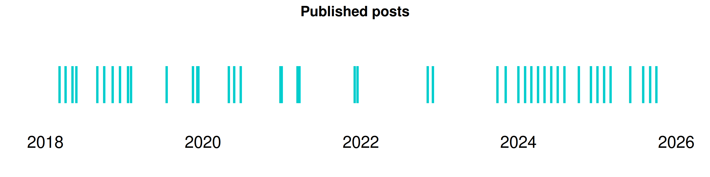

<!-- README.md is generated from README.Rmd. Please edit that file -->

# DrMowinckels website repo!

Welcome to the repository for my website. This repository contains the
code for my content.

## Some stats

🎉 DrMowinckels has **40** posts since **2018-03-08**!

📅 That’s a post roughly every **63** days, or about **0.48** posts per
month, since 2018-03-08.

✍️ The last post was published **-28** days ago ([The difficult
year](https://drmowinckels.io/blog/the-difficult-year)).

😉 I’ll post as often as I am able, and hope people find it interesting.
I’d love your feedback in the comments!

📂 Click to expand a full list of posts

| Date       | Title                                                                                                                                                                                    |
|:-----------|:-----------------------------------------------------------------------------------------------------------------------------------------------------------------------------------------|
| 2025-01-01 | [The difficult year](https://drmowinckels.io/blog/the-difficult-year)                                                                                                                    |
| 2024-12-02 | [Posting to Bluesky from R](https://drmowinckels.io/blog/bluesky)                                                                                                                        |
| 2024-11-01 | [Reading in multiple files without loops](https://drmowinckels.io/blog/lapply-files)                                                                                                     |
| 2024-10-07 | [Creating post summary with AI from Hugging Face](https://drmowinckels.io/blog/ai-blog-summary)                                                                                          |
| 2024-09-06 | [Making your blog FAIR](https://drmowinckels.io/blog/fair-blog)                                                                                                                          |
| 2024-08-01 | [Positron IDE - A new IDE for data science](https://drmowinckels.io/blog/positron)                                                                                                       |
| 2024-07-01 | [Improving your GitHub Profile](https://drmowinckels.io/blog/github-profile)                                                                                                             |
| 2024-06-01 | [Customise your R startup message](https://drmowinckels.io/blog/rproject)                                                                                                                |
| 2024-05-01 | [The IDEs I use](https://drmowinckels.io/blog/ide)                                                                                                                                       |
| 2024-04-01 | [Too much git cleaning](https://drmowinckels.io/blog/git-clean-woes)                                                                                                                     |
| 2024-03-01 | [Setting up a Freesurfer LMM through R](https://drmowinckels.io/blog/freesurfer-lmm-r)                                                                                                   |
| 2024-02-01 | [Teaching you - teaching me](https://drmowinckels.io/blog/teaching-unlocks)                                                                                                              |
| 2024-01-01 | [New year, New blog](https://drmowinckels.io/blog/newyear-newblog)                                                                                                                       |
| 2023-11-03 | [Reorganising Hugo Content and Aliasing](https://drmowinckels.io/blog/reorganising-hugo)                                                                                                 |
| 2023-09-26 | [Posit::conf 2023](https://drmowinckels.io/blog/positconf-2023)                                                                                                                          |
| 2022-12-01 | [Advent of R Functions](https://drmowinckels.io/blog/advent-of-r-functions)                                                                                                              |
| 2022-11-07 | [Lets Get Applying](https://drmowinckels.io/blog/lets-get-applying)                                                                                                                      |
| 2021-12-17 | [Rmarkdown Child Templates](https://drmowinckels.io/blog/rmarkdown-child-templates)                                                                                                      |
| 2021-12-04 | [Adding giscus to your blogdown site](https://drmowinckels.io/blog/adding-giscus-to-your-blogdown-site)                                                                                  |
| 2021-03-23 | [Using GitHub Actions to Build your Hugo Website](https://drmowinckels.io/blog/using-github-actions-to-build-your-hugo-website)                                                          |
| 2021-03-14 | [New {ggseg} with Geom!](https://drmowinckels.io/blog/new-ggseg-with-geom)                                                                                                               |
| 2020-12-31 | [New Years Wishes](https://drmowinckels.io/blog/new-year-s-wishes)                                                                                                                       |
| 2020-12-25 | [R-Package Advent Calendar 2020](https://drmowinckels.io/blog/r-package-advent-calendar)                                                                                                 |
| 2020-06-24 | [The Linear Regression Family in R](https://drmowinckels.io/blog/the-linear-regression-family-in-r)                                                                                      |
| 2020-05-25 | [Changing your Blogdown Workflow](https://drmowinckels.io/blog/changing-you-blogdown-workflow)                                                                                           |
| 2020-04-30 | [Using Freesurfer annotation files to plot in R](https://drmowinckels.io/blog/using-freesurfer-annotation-files-to-plot-in-r)                                                            |
| 2019-12-11 | [Do you wanna build a snowman?](https://drmowinckels.io/blog/do-you-wanna-build-a-snowman)                                                                                               |
| 2019-12-06 | [ggseg3d - creating interactive brain segmentation plots with plotly](https://drmowinckels.io/blog/ggseg3d-creating-interactive-brain-segmentation-plots-with-plotly)                    |
| 2019-11-16 | [Plotting GAMM interactions with ggplot2](https://drmowinckels.io/blog/plotting-gamm-interactions-with-ggplot2)                                                                          |
| 2019-07-17 | [“R for Psychologists - part II”](https://drmowinckels.io/blog/r-for-psychologists-part-ii)                                                                                              |
| 2019-02-02 | [Building tidy tools - a quick recap of RStudio::conf 2019 workshop & teeny demonstration](https://drmowinckels.io/blog/building-tidy-tools-a-quick-recap-of-rstudio-conf-2019-workshop) |
| 2019-01-19 | [Why RStudio::conf is the best conference experience I have had](https://drmowinckels.io/blog/why-rstudio-conf-is-the-best-conference-experience-i-have-had)                             |
| 2018-12-13 | [Christmas tree in ggplot](https://drmowinckels.io/blog/christmas-tree-in-ggplot)                                                                                                        |
| 2018-11-09 | [R for psychologists - just dive into it!](https://drmowinckels.io/blog/r-just-dive-into-it)                                                                                             |
| 2018-10-01 | [Get the brain animated!](https://drmowinckels.io/blog/get-the-brain-animated)                                                                                                           |
| 2018-08-30 | [Introducing the ggseg R-package for brain segmentations](https://drmowinckels.io/blog/introducing-the-ggseg-r-package-for-brain-segmentations)                                          |
| 2018-05-25 | [Circular plots in R and adding images](https://drmowinckels.io/blog/circluar-plots-in-r-and-adding-images)                                                                              |
| 2018-05-07 | [Adding external images to plots](https://drmowinckels.io/blog/adding-external-images-to-plots)                                                                                          |
| 2018-04-05 | [GAMM random effects](https://drmowinckels.io/blog/gamm-random-effects)                                                                                                                  |
| 2018-03-08 | [GAMM spaghetti plots in R with ggplot](https://drmowinckels.io/blog/gamm-spaghetti-plots-in-r-with-ggplot)                                                                              |

------------------------------------------------------------------------

*The automatically rendered readme was inspired by [Matt
Dray](https://www.rostrum.blog/2021/04/14/gha-readme/) and [Piping Hot
Data](https://github.com/shannonpileggi/pipinghotdata_distill/blob/master/README.Rmd).*

*Updated 2025-01-29 01:14:03.73051*
