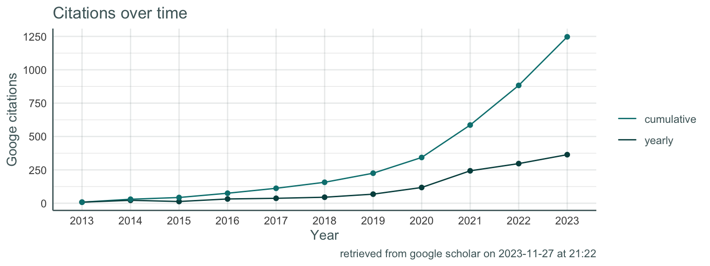

# Education

    # A tibble: 3 × 5
      what                                                   when  with  where why  
      <chr>                                                  <glu> <glu> <chr> <lis>
    1 Thesis title: Neurocognitive Processes of Decision-ma… 2012… Phil… <NA>  <chr>
    2 Thesis title: Default Mode Resting-State Functional C… 2009… Mast… <NA>  <chr>
    3 Thesis title: Attention Deficits in Mild Cognitive Im… 2006… Bach… <NA>  <chr>

# Research positions

    # A tibble: 3 × 5
      what                                  when           with          where why  
      <chr>                                 <glue>         <glue>        <chr> <lis>
    1 Staff scientist                       2018 - present University o… Oslo  <chr>
    2 Researcher / Project Manager          2016 - 2017    University o… Oslo  <chr>
    3 Research assistant and lab-technician 2011 - 2012    University o… Oslo  <chr>

# Memberships & Services

I am passionate about increasing the representation and retention of women in science, and in improving the formal training and competencies taught at the University. These interests are evident from task force and board memberships, and in activities I engage in outside of work, like R-Ladies.

    # A tibble: 3 × 5
      what                 when           with                 where why      
      <chr>                <glue>         <glue>               <chr> <list>   
    1 Board of Directors   2022 - present R-Ladies Leadership  LA    <chr [3]>
    2 Global team member   2019 - present R-Ladies global team Oslo  <chr [3]>
    3 Co-founder and chair 2018 - present R-Ladies Oslo        Oslo  <chr [3]>

    # A tibble: 6 × 5
      what                               when        with               where why   
      <chr>                              <glue>      <glue>             <chr> <list>
    1 "Member"                           2019 - 2022 University of Oslo Oslo  <chr> 
    2 "Member "                          2017 - 2018 University of Oslo Oslo  <chr> 
    3 "Member "                          2016 - 2017 University of Oslo Oslo  <chr> 
    4 "Faculty Board Member, elected"    2015 - 2015 University of Oslo Oslo  <chr> 
    5 "Department Board Member, elected" 2014 - 2015 University of Oslo Oslo  <chr> 
    6 "Co-founder and chair"             2013 - 2015 University of Oslo Oslo  <chr> 

# Teaching & Dissemination

In addition to teaching and workshops, I run a coding and neuroscience blog, , that includes tutorials in R and neuroimaging. I am also a certified .

## University

    # A tibble: 3 × 5
      what            when        with               where        why      
      <chr>           <chr>       <chr>              <chr>        <list>   
    1 Seminar teacher 2012 - 2015 University of Oslo Oslo, Norway <chr [2]>
    2 Supervisor      2012 - 2015 University of Oslo Oslo, Norway <chr [1]>
    3 Seminar teacher 2009 - 2011 University of Oslo Oslo, Norway <chr [2]>

## Workshops

    # A tibble: 4 × 5
      what          when                   with                          where why  
      <chr>         <chr>                  <chr>                         <chr> <lis>
    1 Instructor    Monthly 2018 - present "Monthly internal R-workshop… Cent… <chr>
    2 Instructor    June 5, 2019           "Workshop: Straightforward i… Oslo… <chr>
    3 Instructor    March 28, 2019         "Linear Mixed models on repe… R-La… <chr>
    4 Co-instructor Sept.  25 - 26, 2018   "TidyVerse R \\href{https://… Univ… <chr>

# Research software development

A recent interest and professional endeavor is creating R-packages to improve data workflows and visualization in R. Icons link to package websites with documentation (), and github repositories () where source code is openly available.

    # A tibble: 5 × 3
      what                                                               when  with 
      <glue>                                                             <chr> <chr>
    1 \textbf{ggseg \href{https://github.com/LCBC-UiO/ggseg}{\faicon{gi… 2018… <NA> 
    2 \textbf{ggeg3d \href{https://github.com/LCBC-UiO/ggseg3d}{\faicon… 2018… <NA> 
    3 \textbf{ggegExtra \href{https://github.com/LCBC-UiO/ggsegExtra}{\… 2018… <NA> 
    4 \textbf{nettskjemar \href{https://github.com/LCBC-UiO/nettskjemar… 2019… <NA> 
    5 \textbf{metagam \href{https://github.com/Lifebrain/metagam}{\faic… 2020  <NA> 

<!-- # Awards & Achievements -->
<!-- ## Awards -->
<!-- ```{r} -->
<!-- tribble( -->
<!--   ~ award, ~ from, ~ year, -->
<!--   "Commerce Dean's Honour", "Monash", "2017", -->
<!--   "Commerce Dean's Commendation", "Monash", "2016", -->
<!--   "Science Dean’s List", "Monash", "2014-2016", -->
<!--   "International Institute of Forecasters Award", "IIF", "2014", -->
<!--   "Rotary Youth Leadership Award", "Rotary", "2013" -->
<!-- ) %>% -->
<!--   brief_entries(award, year, from) -->
<!-- ``` -->



# Publications & Preprints



## Most recent 10

    # A tibble: 45 × 3
       what                                                              when  with 
       <glue>                                                            <chr> <chr>
     1 AM \textbf{Mowinckel}, T Espeseth, LT Westlye \newline \textit{N… 2012  "cit…
     2 AM \textbf{Mowinckel}, ML Pedersen, E Eilertsen, G Biele \newlin… 2015  "cit…
     3 S Ziegler, ML Pedersen, AM \textbf{Mowinckel}, G Biele \newline … 2016  "cit…
     4 AM \textbf{Mowinckel}, D Alnæs, ML Pedersen, S Ziegler, M Fredri… 2017  "cit…
     5 KB Walhovd, AM Fjell, R Westerhausen, L Nyberg, KP Ebmeier, et a… 2018  "cit…
     6 D Vidal-Piñeiro, SH Markus, L Nyberg, AM \textbf{Mowinckel}, D S… 2018  "cit…
     7 AM Fjell, CH Chen, D Sederevicius, MH Sneve, H Grydeland, et al.… 2019  "cit…
     8 D Vidal-Piñeiro, MH Sneve, LH Nyberg, AM \textbf{Mowinckel}, D S… 2019  "cit…
     9 AM Fjell, MH Sneve, D Sederevicius, Ø Sørensen, SK Krogsrud, et … 2019  "cit…
    10 AM \textbf{Mowinckel}, D Vidal-Piñeiro \newline \textit{Visualis… 2019  "Pre…
    # ℹ 35 more rows

## Most cited 10

# A tibble: 45 × 3

what when with
<glue> <chr> <chr>
1 AM , T Espeseth, LT Westlye \textit{N... 2012 cite...
2 AM , D Vidal-Piñeiro \textit{Visualiz... 2020 cite...
3 AM , ML Pedersen, E Eilertsen, G Biele ... 2015 cite...
4 S Ziegler, ML Pedersen, AM , G Biele ... 2016 cite...
5 D Vidal-Pineiro, N Parker, J Shin, L French, H Grydeland, AP Jac... 2020 cite...
6 JM Roe, D Vidal-Piñeiro, Ø Sørensen, AM Brandmaier, S Düzel, et ... 2021 cite...
7 D Vidal-Pineiro, Y Wang, SK Krogsrud, IK Amlien, WFC Baaré, et a... 2021 cite...
8 AM Fjell, Ø Sørensen, IK Amlien, D Bartrés-Faz, DM Bros, N Buchm... 2020 cite...
9 KB Walhovd, AM Fjell, R Westerhausen, L Nyberg, KP Ebmeier, et a... 2018 cite...
10 AM , D Alnæs, ML Pedersen, S Ziegler, M Fredri... 2017 cite...
\# ℹ 35 more rows
