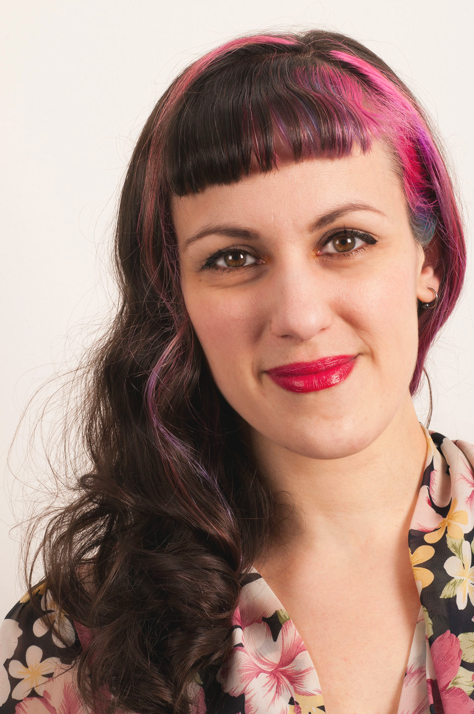
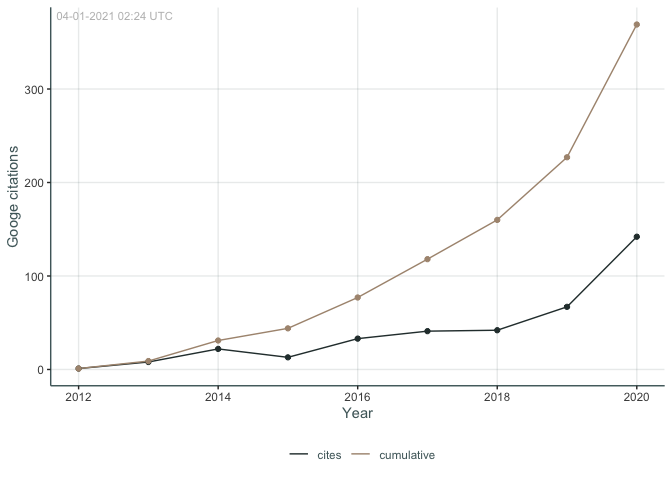

 

### In short

I am a cognitive neuroscientist based in Oslo, Norway, and works at the [Center for Lifespan Changes in Brain and Cognition](www.oslobrains.no). I'm passionate about cognitive neuroscience, using R and teaching the world the wonders of R. Doing all I can to improve gender diversity and equity in the R-community though [R-Ladies Oslo](https://twitter.com/RLadies_Oslo) and on the [R-Ladies Global Team](https://rladies.org/about-us/team/). 

### Education  

| Start|  End|Place              |Degree |Field                  |Thesis                                                                             |Grade |
|-----:|----:|:------------------|:------|:----------------------|:----------------------------------------------------------------------------------|:-----|
|  2012| 2017|University of Oslo |PhD    |Cognitive Neuroscience |Neurocognitive Processes of Decision-making in Adults with ADHD                    |      |
|  2009| 2011|University of Oslo |MPhil  |Cognitive Neuroscience |Default Mode Resting-State Functional Connectivity of the Aging Brain              |B     |
|  2005| 2009|University of Oslo |BA     |Psychology             |Attention Deficits in Mild Cognitive Impairment and Dementia of the Alzheimer Type |A     |

### Work  

| Start|End     |Place                                                          |Position                              |Responsibilities                                                                                                                     |
|-----:|:-------|:--------------------------------------------------------------|:-------------------------------------|:------------------------------------------------------------------------------------------------------------------------------------|
|  2018|Current |<a href=https://www.oslobrains.no>University of Oslo, LCBC</a> |Staff scientist                       |Data-management in <a href=https://www.oslobrains.no>LCBC</a> and the <a href=https://www.lifebrain.uio.no/>Lifebrain</a> EU-project |
|  2016|2018    |<a href=https://www.oslobrains.no>University of Oslo, LCBC</a> |Researcher/Project manager            |Co-ordinating data collection, data-management, and research collaborations. Running analyses and data preperations                  |
|  2012|2016    |<a href=https://www.uio.no/english/>University of Oslo</a>     |PhD fellow                            |Project on decision-making in adults with ADHD and the effects of methylphenidate on this process.                                   |
|  2015|        |University of Southampton                                      |Visiting research fellow              |Developmental Brain Behaviour Lab under Prof. Edmund Sonuga-Barke.                                                                   |
|  2011|2012    |Tor Endestad, University of Oslo                               |Research assistant and lab-technician |Work with functional MRI-analysis, supervising students, and transitioning lab from windows to a linux operating system.             |
|  2011|2012    |Guido Biele, University of Oslo.                               |Research assistant                    |Scripting of experiments, testing of participants and work on application for grants and ethical approval.                           |
|  2010|        |Thomas Espeseth, University of Oslo.                           |Research assistant                    |Coordinating data-collection at Oslo University hospital between research assistants, participants, and hospital employees.          |
|  2009|        |European Congress of Psychology, Oslo, Norway.                 |Lecture room assistant                |volunteer work.                                                                                                                      |

### Commissions  

| Start|  End|Place                                          |Commission                                           |Description                                                   |
|-----:|----:|:----------------------------------------------|:----------------------------------------------------|:-------------------------------------------------------------|
|  2016| 2017|University of Oslo                             |University Ethics work group                         |Member of group canvasing routines regarding research ethics. |
|  2017| 2018|University of Oslo                             |PhD program work group                               |Member of group proposing changes to the PhD-program.         |
|  2017|     |University of Oslo, Faculty of Social Sciences |Faculty Board Member                                 |Elected member.                                               |
|  2014| 2015|University of Oslo, Dept. of Psychology        |Department Board Member                              |Elected member.                                               |
|  2013| 2015|University of Oslo, Dept. of Psychology        |PsyDoc - Interest organization for PhDs and PostDocs |Co-Founder and elected Chair.                                 |
|  2009| 2011|University of Oslo, Dept. of Psychology        |Student Council                                      |Representative for Cognitive Neuroscience Master.             |

### Publications & Citations
<!-- -->

AM Fjell, Ø Sørensen, IK Amlien, D Bartrés-Faz, DM Bros, N Buchmann, ... (2020) [_Self-reported sleep relates to hippocampal atrophy across the adult lifespan: results from the Lifebrain consortium_](https://scholar.google.no/scholar?oi=bibs&hl=en&cluster=13478746394103686546) Sleep _43 (5), zsz280_ 

VM Danielsen, DV Pineiro, AM **Mowinckel**, D Sederevicius, AM Fjell, ... (2020) [_Lifespan trajectories of relative corpus callosum thickness: regional differences and cognitive relevance._](https://scholar.google.no/scholar?oi=bibs&hl=en&cluster=8904205061858122143) PsyArXiv __ 

D Vidal-Pineiro, N Parker, J Shin, L French, H Grydeland, AP Jackowski, ... (2020) [_Cellular correlates of cortical thinning throughout the lifespan_](https://scholar.google.no/scholar?oi=bibs&hl=en&cluster=5860637791443459396) BioRxiv _585786_ 

KB Walhovd, AM Fjell, Ø Sørensen, AM **Mowinckel**, CS Reinbold, ... (2020) [_Genetic risk for Alzheimer disease predicts hippocampal volume through the human lifespan_](https://scholar.google.no/scholar?oi=bibs&hl=en&cluster=2204833211052181607) Neurology Genetics _6 (5)_ 

Ø Sørensen, AM Brandmaier, DM Bros, K Ebmeier, P Ghisletta, RA Kievit, ... (2020) [_Meta-Analysis of Generalized Additive Models in Neuroimaging Studies_](https://scholar.google.no/scholar?oi=bibs&hl=en&cluster=5651230076567075017) arXiv preprint arXiv: _:2002.02627_ 

KB Walhovd, ACS Bråthen, MS Panizzon, AM **Mowinckel**, Ø Sørensen, ... (2020) _Within-session verbal learning slope is predictive of lifespan delayed recall, hippocampal volume, and memory training benefit, and is heritable_ Scientific reports _10 (1), 1-13_ 

AM Fjell, Ø Sørensen, IK Amlien, D Bartrés-Faz, AM Brandmaier, ... (2020) _Poor Self-Reported Sleep is Related to Regional Cortical Thinning in Aging but not Memory Decline—Results From the Lifebrain Consortium_ Cerebral Cortex __ 

I Budin-Ljøsne, BB Friedman, S Suri, C Solé-Padullés, S Düzel, ... (2020) _The Global Brain Health Survey: Development of a Multi-Language Survey of Public Views on Brain Health_ Frontiers in Public Health _8, 387_ 

KB Walhovd, A Fjell, Y Wang, IK Amlien, AM **Mowinckel**, U Lindenberger, ... (2020) _Education and income show heterogeneous relationships to lifespan brain and cognitive differences across European and US cohorts_ bioRxiv __ 

T Gorbach, S Pudas, D Bartrés‐Faz, AM Brandmaier, S Düzel, ... (2020) _Longitudinal association between hippocampus atrophy and episodic‐memory decline in non‐demented APOE ε4 carriers_ Alzheimer's & Dementia: Diagnosis, Assessment & Disease Monitoring _12 (1 …_ 

A Fjell, H Grydeland, Y Wang, IK Amlien, D Bartres-Faz, A Brandmaier, ... (2020) _The genetic organization of subcortical volumetric change is stable throughout the lifespan_ bioRxiv __ 

A Fjell, O Sorensen, IK Amlien, D Bartrés-Faz, A Brandmaier, D Macia, ... (2020) _Self-reported sleep problems are related to cortical thinning in aging but not memory decline and amyloid-β accumulation-results from the Lifebrain consortium_ bioRxiv __ 

D Vidal-Pineiro, MH Sneve, IK Amlien, HH Grydeland, AM **Mowinckel**, ... (2020) _The functional foundations of episodic memory remain stable throughout the lifespan_ bioRxiv __ 

AM **Mowinckel**, D Vidal-Piñeiro (2019) [_Visualisation of brain statistics with r-packages ggseg and ggseg3d_](https://scholar.google.no/scholar?oi=bibs&hl=en&cluster=14033947876110404932) arXiv preprint arXiv: _:1912.08200_ 

AM Fjell, CH Chen, D Sederevicius, MH Sneve, H Grydeland, ... (2019) [_Continuity and discontinuity in human cortical development and change from embryonic stages to old age_](https://scholar.google.no/scholar?oi=bibs&hl=en&cluster=12292935935753013374) Cerebral Cortex _29 (9), 3879-3890_ 

D Vidal-Piñeiro, MH Sneve, LH Nyberg, AM **Mowinckel**, D Sederevicius, ... (2019) [_Maintained frontal activity underlies high memory function over 8 years in aging_](https://scholar.google.no/scholar?oi=bibs&hl=en&cluster=17089103347718824083) Cerebral Cortex _29 (7), 3111-3123_ 

AM Fjell, MH Sneve, D Sederevicius, Ø Sørensen, SK Krogsrud, ... (2019) [_Volumetric and microstructural regional changes of the hippocampus underlying development of recall performance after extended retention intervals_](https://scholar.google.no/scholar?oi=bibs&hl=en&cluster=6382077352973065340) Developmental cognitive neuroscience _40, 100723_ 

KB Walhovd, AM Fjell, Ø Sørensen, AM **Mowinckel**, CS Reinbold, ... (2019) [_Genetic risk for Alzheimers disease predicts hippocampal volume through the lifespan_](https://scholar.google.no/scholar?oi=bibs&hl=en&cluster=13849018663476393665) bioRxiv _711689_ 

AM Fjell, MH Sneve, D Sederevicius, Ø Sørensen, SK Krogsrud, ... (2019) [_Volumetric and microstructural regional changes of the hippocampus underlying development of extended delay long-term memory_](https://scholar.google.no/scholar?oi=bibs&hl=en&cluster=17521939232361433407) bioRxiv _595827_ 

D Bartrés-Faz, Ø Sørensen, IK Amlien, AM Fjell, DM Bros, N Buchmann, ... (2019) _Self-reported sleep relates to hippocampal atrophy over the adult lifespan–results from the Lifebrain consortium_ Sleep _43 (5)_ 

KB Walhovd, AM Fjell, R Westerhausen, L Nyberg, KP Ebmeier, ... (2018) [_Healthy minds 0–100 years: Optimising the use of European brain imaging cohorts (“Lifebrain”)_](https://scholar.google.no/scholar?oi=bibs&hl=en&cluster=761121902853026504) European Psychiatry _50, 47-56_ 

D Vidal-Piñeiro, SH Markus, L Nyberg, AM **Mowinckel**, D Sederevicius, ... (2018) _P2‐395: TESTING MAINTENANCE AND COMPENSATION NOTIONS IN NORMAL AGING: AGE‐RELATED CORRELATES OF ASSOCIATIVE ENCODING SUCCESS_ Alzheimer's & Dementia _14 (7S_Part_16), P854-P854_ 

AM **Mowinckel**, D Alnæs, ML Pedersen, S Ziegler, M Fredriksen, ... (2017) [_Increased default-mode variability is related to reduced task-performance and is evident in adults with ADHD_](https://scholar.google.no/scholar?oi=bibs&hl=en&cluster=15217082774564824421) NeuroImage: Clinical _16, 369-382_ 

S Ziegler, ML Pedersen, AM **Mowinckel**, G Biele (2016) [_Modelling ADHD: A review of ADHD theories through their predictions for computational models of decision-making and reinforcement learning_](https://scholar.google.no/scholar?oi=bibs&hl=en&cluster=11108308558386894134) Neuroscience & Biobehavioral Reviews _71, 633-656_ 

AM **Mowinckel**, ML Pedersen, E Eilertsen, G Biele (2015) [_A meta-analysis of decision-making and attention in adults with ADHD_](https://scholar.google.no/scholar?oi=bibs&hl=en&cluster=9967029451223534628) Journal of attention disorders _19 (5), 355-367_ 

AM **Mowinckel**, T Espeseth, LT Westlye (2012) [_Network-specific effects of age and in-scanner subject motion: a resting-state fMRI study of 238 healthy adults_](https://scholar.google.no/scholar?oi=bibs&hl=en&cluster=13651232777638540310) Neuroimage _63 (3), 1364-1373_ 

