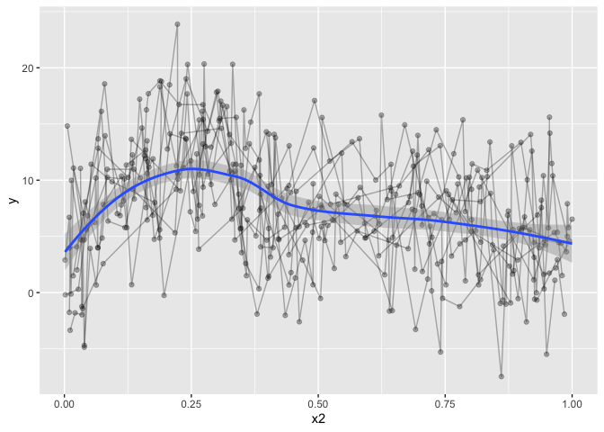
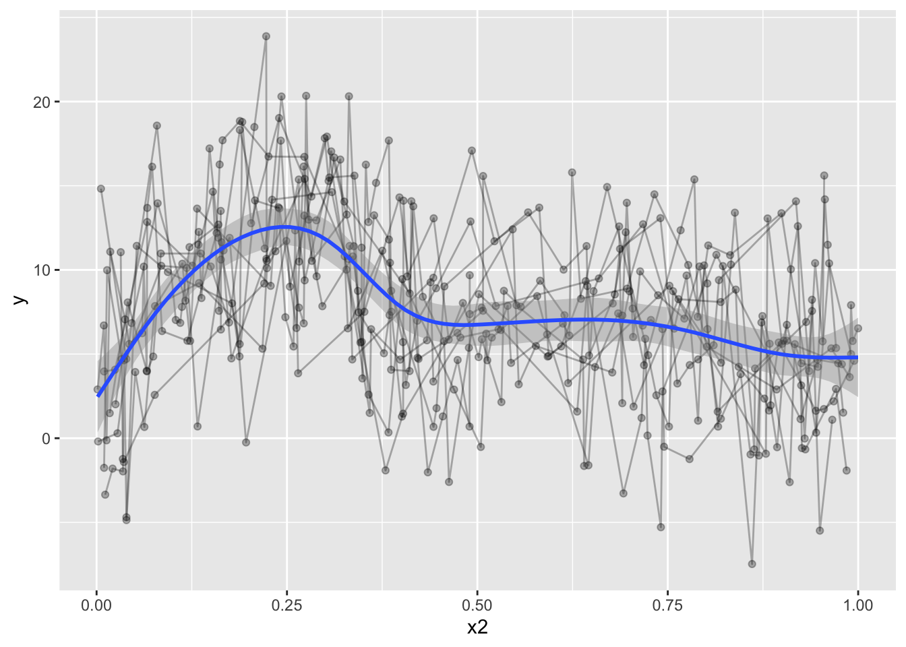
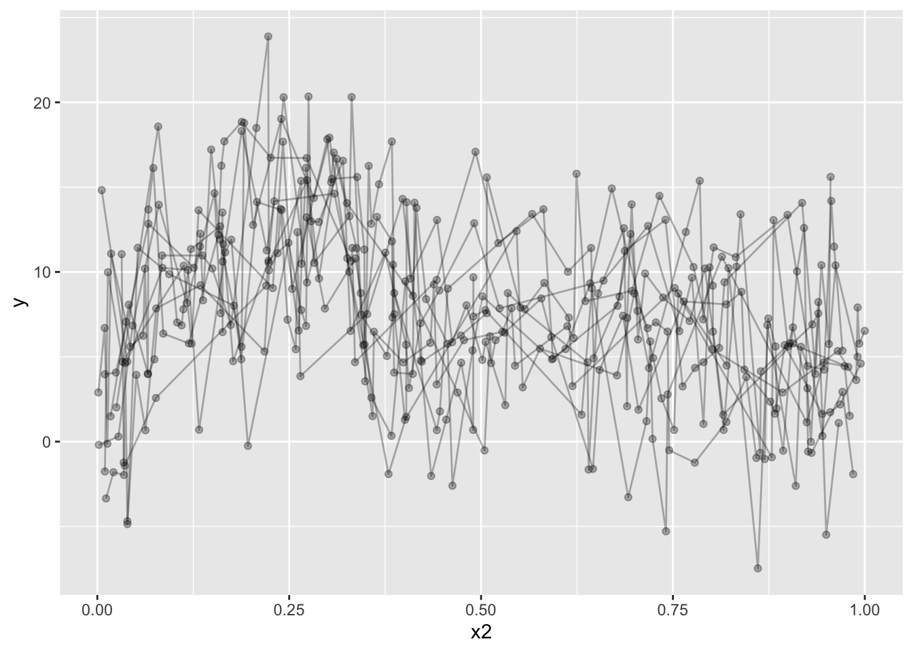
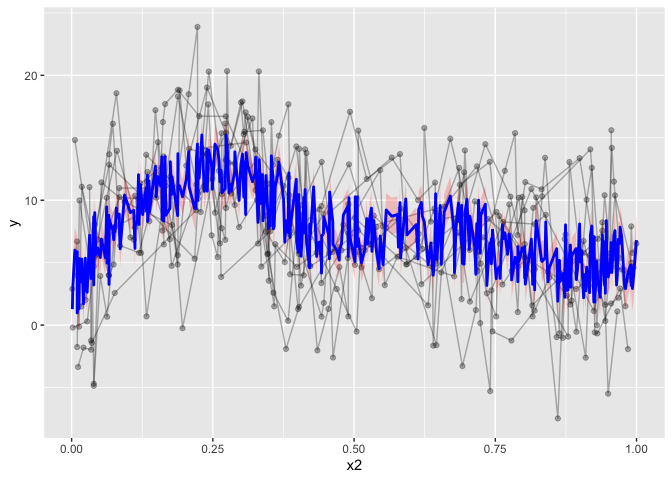
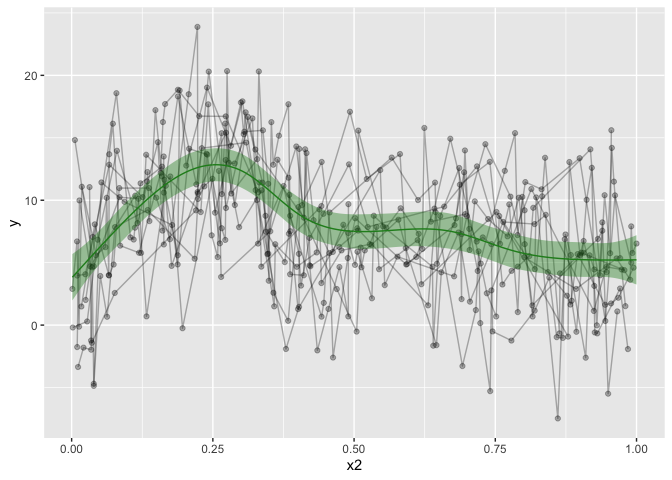
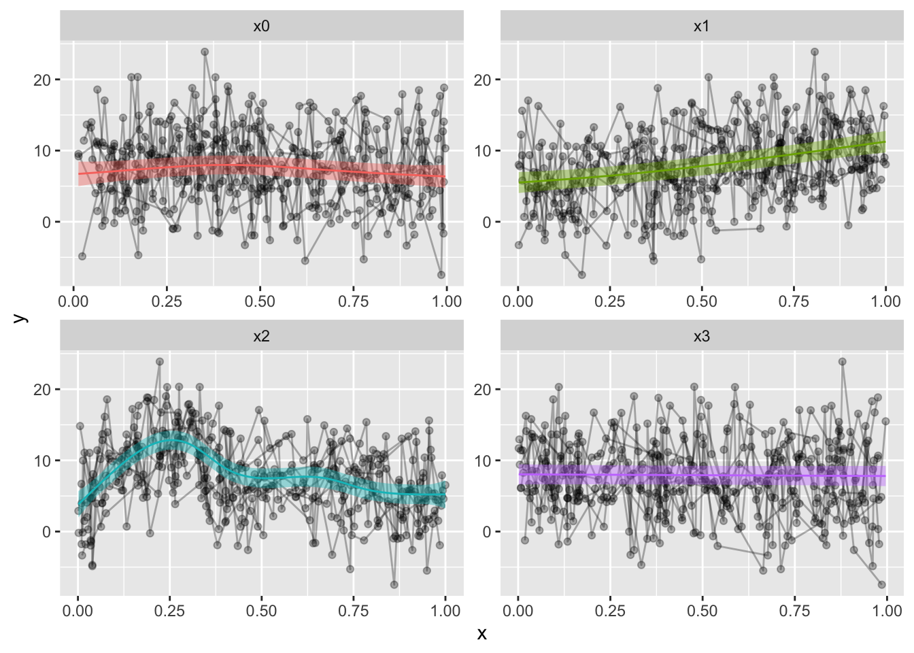

Here we go! Stepping into the world of blogging through R and blogdown! This is both super exciting and slightly scary, I have not really shared code online like I plan here before. But I guess we start somewhere. And we start with plotting.

A co-worker was working on some generalized additive mixed models (GAMM) through the R package [mgcv](https://cran.r-project.org/web/packages/mgcv/mgcv.pdf). The analyses work very well, and results were as expected. There were also some built in plotting functions for the gamm output in R. However, they were with base-r, and we all know base-r is not the most beautiful plotting application. Also, we have a need to a spaghetti plot in the background, as the whole point with a GAMM is that we have repeated data, and showing those in the background is very essential. **This** is not easily done in base-r.

This is what we have


```r
library(tidyverse); library(mgcv)
```

```
## ── Attaching packages ───────────────────────────────────────────────────────────── tidyverse 1.3.0 ──
```

```
## ✓ ggplot2 3.3.0     ✓ purrr   0.3.4
## ✓ tibble  3.0.1     ✓ dplyr   0.8.5
## ✓ tidyr   1.0.3     ✓ stringr 1.4.0
## ✓ readr   1.3.1     ✓ forcats 0.5.0
```

```
## ── Conflicts ──────────────────────────────────────────────────────────────── tidyverse_conflicts() ──
## x dplyr::filter() masks stats::filter()
## x dplyr::lag()    masks stats::lag()
```

```
## Loading required package: nlme
```

```
## 
## Attaching package: 'nlme'
```

```
## The following object is masked from 'package:dplyr':
## 
##     collapse
```

```
## This is mgcv 1.8-31. For overview type 'help("mgcv-package")'.
```

```r
set.seed(0)
n.g <- 10
n<-n.g*10*4

dat <- gamSim(1,n=n,scale=2)
```

```
## Gu & Wahba 4 term additive model
```

```r
f <- dat$f

## simulate nested random effects....
fa <- as.factor(rep(1:10,rep(4*n.g,10)))
ra <- rep(rnorm(10),rep(4*n.g,10))
fb <- as.factor(rep(rep(1:4,rep(n.g,4)),10))
rb <- rep(rnorm(4),rep(n.g,4))
for (i in 1:9) rb <- c(rb,rep(rnorm(4),rep(n.g,4)))

## simulate auto-correlated errors within groups
e<-array(0,0)
for (i in 1:40) {
  eg <- rnorm(n.g, 0, sd(f))
  for (j in 2:n.g) eg[j] <- eg[j-1]*0.6+ eg[j]
  e<-c(e,eg)
}

dat$y <- f + ra + rb + e
dat$id <- fa;dat$fb <- fb
```


```r
# Let's have a look at it
dat %>% 
  ggplot(aes(x=x2, y=y)) + 
  geom_line(alpha=.3,aes(group=id)) + 
  geom_point(alpha=.3) +
  geom_smooth()
```

```
## `geom_smooth()` using method = 'loess' and formula 'y ~ x'
```

<!-- -->

The data is not particularly well crafted, but it serves to make my point I believe. `geom_smooth` runs a loess model for prediction, which, given this data, makes a lot of sense. But it's not what I want, and it won't take into account the repeated measures. Let's go over to the gamm models. I'll omit gam, because you can easily get gams in ggplot by running:


```r
dat %>% 
  ggplot(aes(x=x2, y=y)) + 
  geom_line(alpha=.3,aes(group=id)) + 
  geom_point(alpha=.3) +
  geom_smooth(method="gam")
```

```
## `geom_smooth()` using formula 'y ~ s(x, bs = "cs")'
```

<!-- -->

but that's definately not what we want, despite the horrible data

We could even give it a formula, which might look really nice. Not that the formula will read x and y in the formula as the 'x' and 'y' set in the `aes`. So don't give it the actual names of the column, use 'x' and 'y'.


```r
dat %>% 
  ggplot(aes(x=x2, y=y)) + 
  geom_line(alpha=.3,aes(group=id)) + 
  geom_point(alpha=.3) +
  geom_smooth(method="gam", formula=y~s(x,bs='cr'))
```

<!-- -->

The downside to this is that it is only modelling the one term, and we want a fit that takes into account all our covariates, but only plots the one prediction, holding the others constant. trying to increase formula complexity in ggplot directly wont work, it's just not made for something so complex.


```r
dat %>% 
  ggplot(aes(x=x2, y=y)) + 
  geom_line(alpha=.3,aes(group=id)) + 
  geom_point(alpha=.3) +
  geom_smooth(method="gam", formula=y~s(x,bs='cr') + s(group, bs="re"))
```

```
## Warning in predict.gam(model, newdata = data_frame(x = xseq), se.fit = se, : not all required variables have been supplied in  newdata!
```

```
## Warning: Computation failed in `stat_smooth()`:
## object 'group' not found
```

<!-- -->

So, let's have a look at what we want to model. This particular example is compelx, because it is the complex that is hard to predict and plot. The simple ones will work with the above, provigin a formula directly to `geom_stat`. We're using three smoothing splines on three predictors in this model, and including two random intercepts. But we are really only interested in the `x2` smoothing spline, the others are just covariates of no interest.


```r
b = gamm(y~s(x0,bs="cr")+s(x1,bs="cr")+s(x2,bs="cr")+
           s(x3,bs="cr"),data=dat,random=list(id=~1,fb=~1),
         correlation=corAR1())

# Output is a list of two
b %>% summary()
```

```
##     Length Class Mode
## lme 18     lme   list
## gam 31     gam   list
```

```r
# Let's see the model summary
b$gam %>% summary()
```

```
## 
## Family: gaussian 
## Link function: identity 
## 
## Formula:
## y ~ s(x0, bs = "cr") + s(x1, bs = "cr") + s(x2, bs = "cr") + 
##     s(x3, bs = "cr")
## 
## Parametric coefficients:
##             Estimate Std. Error t value Pr(>|t|)    
## (Intercept)   7.6878     0.5131   14.98   <2e-16 ***
## ---
## Signif. codes:  0 '***' 0.001 '**' 0.01 '*' 0.05 '.' 0.1 ' ' 1
## 
## Approximate significance of smooth terms:
##         edf Ref.df      F p-value    
## s(x0) 2.760  2.760  5.136 0.00925 ** 
## s(x1) 1.938  1.938 61.438 < 2e-16 ***
## s(x2) 7.059  7.059 42.398 < 2e-16 ***
## s(x3) 1.000  1.000  0.185 0.66755    
## ---
## Signif. codes:  0 '***' 0.001 '**' 0.01 '*' 0.05 '.' 0.1 ' ' 1
## 
## R-sq.(adj) =  0.351   
##   Scale est. = 13.963    n = 400
```

So I went googling, and in my frustration, there was very little help in what I found. `mgcv`'s gamm output is different from other analyses, as it gives a list containing an lme and gam model (which is really a GAMM model). So grabbing the smooth directly in ggplot will not work. Furthermore, we want one single smoothed predictor while still taking into account the rest of the predictors and covariates.

I even [posted something on stackoverflow](https://stackoverflow.com/questions/48907493/ggplot2-geom-ribbon-from-mgcvgamm/48907846?noredirect=1#comment85066362_48907846) (the example data is horrendous!), and the answer pointed me to `predict()`. So that' what I did, I tried running `predict()` on the gamm output, but the resulting output was not what I wanted. `predict()` predicts based on all the predictors and covariates, and so, we are not plotting the one smoothed predictor, but a jumble of predictors. The resulting 'smooth' it not pretty, and completely wrong. 


```r
pred <- predict(b$gam, se.fit=T)

dat %>% 
  ggplot(aes(x=x2, y=y)) + 
  geom_line(alpha=.3,aes(group=id)) + 
  geom_point(alpha=.3) +
  geom_ribbon(aes(ymin=pred$fit-1.96*pred$se.fit,
                  ymax=pred$fit+1.96*pred$se.fit), alpha=0.2, fill="red")+
  geom_line(aes(y=pred$fit), col="blue", lwd=1)
```

<!-- -->

Now, there are packages to help do this. For instance, visreg has a gamm plotting function. However, [visreg](https://cran.r-project.org/web/packages/visreg/visreg.pdf) requires attached data, or each variable existing in the global environment. I don't like working with attached data, in my opinion in makes the workflow less transparent, and it's hard to debug issues. If you forget to detach the data, you can spend hours trying to figure out why things aren't working, without noticing that the attached data may be messing things up. 

What we need to do, is predict all the data, keeping the other covariates constant, while only varying the predictor of interest. Right-o. If you're good at simulating data etc, this might be easy for you. I'm pretty terrible at it (for lack of practise for sure).

After trying for several days, without managing to make the plot I wanted, I tweeted my frustration. 

<!--html_preserve--><!--/html_preserve-->

And to the rescue comes twitter, a useR pointed me to [itsadug](https://cran.r-project.org/web/packages/itsadug/index.html). The obscure package I just could not manage to find through all my googling. `itsadug` has a predict function, where you can specify which predictor you want to predict on. 

If you give it the min, max and length of what you want to predict, it then generates data with all other predictors set to constants, for your convenient plotting. It was like magic, exactly what i was searching for. Now, I could plot what I wanted, just like I wanted it!


```r
library(itsadug)
```

```
## Loading required package: plotfunctions
```

```
## 
## Attaching package: 'plotfunctions'
```

```
## The following object is masked from 'package:ggplot2':
## 
##     alpha
```

```
## Loaded package itsadug 2.4 (see 'help("itsadug")' ).
```

```r
# predict on x2
pred = get_predictions(b$gam, 
                       cond = list(x2 = seq(min(dat$x2, na.rm=T),
                                            max(dat$x2, na.rm=T), 
                                            length.out = nrow(dat)), se=T))
```

```
## Summary:
## 	* x0 : numeric predictor; set to the value(s): 0.476351245073602. 
## 	* x1 : numeric predictor; set to the value(s): 0.514732652809471. 
## 	* x2 : numeric predictor; with 400 values ranging from 0.001315 to 0.999931. 
## 	* x3 : numeric predictor; set to the value(s): 0.477402933407575. 
## 	* NOTE : No random effects in the model to cancel.
## 
```

```r
# add y to predicted data, becasue ggplot requires all main variables in both datasets
pred = pred %>% mutate(y=1)

dat %>% 
  ggplot(aes(x=x2, y=y)) + 
  geom_line(alpha=.3,aes(group=id)) + 
  geom_point(alpha=.3) +
  geom_ribbon(data=pred, alpha=.4, aes(ymin=fit-CI, ymax=fit+CI), show.legend = F, fill='forestgreen') +
  geom_line(data=pred, aes(y=fit), show.legend = F, color='forestgreen')
```

<!-- -->


That's looking much nicer! Hurrah! I also made a convenience function for my self, to make the predicted data. This would only work for other numeric predictors, and it's not particularly pretty coding, as it's using ugly eval parsing, but that's how I got it working for me.


```r
# Custom function that predicts on a single predictor, and adds the dependent with the value of 1
GammPredData = function(data, gamm.model, condition){
  
  eval(parse(text=paste0(
    "get_predictions(gamm.model, cond = list(",
    condition,
    "=seq(min(data[condition], na.rm=T),max(data[condition], na.rm=T), length.out = nrow(data)))) %>% as.data.frame() %>% mutate(",
    str_split(gamm.model$formula, " ")[[2]],"=1)")))
}

  # Use the function to predict on x2. you can easily supply the other predictors
  pred = GammPredData(dat, b$gam, "x2")
```

```
## Summary:
## 	* x0 : numeric predictor; set to the value(s): 0.476351245073602. 
## 	* x1 : numeric predictor; set to the value(s): 0.514732652809471. 
## 	* x2 : numeric predictor; with 400 values ranging from 0.001315 to 0.999931. 
## 	* x3 : numeric predictor; set to the value(s): 0.477402933407575. 
## 	* NOTE : No random effects in the model to cancel.
## 
```

```r
dat %>% 
  ggplot(aes(x=x2, y=y)) + 
  geom_line(alpha=.3,aes(group=id)) + 
  geom_point(alpha=.3) +
  geom_ribbon(data=pred, alpha=.4, aes(ymin=fit-CI, ymax=fit+CI), show.legend = F, fill='forestgreen') +
  geom_line(data=pred, aes(y=fit), show.legend = F, color='forestgreen')
```

<!-- -->

You might want to grab each predictor and plot them? That can be done also, and I'll use a combination of `apply`'es to do so, for convenience. I love apply'es...


```r
# Predictions
p = c("x0", "x1", "x2","x3")

# we will be using facet_wrap, gather the data on the predictors, for a long data frame.
dat2 = dat %>% 
  gather(Pred, x, p)
```

```
## Note: Using an external vector in selections is ambiguous.
## ℹ Use `all_of(p)` instead of `p` to silence this message.
## ℹ See <https://tidyselect.r-lib.org/reference/faq-external-vector.html>.
## This message is displayed once per session.
```

```r
preds = list() # prepare a list

# loop through the predictors
for(i in 1:length(p)){
  preds[[i]] = GammPredData(dat, b$gam, p[i]) %>% 
    select_("y", "CI", "fit", p[i])
  names(preds)[i] = p[i]
}
```

```
## Summary:
## 	* x0 : numeric predictor; with 400 values ranging from 0.013078 to 0.996077. 
## 	* x1 : numeric predictor; set to the value(s): 0.514732652809471. 
## 	* x2 : numeric predictor; set to the value(s): 0.445692849811167. 
## 	* x3 : numeric predictor; set to the value(s): 0.477402933407575. 
## 	* NOTE : No random effects in the model to cancel.
## 
```

```
## Warning: select_() is deprecated. 
## Please use select() instead
## 
## The 'programming' vignette or the tidyeval book can help you
## to program with select() : https://tidyeval.tidyverse.org
## This warning is displayed once per session.
```

```
## Summary:
## 	* x0 : numeric predictor; set to the value(s): 0.476351245073602. 
## 	* x1 : numeric predictor; with 400 values ranging from 0.001837 to 0.999455. 
## 	* x2 : numeric predictor; set to the value(s): 0.445692849811167. 
## 	* x3 : numeric predictor; set to the value(s): 0.477402933407575. 
## 	* NOTE : No random effects in the model to cancel.
##  
## Summary:
## 	* x0 : numeric predictor; set to the value(s): 0.476351245073602. 
## 	* x1 : numeric predictor; set to the value(s): 0.514732652809471. 
## 	* x2 : numeric predictor; with 400 values ranging from 0.001315 to 0.999931. 
## 	* x3 : numeric predictor; set to the value(s): 0.477402933407575. 
## 	* NOTE : No random effects in the model to cancel.
##  
## Summary:
## 	* x0 : numeric predictor; set to the value(s): 0.476351245073602. 
## 	* x1 : numeric predictor; set to the value(s): 0.514732652809471. 
## 	* x2 : numeric predictor; set to the value(s): 0.445692849811167. 
## 	* x3 : numeric predictor; with 400 values ranging from 0.001642 to 0.996272. 
## 	* NOTE : No random effects in the model to cancel.
## 
```

```r
# use bind_rows to make them into a large data frame, gather them, just like the data
preds = bind_rows(preds)%>% 
  gather(Pred, x, p) %>% 
  na.omit()

dat2 %>% 
  ggplot(aes(x=x, y=y)) + 
  geom_line(alpha=.3,aes(group=id)) + 
  geom_point(alpha=.3) +
  geom_ribbon(data=preds, alpha=.4, aes(ymin=fit-CI, ymax=fit+CI, fill=Pred), show.legend = F) +
  geom_line(data=preds, aes(y=fit, color=Pred), show.legend = F) +
  facet_wrap(~Pred, scales="free")
```

<!-- -->

And that is it. My first blogpost, and I hope it is to some help. 

Happy International Woman's day!
