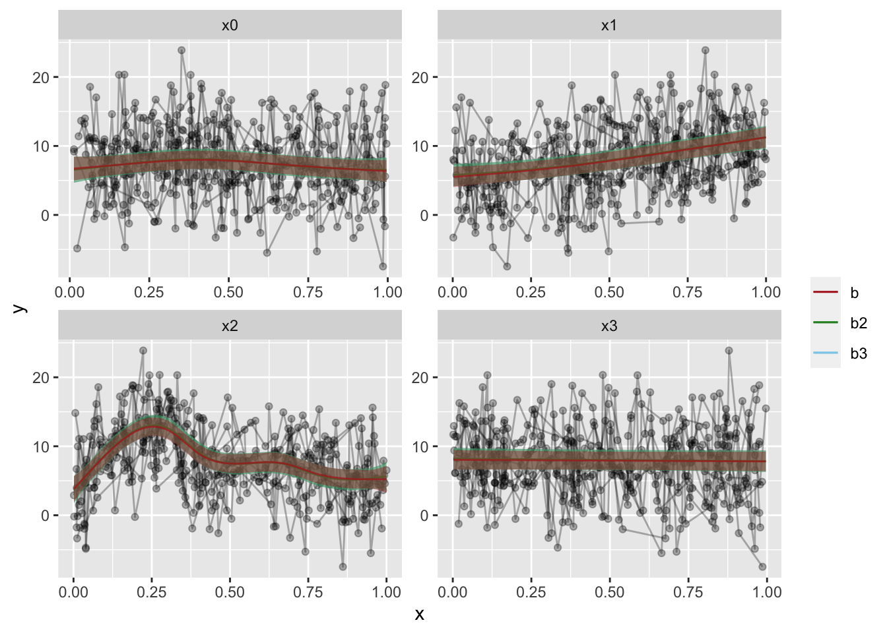

I'm working a lot with Generalized Additive Mixed Models (GAMMs) lately, and so, it seems I will be doing a small series on them as we go now. After a little feedback, I did some small alterations to the last post, hopefully it is a little easier to follow, you can read it [here](blog/gamm-spaghetti-plots-in-r-with-ggplot/). 

For this part I'd like to talk about random effects in `mgcv::gamm` as they are a little different from what I am used to from, for instance `lme4` or even a standard GAM.

When I started with GAMMs, it was mainly adapting code used by my PI, and taking it somewhat for granted that the syntax was correct (and it is). But when I started really looking into the outputs, I started seeing some differences in the output from other mixed models I had run through [lme4](https://cran.r-project.org/web/packages/lme4/lme4.pdf) and even through Bayesian mixed models with [rstanarm](https://cran.r-project.org/web/packages/rstanarm/rstanarm.pdf).

The random effects terms were specified differently. At first I thought this was mainly the fact that I was now using smoothing splines, which I was unfamiliar with running before. And it seemed intuitively weird to specify a factor as a random smoothing spline, which in my head would be a **slope** estimator, when I know the random effect I was after was participant intercepts.

We'll continue using the example from the package

```r
library(tidyverse); library(mgcv)
```

```
## ── Attaching packages ───────────────────────────────────────────────────── tidyverse 1.3.0 ──
```

```
## ✓ ggplot2 3.3.0     ✓ purrr   0.3.4
## ✓ tibble  3.0.1     ✓ dplyr   0.8.5
## ✓ tidyr   1.0.3     ✓ stringr 1.4.0
## ✓ readr   1.3.1     ✓ forcats 0.5.0
```

```
## ── Conflicts ──────────────────────────────────────────────────────── tidyverse_conflicts() ──
## x dplyr::filter() masks stats::filter()
## x dplyr::lag()    masks stats::lag()
```

```
## Loading required package: nlme
```

```
## 
## Attaching package: 'nlme'
```

```
## The following object is masked from 'package:dplyr':
## 
##     collapse
```

```
## This is mgcv 1.8-31. For overview type 'help("mgcv-package")'.
```

```r
set.seed(0)
n.g <- 10
n<-n.g*10*4

dat <- gamSim(1,n=n,scale=2)
```

```
## Gu & Wahba 4 term additive model
```

```r
f <- dat$f

## simulate nested random effects....
fa <- as.factor(rep(1:10,rep(4*n.g,10)))
ra <- rep(rnorm(10),rep(4*n.g,10))
fb <- as.factor(rep(rep(1:4,rep(n.g,4)),10))
rb <- rep(rnorm(4),rep(n.g,4))
for (i in 1:9) rb <- c(rb,rep(rnorm(4),rep(n.g,4)))

## simulate auto-correlated errors within groups
e<-array(0,0)
for (i in 1:40) {
  eg <- rnorm(n.g, 0, sd(f))
  for (j in 2:n.g) eg[j] <- eg[j-1]*0.6+ eg[j]
  e<-c(e,eg)
}

dat$y <- f + ra + rb + e
dat$id <- fa;dat$fb <- fb

# Have a look at the data
dat %>% glimpse
```

```
## Rows: 400
## Columns: 12
## $ y  <dbl> 5.7219994, -0.9639415, -1.2327185, 5.3578028, -0.5071576, 9.376896…
## $ x0 <dbl> 0.89669720, 0.26550866, 0.37212390, 0.57285336, 0.90820779, 0.2016…
## $ x1 <dbl> 0.14784571, 0.65887761, 0.18506996, 0.95437814, 0.89784849, 0.9436…
## $ x2 <dbl> 0.34826473, 0.85868745, 0.03443876, 0.97099715, 0.74511014, 0.2732…
## $ x3 <dbl> 0.04572472, 0.36652658, 0.74139303, 0.93350625, 0.67320995, 0.7013…
## $ f  <dbl> 7.962274, 5.514517, 3.576406, 8.692625, 8.752859, 16.190349, 8.026…
## $ f0 <dbl> 0.63773679, 1.48141126, 1.84076823, 1.94784424, 0.56878697, 1.1841…
## $ f1 <dbl> 1.344055, 3.735028, 1.447937, 6.744695, 6.023672, 6.602142, 4.2519…
## $ f2 <dbl> 5.980482e+00, 2.980780e-01, 2.877006e-01, 8.611364e-05, 2.160400e+…
## $ f3 <dbl> 0, 0, 0, 0, 0, 0, 0, 0, 0, 0, 0, 0, 0, 0, 0, 0, 0, 0, 0, 0, 0, 0, …
## $ id <fct> 1, 1, 1, 1, 1, 1, 1, 1, 1, 1, 1, 1, 1, 1, 1, 1, 1, 1, 1, 1, 1, 1, …
## $ fb <fct> 1, 1, 1, 1, 1, 1, 1, 1, 1, 1, 2, 2, 2, 2, 2, 2, 2, 2, 2, 2, 3, 3, …
```


The model we have run before was specified like so:

```r
b = gamm(y~s(x0,bs="cr")+s(x1,bs="cr")+s(x2,bs="cr")+s(x3,bs="cr"),
         random=list(id=~1,fb=~1),
         data=dat, correlation=corAR1())

# Let's see the model summary
b$gam %>% summary()
```

```
## 
## Family: gaussian 
## Link function: identity 
## 
## Formula:
## y ~ s(x0, bs = "cr") + s(x1, bs = "cr") + s(x2, bs = "cr") + 
##     s(x3, bs = "cr")
## 
## Parametric coefficients:
##             Estimate Std. Error t value Pr(>|t|)    
## (Intercept)   7.6878     0.5131   14.98   <2e-16 ***
## ---
## Signif. codes:  0 '***' 0.001 '**' 0.01 '*' 0.05 '.' 0.1 ' ' 1
## 
## Approximate significance of smooth terms:
##         edf Ref.df      F p-value    
## s(x0) 2.760  2.760  5.136 0.00925 ** 
## s(x1) 1.938  1.938 61.438 < 2e-16 ***
## s(x2) 7.059  7.059 42.398 < 2e-16 ***
## s(x3) 1.000  1.000  0.185 0.66755    
## ---
## Signif. codes:  0 '***' 0.001 '**' 0.01 '*' 0.05 '.' 0.1 ' ' 1
## 
## R-sq.(adj) =  0.351   
##   Scale est. = 13.963    n = 400
```

Notice how the random effects is specified as a separate argument in the function, as a list of two in this case `random=list(id=~1,fb=~1)`. The argument is given a named list, with the list names being the columns you want as random effects over, and the `~1` indicating you want estimated random intercepts over these columns.

In comparison to other functions, I read this argument as being equivalent to `lme4`'s `(1|id)` and `nlme`'s `random = ~ 1 | id`. The output of such a model is also familiar to me, when looking at the lme part of the output (remember how `gamm()` outputs a list of two models, one `lme` and one `gam`).

The summary does not contain particular information about the random effect, and you can grab the random effects coefficients with the `ranef` function, and clearly see each intercept estimated.


```r
ranef(b$lme)
```

```
## Level: g 
##            Xr1         Xr2         Xr3          Xr4        Xr5        Xr6
## 1 0.0005843676 0.003156997 -0.01032196 -0.006625699 0.02528885 0.04149708
##           Xr7         Xr8
## 1 -0.05451532 -0.07259337
## 
## Level: g.0 %in% g 
##             Xr.01        Xr.02        Xr.03        Xr.04       Xr.05
## 1/1 -0.0009779545 -0.001372479 -0.004842131 0.0001262393 -0.00105675
##           Xr.06       Xr.07      Xr.08
## 1/1 0.006042108 -0.01916633 0.03101186
## 
## Level: g.1 %in% g.0 %in% g 
##         Xr.11      Xr.12     Xr.13      Xr.14      Xr.15     Xr.16     Xr.17
## 1/1/1 0.57811 -0.2616855 -0.772783 -0.7038865 -0.7802115 -1.149971 0.7456378
##            Xr.18
## 1/1/1 -0.2837219
## 
## Level: g.2 %in% g.1 %in% g.0 %in% g 
##                Xr.21        Xr.22        Xr.23        Xr.24         Xr.25
## 1/1/1/1 2.909284e-10 2.054763e-10 1.476629e-09 1.896314e-09 -2.472759e-09
##                Xr.26       Xr.27        Xr.28
## 1/1/1/1 2.618453e-10 1.64276e-09 -2.44613e-10
## 
## Level: id %in% g.2 %in% g.1 %in% g.0 %in% g 
##            (Intercept)
## 1/1/1/1/1  -0.04093526
## 1/1/1/1/2  -1.24502533
## 1/1/1/1/3   1.10530245
## 1/1/1/1/4  -0.41008709
## 1/1/1/1/5   0.36932934
## 1/1/1/1/6  -0.70282594
## 1/1/1/1/7  -0.29445029
## 1/1/1/1/8   0.37379922
## 1/1/1/1/9   0.31498060
## 1/1/1/1/10  0.52991230
## 
## Level: fb %in% id %in% g.2 %in% g.1 %in% g.0 %in% g 
##              (Intercept)
## 1/1/1/1/1/1   -0.8283858
## 1/1/1/1/1/2    1.7647269
## 1/1/1/1/1/3   -0.7439014
## 1/1/1/1/1/4   -0.3082929
## 1/1/1/1/2/1   -0.4582550
## 1/1/1/1/2/2   -0.6137777
## 1/1/1/1/2/3   -1.1459145
## 1/1/1/1/2/4   -1.3056657
## 1/1/1/1/3/1    1.2229016
## 1/1/1/1/3/2   -0.7911620
## 1/1/1/1/3/3    1.9957750
## 1/1/1/1/3/4    0.7006611
## 1/1/1/1/4/1   -1.2557125
## 1/1/1/1/4/2   -1.2974789
## 1/1/1/1/4/3    2.0870433
## 1/1/1/1/4/4   -0.6944613
## 1/1/1/1/5/1    0.1460494
## 1/1/1/1/5/2    0.9042705
## 1/1/1/1/5/3   -0.7208290
## 1/1/1/1/5/4    0.7157679
## 1/1/1/1/6/1   -0.4242333
## 1/1/1/1/6/2   -0.4369515
## 1/1/1/1/6/3    0.8543035
## 1/1/1/1/6/4   -1.9822241
## 1/1/1/1/7/1    0.7972101
## 1/1/1/1/7/2    1.3004748
## 1/1/1/1/7/3   -1.1514110
## 1/1/1/1/7/4   -1.7796134
## 1/1/1/1/8/1    0.1702061
## 1/1/1/1/8/2    0.9086099
## 1/1/1/1/8/3   -1.0343737
## 1/1/1/1/8/4    1.0134668
## 1/1/1/1/9/1    0.4412907
## 1/1/1/1/9/2   -1.4015796
## 1/1/1/1/9/3    1.1137714
## 1/1/1/1/9/4    0.7379609
## 1/1/1/1/10/1   0.7863282
## 1/1/1/1/10/2  -0.8114996
## 1/1/1/1/10/3  -0.7101010
## 1/1/1/1/10/4   2.2350055
```

So, this leads me to what my PI has been doing. In his code, the random effects are specified as smoothing spines through `mgcv`'s formula function `s()`. I'll not cover this function too much right now, you can see it in the formula we have already used, and it is a powerful smoothing spline function, where you can specify different types of splines. You can also specify that the spline is a random effect, by setting the argument `bs` to `"re"`. 


```r
b2 = gamm(y~s(x0,bs="cr")+s(x1,bs="cr")+s(x2,bs="cr")+s(x3,bs="cr") +
            s(id, bs="re") + s(fb, bs="re"),
          data=dat, correlation=corAR1())

# Let's see the model summary
b2$gam %>% summary()
```

```
## 
## Family: gaussian 
## Link function: identity 
## 
## Formula:
## y ~ s(x0, bs = "cr") + s(x1, bs = "cr") + s(x2, bs = "cr") + 
##     s(x3, bs = "cr") + s(id, bs = "re") + s(fb, bs = "re")
## 
## Parametric coefficients:
##             Estimate Std. Error t value Pr(>|t|)    
## (Intercept)   7.6814     0.6034   12.73   <2e-16 ***
## ---
## Signif. codes:  0 '***' 0.001 '**' 0.01 '*' 0.05 '.' 0.1 ' ' 1
## 
## Approximate significance of smooth terms:
##             edf Ref.df      F  p-value    
## s(x0) 3.018e+00  3.018  4.833 0.002708 ** 
## s(x1) 2.058e+00  2.058 55.553  < 2e-16 ***
## s(x2) 7.093e+00  7.093 44.217  < 2e-16 ***
## s(x3) 1.000e+00  1.000  0.424 0.515152    
## s(id) 5.984e+00  9.000  2.254 0.000526 ***
## s(fb) 1.389e-05  3.000  0.000 0.370790    
## ---
## Signif. codes:  0 '***' 0.001 '**' 0.01 '*' 0.05 '.' 0.1 ' ' 1
## 
## R-sq.(adj) =  0.428   
##   Scale est. = 16.399    n = 400
```

Notice how we've now **not** used the `random` argument in the function, but set two splines over the random effects instead. Notice also that while p and F-values have changed, the effects are still very strong, and the adjusted R^2^ is also changed, but the conclusion would still be the same. I'm still working on understanding exactly _how_ these values change on a statistical basis, but I understand why.

See also how the model summary also includes the random effect splines in the summary of fixed effects! This tripped me up a little, but they are still not handled as fixed effects, they are random, but there **is** something different about the models.

and that is true. The first case uses a "standard" maximum likelihood function on the estimates, which makes it fast and powerfull. The second example introduces a penalized ridge function over the random effects, making it quite a conservative approach. Which you can see through the reduced F-values and increased p-values, and but also the increased correlation!

I was still quite insecure about what I was looking at. There are things with this output that is different enough for me to be a little insecure about the approach being _correct_. Using `ranef` on this output, furhter made me a little anxious, it was so different than what I am used to.


```r
ranef(b2$lme)
```

```
## Level: g 
##           Xr1         Xr2         Xr3          Xr4        Xr5        Xr6
## 1 0.001218306 0.006751215 -0.01164747 -0.002250968 0.03275992 0.05436231
##           Xr7         Xr8
## 1 -0.08915512 -0.07731022
## 
## Level: g.0 %in% g 
##            Xr.01        Xr.02        Xr.03         Xr.04        Xr.05
## 1/1 -0.001094679 -0.002218705 -0.006072649 -0.0008453061 -0.004124781
##           Xr.06       Xr.07      Xr.08
## 1/1 0.008283311 -0.02910859 0.03293125
## 
## Level: g.1 %in% g.0 %in% g 
##          Xr.11     Xr.12      Xr.13      Xr.14      Xr.15     Xr.16     Xr.17
## 1/1/1 0.600786 -0.311167 -0.6703398 -0.8216271 -0.8450285 -1.124136 0.8277681
##            Xr.18
## 1/1/1 -0.2820918
## 
## Level: g.2 %in% g.1 %in% g.0 %in% g 
##                Xr.21        Xr.22        Xr.23        Xr.24         Xr.25
## 1/1/1/1 1.143455e-10 1.382432e-10 2.446341e-10 5.680494e-10 -7.165239e-10
##                 Xr.26        Xr.27        Xr.28
## 1/1/1/1 -1.735753e-10 7.832526e-10 4.623393e-11
## 
## Level: g.3 %in% g.2 %in% g.1 %in% g.0 %in% g 
##              Xr.31     Xr.32     Xr.33      Xr.34     Xr.35     Xr.36    Xr.37
## 1/1/1/1/1 1.014185 0.5310558 0.8330142 -0.3497278 -1.347548 0.6065157 -0.70093
##              Xr.38     Xr.39      Xr.310
## 1/1/1/1/1 2.054974 -2.542524 -0.09901478
## 
## Level: g.4 %in% g.3 %in% g.2 %in% g.1 %in% g.0 %in% g 
##                     Xr.41        Xr.42         Xr.43        Xr.44
## 1/1/1/1/1/1 -1.281446e-06 3.505485e-06 -2.816875e-06 5.928355e-07
```

Look at that, the random participant intercepts are seemingly gone! _Whaaaaaat?_ I've been looking into why, and the answer still eludes me a little. But I know the random effects are taken into account in the model, I know they are random because I specified them so, and I also can see a simple summary of the spline in the model summary. 

This is not the first thing about the `gamm` output that is different from other models. We know it outputs a list of two models, a `gam` and an `lme` , and these two are given to provide something familiar to compare to `gamm` to. The splines are also quite different than what we would specify otherwise, like quadratic fits, and their output would naturally also be a little different.

and it hit me I was treating a subject identifier as a `double` rather than as a `factor`. Yikes! That was punishment for me not being observant enough about my data. The second model is in a way, estimating a smoothing spline along my ID as if it was a continuous numeric variable. 

Let's make it a factor, and have a look-see at what happens then.


```r
dat = dat %>% mutate(id = factor(id))

b3 = gamm(y~s(x0,bs="cr")+s(x1,bs="cr")+s(x2,bs="cr")+s(x3,bs="cr") +
            s(id, bs="re") + s(fb, bs="re"),
          data=dat, correlation=corAR1())

# Let's see the model summary
b3$gam %>% summary()
```

```
## 
## Family: gaussian 
## Link function: identity 
## 
## Formula:
## y ~ s(x0, bs = "cr") + s(x1, bs = "cr") + s(x2, bs = "cr") + 
##     s(x3, bs = "cr") + s(id, bs = "re") + s(fb, bs = "re")
## 
## Parametric coefficients:
##             Estimate Std. Error t value Pr(>|t|)    
## (Intercept)   7.6814     0.6034   12.73   <2e-16 ***
## ---
## Signif. codes:  0 '***' 0.001 '**' 0.01 '*' 0.05 '.' 0.1 ' ' 1
## 
## Approximate significance of smooth terms:
##             edf Ref.df      F  p-value    
## s(x0) 3.018e+00  3.018  4.833 0.002708 ** 
## s(x1) 2.058e+00  2.058 55.553  < 2e-16 ***
## s(x2) 7.093e+00  7.093 44.217  < 2e-16 ***
## s(x3) 1.000e+00  1.000  0.424 0.515152    
## s(id) 5.984e+00  9.000  2.254 0.000526 ***
## s(fb) 1.389e-05  3.000  0.000 0.370790    
## ---
## Signif. codes:  0 '***' 0.001 '**' 0.01 '*' 0.05 '.' 0.1 ' ' 1
## 
## R-sq.(adj) =  0.428   
##   Scale est. = 16.399    n = 400
```

Well, in this specific example, factoring ID does not have a particularly large effect. But on my actual data it did, which makes sense. Treating people as a continuous variable is generally a bad idea! Goes to show you should always have an extra thought about what you are doing, and what your variables **are** and what they are coded as.

Maybe it has an effect on the random effects output?

```r
ranef(b3$lme)
```

```
## Level: g 
##           Xr1         Xr2         Xr3          Xr4        Xr5        Xr6
## 1 0.001218306 0.006751215 -0.01164747 -0.002250968 0.03275992 0.05436231
##           Xr7         Xr8
## 1 -0.08915512 -0.07731022
## 
## Level: g.0 %in% g 
##            Xr.01        Xr.02        Xr.03         Xr.04        Xr.05
## 1/1 -0.001094679 -0.002218705 -0.006072649 -0.0008453061 -0.004124781
##           Xr.06       Xr.07      Xr.08
## 1/1 0.008283311 -0.02910859 0.03293125
## 
## Level: g.1 %in% g.0 %in% g 
##          Xr.11     Xr.12      Xr.13      Xr.14      Xr.15     Xr.16     Xr.17
## 1/1/1 0.600786 -0.311167 -0.6703398 -0.8216271 -0.8450285 -1.124136 0.8277681
##            Xr.18
## 1/1/1 -0.2820918
## 
## Level: g.2 %in% g.1 %in% g.0 %in% g 
##                Xr.21        Xr.22        Xr.23        Xr.24         Xr.25
## 1/1/1/1 1.143455e-10 1.382432e-10 2.446341e-10 5.680494e-10 -7.165239e-10
##                 Xr.26        Xr.27        Xr.28
## 1/1/1/1 -1.735753e-10 7.832526e-10 4.623393e-11
## 
## Level: g.3 %in% g.2 %in% g.1 %in% g.0 %in% g 
##              Xr.31     Xr.32     Xr.33      Xr.34     Xr.35     Xr.36    Xr.37
## 1/1/1/1/1 1.014185 0.5310558 0.8330142 -0.3497278 -1.347548 0.6065157 -0.70093
##              Xr.38     Xr.39      Xr.310
## 1/1/1/1/1 2.054974 -2.542524 -0.09901478
## 
## Level: g.4 %in% g.3 %in% g.2 %in% g.1 %in% g.0 %in% g 
##                     Xr.41        Xr.42         Xr.43        Xr.44
## 1/1/1/1/1/1 -1.281446e-06 3.505485e-06 -2.816875e-06 5.928355e-07
```

Nope, not particularly. It's stil not what i would be used to seeing. Oh well. For now, I've settled my mind on that the models show equivalency, which we can see if we compare the models with model comparison function `anova` (enter confusion, this function is a model comparator in R, if you want to do a "classical" anova, the function you are looking for is `aov`).


```r
anova(b$lme, b2$lme, b3$lme)
```

```
##        Model df      AIC      BIC    logLik
## b$lme      1 13 2178.215 2230.104 -1076.108
## b2$lme     2 13 2191.055 2242.943 -1082.527
## b3$lme     3 13 2191.055 2242.943 -1082.527
```

If you are not used to model comparisons, what you want to look at is Bayesian Information Criterion (BIC) that is the lowest. In our case, the two last models are exactly the same, factoring we saw didn't have much effect in this example. The first model is, however, superior, but only by a very small margin. Most people would agree that all three models are equivalent.

Lets also plot then to see how the fits look. I'll be using the function I presented in the last post, that creates fitted data with the `itsadug` package.


```r
GammPredData = function(data, gamm.model, condition){
  require(itsadug)
  eval(parse(text=paste0(
    "get_predictions(gamm.model, cond = list(",
    condition,
    "=seq(min(data[condition], na.rm=T),max(data[condition], na.rm=T), length.out = nrow(data)))) %>% as.data.frame() %>% mutate(",
    str_split(gamm.model$formula, " ")[[2]],"=1)")))
}
```


```r
# Predictions
p = c("x0", "x1", "x2","x3")

# we will be using facet_wrap, gather the data on the predictors, for a long data frame.
dat2 = dat %>% 
  gather(Pred, x, p)

preds.b = preds.b2 = preds.b3 = list() # prepare lists for predictions

# loop through the predictors
for(i in 1:length(p)){
  preds.b[[i]] = GammPredData(dat, b$gam, p[i]) %>% 
    select_("y", "CI", "fit", p[i])
  
  preds.b2[[i]] = GammPredData(dat, b2$gam, p[i]) %>% 
    select_("y", "CI", "fit", p[i])
  
  preds.b3[[i]] = GammPredData(dat, b3$gam, p[i]) %>% 
    select_("y", "CI", "fit", p[i])
  
  names(preds.b)[i] = names(preds.b2)[i] = names(preds.b3)[i] = p[i]
}
```

```
## Summary:
## 	* x0 : numeric predictor; with 400 values ranging from 0.013078 to 0.996077. 
## 	* x1 : numeric predictor; set to the value(s): 0.514732652809471. 
## 	* x2 : numeric predictor; set to the value(s): 0.445692849811167. 
## 	* x3 : numeric predictor; set to the value(s): 0.477402933407575. 
## 	* NOTE : No random effects in the model to cancel.
## 
```

```
## Warning: select_() is deprecated. 
## Please use select() instead
## 
## The 'programming' vignette or the tidyeval book can help you
## to program with select() : https://tidyeval.tidyverse.org
## This warning is displayed once per session.
```

```
## Summary:
## 	* x0 : numeric predictor; with 400 values ranging from 0.013078 to 0.996077. 
## 	* x1 : numeric predictor; set to the value(s): 0.514732652809471. 
## 	* x2 : numeric predictor; set to the value(s): 0.445692849811167. 
## 	* x3 : numeric predictor; set to the value(s): 0.477402933407575. 
## 	* id : factor; set to the value(s): 1. (Might be canceled as random effect, check below.) 
## 	* fb : factor; set to the value(s): 1. (Might be canceled as random effect, check below.) 
## 	* NOTE : The following random effects columns are canceled: s(id),s(fb)
##  
## Summary:
## 	* x0 : numeric predictor; with 400 values ranging from 0.013078 to 0.996077. 
## 	* x1 : numeric predictor; set to the value(s): 0.514732652809471. 
## 	* x2 : numeric predictor; set to the value(s): 0.445692849811167. 
## 	* x3 : numeric predictor; set to the value(s): 0.477402933407575. 
## 	* id : factor; set to the value(s): 1. (Might be canceled as random effect, check below.) 
## 	* fb : factor; set to the value(s): 1. (Might be canceled as random effect, check below.) 
## 	* NOTE : The following random effects columns are canceled: s(id),s(fb)
##  
## Summary:
## 	* x0 : numeric predictor; set to the value(s): 0.476351245073602. 
## 	* x1 : numeric predictor; with 400 values ranging from 0.001837 to 0.999455. 
## 	* x2 : numeric predictor; set to the value(s): 0.445692849811167. 
## 	* x3 : numeric predictor; set to the value(s): 0.477402933407575. 
## 	* NOTE : No random effects in the model to cancel.
##  
## Summary:
## 	* x0 : numeric predictor; set to the value(s): 0.476351245073602. 
## 	* x1 : numeric predictor; with 400 values ranging from 0.001837 to 0.999455. 
## 	* x2 : numeric predictor; set to the value(s): 0.445692849811167. 
## 	* x3 : numeric predictor; set to the value(s): 0.477402933407575. 
## 	* id : factor; set to the value(s): 1. (Might be canceled as random effect, check below.) 
## 	* fb : factor; set to the value(s): 1. (Might be canceled as random effect, check below.) 
## 	* NOTE : The following random effects columns are canceled: s(id),s(fb)
##  
## Summary:
## 	* x0 : numeric predictor; set to the value(s): 0.476351245073602. 
## 	* x1 : numeric predictor; with 400 values ranging from 0.001837 to 0.999455. 
## 	* x2 : numeric predictor; set to the value(s): 0.445692849811167. 
## 	* x3 : numeric predictor; set to the value(s): 0.477402933407575. 
## 	* id : factor; set to the value(s): 1. (Might be canceled as random effect, check below.) 
## 	* fb : factor; set to the value(s): 1. (Might be canceled as random effect, check below.) 
## 	* NOTE : The following random effects columns are canceled: s(id),s(fb)
##  
## Summary:
## 	* x0 : numeric predictor; set to the value(s): 0.476351245073602. 
## 	* x1 : numeric predictor; set to the value(s): 0.514732652809471. 
## 	* x2 : numeric predictor; with 400 values ranging from 0.001315 to 0.999931. 
## 	* x3 : numeric predictor; set to the value(s): 0.477402933407575. 
## 	* NOTE : No random effects in the model to cancel.
##  
## Summary:
## 	* x0 : numeric predictor; set to the value(s): 0.476351245073602. 
## 	* x1 : numeric predictor; set to the value(s): 0.514732652809471. 
## 	* x2 : numeric predictor; with 400 values ranging from 0.001315 to 0.999931. 
## 	* x3 : numeric predictor; set to the value(s): 0.477402933407575. 
## 	* id : factor; set to the value(s): 1. (Might be canceled as random effect, check below.) 
## 	* fb : factor; set to the value(s): 1. (Might be canceled as random effect, check below.) 
## 	* NOTE : The following random effects columns are canceled: s(id),s(fb)
##  
## Summary:
## 	* x0 : numeric predictor; set to the value(s): 0.476351245073602. 
## 	* x1 : numeric predictor; set to the value(s): 0.514732652809471. 
## 	* x2 : numeric predictor; with 400 values ranging from 0.001315 to 0.999931. 
## 	* x3 : numeric predictor; set to the value(s): 0.477402933407575. 
## 	* id : factor; set to the value(s): 1. (Might be canceled as random effect, check below.) 
## 	* fb : factor; set to the value(s): 1. (Might be canceled as random effect, check below.) 
## 	* NOTE : The following random effects columns are canceled: s(id),s(fb)
##  
## Summary:
## 	* x0 : numeric predictor; set to the value(s): 0.476351245073602. 
## 	* x1 : numeric predictor; set to the value(s): 0.514732652809471. 
## 	* x2 : numeric predictor; set to the value(s): 0.445692849811167. 
## 	* x3 : numeric predictor; with 400 values ranging from 0.001642 to 0.996272. 
## 	* NOTE : No random effects in the model to cancel.
##  
## Summary:
## 	* x0 : numeric predictor; set to the value(s): 0.476351245073602. 
## 	* x1 : numeric predictor; set to the value(s): 0.514732652809471. 
## 	* x2 : numeric predictor; set to the value(s): 0.445692849811167. 
## 	* x3 : numeric predictor; with 400 values ranging from 0.001642 to 0.996272. 
## 	* id : factor; set to the value(s): 1. (Might be canceled as random effect, check below.) 
## 	* fb : factor; set to the value(s): 1. (Might be canceled as random effect, check below.) 
## 	* NOTE : The following random effects columns are canceled: s(id),s(fb)
##  
## Summary:
## 	* x0 : numeric predictor; set to the value(s): 0.476351245073602. 
## 	* x1 : numeric predictor; set to the value(s): 0.514732652809471. 
## 	* x2 : numeric predictor; set to the value(s): 0.445692849811167. 
## 	* x3 : numeric predictor; with 400 values ranging from 0.001642 to 0.996272. 
## 	* id : factor; set to the value(s): 1. (Might be canceled as random effect, check below.) 
## 	* fb : factor; set to the value(s): 1. (Might be canceled as random effect, check below.) 
## 	* NOTE : The following random effects columns are canceled: s(id),s(fb)
## 
```

```r
# use bind_rows to make them into large data frames and gather them, just like the data
preds.b = bind_rows(preds.b)%>% 
  gather(Pred, x, p) %>% 
  na.omit()

preds.b2 = bind_rows(preds.b2)%>% 
  gather(Pred, x, p) %>% 
  na.omit()

preds.b3 = bind_rows(preds.b3)%>% 
  gather(Pred, x, p) %>% 
  na.omit()

# Lets plot them all, here, I will add all three models predictions on top of eachother in different colors, for easy comparison.

dat2 %>% 
  ggplot(aes(x=x, y=y)) + 
  geom_line(alpha=.3,aes(group=id)) + 
  geom_point(alpha=.3) +

  
  # Add predictions for model b3
  geom_ribbon(data=preds.b3, alpha=.4, aes(ymin=fit-CI, ymax=fit+CI, fill="b3"), show.legend = F) +
  geom_line(data=preds.b3, alpha=.7, aes(y=fit, color="b3")) +
    
  # Add predictions for model b2
  geom_ribbon(data=preds.b2, alpha=.4, aes(ymin=fit-CI, ymax=fit+CI, fill="b2"), show.legend = F) +
  geom_line(data=preds.b2, alpha=.7, aes(y=fit, color="b2")) +
  
  # Add predictions for model b
  geom_ribbon(data=preds.b, alpha=.4, aes(ymin=fit-CI, ymax=fit+CI, fill="b"), show.legend = F) +
  geom_line(data=preds.b, alpha=.7, aes(y=fit, color="b")) +
  
  # Add some color, this way of doing it gives us a nice legend!
  scale_color_manual("",
                     breaks=c("b","b2","b3"),
                     values=c("firebrick","forestgreen","skyblue")) +
  scale_fill_manual("",
                    breaks=c("b","b2","b3"),
                    values=c("firebrick","forestgreen","skyblue")) +
  
  facet_wrap(~Pred, scales="free")
```

<!-- -->

The fit overlap is uncanny, but the confidence intervals have a marked difference. With my actual data, there is a little more difference than here, but it really is quite minute. 

So, through my tests, I've become quite confident that the approaches are both _valid_. There is nothing statistically _wrong_ in doing either. However, if you want a conservative approach, the second option, with random effects as a spline is the way to go. Just make sure your subject identifier is a factor, it might impact your inference more than you think.
