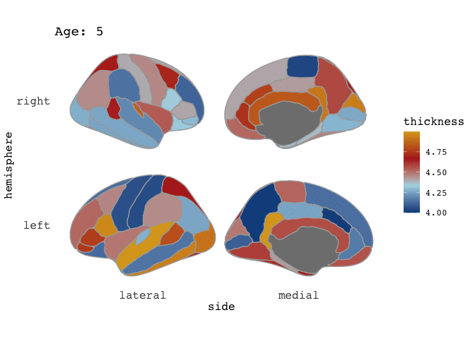

```{r setup, include=F}
library(tidyverse)
library(ggseg)
```

I'm super delighted that our ggseg package was so well received! We almost immediately got it on [Neuroconductor](https://neuroconductor.org/), which is a neuroimaging equivalent to Bioconductor. We got some pull requests from people helping us improve the code, and particularly get it ready for CRAN when we decide to submit it there. 

In all of this, I learned so much about creating packages, and ended up making quite a major alteration to the base-functions of the package. I had not completely understood the use and the ellipsis (`...`) and as such had not used it correctly. Once I started understanding it, we could make the package working closer to what a standard ggplot package would work!

The package vignettes are update on the new usage, which mainly affects how you may supply data for facetting. Just have a look at  `vignette("ggseg")` and `vignette("externalData")` for a more up-to-date understanding of how the data should look. 

And this post will use the technique necessary for facetting, just for making animations with the [gganimate](https://github.com/thomasp85/gganimate) package instead. This package is so clever, and I am in complete awe of Thomas' brilliance in making it. Especially the new development version, which has altered the way to use the package that falls completely in-line with the rest of the ggplot-idea. 

Let's fabricate some data to work with. I want to plot the Desikan-Killany atlas, with information for mean values of thickness across different ages. Since I'm completely making all this data up, I'll just start with the `dk` data.frame that comes with the package, grabs its unique instances of region and hemisphere (which gives me every region in the dk atlas), and start making up some cortical thickness values per age.

Grab the unique polygons
```{r}
base_atlas = dk %>% 
  select(region, hemi) %>% 
  distinct() %>% 
  na.omit()

base_atlas %>% head(5)
```

Make up some cortical thickness values given an age
```{r}
new_data = base_atlas %>% 
  mutate(Age=7,
         thickness = sample(seq(4,5,by=.001), nrow(.)))
```

Lets plot it to have a looksie
```{r}
new_data %>% 
  ggseg(mapping=aes(fill=thickness), position="stacked", colour="darkgrey") +
  scale_fill_gradientn(colours=c("dodgerblue4","light blue","firebrick","goldenrod"))
```

ok, so that looks pretty decent. Notice that I've included some extra aestetics to make it look nice. I've added `colour` to provide definition between the cortical parcellations, and made sure the `size` of this line is thin. 

So, now I want to do the same thing, just for many different age groups.

```{r}
# Make a list of all the age groups
full_data = sapply(seq(5,40,by=5), list)
names(full_data) = seq(5,40,by=5)

# apply through the list to fabricate data per age.
full_data = lapply(full_data, 
       function(x)  
         base_atlas %>% 
         mutate(Age=x[1],
                thickness = sample(seq(4,5,by=.001), nrow(.))))

# Bind the data together.
full_data = full_data %>% bind_rows()
```

Now we should have a data frame with values for each region and hemisphere across the ages 5-40. 
Let's have a look at how it looks when we facet it.

```{r}
full_data %>% 
  ggseg(mapping=aes(fill=thickness), position="stacked", colour="darkgrey") +
  scale_fill_gradientn(colours=c("dodgerblue4","light blue","firebrick","goldenrod")) +
  facet_wrap(~Age)
```

Hm, there is something a little off here. The medial wall is omitted from all facets, and is placed in it's own facet! 
This is expected behaviour as of the new `ggseg` version. 

If you want to facet, you'll need to make sure each facet includes information for *all regions*  even if these regions don't have any aestetics value (in this case a thickness value we are plotting as fill). 

To manage this, we need to go back a step when we made the data.frame, and merge our fabricated data with the entire `dk` atlas.


```{r}
# Make a list of all the age groups
full_data = sapply(seq(5,40,by=5), list)
names(full_data) = seq(5,40,by=5)

# apply through the list to fabricate data per age, and add dk atlas
full_data = lapply(full_data, 
       function(x)  
         base_atlas %>% 
         mutate(thickness = sample(seq(4,5,by=.001), nrow(.))) %>% 
         full_join(dk) %>% 
         mutate(Age=x[1])
         )

# Bind the data together.
full_data = full_data %>% bind_rows()
```

You see how we've been informed that the data have been joined by `hemi` and `region`, which is exactly what we want. Let's see what it looks like now.


```{r}
full_data %>% 
  ggseg(mapping=aes(fill=thickness), position="stacked", colour="darkgrey") +
  scale_fill_gradientn(colours=c("dodgerblue4","light blue","firebrick","goldenrod")) +
  facet_wrap(~Age)
```

Even more crazy! But again, this is expected behaviour. You see, we have supplied an entire atlas of information to ggseg, which again tries to mege it with (in this case)  the dk atlas. That makes this odd behaviour.

To plot this as we want, we need to tell `ggseg` that we are supplying a new `atlas` **not** new data.

```{r}
ggseg(atlas=full_data, mapping=aes(fill=thickness), position="stacked", colour="darkgrey") +
  scale_fill_gradientn(colours=c("dodgerblue4","light blue","firebrick","goldenrod")) +
  facet_wrap(~Age)
```

Right-o! Now we're cookin'! Now that we've established that our data is good for faceting, this means it is also good for animating.

You'll need to install the gganimate package from github to get this working and also install the package `transformr` from the same author, as we are working with polygons. 

While I am still far from comfortable with gganimate (I struggle to control speed and types of transitions), it is pretty easy to get an animation going. Disclaimer here: this data is quite rich, so you'll need patienence for the animation to render.

We use the same bare plot as before, but substitute the facet with a transition. The transition here you provide with the variable that contains the different transitions, and information about the transition length and state length, which I am more unsure of. At the end, we'll make sure the title of the plot corresponds with the age currently displaying, with some more `gganimate` magic.

```{r "featured", message=F, fig.show = "animate", ffmpeg.format="gif", dev="png", results="hide"}
library(gganimate)
library(transformr)

t = ggseg(atlas=full_data, 
          mapping=aes(fill=thickness), 
          position="stacked", colour="darkgrey") +
  scale_fill_gradientn(
    colours = c("dodgerblue4","light blue","firebrick","goldenrod")
    ) +
  transition_states(Age, 1, 1) + 
  labs(title = "Age: {closest_state}")

# This last part is just to control the output in this blog, which was rendering the gif too slow by default
animate(t, fps = 10) 

```




 
and there you go! A pretty animation of the data! To understand the arguments to gganimate, I guess the best way to get a feel for it is to just play around with it. Now, I have to admit, that I am a little frustrated by the the gif is shown here on the blog, as in the RStudio viewer it looks awesome, with nice smooth transitions between states (here: Ages), but it is rendered here with very stacatto transitions.

I'm giving up a little fixing this issue for now, and hope I'll manage a better integration of gifs on the blog in the future.
  
Happy plotting!

_Edit: This post was edited May 1st 2020 to reflect newer package changes_
