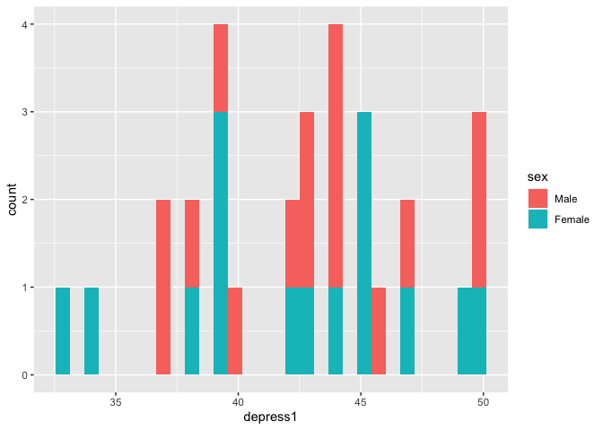
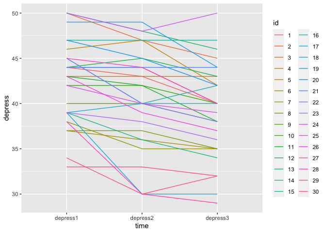
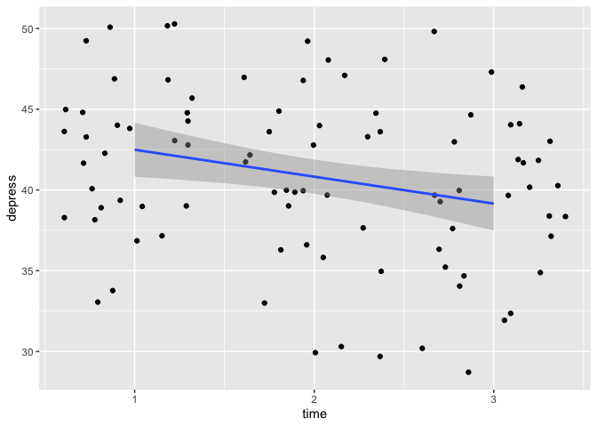

I recently was talking with a good friend and brilliant researcher regarding the advantages of R. As you can guess, I was the advocate. Coming from psychology, we are mainly taught to use "simple" analysis tools, and mainly SPSS. I never liked SPSS, even as a student. not knowing of any possible alternatives or what could be improved, I just thought the whole thing felt too black-boxy. But it is a convenient tool, when the data is already in a relatively clean format, and the analyses you want to do are straight forward, and you don't mind not knowing exactly the formula SPSS uses to calculate your results.

Now, R, on the other hand, requires you to be proficient in it in a different way than SPSS. It is hard, in R, to just type (or click) some stuff and get some results without haveing to work a little for it. In my opinion, this is a positive, but it also can create a barrier for those who find coding scary or just don't have the interest or time to sit down and literally learn a new language. However, the benefit once you have done so, in my opinion, vastly out-weighs the disadvantage. Once you are proficient enough in R, and amazing realm of possibilities opens up, and you have a gazillion tools to do more or less anything you want to do, be it analysing complex data, a simple linear regression, writing a blog or making interactive data portals. 

So, this will be the first in my series of R for psychologists. We dive straight into it, I'll assume you have [installed both R and RStudio](https://courses.edx.org/courses/UTAustinX/UT.7.01x/3T2014/56c5437b88fa43cf828bff5371c6a924/), and are capable of opening RStudio. We will start with reading in SPSS data, looking at the data, do some simple plots, and then a simple linear model. 

# RStudio - the quick tour.
RStudio will look completely different than SPSS, and it will take you some time to get comfortable with that. Firstly, you do not have to have any data open to have RStudio open, when you open RStudio you have a completely blank slate. No data, no fancy stuff, just a program ready to do your bidding.

The first thing we will do is make a `Project` that will be where we put all the stuff we will be working on during this series. At the top right of Rstudio, there is a blue icon with the text `Project: (None)` next to it, click it and choose New Project - New directory - New Package, and choose what to call your project and where to put it. Let's say for simplicity to call it "R_start" and place it on your Desktop. 

Rstudio will now create a folder called "R_start" on your Desktop and will go into this folder, so that anything you do will happen from within that folder.

Lets also open a file we can place our script in (or our Syntax if you want). Click the little green circle with the pluss sign, and open an `RScript`

You'll have something that looks like this once you've done so:


The top left quadrant is where your script will go (i.e. is where we are building the syntax). The bottom left is the **console** that _executes_ your commands or you script. Whenever we want to do something, it is in the console that we do it. In a way, this is where R as a program lives, the rest or RStudio is just a way of communicating with it. The top right quadrant will show you any data (called objects in R) that you have active and available, and the bottom right is a place you can navigate to where you want to be working. The bottom right hows you the content of the folder you are in, which is the "R_start" folder on your Dekstop. 

Let's download some data that we can work with. This little bit of code, will download an dataset from the SPSS survival manual, and place it in your current folder.

In your console, type:

```r
download.file("http://spss.allenandunwin.com.s3-website-ap-southeast-2.amazonaws.com/Files/experim.zip", 
              destfile = "experim.zip")
```

You will now see, in the Files pane in the bottom right, that a file named `experim.zip` is there. For us to use the data you need to unzip/extract the file. Once you have done so, a file called `experim.sav` will be in there too. This will be our data for now.

# Open SPSS data in R
R has about a gazillion handy tools to open data from different sources. 
My personal favourite, working with data from so many sources, is using the [rio](https://github.com/leeper/rio) package, which opens more or less any file you give it.

To use an R package, like rio, you need to install it. We will also install the [tidyverse]() meta-package (it contains several packages) which gives us easier ways to work with data than base R does.

In your console, type:

```r
install.packages("rio")

install.packages("tidyverse")
```

Once you do this, your console will start being very busy. Rio is a large package, because it does so many things, so it takes a bit of time to install.

Once it is installed, you can start using it. First by letting R know you want to use it, then using its `import` function.

Here, we will read in the data from the `sav` file, and assign it to an object we will call `eData`.

In your console, type:

```r
library(rio)
eData = import("experim.sav")
```


In your top right quandrant now, your environment pane will list one object called `eData` , that has 30 observations (cases) and 18 variables. Lets look at it! 

In your console, type:

```r
library(tidyverse)
```

```
## ── Attaching packages ────────────────────────────────────── tidyverse 1.3.0 ──
```

```
## ✓ ggplot2 3.3.0     ✓ purrr   0.3.4
## ✓ tibble  3.0.1     ✓ dplyr   0.8.5
## ✓ tidyr   1.0.3     ✓ stringr 1.4.0
## ✓ readr   1.3.1     ✓ forcats 0.5.0
```

```
## ── Conflicts ───────────────────────────────────────── tidyverse_conflicts() ──
## x dplyr::filter() masks stats::filter()
## x dplyr::lag()    masks stats::lag()
```

```r
glimpse(eData)
```

```
## Rows: 30
## Columns: 18
## $ id       <dbl> 4, 10, 9, 3, 12, 11, 6, 5, 8, 13, 14, 1, 15, 7, 2, 27, 25, 1…
## $ sex      <dbl> 1, 1, 1, 1, 1, 1, 1, 1, 1, 1, 1, 1, 1, 1, 1, 2, 2, 2, 2, 2, …
## $ age      <dbl> 23, 21, 25, 30, 45, 22, 22, 26, 23, 21, 23, 19, 23, 19, 21, …
## $ group    <dbl> 2, 2, 1, 1, 2, 1, 2, 1, 2, 1, 2, 1, 1, 1, 2, 1, 1, 1, 2, 1, …
## $ fost1    <dbl> 50, 47, 44, 47, 46, 39, 32, 44, 40, 47, 38, 32, 39, 36, 37, …
## $ confid1  <dbl> 15, 14, 12, 11, 16, 13, 21, 17, 22, 20, 28, 20, 21, 24, 29, …
## $ depress1 <dbl> 44, 42, 40, 43, 44, 43, 37, 46, 37, 50, 39, 44, 47, 38, 50, …
## $ fost2    <dbl> 48, 45, 39, 42, 45, 40, 33, 37, 40, 45, 37, 28, 35, 32, 36, …
## $ confid2  <dbl> 16, 15, 18, 16, 16, 20, 22, 20, 23, 25, 27, 25, 26, 28, 30, …
## $ depress2 <dbl> 44, 42, 40, 43, 45, 42, 36, 47, 37, 48, 36, 43, 47, 35, 47, …
## $ fost3    <dbl> 45, 44, 36, 41, 43, 39, 32, 32, 40, 46, 32, 23, 35, 30, 34, …
## $ confid3  <dbl> 14, 18, 19, 20, 20, 22, 23, 26, 26, 27, 29, 30, 30, 32, 34, …
## $ depress3 <dbl> 40, 40, 38, 43, 43, 38, 35, 42, 35, 46, 34, 40, 47, 35, 45, …
## $ exam     <dbl> 52, 55, 58, 60, 58, 62, 59, 70, 60, 70, 72, 82, 79, 80, 90, …
## $ mah_1    <dbl> 0.5699842, 1.6594031, 3.5404715, 2.4542143, 0.9443036, 1.625…
## $ DepT1gp2 <dbl> 0, 0, 0, 0, 0, 0, 0, 1, 0, 1, 0, 0, 1, 0, 1, 1, 0, 1, 0, 0, …
## $ DepT2Gp2 <dbl> 0, 0, 0, 0, 1, 0, 0, 1, 0, 1, 0, 0, 1, 0, 1, 0, 0, 1, 0, 0, …
## $ DepT3gp2 <dbl> 0, 0, 0, 0, 0, 0, 0, 0, 0, 1, 0, 0, 1, 0, 1, 0, 0, 0, 0, 0, …
```

`glimpse` is a function you can use to get a brief idea of what the data look like. Here again, it tells you the number of observations (cases)  and the number of variables, what the variables are called, and what their `type` is. As is the norm with SPSS, all data, even categorical data is coded into numbers. We dont need to do this is R, as R can run numerical operations on string/character variables, because it automatically converts them into dummies. 

Lets have a look at one variable we know is not truly numeric, the `sex` column is obivously dummy coded. You can look directly at a single variable using the `$` sign:

```r
eData$sex
```

```
##  [1] 1 1 1 1 1 1 1 1 1 1 1 1 1 1 1 2 2 2 2 2 2 2 2 2 2 2 2 2 2 2
## attr(,"format.spss")
## [1] "F8.0"
## attr(,"labels")
##   male female 
##      1      2
```

Neat, the console output tells us that male is coded as `1` and female is coded as `2`. Lets recode the sex variable right away, so we can look at some summaries. In this case, I'll use the `mutate` function, which adds or alters a variable that already exists in the data


```r
mutate(eData, sex = factor(sex, labels=c("Male","Female")))
```

```
##    id    sex age group fost1 confid1 depress1 fost2 confid2 depress2 fost3
## 1   4   Male  23     2    50      15       44    48      16       44    45
## 2  10   Male  21     2    47      14       42    45      15       42    44
## 3   9   Male  25     1    44      12       40    39      18       40    36
## 4   3   Male  30     1    47      11       43    42      16       43    41
## 5  12   Male  45     2    46      16       44    45      16       45    43
## 6  11   Male  22     1    39      13       43    40      20       42    39
## 7   6   Male  22     2    32      21       37    33      22       36    32
## 8   5   Male  26     1    44      17       46    37      20       47    32
## 9   8   Male  23     2    40      22       37    40      23       37    40
## 10 13   Male  21     1    47      20       50    45      25       48    46
## 11 14   Male  23     2    38      28       39    37      27       36    32
## 12  1   Male  19     1    32      20       44    28      25       43    23
## 13 15   Male  23     1    39      21       47    35      26       47    35
## 14  7   Male  19     1    36      24       38    32      28       35    30
## 15  2   Male  21     2    37      29       50    36      30       47    34
## 16 27 Female  20     1    41      16       45    40      14       44    38
## 17 25 Female  24     1    38      14       42    37      14       40    35
## 18 19 Female  27     1    42      15       49    41      13       49    40
## 19 18 Female  23     2    44      13       39    39      20       30    34
## 20 23 Female  22     1    32      22       39    31      18       38    32
## 21 21 Female  46     1    39      21       44    40      19       44    38
## 22 26 Female  19     2    42      13       43    38      20       39    36
## 23 29 Female  22     1    37      28       33    38      22       33    36
## 24 17 Female  37     1    41      29       39    40      22       40    40
## 25 20 Female  32     2    43      17       47    36      26       45    34
## 26 28 Female  30     2    46      20       38    40      28       30    37
## 27 22 Female  25     2    30      24       45    28      28       40    25
## 28 24 Female  21     2    33      12       50    29      20       48    25
## 29 16 Female  45     2    40      22       45    30      35       40    25
## 30 30 Female  21     2    39      21       34    36      30       30    30
##    confid3 depress3 exam      mah_1 DepT1gp2 DepT2Gp2 DepT3gp2
## 1       14       40   52  0.5699842        0        0        0
## 2       18       40   55  1.6594031        0        0        0
## 3       19       38   58  3.5404715        0        0        0
## 4       20       43   60  2.4542143        0        0        0
## 5       20       43   58  0.9443036        0        1        0
## 6       22       38   62  1.6257058        0        0        0
## 7       23       35   59  4.1744717        0        0        0
## 8       26       42   70  1.0261059        1        1        0
## 9       26       35   60  1.7053103        0        0        0
## 10      27       46   70  3.0873214        1        1        1
## 11      29       34   72  2.9140163        0        0        0
## 12      30       40   82  0.3469978        0        0        0
## 13      30       47   79  1.5886241        1        1        1
## 14      32       35   80  1.5076582        0        0        0
## 15      34       45   90 10.2401804        1        1        1
## 16      18       40   56  1.1776467        1        0        0
## 17      19       39   53  1.0564668        0        0        0
## 18      20       44   59  3.8748910        1        1        0
## 19      22       30   64  2.7101641        0        0        0
## 20      22       36   63  3.5488594        0        0        0
## 21      23       44   64  0.5007192        0        0        0
## 22      23       37   63  1.4739118        0        0        0
## 23      26       32   67  9.1295758        0        0        0
## 24      27       40   71  6.2065842        0        0        0
## 25      28       42   73  1.7190981        1        1        0
## 26      29       29   80  1.5015533        0        0        0
## 27      30       38   83  1.9240376        1        0        0
## 28      30       50   85  7.5576411        1        1        1
## 29      32       42   78  1.1884922        1        0        0
## 30      32       32   84  6.0455901        0        0        0
```

Now, notice that I did not acutally put anything to the left of that command. I have not saved the change I made. I usually never save such a change, untill I have tested it, and seen it does what I wanted. In this case, I can see it did, so I'll overwrite the old `eData` with the new.


```r
eData = mutate(eData, sex = factor(sex, labels=c("Male","Female")))
```

Up untill now, we have done everything in the console. This means that if we close RStudio now, everything we have done it lost! no! No worries though, that's why we opened a script, we just need to put everything we have done into the script! 

Copy this and place it into the empty script in your top left quadrant.

```r
library(rio)
library(tidyverse)

# Import the data
eData = rio::import("SPSS/experim.sav")

# Recode sex to Male and Female
eData = mutate(eData, sex = factor(sex, labels=c("Male","Female")))
```

This now works much like an SPSS syntax. You can run it all, either by selecting it all and pressing `cmd/ctrl + shift + enter` or clicking the `Run` button on the top left of the script quadrant.

Notice there are also some lines in there that have a `#` in front. These are comment lines, they will not be "run"  in the console, they are just there for our safe keeping.

# The elusive, and brilliant, pipe
If you have heard of tidyverse before, you have heard of the pipe. And you likely are wondering what that is all about. A pipe is brilliant, though can be a little odd to understand if you have never encountered something like it before. 

A pipe, in tidyverse it is the sign `%>%`, is something we use to help us do many operations on the same data/object, without having to stop and store things in between. 

An equivalen way of writing our script, and my preference is:


```r
library(rio)
library(tidyverse)

# Start with importing the data
eData = rio::import("SPSS/experim.sav") %>% 
  # then recode sex to Male and Female
  mutate(sex = factor(sex, labels=c("Male","Female")))
```

Notice how we are not assigning `eData` twice, we are going straight from import, right into mutating, and it's all saved directly to `eData`. We can now also read it more like a sentance, "Grab this data, then mutate (i.e. change) the sex data into a factor."

The end result of `eData` is the same, it's just cleaner. In this example, which is so short, it has little effect, but once your scripts get complicated, being able to read what happens to the data like this is very convenient.

Lets have a look at our data again, lets `glimpse` it:

```r
eData %>% glimpse()
```

```
## Rows: 30
## Columns: 18
## $ id       <dbl> 4, 10, 9, 3, 12, 11, 6, 5, 8, 13, 14, 1, 15, 7, 2, 27, 25, 1…
## $ sex      <fct> Male, Male, Male, Male, Male, Male, Male, Male, Male, Male, …
## $ age      <dbl> 23, 21, 25, 30, 45, 22, 22, 26, 23, 21, 23, 19, 23, 19, 21, …
## $ group    <dbl> 2, 2, 1, 1, 2, 1, 2, 1, 2, 1, 2, 1, 1, 1, 2, 1, 1, 1, 2, 1, …
## $ fost1    <dbl> 50, 47, 44, 47, 46, 39, 32, 44, 40, 47, 38, 32, 39, 36, 37, …
## $ confid1  <dbl> 15, 14, 12, 11, 16, 13, 21, 17, 22, 20, 28, 20, 21, 24, 29, …
## $ depress1 <dbl> 44, 42, 40, 43, 44, 43, 37, 46, 37, 50, 39, 44, 47, 38, 50, …
## $ fost2    <dbl> 48, 45, 39, 42, 45, 40, 33, 37, 40, 45, 37, 28, 35, 32, 36, …
## $ confid2  <dbl> 16, 15, 18, 16, 16, 20, 22, 20, 23, 25, 27, 25, 26, 28, 30, …
## $ depress2 <dbl> 44, 42, 40, 43, 45, 42, 36, 47, 37, 48, 36, 43, 47, 35, 47, …
## $ fost3    <dbl> 45, 44, 36, 41, 43, 39, 32, 32, 40, 46, 32, 23, 35, 30, 34, …
## $ confid3  <dbl> 14, 18, 19, 20, 20, 22, 23, 26, 26, 27, 29, 30, 30, 32, 34, …
## $ depress3 <dbl> 40, 40, 38, 43, 43, 38, 35, 42, 35, 46, 34, 40, 47, 35, 45, …
## $ exam     <dbl> 52, 55, 58, 60, 58, 62, 59, 70, 60, 70, 72, 82, 79, 80, 90, …
## $ mah_1    <dbl> 0.5699842, 1.6594031, 3.5404715, 2.4542143, 0.9443036, 1.625…
## $ DepT1gp2 <dbl> 0, 0, 0, 0, 0, 0, 0, 1, 0, 1, 0, 0, 1, 0, 1, 1, 0, 1, 0, 0, …
## $ DepT2Gp2 <dbl> 0, 0, 0, 0, 1, 0, 0, 1, 0, 1, 0, 0, 1, 0, 1, 0, 0, 1, 0, 0, …
## $ DepT3gp2 <dbl> 0, 0, 0, 0, 0, 0, 0, 0, 0, 1, 0, 0, 1, 0, 1, 0, 0, 0, 0, 0, …
```


We used the pipe again, so I said _"Take `eData` and `glimpse` it"_.
Now you'll see the "sex" variable no longer says `<dbl>` it says `<fct>` glimpse is telling us that is it not a number, but a factor. 

Let's count how many we have of each sex.

```r
eData %>% 
  group_by(sex) %>% 
  tally()
```

```
## # A tibble: 2 x 2
##   sex        n
##   <fct>  <int>
## 1 Male      15
## 2 Female    15
```

Again, we are saying _"Take `eData`, group it by the unique values in variable `sex` and tally them (i.e. count them)"_. We have 15 of each, nice. 

# A simple plot
It's always a good idea to have a look at what your data looks like. Theres a column calles `depress1`, which is depression at baseline, this is after all data from a depression intervention experiment.

Lets have a look at its distribution:

```r
eData %>% 
  ggplot(aes(x=depress1)) +
  geom_histogram()
```

```
## `stat_bin()` using `bins = 30`. Pick better value with `binwidth`.
```

<!-- -->

We are using tidyverse's ggplot to make some pretty plots. It's quite something else than what SPSS gives you. 
Again, with the pipe we are saying _"Take `eData` create a ggplot with variable `depress1` as the x-axis, and create a histogram"_.
The observant might notice that after ggplot there is a `+` not a ` %>% `. I'll not go into that, just know in ggplot we add more geoms (type of plots) to eachother with `+`. 

Maybe we would like to see the difference between men and women? We can do that is several different ways:

```r
# Bars coloured but on top of each other
eData %>% 
  ggplot(aes(x=depress1, fill=sex)) +
  geom_histogram()
```

```
## `stat_bin()` using `bins = 30`. Pick better value with `binwidth`.
```

<!-- -->

```r
# Bars next to each other
eData %>% 
  ggplot(aes(x=depress1, fill=sex)) +
  geom_histogram(position="dodge")
```

```
## `stat_bin()` using `bins = 30`. Pick better value with `binwidth`.
```

<!-- -->

```r
# In different subplots
eData %>% 
  ggplot(aes(x=depress1, fill=sex)) +
  geom_histogram(show.legend = F) + 
  facet_wrap(~sex)
```

```
## `stat_bin()` using `bins = 30`. Pick better value with `binwidth`.
```

<!-- -->

# The tall data format
If you notice, there are actually three variables with `depress` in them. This was measures three times!
R prefers data to be, long or tall, in contrast to SPSS which likes it wide. Wide means that each person has one row, and all data collected on them is in distinct variables/columns. Long, or tall, means that R would rather you had one variable **per parameter** and several rows per person. In this case, R would prefer each person has three rows, and one variable for depression.
We can do this quite simple, like so:

```r
eData_tall = eData %>% 
  gather(time, depress, c("depress1", "depress2", "depress3")) %>% 
  arrange(id)
```

```
## Warning: attributes are not identical across measure variables;
## they will be dropped
```

```r
eData_tall %>% head
```

```
##   id  sex age group fost1 confid1 fost2 confid2 fost3 confid3 exam      mah_1
## 1  1 Male  19     1    32      20    28      25    23      30   82  0.3469978
## 2  1 Male  19     1    32      20    28      25    23      30   82  0.3469978
## 3  1 Male  19     1    32      20    28      25    23      30   82  0.3469978
## 4  2 Male  21     2    37      29    36      30    34      34   90 10.2401804
## 5  2 Male  21     2    37      29    36      30    34      34   90 10.2401804
## 6  2 Male  21     2    37      29    36      30    34      34   90 10.2401804
##   DepT1gp2 DepT2Gp2 DepT3gp2     time depress
## 1        0        0        0 depress1      44
## 2        0        0        0 depress2      43
## 3        0        0        0 depress3      40
## 4        1        1        1 depress1      50
## 5        1        1        1 depress2      47
## 6        1        1        1 depress3      45
```

I did quite a lot there, so lets go through it. I said _"Take `eData`, gather the variables and place the repeating column names in a variable called `time` and the values in the columns into a variable called `depress`, and sort (arrange)  the observarions (rows/cases) by the id"_. I placed (assigned) the output of that to a object I'm calling `eData_tall`, and then asking to see the first rows of it, so i can inspect the effect. As you can see, person with `id==1` has three rows now, one for each `depress`.

We can plot this now, just to see what this has made it possible for us to do.
We can now plot each persons change on depression score over the three measurements:


```r
eData_tall %>% 
  ggplot(aes(x=time, y=depress, group=id)) +
  geom_line()
```

<!-- -->

I'm saying _"Take the data in `eData_tall` make a plot with the variable time on the x-axis, the variable  depress as the y-axis, and group the lines by the id". 

We can also colour the lines by the id, so we can see each person's trajecotry better:

```r
eData_tall %>% 
  ggplot(aes(x=time, y=depress, group=id)) +
  geom_line(aes(colour=id))
```

<!-- -->

and there we actually see a problem! in the data, `id` is read as a double precision **number** to the colour bar provides shades of a colour. But, these are distinctly different people! This issue traces all the way back to the original `eData` so we are going to make sure we fix that, and then recreate the `eData_tall` data based on that again.

Make sure now, that you update your script, not just type in the console. 
Your updated script should now be something like so, to make sure we fix this forever!


```r
library(rio)
library(tidyverse)

# Start with importing the data
eData = rio::import("SPSS/experim.sav") %>% 
  # then recode sex to Male and Female
  mutate(
    sex = factor(sex, labels=c("Male","Female")),
    id = factor(id))

# Gather depression variables into a tall depression data format.
eData_tall = eData %>% 
  gather(time, depress, c("depress1", "depress2", "depress3")) %>% 
  arrange(id)
```


Our script is not update, and we can run it in its entirety by `cmd/ctrl + shift + enter`, or by pressing `Run` at the top right corner of the scripts quadrant.

Let's try making that last plot again:

```r
eData_tall %>% 
  ggplot(aes(x=time, y=depress, group=id)) +
  geom_line(aes(colour=id))
```

<!-- -->
Weee! Now we have 30 distinct colours, and there is no colourbar, but a categorical legend. 

# Plot some regression lines!
We usually want to understand the trend in the data, right? So, let's add a linear regression line, and some confidence intervals around this line. Sounds complicated you say? Nay! we only need to alter the `depress` variable into something numeric, which I'm going to cheat a bit here. I'm doing to remove all alphabetic characters from the variable, and then change it to an integer.


```r
eData_tall %>% 
  mutate(time = as.integer(gsub("[[:alpha:]]","",time))) %>% 
  ggplot(aes(x=time, y=depress)) +
  geom_jitter() + 
  geom_smooth(method="lm")
```

```
## `geom_smooth()` using formula 'y ~ x'
```

<!-- -->

nice! So, again, we are saying _"Take `eData_tall`, change the time variable by removing all alphabetic characters and make it into an integer. Plot this with time on the x-axis, depress on the y-axis, create a scatter plot with a little bit of random noise, and add a regression line using a linear model."_

# Doing a simple linear model
There is a little bit of a decrease with time there! Let's actually run the linear model, to see what it's coefficients are.


```r
lm(depress~time, data=eData_tall) %>% 
  summary()
```

```
## 
## Call:
## lm(formula = depress ~ time, data = eData_tall)
## 
## Residuals:
##      Min       1Q   Median       3Q      Max 
## -10.7333  -3.5333   0.6333   3.4167  10.8000 
## 
## Coefficients:
##              Estimate Std. Error t value Pr(>|t|)    
## (Intercept)   42.5333     0.9277  45.849   <2e-16 ***
## timedepress2  -1.8000     1.3119  -1.372   0.1736    
## timedepress3  -3.3333     1.3119  -2.541   0.0128 *  
## ---
## Signif. codes:  0 '***' 0.001 '**' 0.01 '*' 0.05 '.' 0.1 ' ' 1
## 
## Residual standard error: 5.081 on 87 degrees of freedom
## Multiple R-squared:  0.06921,	Adjusted R-squared:  0.04782 
## F-statistic: 3.235 on 2 and 87 DF,  p-value: 0.04416
```

We are a little different here. We're going _"Run a linear model predicting depress from time, in the `eData_tall` object, and display the summary of that."_

As you can see, there are nice little asteri there and all, it seems there is a significant decrease of depression at time 3 compared to the baseline. With a handy little function from a package called `broom` we can even create a table straight away.


```r
lm(depress~time, data=eData_tall) %>% 
  broom::tidy()
```

```
## # A tibble: 3 x 5
##   term         estimate std.error statistic  p.value
##   <chr>           <dbl>     <dbl>     <dbl>    <dbl>
## 1 (Intercept)     42.5      0.928     45.8  1.02e-62
## 2 timedepress2    -1.8      1.31      -1.37 1.74e- 1
## 3 timedepress3    -3.33     1.31      -2.54 1.28e- 2
```


That is what we are covering today. And it's covering a lot! This is probably really just throwing way too much on you way too early. But I thought it might be a good idea to just jump into it, to things you might already be comfortable doing in SPSS, and want to know how to do in R. 

If we combine all we have done in this session, we can end up with a script like so:


```r
library(rio)
library(tidyverse)

# Start with importing the data
eData = rio::import("SPSS/experim.sav") %>% 
  # then recode sex to Male and Female
  mutate(
    sex = factor(sex, labels=c("Male","Female")),
    id = factor(id))

# Gather depression variables into a tall depression data format.
eData_tall = eData %>% 
  gather(time, depress, c("depress1", "depress2", "depress3")) %>% 
  mutate(time = as.integer(gsub("[[:alpha:]]","",time))) %>% 
  arrange(id)

# Do a linear regression on depression over time
lm(depress~time, data=eData_tall) %>% 
  broom::tidy()

# plot the regression
eData_tall %>% 
  ggplot(aes(x=time, y=depress)) +
  geom_jitter() + 
  geom_smooth(method="lm")
```
