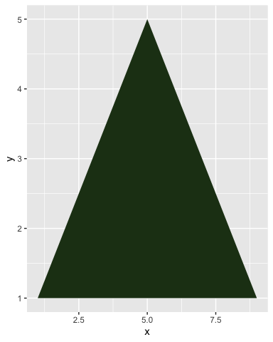
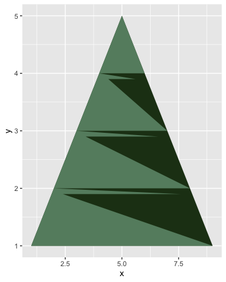
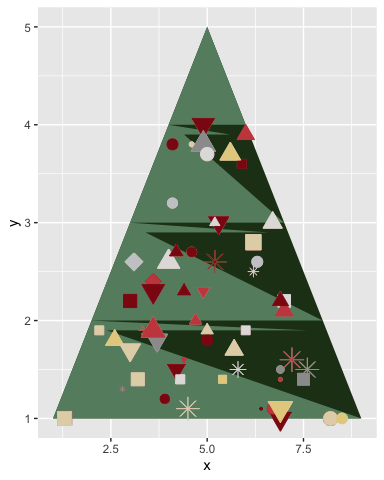
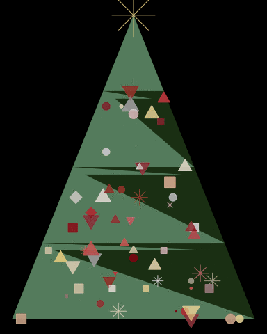

It's Christmas! And I love Christmas! Pretty snow, cozy fires, fairy lights, family, friends and love. It's just filled with all times of lovely things. 

That also means... PLOTS! You might know from my previous posts that I love plotting. A bit too much, but it truly is a lovely thing to create a great plot. 

So, a while ago, the amazing [RLadies](rladies.org) network showed me this cool thing a stats professor does each Christmas at the end of his visualisation lecture, I knew I had to do it! You can see all the lovely submissions he has [here](http://smarterpoland.pl/index.php/2017/12/christmas-trees/).

So here is my process for making the Christmas tree in ggplot.

## The tree cone
First, lest just make a triangle and make it green!

```r
library(tidyverse, quietly = T)
```

```
## ── Attaching packages ───────────────────────────────────────────────── tidyverse 1.3.0 ──
```

```
## ✓ ggplot2 3.3.0     ✓ purrr   0.3.4
## ✓ tibble  3.0.1     ✓ dplyr   0.8.5
## ✓ tidyr   1.0.3     ✓ stringr 1.4.0
## ✓ readr   1.3.1     ✓ forcats 0.5.0
```

```
## ── Conflicts ──────────────────────────────────────────────────── tidyverse_conflicts() ──
## x dplyr::filter() masks stats::filter()
## x dplyr::lag()    masks stats::lag()
```

```r
cone = data.frame(x = 1:9,
                  y = c(1:5,4:1)) %>% 
  na.omit() %>% 
  arrange(x)

cone %>% 
  ggplot(aes(x=x, y=y)) +
  geom_polygon(fill="#213c18")
```

<!-- -->

## Add some fancy stuff
This as actually meant to alter the cone and get the distinct Christmas tree shape, but I couldn't manage the little "dips" at each branch, the wrong points kept connecting. 
So it enved up with this more abstract, contemporary thing, which I actually really like!

```r
fancy = cone %>% 
  mutate(xoff = ifelse(x<5, x+.4, ifelse(x>5, x-.4, NA))) %>% 
  gather(del, x, contains("x")) %>% 
  mutate(y = ifelse(del=="xoff", y-.1,y)) %>% 
  filter(y>=1) %>% 
  na.omit() %>% 
  select(-del) %>% 
  arrange(y)

cone %>% 
  ggplot(aes(x=x, y=y)) +
  geom_polygon(fill="#213c18") +
  geom_polygon(data=fancy, fill = "#668c6f")
```

<!-- -->

## BAUBLES!
What christmas tree would it be without some baubles!
We define some nice christmas'y colours, do some data sample-randomness stuff, and voila!

```r
library(gganimate, quietly = T)

# Define bauble colours
bauble_colours = c("#e5d08f", "#e3d4b6",
                   "#cacbce", "#9c9c9c", "#e1dfdf",
                   "#c94c4c", "#8d1414")

baubles = cone %>% 
  
  # Group by y, nest and make up some random values for x.
  group_by(y) %>% 
  nest() %>% 
  mutate(data =  map(data, ~data.frame(x=seq(min(.$x), max(.$x), by=.1)))) %>% 
  unnest() %>% 
  
  # Group by x, nest and make up some random values for y.
  group_by(x) %>% 
  nest() %>% 
  mutate(data =  map(data, ~data.frame(y=seq(min(.$y), max(.$y), by=.1)))) %>% 
  unnest() %>% 
  ungroup() %>% 
  
  # Give baubles random shapes, sizes and two different colours.
  mutate(col1 = sample(bauble_colours, nrow(.), replace = T),
         col2 = sample(bauble_colours, nrow(.), replace = T),
         shp = sample(1:7, nrow(.), replace = T),
         sz = sample(seq(.5,2,by=.1), nrow(.), replace = T),
         time = sample(seq(.5,1,by=.01), nrow(.), replace = T)
  ) %>%
  rownames_to_column() %>% 
  
  # Grab only 60 baubles
  sample_n(60) %>% 
  
  # Gather the colours into a single column
  gather(dd, cols, contains("col")) %>% 
  mutate(alph = ifelse(dd == "col1", .8, 1))
```

```
## Warning: `cols` is now required.
## Please use `cols = c(data)`

## Warning: `cols` is now required.
## Please use `cols = c(data)`
```

```r
cone %>% 
  ggplot(aes(x=x, y=y)) +
  geom_polygon(fill="#213c18") +
  geom_polygon(data=fancy, fill = "#668c6f") +
  geom_point(data = baubles, aes(colour=I(cols), fill=I(cols), 
                                 shape = factor(shp),size=sz), show.legend = F) + 
  scale_shape_manual(values = c(20:25,8))
```

<!-- -->

## Add the topper and animate some sparkly!
We need a tree topper, in Norway, we usually add the Christmas star.
And then I wanted some ornaments to seemlingly sparkle a little, so we add a small animation too!

```r
cone %>% 
  ggplot(aes(x=x, y=y)) +
  
  # Cone
  geom_polygon(fill="#213c18") +
  
  # Fancy
  geom_polygon(data=fancy, fill = "#668c6f") +
  
  # Baubles
  geom_point(data = baubles %>% select(-time), show.legend = F, alpha = .7,
             aes(colour=I(cols), fill=I(cols),
                 shape = factor(shp),size=sz, group=rowname)) +
  
  # animated baubles!
  geom_point(data = baubles, show.legend = F,
             aes(colour=I(cols), fill=I(cols), alpha=I(alph),
                 shape = factor(shp),size=sz, group=rowname)) + 
  
  # Topper
  geom_point(data=data.frame(x=5, y=5), colour="#e5d08f", size=15, shape=8) +
  scale_shape_manual(values = c(20:25,8)) +
  
  # remove axes etc., and make background black
  theme_void() + 
  theme(plot.background = element_rect(fill="black"), title = element_text(colour="white")) +
  
  # Animate
  #transition_states(time, transition_length = 10, state_length = 2) + 
  transition_time(time) + 
  ease_aes('quadratic-in-out') 
```

<!-- -->


## The snow!
I also wanted to have some snow falling in the background. 


```r
snow = data.frame(x = sample(seq(1, max(cone$x)+1, by=.01), 100, replace = F),
                  y = sample(seq(1, max(cone$y)+1, by=.01), 100, replace = F)) %>% 
  group_by(x) %>% 
  nest() %>% 
  mutate(data =  map(data, 
                     ~data.frame(y=seq(.$y, .$y-sample(seq(.5,1,by=.01),1), length.out = 100)) %>% 
                       mutate(time = sample(seq(0.5,.9, .01), 1)) %>% 
                       mutate(time = seq(unique(time), unique(time)+.02, length.out = nrow(.)))
  )) %>% 
  unnest() 
```

```
## Warning: `cols` is now required.
## Please use `cols = c(data)`
```

```r
cone %>% 
  ggplot(aes(x=x, y=y)) +
  
  # Snow
  geom_jitter(data=snow, aes(group=x), colour="white", shape=8, size=1) +
  
  # Cone
  geom_polygon(fill="#213c18") +
  
  # Fancy
  geom_polygon(data=fancy, fill = "#668c6f") +
  
  # Baubles
  geom_point(data = baubles %>% select(-time), show.legend = F, alpha = .7,
             aes(colour=I(cols), fill=I(cols),
                 shape = factor(shp),size=sz, group=rowname)) +
  
  # animated baubles!
  geom_point(data = baubles, show.legend = F,
             aes(colour=I(cols), fill=I(cols), alpha=I(alph),
                 shape = factor(shp),size=sz, group=rowname)) +
  
  # Topper
  geom_point(data=data.frame(x=5, y=5), colour="#e5d08f", size=15, shape=8) +
  scale_shape_manual(values = c(20:25,8)) +
  
  # remove axes etc., and make background black
  theme_void() + 
  theme(plot.background = element_rect(fill="black"), title = element_text(colour="white")) +
  
  # Animate
  transition_time(time) + 
  ease_aes('sine-in-out') 
```

<!-- -->

There you go! My little Christmas tree!

# Merry Christmas, y'all!

