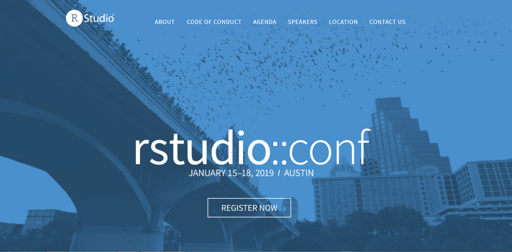
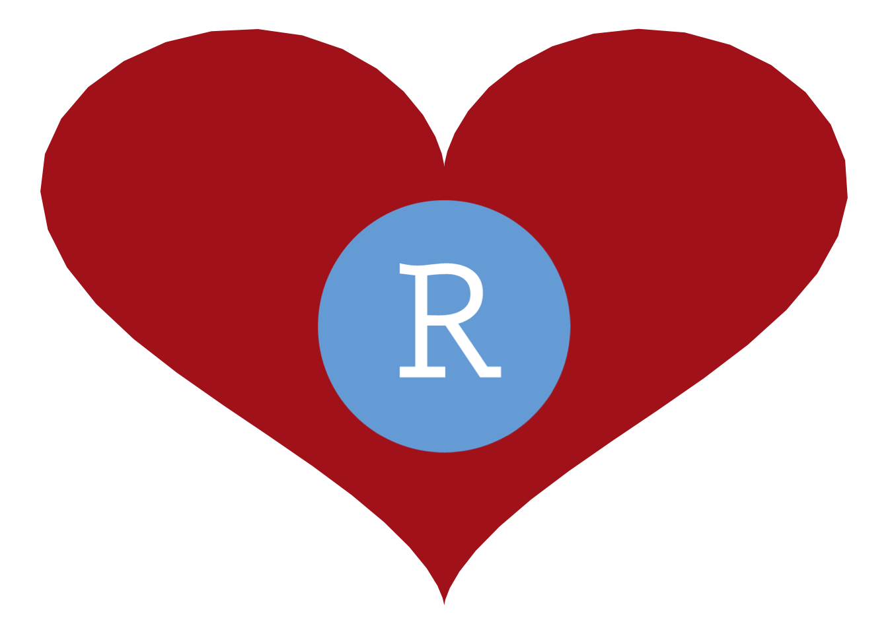

There is something to be said about the R-community. Actually, there is a lot to be said about the R-community, and I believe RStudio::conf is the empitamy of what this community actually is. While I'm in my hotel room as RStudio::conf Austin has just wrapped up, ending with an amazing Birds of a Feather session with [RLadies](www.rladies.org), I'm having so many thoughts and feelings about this experience. I'm on a complete high, and cannot fathom that I just participated in something like this conference, which is quite something different than any other conference I have been to. 

As an academic, I have been more used to going to field-specific conferences, big and small. The smallest had about 500 attendees, and the largest about 30.000. Before RStudio::conf, I had already made up my mind that small conferences trump big ones, because big conferences are too hard to navigate, too hard to network, and are generally just overwhealming. While I am semi-comfortable networking and talking to people I don't know alot, too large conferences just make it impossible. You might disagree with me, but that has been my general experience. 

I am also kind of used to conferences being a little hard to network. I don't know who is approachable, who is off-limits, and how do I do this network thing in general? Coming from Norway, it does not come very natural to me to just put my head into a circle of people and introduce myself, or to even have small-talk with people I don't know. Norwegians tend to be comfortable being silent around strangers (or among friends... like awkward silences in Norway are a complete different thing than what I believe most other cultures experience). 

RStudio::conf was my second, non-field specific conference. The first being [StanCon](https://mc-stan.org/events/stancon2018Helsinki/) in Helsinki in August. I thoroughly enjoyed StanCon, and got to meet some awesome new people and learn some nice new MCMC stuff. And while people in general were friendly, it was quite a different vibe than RStudio::conf. 

So, to the point of this post, the reasons why RStudio::conf has far surpassed any conference experience I have had. There are quite some reasons, but I will try to keep it to the main points; what I believe are the key reasons that make RStudio::conf such an amazing conference to attend.



## 1. All talks are relevant
I had a genuinely difficult task of finding which sessions I wanted to attend. Of course, this can also be seen as the negative (actually what I said in the survey, sorry RStudio folks, its useless feedback 'cause you obviously need parallel sessions). There were so many cool things to learn about, hear about, and so many properly good speakers. 

## 2. Industry, academia and non-profit combined
I have never been to a conference with such a diverse set of atttendees and speakers. Not only did people from all around the globe, of all colours, genders and what-nots attend, but also all different fields and industries. It was really interesting talking to people in industry on how they apply the same tools I use in research to solve "real-life" industry problems. It was thoroughly enjoyable and educational to see the different ways the same tools were applied. Which also sparked my own imagination as to how I could be more creative in what I do. 

## 3. You feel the love
This might seem like a silly thing to you, if you have not been to RStudio::conf, but this thing is real. There is a real _love_ for all things R. There is a real _love_ for all people who love R. There is a real _love_ for the community we have. This love is actually palpable when you are at RStudio::conf. I have never met a friendlier bunch of people, and it is epitomized by the conference host reminding everyone to be inclusive and friendly as the very first thing said on stage at the conference. That it in self is amazing, but with this bunch of people that thought is already so ingrained that I am unsure whether is was necessary to even say it! If I ever looked lost in the hallway, looking for familiar faces or anything like that, I was just osmosised into groups of people I didn't know. Every single person I met was super friendly, and in a natural and really genuine way. 

## 4. Support for each speaker
In every session I went, speakers recieved amazing support from the audience. People were excited to hear about what other were doing with R. I remember particularly well the talk on the [rayshader](https://github.com/tylermorganwall/rayshader) package by Tyler Morgan-Wall, where people just started clapping and cheering and he showcased the amazing things his package can do! There was this genuine apprication and amazement by what people are doing with this tool we all love, and real support and community cheer for everything.

## 5. The organisers
The last point I want to make is regarding the organisers. As a company, you would expect RStudio to be pushing their enterprise solutions a lot, and heavily advocating the need to use them. You would expect them to be stingy on the topics and talks people _outside_ of RStudio were giving. You would epxect them to prioritise everything corporate and to omit all the open source and community stuff. They don't do any of that. Yes, there were showcases for their product, of course. But nothing intrusive, nothing during the days of the conference made me in any way feel like they had an agenda, other than making an awesome conference with an amazing, inclusive vibe. The fact that everyone was taking pictures with developers, CEO's, sponsors, eachother, anyone, just goes to show how available they are making them selves, and how much they _want_ the community to network and thrive and grow. It really is impressive to see how they balance the support of the open source community, while also creating enterprise solutions. I really have a lot of respect and appreciation for what they are doing. And they are streaming it all, and everything will be posted online so you can watch sessions you missed, or watch them all if you could not attend for any reason. 


# The take home
I really really really recommend this experience to anyone. Even if you dont necessarily code a lot in R, if you are organizing conferences, or doing community meetups, or hosting consortia of researchers, experiencing RStudio::conf will give you ideas on how to build and support a community that lifts eachother up and that show genuine appreciation for eachother and eachothers achievements. I have never been so inspired to do good work, and to help others, and to engage even more in this amazing community than I do right now. 


```r
library(tidyverse)
yhrt <- function(t) 13*cos(t)-5*cos(2*t)-2*cos(3*t)-cos(4*t)
xhrt <- function(t) 16*sin(t)^3

png <- RCurl::getURLContent("https://le-datascientist.fr/wp-content/uploads/2019/03/cropped-rstudio.png") %>%
  png::readPNG() %>%
  grid::rasterGrob(interpolate=TRUE)

data.frame(t=seq(0, 2*pi, by=0.1)) %>%
  mutate(y=yhrt(t),
         x=xhrt(t)) %>%

  ggplot(aes(x=x, y=y)) +
  geom_polygon(fill="firebrick") +
  annotation_custom(grob=png, xmin=-5, xmax=5, ymin=-10, ymax=4) +
  theme_void()
```

<!-- -->
