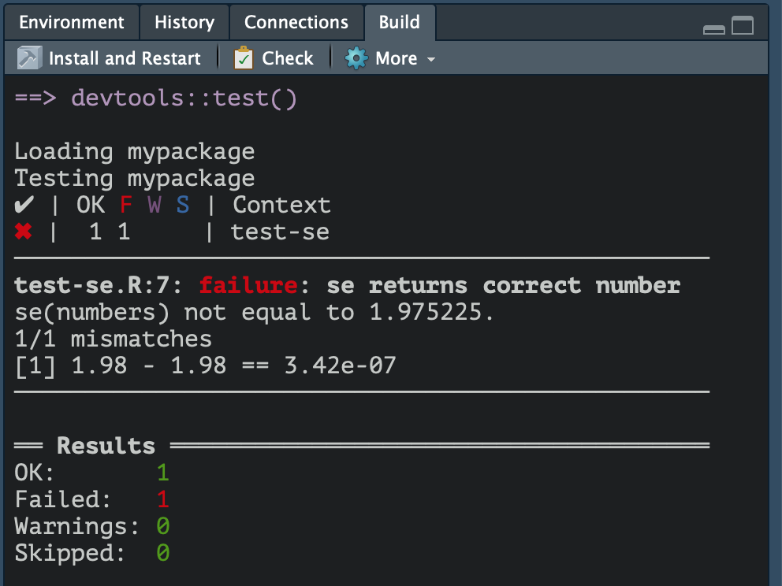
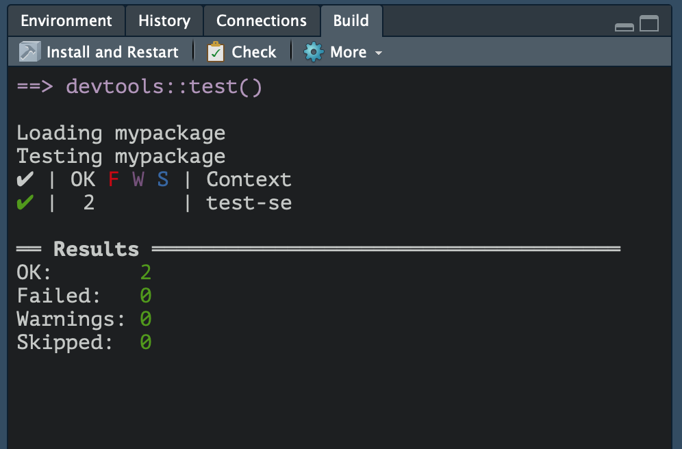
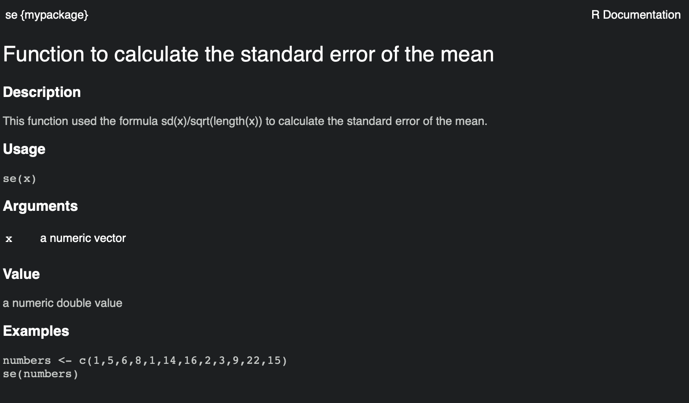
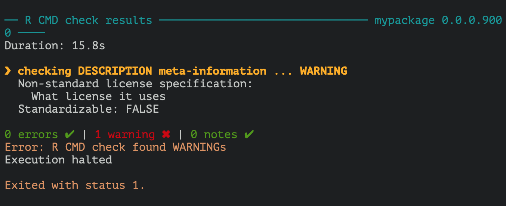

I've already posted about what I liked so much about RStudio::conf 2019, and while I could continue chanting that over and over without it ever being able to properly convey how lovely it was, I am going to continue into another report from the conference.

There were several pre-conference workshops to attend, which I of course signed up for. After debating heavily with my self of what to choose, the cruelty was really that all the workshops looked amazing, I decided to go for _"Building tidy tools"_ with [Charlotte Wickham](https://twitter.com/CVWickham) and [Hadley Wickham](https://twitter.com/hadleywickham). The sibling duo of R-package development (and more) did not fail to deliver what the workshop title announced, a workshop in how to create packages in a tidy way. Given than they both have packages released of amazing quality, nothing less would be expected.

I will not go into details on all the things that were taught the two full days of this workshop, but go through some key points on what is important to think about and do while creating a package. We did quite a lot of `purrr` work, which I wont go through here. While `purrr` is amazing, and using its functions in your package, especially if working with rectangular data, will make your code faster, it will turn this post into a monster. I will try to go through some key `purrr` stuff in the future, and incorporate some lessons from this workshop in that.

I only recently started making packages my self, and even if you are not making packages for wider distribution and use of the general public, having these things in mind while making simple packages for yourself or your coworkers is a good idea. And yes, you might want to consider making a simple package, if you find your self using the same custom-made functions or bits of code over and over again, because packages are a brilliant way of re-using code and making sure things are reproducible!

> A package is a set of conventions that make your life easier.  


## The general advice summary
In a two-day workshop, there is a vast amount of information that is disseminated, and I cannot possibly write everything down, but I can provide some super general advice to being with, and then go into slightly more detail on certain key points. 

**1. Use Rprojects**  
    - You can have multiple RStudio projects open at the same time. They are independent  
    - Easy way to manage working directories  
    - Enhances navigation  
    - Opens up nice key-stroke shortcuts when developing packages  
**2. Use the `usethis` package**  
    - Has convenience functions for adding different types of licences, tests, data, you name it, to your package  
    - Makes sure all these resources are organized as packages require in sub-folders  
**3. Make tests with the `testthat` package**
    - Makes it easier to make sure your functions behave as expected  
**4. Documenting functions is worth while in the long run**  
    - Function and package documentation takes time, but makes your packages easier to use
    - Even with packages just for you, it helps you remember what the functions do  
    - If proper documentation exists, and even vignettes, use the `pkgdown` package to create a lovely website with all this documentation organized in a nice way  


## Get started
### Create a package

Getting starts with a package is easy enough, either start a `New project -> Package` or in R just get right into it with `usethis`:

```r
usethis::create_package("~/Desktop/mypackage")
```

This will creates a package directory, with a couple of sub-directories, and makes it a project.
Will make it easier to work with the code.

**General package creating workflow:**  

- modifying code  
- reload the code  
- explore in the console  

All your functions will go into the `R` folder, and all the necessary and suggested packages go in the "DESCRIPTION" file which has been generated.

I recommend just typing `usethis::` in the console in RStudio and leaf through all the functions `usethis` has, it will give you some idea of what usethis can help you set up. 
The real advantage of `usethis` is that is makes sure things are specified in the correct way, places things in the correct folders etc, so you don't have to micromanage it all. I used it very sparingly before taking this workshop, now I use it almost constantly, because it is just so convenient.

**`usethis` commands I commonly use:**

```r
usethis::use_r("myFunc") # Initiate new function
usethis::use_test() # Initiate tests for all functions
usethis::use_package("ggplot2", type="Imports") # Adds a package to DESCRIPTION
usethis::use_mit_license() # Adds MIT LICENCE
```

### Profile for package making:
There is alto of console outputs etc while making a package. This can be reduced by editing your profile, so you don't have to see all the messages `usethis::edit_r_profile()`.


## Unit testing
Writing tests improves your API. If the tests are passing, you know things are working. 
It is generally nice to know you have not broken something.
When you stop working, your failing will still happen, and the next day you will know where it is failing and can continue from there.

### Testing workflow
`usethis::use_test()` creates the structure and files necessary to make the tests for the package. Makes one test file per R function.

The convention is that tests live in the `tests/` folder. The `thesthat` package wants the test to be nested again into the `testthat` folder. 
There, there are R functions (scripts) that run different tests. 

The `context` is a context the tests is run in. Different tests might be related in some way, and the context bulks them together when writing report of the tests.

I have never added context of split my tests into separate files, I just put it all bulkily into one `test.R` script. I immediately changed that after this workshop, as the context and separate files really have made it immensely much easier improving my code and also the tests once they are more split up, and the tests-summary is more structured.


## API design 
### Naming functions
Making up names for you functions can be really hard, and sometimes they end up with stupid names. But you might want to adopt some common way of naming your functions, which will makes it easier for the user to find the functions they are looking for. 

If it does something, make it a verb.
Some times that will not work, because there is no good word. 

Building things or composing things may rather use nouns (like ggplot2).

**Principles:**  
- Use prefixes to group related functions together  
- If you use prefix with four characters, auto-complete in RStudio will help  
- Suffixes for variations on a theme  
- Suffixes, rather than arguments, might help with type stability, so that the output of   any single function will always have the same type    
- Data arguments should come first  
- Match output and input  
- Type stability - make sure the function always returns the same  
- The less context you need to understand what your function will return, the easier it will be to use  
- Check out more about the [vctrs](https://github.com/r-lib/vctrs) package  

stick to a style, be consistent. use `.` or `_`, or camelCase or whatever. Just choose and stick to it. 

**Naming conflicts**
there is a `conflict` package that might help find conflicts and what you are calling. So that you may avoid conflicting loading and use. 
Is impossible to avoid naming conflicts with other packages, but maybe try to avoid tidyverse conflicts (if you are a tidyverse user) and base-r conflicts.

Don't have arguments that are exclusive to each other. All options should be possible to combine in some way. 

Functions that are related should work together. If the output of one function makes sense to pass into another, you should make sure they do actually work together.
 

## Errors
Traceback gives you the opportunity to have a look at the steps done to get to this error, backwards. 
You want your functions to throw errors early, so that you can provide helpful feedback to the user, or you may be able to intercept and make it impossible for the user to do so.
Try to make functions easy to read. If you need to do many things in the function, write sub-functions that do these things, and then use those.

This increases the amount of files, but it is better to have something that reads easy.

**Error message structure:  **
1. Problem statement (must or can't)  
2. Error location (where possible)  
3. Hint (if common)  


```r
check_where(0)
#> Error: `where` must not be zero or missing.
check_where(NA)
#> Error: `where` must not be zero or missing.
check_where(1:10)
#> Error: `where` must be a length one numeric vector. check_where("a")
#> Error: `where` must be a length one numeric vector.
```

**Style**  
- Surround variable names in back ticks , and strings in '...'  
- Sentence case  

Use `expect_error` with the string it is supposed to be matching when testing an error. That way out can check that you are getting the right error message. It will test with regexp, so it handles partial matches, so you wont need to add the entire error message, in case you tweak it a bit.

Use `stop` with `.call=FALSE` to avoid the print of what produced the error. Your own error message should suffice to understand where the error is happening. 


## Documentation
Documenting your functions is key. Even if you are only creating a package for you self, try to think how often you might have looked at a bit of code you wrote 1, 3, or 6 months ago, and did you remember what that piece of code did?

I am the worst at commenting my own code, but I always try to make sure my function documentation is up to par. This is because good function names, and good documentation is almost like a nice bit of commenting. If they make sense by looking at them in a chain of commands in a script, alto of your work is already done. It also makes it easier to share your functions with others, without having to do lots of extra work later to make sure the functions are understandable by others, you have already documented them!

### Creating function documentation
Use `roxygen2` to create function documents. It is quite easy to use, and it has several nice options that will help you get started. If your cursor is _inside_  a function, you may use the GUI and go `Code -> Insert Roxygen skeleton` and the main bits necessary for documentation will be added for you. 

If you have many package dependencies, I also recommend using the `prefixer` package, which will help you prefix functions you use in your own functions with package names, and then you may ask prefixer for their "Imports" after, which will setup the necessary lines of code for package dependency in a given function.

### Preview your documentation
`devtools::document()` will create the document so you can look at it. 
There is also the `cmd + shift + d` keystroke.
You must load_all to actually be able to see the update doc. 

use `@family` to link lots of objects together, they will then have a special section in the documentation, without you having to add each link to each documentation your self!

To actually see the documentation and it's links, you'll need to `install and restart R` which is its own button in the Build pane.

NEWS documentation might also be a really good idea, especially for public packages. And if you are making particular changes that alter the way the package functions work. 

### Sharing the package with others
If you have all the necessary components for a package, which you will have following the advice above, you can easily share your package by uploading it to github. Users may use the `devtools::install_github()` function to install it, and you have a nice place to have a version controlled instance of your package.

`pkgdown` is a package that can generate a website for you for your package, if you have already setup documentation, and even a vignette. This works a little like magic and more or less right out of the box!

`pkgdown::build_site()` will just start doing it for you, and dump it all in a `docs` folder. If your package is on github, you can then setup github pages to the `docs` folder in github settings, and _Voila!_ lovely package website created!

## A note on tidyeval
If you, like me, thought you needed to understand the intricacies of tidy evaluation to be able to properly use it, you are very likely wrong. 
To put simply, if you want to pass arguments to other tidyverse package functions like `dplyr` and `ggplot2` you don't need to, and should not, hard code all these options. There are two tools that will get you there, either "passing the dots" (...)  or using `enquo` and the bang-bang (!!). Tidyeval is super complex, but these two things should work for 90% of your wants, according to Hadley. I don't know about you, but I'll trust one of RStudio's lead programmers on this. You might find these two talks from RStudio::conf 2018 and 2019 informative if you are looking into tidyeval and feel lost.

[Tidy eval: programming with dplyr, tidyr, and ggplot2 – Hadley Wickham](https://resources.rstudio.com/rstudio-conf-2018/tidy-eval-programming-with-dplyr-tidyr-and-ggplot2-hadley-wickham)  
[Lazy evaluation - Jenny Bryan](https://resources.rstudio.com/rstudio-conf-2019/lazy-evaluation)


## Let's make a teeny tiny package!
Just to prove some of the points made above, and show you how easily you can get a package up and running, let's go ahead and make a teeeeeeny tiny package. 

Start my initiating a package with `usethis`. In this case, we are making a package called `mypackage` and placing it on the Desktop:

```r
usethis::create_package("~/Desktop/mypackage")
```

This will start a small interactive selection in your console, and just choose the positive options you get.

Rstudio will now change. First, it will initiate the package and setup some folder structure and some files for you, in the location you specified. Then it will move into it and restart. This way, you immediately jump to your new package project, so you can start developing.

We're going to make a small function that calculates the standard error of the mean of a vector of numbers. I have this function everywhere, as my field often uses this particular formula for the sem. We are going to call it `se`. Again, calling `usethis` in the console (you may also to `library(usethis)` and skip all the `usethis::function()` syntax). 


```r
usethis::use_r("se")
```

Running this will make an 'SE.R' file in the 'R/' folder within your project, which is where all the functions to your package will go. Using `usethis` just sets that up for you directly, so you don't have to even think about making sure things go in the right place. The script file will also automatically be opened in RStudio for you, so you can start writing you function.


```r
se <- function(x){
  sd(x)/sqrt(length(x))
}
```

In this case, the sem is calculated as the standard deviation of the vector, divided by the square root of its length. Copy or write that into your 'SE.R' script and save. Once this is done, you can load your package directly, and see how it works. You can either load by the key-stroke `cmd (ctrl) + shift + L` or type `devtools::load_all(.)` in your console. I recommend learning the keystroke, it makes things easier, and you'll be doing it alto! Once it's loaded, all the functions of your package is made available for you to use, so you can give them a go and see how they work.

We'll generate 50 random numbers, and test our `se()` function on that.

```r
numbers <- runif(50)
se(numbers)
```

```
## [1] 0.03908713
```

```r
# Break down components and double check
sd(numbers)
```

```
## [1] 0.2763878
```

```r
sqrt(50)
```

```
## [1] 7.071068
```

```r
sd(numbers)/sqrt(50)
```

```
## [1] 0.03908713
```

The numbers correspond pretty nicely! What we just did, was test our function. We should formalist such a test so you can check if your functions work as expected and let you know when you break them (you will at some point, mostly by accident). 

We'll use `usethis` again to set up some testing. It will create a 'tests/' folder with some hierarchy and initiate one test script per function script you have. Great way to organise your tests! As with `use_r()` it will create the files needed and open them so you can start editing. 


```r
usethis::use_test()
```

In the case of tests, you also get some standard stuff already in your test, just to provide you with some idea of what to do. You'll need to change it, of couse, cause the test provided will not be a good test for your function. Notice the function `expect_equal`. This is from the `testthat` package, which you might at this point want to load `library(testthat)`. There are many different tests you can use, just start typing `expect_` in the console after loading in `testthat` and you'll see how many things you can do. What these function do, is do comparisons for you, and provide specific output if the tests fail or not. 

Since we've already done a test, we should just use this test in our formal test. It's simple, you can copy + paste it, and do some edits. 
We should probably create our of numbers vector, so that we always know the answer and can make definitive checks.


```r
context("test-se")

test_that("se returns correct number", {
  numbers <- c(1,5,6,8,1,14,16,2,3,9,22,15)

  expect_equal(se(numbers), sd(numbers)/sqrt(12))
  expect_equal(se(numbers), 1.975225)
  
})
```

I've set up two tests, one will work, the other will fail to prove a point. Once you have this test made, use the key-stroke `cmd (ctrl) + shift + t` to run the test (or type `devtools::test()`. This will automatically save any edited test script if you forgot to do so. 

This will start some stuff in your build-console, which is in the top righ-hand-corner of your RStudio if you have the standard setup.



We're given some information of how many passed and how many failed, and for the failed, we are told what failed. So, while the console shows us the number `1.975225` as a return from our function, R in the background has _lots_ more decimal numbers it is not showing us. This makes it possible for us to actually get a number for pi (3.1415927), which is technically infinite, while R still in the back of the special object `pi` actually has all of pi with all it's decimal glory. This makes computations more accurate, while we as humans don't need to actually see the infinite detail. But it makes a formalized tests against a number difficult! Thankfully, the expect function takes something called 'tolerance', where you inform it that you have some tolerance for deviation from this number. We'll set out tolerance to `1e-6` which gives minor some decimal tolerance, but will fail if the difference is too much.


```r
context("test-se")

test_that("se returns correct number", {
  numbers <- c(1,5,6,8,1,14,16,2,3,9,22,15)

  expect_equal(se(numbers), sd(numbers)/sqrt(12))
  expect_equal(se(numbers), 1.975225, tolerance = 1e-6)
  
})
```

do `cmd (ctrl) + shift + t`  again, and see how that went. 



Both our tests have passed, and we are good! Now, whenever you change something in a function, or create a new function, make sure you have a test to check its output. That way, all you need to do it `cmd (ctrl) + shift + t` and you'll know if your function is still doing what you have intended. This is instead of you manually typing all the tests every time. 

Go back to your 'SE.R' script, i.e. your function. We'll add some simple documentation to the function, so that we can generate files for people to check what your package expects as input, what it returns etc. 

Place your cursor inside the function, like on the line of the calculation, then in RStudio go to `Code -> Insert Roxygen Skeleton`.  This _should_ add some key documentation to your function, which you need to adapt to describe it.


```r
#' Function to calculate the standard error of the mean
#'
#' This function used the formula sd(x)/sqrt(length(x)) to
#' calculate the standard error of the mean.
#'
#' @param x a numeric vector
#'
#' @return a numeric double value
#' @export
#'
#' @examples
#' numbers <- c(1,5,6,8,1,14,16,2,3,9,22,15)
#' se(numbers)
#'
se <- function(x){
  sd(x)/sqrt(length(x))
}
```

I have already made some edits. Roxygen type documentation is nice, because you place them directly with your function, in lines starting with "#'". The first line will be the title, then comes a simple description. Then there are several different "arguments"  that start with an `@`. `@params` will be one for each argument to your function, names exactly as the function names them, in this case we only have `x`. `@return` is optional, where you may describe what your function will return. `@export` means the function will be made available once the package is loaded, most packages have several functions that are _not_ exported, which are just for internal use within the package, ie function within the exported functions. and `@examples` will create small snippets of example code for the documentation. `@importFrom` I added so that this function knows to use the `sd()` function from the `stats` package, rather than any other possible loaded package. This is where the package `prefixer` might be of help, as it helps you add these imports, if you have many. I use that package heavily. 

Save this and do the key-stroke `cmd (ctrl) + shift + d` and the documentation will be generated. Re-load your package with `cmd (ctrl) + shift + l` , and then type `?se` in your console. Now the new wonderful documentation of your function pops up like any other function help in R. 

neat, huh?


That is basically it. You have made a package with a single function in it. You can do the last ultimate test of your package by testing it's build, with the key-stroke `cmd (ctrl) + shift + e`. A whole lot of stuff will happen in your build pane, and hopefully it will end with something looking like this:



Its giving a warning, because there is no licence. If you are putting it up on github, you'll want to add something. `usethis::use_mit_license()` might be a good option, of you can browse all the licences `usethis` can provide for you. If you are not distributing or fussed, you can skip it. 

You can use `git` and publish it on `github` for safe keeping, or build and zip it to distribute it. Up to you! I put mine of github, cause it's just very very convenient.

Happy package making, it is pretty fun!
