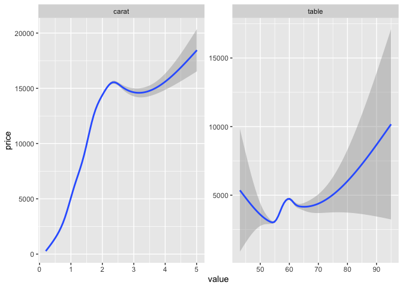
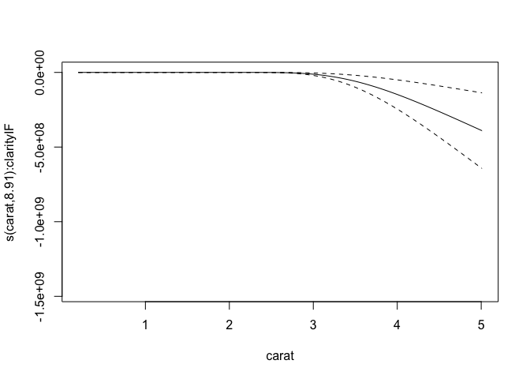
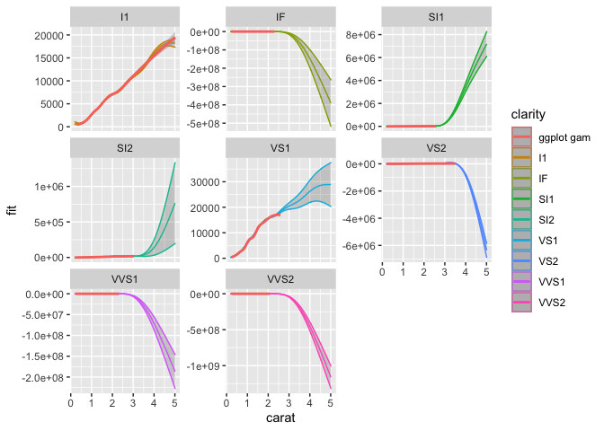

I'm full of making packages and unit testing these days, and I don't feel particularly confident in my unit testing skills to be sharing those yet.
But, thankfully, I am also back in the GAMM corner lately. 
There is something very satisfying to me about running appropriate models and seeing the results. 
But, plotting the results of GAMMs are not always so easy, especially if you have some interactions in there. 
I've already posted a little about how you can plot predictions from GAMMs in other posts, but I've been improving (in my opinion), and want to expand to when you have interactions also.

Interactions are tricky, because depending on whether the interaction is a numeric with a numeric or a numeric with a factor, you must plot them differently. 
And depending on the number of factors, you'll have several options on how to look at the effects.
In my opinion, this is a whole lot of trial and error, really. 
I never make the correct plot on the first try, I always need to try several things untill I understand exactly what I am after and am able to do that. 

I'll be using the `diamonds` dataset from ggplot2 for this, as it has some nice non-linear features that we can explore. 
This dataset is a collection of observations of diamonds, with variables like price, cut, carat, clarity etc. 
Our purpose is to try to create a model that predicts well the price of a diamond, given these variables, and to see which variables contribute more or less to the price of the diamond.
Off the bat, I think we should be quite certain that `carat` has a real effect on the price. 
But the other variables might also have smaller effects that we should be accounting for.

Let's start of by just making some plots, and get an idea of the data and how they interact with price.
I'm going to gather the numeric variables I'm interested in into a long-format table, so that I can facet (make subplots) easily for the different variables.


```r
library(tidyverse)
```

```
## ── Attaching packages ───────────────────────────────────────────────── tidyverse 1.3.0 ──
```

```
## ✓ ggplot2 3.3.0     ✓ purrr   0.3.4
## ✓ tibble  3.0.1     ✓ dplyr   0.8.5
## ✓ tidyr   1.0.3     ✓ stringr 1.4.0
## ✓ readr   1.3.1     ✓ forcats 0.5.0
```

```
## ── Conflicts ──────────────────────────────────────────────────── tidyverse_conflicts() ──
## x dplyr::filter() masks stats::filter()
## x dplyr::lag()    masks stats::lag()
```

```r
diamonds %>% 
  gather(variable, value, carat,table) %>% 
  ggplot(aes(x=value, y=price)) +
  geom_smooth() +
  facet_wrap(~variable, scales = "free")
```

```
## `geom_smooth()` using method = 'gam' and formula 'y ~ s(x, bs = "cs")'
```

<!-- -->

`carat` quite obviously has a strong relationship with the price, with higher carats upping the price of the diamond.
But it does not look to be linear, there seems to be a peak around 2.2 carat, with a flattening and then a slower increase again later, with higher uncertainty (look at the CI bands). 
`table` is a more odd little thing. 
It looks so strange, but we can play with it anyway.


## GAM interactions between numeric and factors
Let's also have a look at some of the factors, and how they play into those two variables.


```r
diamonds %>% 
  gather(variable, value, carat, table) %>% 
  gather(factor_g , factor_v, cut, color, clarity) %>% 
  ggplot(aes(x=value, y=price)) +
  geom_smooth(aes(group=factor_v, colour=factor_v)) +
  facet_grid(factor_g~variable, scales = "free")
```

```
## Warning: attributes are not identical across measure variables;
## they will be dropped
```

```
## `geom_smooth()` using method = 'gam' and formula 'y ~ s(x, bs = "cs")'
```

<!-- -->

I'm not winning any awards with this plot, but it's a quick way to get a general idea of what the data looks like. 
There's not much fun happening with `table` though there is this one cut that seems to behave _very_ oddly. 
We will leave `table` as a main contributor, and focus on `carat`. 

I'd say both the carat-clarity and carat-table plots might have some interesting interactions, so I'll dig into those. 
I'm just going to pick clarity, for the clarity (award for horrible word-puns goes to me!). 


```r
library(mgcv)
```

```
## Loading required package: nlme
```

```
## 
## Attaching package: 'nlme'
```

```
## The following object is masked from 'package:dplyr':
## 
##     collapse
```

```
## This is mgcv 1.8-31. For overview type 'help("mgcv-package")'.
```

```r
library(broom)

model1 <- gam(price ~ s(carat), data=diamonds)
broom::tidy(model1)
```

```
## # A tibble: 1 x 5
##   term       edf ref.df statistic p.value
##   <chr>    <dbl>  <dbl>     <dbl>   <dbl>
## 1 s(carat)  8.81   8.98    40466.       0
```

Unsurprisingly, that turns out to be quite true, carat predicts price well. 
Let's look at predicted price in a plot. 


```r
plot(model1)
```

<!-- -->

There's the smooth line.
But let's be honest, it ain't pretty. 
It's neat for getting a quick look at, but if you're prepping for a paper or a report, you'll need to fix it up a bit.
Let's ggplot it.

In order to do that, we need to make some data that will create the regression line.
We do that by creating a data frame that includes the predictor variable(s) in an ordered fashion.
In this first case, we want a data frame with a column named `carat` that covers all the carat-values in the dataset, but that is neatly ordered ascendingly. 
We can then use that ordered data and predict what the price would be (the fit) given the model we have created.
We also want the confidence bands, so we make sure to tell the `predict` function that we want them too, by specifying the `se.fit` argument as `TRUE`.


```r
tibble(
  carat = seq(from=min(diamonds$carat), 
              to=max(diamonds$carat), 
              length.out = 1000)
) %>% 
  bind_cols(as_tibble(
    predict(model1, newdata = ., se.fit=TRUE)
  )) %>% 
  
  ggplot(aes(x=carat, y=fit)) +
  geom_ribbon(aes(ymin=fit-se.fit, ymax=fit+se.fit),
              alpha=.2) +
  geom_line(aes(colour = "model1")) +
  geom_smooth(data = diamonds, aes(y=price, colour="ggplot gam"))
```

```
## `geom_smooth()` using method = 'gam' and formula 'y ~ s(x, bs = "cs")'
```

<!-- -->

Despite the general formula being more or less the same, our gam and ggplots gam are slightly different. 
This is because ggplot2 does a cubic spline with knot reductions, while we are using the default low rank isotropic smoothers (`bs='tp'`). 
But you can see that we are nicely plotting the predicted line based on the model we have. 
We can do this because we created a tibble with a `carat` variable in the range of that is in the data (min to max) with a length of `1000`. 
For regression lines you'll not need this many points to create a good smooth line, but what the heck.

You can also predict outside the range of the data, by specifying your own range. 
Let's hypothetically say a diamond with such an amazing quality that they decided it should have a carat of 6, i.e. extending the carat measure! 0_o

We can just adjust the max value of the predicting data set and see what happens.


```r
tibble(
  carat = seq(from=0, 
              to=6, 
              length.out = 1000)
) %>% 
  bind_cols(as_tibble(
    predict(model1, newdata = ., se.fit=TRUE)
  )) %>% 
  
  ggplot(aes(x=carat, y=fit)) +
  geom_ribbon(aes(ymin=fit-se.fit, ymax=fit+se.fit),
              alpha=.2) +
  geom_line(aes(colour = "model1")) +
  geom_smooth(data = diamonds, aes(y=price, colour="ggplot gam"))
```

```
## `geom_smooth()` using method = 'gam' and formula 'y ~ s(x, bs = "cs")'
```

<!-- -->

I adjusted both the min and max and you can now see how the regression line based on our predicted data extends beyond the ggplot gam. 

But today we were supposed to talk about interactions. 
Let's have a look at how clarity interacts with carat.


```r
model2 <- gam(price ~ s(carat) + s(carat, by=clarity) + clarity, data=diamonds)
broom::tidy(model2)
```

```
## # A tibble: 8 x 5
##   term                   edf ref.df statistic p.value
##   <chr>                <dbl>  <dbl>     <dbl>   <dbl>
## 1 s(carat)              8.37   8.80      606.       0
## 2 s(carat):claritySI2   8.67   8.89      323.       0
## 3 s(carat):claritySI1   8.94   9.00      397.       0
## 4 s(carat):clarityVS2   8.99   9.00      421.       0
## 5 s(carat):clarityVS1   4.63   5.31      601.       0
## 6 s(carat):clarityVVS2  8.98   9         315.       0
## 7 s(carat):clarityVVS1  8.96   9.00      299.       0
## 8 s(carat):clarityIF    8.91   8.99      299.       0
```

For interactions between numeric and factors, we use the `by` option in the smooths, and the numeric variable also needs its own smooth, and the factor also needs to be added as a simple extra predictor.
This gives you a full factorial.
**Note** if the `by` predictor is numeric, it is **not** an interaction, but its own main effect. 
Numeric interactions we do differently (see later section).
The results here indicate that the different clarities do alter the price.

But notice that the main effects for each clarity is not listed here.
The tidier for `gam` only includes the smooth terms, not the parametric ones.
They have different summary statistics, so having them in the same table require some extra steps, but I still usually do so, atleast to get an idea of what I'm looking at.


```r
broom::tidy(model2) %>% 
  bind_rows(
    broom::tidy(model2, parametric = TRUE)
  )
```

```
## # A tibble: 16 x 7
##    term                   edf ref.df statistic  p.value estimate std.error
##    <chr>                <dbl>  <dbl>     <dbl>    <dbl>    <dbl>     <dbl>
##  1 s(carat)              8.37   8.80   606.    0.            NA        NA 
##  2 s(carat):claritySI2   8.67   8.89   323.    0.            NA        NA 
##  3 s(carat):claritySI1   8.94   9.00   397.    0.            NA        NA 
##  4 s(carat):clarityVS2   8.99   9.00   421.    0.            NA        NA 
##  5 s(carat):clarityVS1   4.63   5.31   601.    0.            NA        NA 
##  6 s(carat):clarityVVS2  8.98   9      315.    0.            NA        NA 
##  7 s(carat):clarityVVS1  8.96   9.00   299.    0.            NA        NA 
##  8 s(carat):clarityIF    8.91   8.99   299.    0.            NA        NA 
##  9 (Intercept)          NA     NA       -6.71  1.92e-11  -19014.     2832.
## 10 clarity.L            NA     NA       -6.55  5.63e-11  -55138.     8412.
## 11 clarity.Q            NA     NA        0.798 4.25e- 1    6593.     8263.
## 12 clarity.C            NA     NA        4.63  3.61e- 6   44847.     9680.
## 13 clarity^4            NA     NA        2.87  4.08e- 3   13883.     4834.
## 14 clarity^5            NA     NA       -6.13  9.03e-10  -43598.     7116.
## 15 clarity^6            NA     NA       -6.71  2.02e-11  -67346.    10043.
## 16 clarity^7            NA     NA       -6.95  3.71e-12  -44808.     6448.
```

There are two things to notice, when combining parametrics and smooths.  
1) While the parametric stats have `estimate` and `st.error` as we are used to,
diagnostics for the smooths are more complicated and are provided with the `edf` measure, which I am definitely not the best person to explain.  
2) The parametric factors have very strange annotations, and it looks like you are given options for linear, quadratic, cubic, and other polynomial fits. 
Be assured, you are not. 
This is just the odd way base R provides outputs on factors. 
They map perfectly on the factor levels of the clarity variable row-by-row.

Let's have a look at them plotted.


```r
plot(model2)
```



Now, we get quite a lot of plots! 
One per smooth we have.
But again, not pretty, and acutally very hard to descipher. 
To make them nicer, we need again to make some new data to predict on, and this time add another level of complexity, namely the `by` variable.
The complexity lies in that the `by` variable needs to have _each_ level represented in the data, with the range of the carat for _each_ of them, giving us long data with the carat range being duplicated for as many as the levels in `by`. 
For this I like using `expand_grid`. 
This function does exatly that, given the various column names and range of data for each, it expands so that every possible combination is created as a data frame. 


```r
pred_data <- expand_grid(
  carat = seq(from=min(diamonds$carat), 
              to=max(diamonds$carat), 
              length.out = 1000),
  clarity = levels(diamonds$clarity)
)
dim(pred_data)
```

```
## [1] 8000    2
```

See how the dimensions of `pred_data` is 8000 rows, and 2 columns. 
`clarity` has 8 levels, and we asked to `carat` have the length of `1000`, $ 8 x 1000 = 8000 $, and then one column for each.
Pretty neat!

Again, we will use `pred_data` to the `new_data` argument in `predict` so we can get predictions based on our model on this ideal data setup. 


```r
pred_data <- pred_data %>% 
  predict(model2, 
          newdata = ., 
          se=TRUE) %>% 
  as_tibble() %>% 
  cbind(pred_data)


pred_data %>% 
  ggplot(aes(x=carat, y=fit, colour = clarity)) +
  geom_ribbon(aes(ymin=fit-se.fit, ymax=fit+se.fit),
              alpha=.2) +
  geom_line() +
  geom_smooth(data = diamonds, aes(y=price, colour="ggplot gam")) +
  facet_wrap(~clarity)
```

```
## `geom_smooth()` using method = 'gam' and formula 'y ~ s(x, bs = "cs")'
```

<!-- -->

Ok, this still looks.... weird. 
Well, the model is not well suited to the data, but it works for making the point of how to plot interactions.
This looks weird because the predictions are odd based on the data and model, and the scaling is very different for the different types of clarities. 
We'll let each subplot have a different y-scale, so that we can inspect the associations better.


```r
pred_data %>% 
  ggplot(aes(x=carat, y=fit, colour = clarity)) +
  geom_ribbon(aes(ymin=fit-se.fit, ymax=fit+se.fit),
              alpha=.2) +
  geom_line() +
  geom_smooth(data = diamonds, aes(y=price, colour="ggplot gam")) +
  facet_wrap(~clarity, scales="free_y")
```

```
## `geom_smooth()` using method = 'gam' and formula 'y ~ s(x, bs = "cs")'
```

<!-- -->

So now we can see each better and whats going on.
The `I1` clarity is a straight up hill, and `VS1` is also looking meaningful.
But it is really where we are projecting predictions on the clarity-carat interaction into levels of carat that don't exist for the specific clarity. 
They just look bananas, but there you have them at least, plotted interactions from gams using numeric and factor interaction.


## GAM interactions between two numerics
Interactions between two numerics are in some ways more straight forward, in others super difficult.
Imagining and visualising interactions between two numerics is hard, you cannot make different regression lines as you do a factor, it would be one line per value. 
I mean you *can* but it would be hard to interpret.
What it commonly done is make heatplots, or contour plots. 


```r
model3 <- gam(price ~ s(carat) + s(table) + ti(carat, table), 
              data = diamonds)
broom::tidy(model3)
```

```
## # A tibble: 3 x 5
##   term              edf ref.df statistic   p.value
##   <chr>           <dbl>  <dbl>     <dbl>     <dbl>
## 1 s(carat)         8.91   9.00   37787.  0.       
## 2 s(table)         8.65   8.94      54.5 1.87e- 98
## 3 ti(carat,table) 11.6   12.2       46.1 3.65e-111
```

Just like with numeric-factor interactions, each predictor in an interaction should be added in its own smooth in the model, and the function `ti` creates an interaction between the two (one of several, really).
Since all out terms are smooths, we don't need to bind the table with another tidier for the parametric effects, nice and neat. 

So let's get to plotting!


```r
plot(model3)
```


This time we are getting 3 plots: one for each main effect, and the interaction.
The interaction is plotted as a contour plot, which in my opinion is always hard to interpret.
I prefer heatplots with contours on top, becasue I find heatplots easier to understand, despite them technically showing the same thing.

Let's recreate those three plots.

We want one per main effect, and the interaction between them. 
I would then make three datassets, one for each, as we want them plotted as independent of the other two effects.
To do that, the main effects need to have a dataset where the main effect you want to predict varies, the other at `0`, and specify to the `predict` function which model term to predict with.


```r
carat_pred <- tibble(
  carat = seq(from=min(diamonds$carat), 
              to=max(diamonds$carat), 
              length.out = 1000),
  table = 0
)

carat_pred <- predict(model3, newdata = carat_pred, 
                      se.fit = TRUE, terms = "s(carat)") %>%  
  as_tibble() %>% 
  cbind(carat_pred)

ggplot(carat_pred, aes(x=carat, y=fit)) +
  geom_ribbon(alpha=.3,
              aes(ymin=fit-se.fit,
                  ymax = fit+se.fit)) +
  geom_line()
```

<!-- -->


```r
table_pred <- tibble(
  carat = 0,
  table = seq(from=min(diamonds$table), 
              to=max(diamonds$table), 
              length.out = 1000)
)

table_pred <- predict(model3, newdata = table_pred, 
                      se.fit = TRUE, terms = "s(table)") %>%  
  as_tibble() %>% 
  cbind(table_pred)

ggplot(table_pred, aes(x=table, y=fit)) +
  geom_ribbon(alpha=.3,
              aes(ymin=fit-se.fit,
                  ymax = fit+se.fit)) +
  geom_line()
```

<!-- -->


Very nice! We now have plottet both main effects, and they looks like the plots from `plot` just better.

To get the interaction, we need to do as we did with the factor, meaning each value of `table` must be combined with each value of `carat`.
We use  `expand_grid` again.


```r
ct_int_pred <- expand_grid(
  carat = seq(from=min(diamonds$carat), 
              to=max(diamonds$carat), 
              length.out = 100),
  table = seq(from=min(diamonds$table), 
              to=max(diamonds$table), 
              length.out = 100)
)

ct_int_pred <- predict(model3, newdata = ct_int_pred, 
                      se.fit = TRUE) %>%  
  as_tibble() %>% 
  cbind(ct_int_pred)

dim(ct_int_pred)
```

```
## [1] 10000     4
```

For a heat plot and contour, we use `geom_tile` and `geom_contour`.


```r
ggplot(ct_int_pred, aes(x=carat, y=table)) + 
  geom_tile(aes(fill = fit)) +
  geom_contour(aes(z = fit), colour = "white")
```

<!-- -->

And there you have it.
Interactions and smooths and all. 
Now you can alter the colour schemes, legends, theme and what you need using the standard `ggplot2` grammar. 

Hope it helps you in your endevours. 
It tok me ages to understand the whole `predict` thing, and how to make it work. 
So I hope it helps someone figure it out easier, so you can look at your results with less ache than I had!

## Edit

Since I mentioned you _could_ also plot the numeric-numeric interaction like the numeric-factor, with a line per interaction, I'll do that too.
But these are quite difficult to parse out, which is why I opt for the heatplot (which is also not trivial to interpret, but in my opinion better).


```r
ct_int_pred %>%
  ggplot(aes(x=carat, y=fit)) +
  geom_line(aes(group=table, colour=table))
```

<!-- -->

It's mighty pretty though! 

