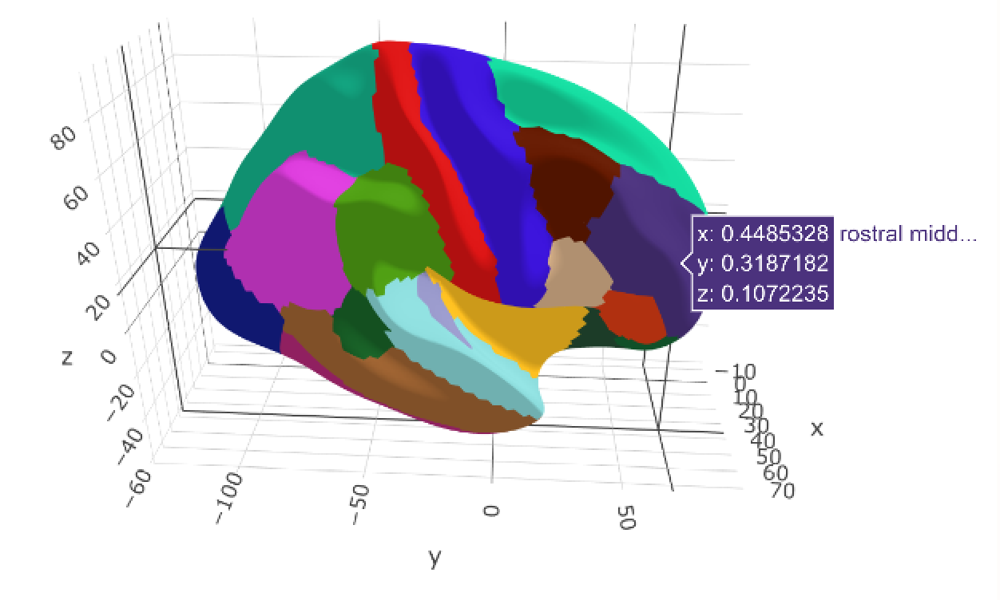

Looking through my blogposts, I realised I've never written about my colleague Didac and my package for 3d mesh plots of brain atlases using plotly.
I've already showed some functionality from out {ggseg}-package, [in the introductory blogpost](blog/introducing-the-ggseg-r-package-for-brain-segmentations/) and [follow-up on animating it](blog/get-the-brain-animated/). 

I guess it's extra timely to do it now, as we recently split the mesh-plot function off the main {ggseg}-package and into it's own package, and also did some re-writing of core-functionality of the package. 
Like the {ggseg}-package, {ggseg3d} is made to plot brain atlas data. 
In Neuroimaging, it is quite common to use these pre-defined areas of the brain, defined through functional or structural qualitites.
Since the brain has three dimensions, we thought it would be neat to actually have a plot where you would actually look at the brain at all angles, and also be able to interact with it.

So started my long and arduous search for tri-surface mesh plots, and plotly became the obvious candidate. 
I had little to no experience with plotly, or with mesh-plots, so it was a real struggle.
But I'm happy I stuck with it, and managed to make a tool that I now am really proud of. 
There are still lots of things to improve, but I believe the core-funcitonality is in place now, and everything else is a bonus!

# Get 3d-plotting

{ggseg3d} can be installed from our works github account, using remotes


```r
remotes::install_github("LCBC-UiO/ggseg3d")
```

And off the bat, it should be fairly easy to use, or atleast make the first plot.


```r
library(ggseg3d)
ggseg3d()
```
<!--html_preserve--><iframe src="ggseg_1_widget.html" width="100%" height="500px"></iframe><!--/html_preserve-->


It plots the right hemisphere of the `dkt_3d` dataset, which is the Desikan-Killany atlas, a Freesurfer default. 
You can easily interact with the plot, turn it, pan it, swivel it. 
Have at it, have fun!

The function takes several arguments:
```
.data	
A data.frame to use for plot aesthetics. Must include a column called "area" corresponding to areas.

atlas	
Either a string with the name of a 3d atlas to use.

surface	
String. Which surface to plot. Either "pial","white", or "inflated"[default]

hemisphere	
String. Hemisphere to plot. Either "left" or "right"[default], can also be "subcort".

label	
String. Quoted name of column in atlas/data that should be used to name traces

text	
String. Quoated name of column in atlas/data that should be added as extra information in the hover text.

colour	
String. Quoted name of column from which colour should be supplied

palette	
String. Either name of paletteer palette or vector of hex colours, used if colour is numeric.

na.colour	
String. Either name, hex of RGB for colour of NA in colour.

na.alpha	
Numeric. A number between 0 and 1 to control transparency of NA-regions.

show.legend	
Logical. Toggle legend if colour is numeric.
```



