It's time for another Christmas special. 
Last year I made a [Christmas tree ggplot](blog/christmas-tree-in-ggplot), and animated some snow and sparkling baubles.
That was a lot of fun, and I decided I wanted to do something similar this year too.
But this year we're going to build a snowman.

<!-- -->

## Body 
A snowman needs a body, so lets start with that! 
Let's go for a two large body ball's, and a head.
First attempt is to specify the center of the circles we're going to draw's locations, 
and their radii.
We're going to use `geom_circle` from the [ggforce](https://ggforce.data-imaginist.com/) package by Thomas Lin Pedersen (go follow him on twitter like now, he's awesome:  [thomasp85](https://twitter.com/thomasp85)). 
This is a very convenient geom, because drawing circles is not arbitrary, and the only other way I can think of is creating a polygon, with lots points to create the circle... 
That would mean a lot of code (at least for me), so {ggforce} is truly to the rescue here.
`geom_circle` needs an x and y position of the _center_ of the circle, and then the radius of that circle. 
Here we specify three circles, with different radii. 


```r
library(tidyverse)
```

```
## ── Attaching packages ───────────────────────────────────────────────── tidyverse 1.3.0 ──
```

```
## ✓ ggplot2 3.3.0     ✓ purrr   0.3.4
## ✓ tibble  3.0.1     ✓ dplyr   0.8.5
## ✓ tidyr   1.0.3     ✓ stringr 1.4.0
## ✓ readr   1.3.1     ✓ forcats 0.5.0
```

```
## ── Conflicts ──────────────────────────────────────────────────── tidyverse_conflicts() ──
## x dplyr::filter() masks stats::filter()
## x dplyr::lag()    masks stats::lag()
```

```r
library(ggforce)

snowman <- tibble(
  y = 1:3,
  x = 0,
  r = 1:3
)

ggplot(snowman) + 
  geom_circle(aes(x0 = x, y0 = y, r = r)) + 
  coord_fixed()
```

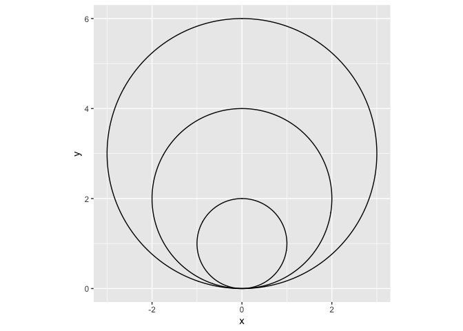<!-- -->

So we have three circles, and while this is pretty, it's not what we wanted.
We need the circles stacked on top of eachother, not within eachother.
An easy way to do this, is to calculate the y position of the circle middle using the radius information.
We will square the radius in a mutate (remember, a `mutate` can add or alter columns in the dataset in a row-wise fashion).


```r
snowman <- tibble(
  x = 0,
  r = 3:1
) %>% 
  mutate(y =  r^2)

ggplot(snowman) + 
  geom_circle(aes(x0 = x, y0 = y, r = r)) + 
  coord_fixed()
```

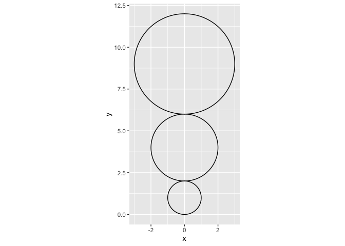<!-- -->

Alright! Almost there. 
The body is up-side-down. Easy fix though, just multiply the y-axis with `-1` to flip it. 
This means we will be operating with negative numbers on the y-axis, but I don't really mind that.
We save this plot to `p` so we can continue adding new layers of data as we build our snowman.
This way we don't need to repeat the previous code all the time.


```r
snowman <- tibble(
  x = 0,
  r = 3:1
) %>% 
  mutate(y =  (r^2) *-1)

p <- ggplot(snowman) + 
  geom_circle(aes(x0 = x, y0 = y, r = r),
              fill = "white", 
              colour = "lightgrey") + 
  coord_fixed()
p
```

<!-- -->

Any snowman needs a face too. 
We're making a data frame (a tibble is a type of data frame), with x and y coordinates for eyes and nose, and also make a column specifying the colour for those elemens.
We add them to our snowman by adding a `geom_point` to the plot, and use `shape = type` to make sure we get different shapes to the eyes and nose. 
The very strange `I(colour)` is a little trick I learned last year. 
Some times it is easier to control the aesthetics of a plot with many layers (like our snowman will have), if you directly provide aesthetics, rather than the standard `scale` options to ggplot. 
In this case `I(colour)` will make sure that ggplot uses the **identity** (`I()`), meaning the actual value in the 'colour' coloumn in the face dataset, to colour the points. 
So we do not need to tweak that more later.

## Face 


```r
face <- tibble(
  x = c(-0.5, 0.5, 0),
  y = c(.75, .75, 1)*-1,
  type = c("eye", "eye", "nose"),
  colour = c("black","black", "coral2")
)

p <- p +
  geom_point(data = face, show.legend = FALSE,
             aes(x = x, y = y, 
                 shape = type, colour = I(colour)))
p
```

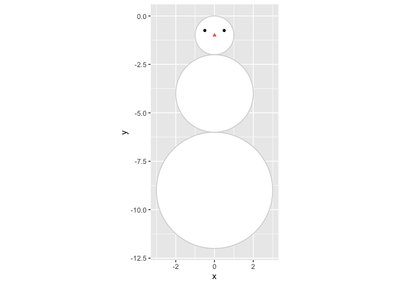<!-- -->

What is a face without a mouth?
The arc of a mouth again is not the easiest to make, but again {ggforce} comes to the rescue with `geom_arc`. 
I have to be honest, I don't really understand the mapping of the `start` and `end` points of the arc, but otherwise it is quite similar to `geom_circle`.
In stead of plotting the _entire_ circle, it plots parts of the circle, specified by the `start` and `end` arguments.
We need to specify the x and y  coordinates for the middle of the arc, which we take from the first circle specification for the head of the snowman, and then I just did some random values for `start` and `end` untill the mouth was in the position I wanted.


```r
p <- p +
  geom_arc(aes(x0 = snowman$x[nrow(snowman)], 
               y0 = snowman$y[nrow(snowman)], 
               start = 2.2, end = 4, r=.6))
p
```

```
## Warning: Use of `snowman$x` is discouraged. Use `x` instead.
```

```
## Warning: Use of `snowman$y` is discouraged. Use `y` instead.
```

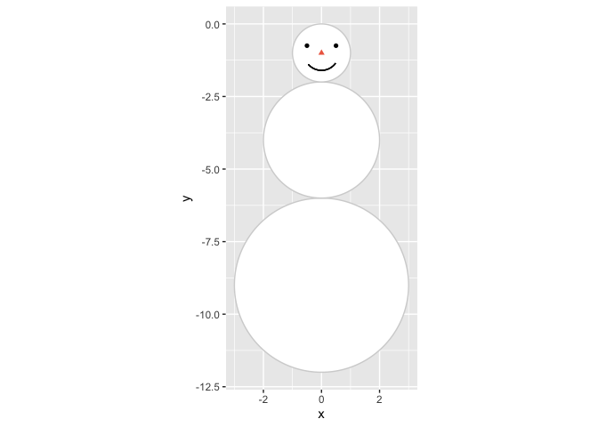<!-- -->

Next up in the body-department, are arms. 
We cant have him not being able to wave to us!
This was again mostly trial and error or finding coordinates I liked for the arms,
and I wanted arms and fingers a little uneven, so they would look like snowmen often do.
Each arm consists of an arm and two fingers, and in addition to coordinates for the end points of each of these in a dataset, we also give pairs of two points the same name, so we can connect them using `geom_line`. 
In `geom_line` using the `group` argument informs the geom which points belong together and should be connected with a line, else it will try to connect them all!


```r
arms <- tibble(
  x = c(-3.5, -2, -3, -3.4, -3, -3.2,
        2, 3.6, 3.1, 3.5, 3.1, 3.3),
  y = c(-3, -3.7, -3.2, -3.5, -3.2, -2.8,
        -3.7, -3, -3.2, -3.4, -3.1, -2.5),
  side = c(
    rep("left arm", 2),
    rep("left finger1", 2),
    rep("left finger2", 2),
    rep("right arm", 2),
    rep("right finger1", 2),
    rep("right finger2", 2)
  )
)

p <- p +
  geom_line(data = arms, 
            size = 1.5, lineend = "round",
            aes(x = x, y = y, group = side))

p
```

```
## Warning: Use of `snowman$x` is discouraged. Use `x` instead.
```

```
## Warning: Use of `snowman$y` is discouraged. Use `y` instead.
```

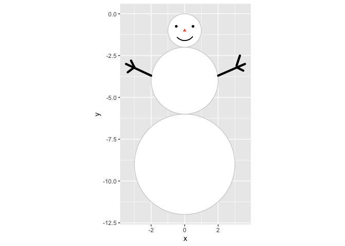<!-- -->

He looks like a happy snowman! 

## Accessories
Let's give him some accessories, it's all in the detailes.
First up, some buttons.
These are farily easy, we position all buttons at `x = 0` and then at `y = c(-3, -4, -5)` for nice even spacing.


```r
p <- p +
  geom_point(aes(x = 0, y = -3:-5), size = 4)
p
```

```
## Warning: Use of `snowman$x` is discouraged. Use `x` instead.
```

```
## Warning: Use of `snowman$y` is discouraged. Use `y` instead.
```

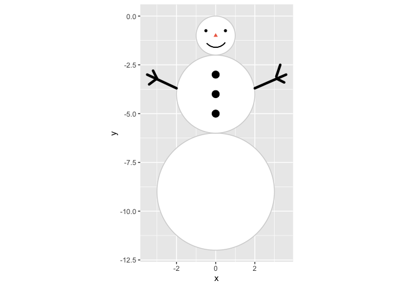<!-- -->

And what is a snowman without a hat?
We give him a tophat, 'cause he's a gentleman (and tophats are not particularly hard to draw with a polygon). 
Since we're making a polygon, we need x and y position for each polygon corner(breakpoint), and add an id column so we can tell `geom_polygon` that all these points belong to a single polygon.


```r
tophat <- tibble(
  x = c(-1, -0.9, -0.3, -0.4, 1.1, 0.8, 1.5, 1.4),
  y = c(0, .25, .15, 1, .75, -0.04, -.25, -.5),
  id = 1
)

p <- p + 
  geom_polygon(data = tophat, 
               aes(x = x, y = y, group = id))
p
```

```
## Warning: Use of `snowman$x` is discouraged. Use `x` instead.
```

```
## Warning: Use of `snowman$y` is discouraged. Use `y` instead.
```

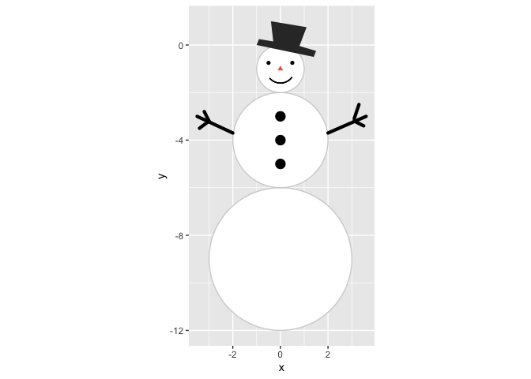<!-- -->

He's looking quite fab, I must say.
But it looks a little chilly, he needs a scarf, and we'll use lines for that. 
For simplicitiy.
And then make it red.


```r
scarf <- tibble(
  x = c(-0.5, 0.3, 0.4, 0.3, 0.5), 
  y = c(-2, -2, -3, -2, -2)
)

p <- p +
  geom_line(data = scarf, size = 3, 
            lineend="round",
            colour = "firebrick4",
            aes(x = x, y = y))
p
```

```
## Warning: Use of `snowman$x` is discouraged. Use `x` instead.
```

```
## Warning: Use of `snowman$y` is discouraged. Use `y` instead.
```

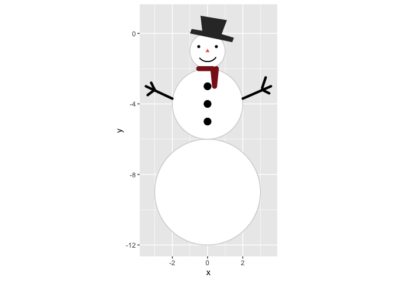<!-- -->

## Ambience

So now we have a snowman, and we like the way he looks. 
He makes me happy at least.

Next is doing some ambience.
As last year's falling snow looked more like slush, let's try again, and actually make serenely falling snow. 
I'm doing almost the same snow creation as last year, but rather than the huge complicated map function I made,
I have rather made a function that creates falling snow at random appearance times.
It's a little complicated, but if you run it slowly, element-by-element, you can see what it is doing.
We're also going to specify the plot window in a `plot_window` element.
This we are going to use to create where the snow appears, and also later when we make a background.

We're going to make a `snow` dataset, where we randomly draw using `sample()` locations on the x an y axis where snow will appear. 
Then we're going to use that data, and expand it so that we have a dataset that is time varying.
So each snowflake is identified with the 'id' column, and a new column 'time' again is a random number indicating when the snowflake appears in the plot, and how it falls.

Since last year, Thomas Lin Pedersen (yeah, the {ggforce} guy, he also maintains [gganimate](https://gganimate.com/), and lots of cool other plot-related packages. Seriously, follow him, you'll not regret it [@thomasp85](https://twitter.com/thomasp85)) did a rewrite of the {gganimate} package, and so also controlling the animation became lots easier, and follows rules more familiar from general ggplot functions. 


```r
library(gganimate)

plot_window <- tibble(
  x = c(-5, 5),
  y = c(3, -12)
)

falling_snow <- function(y, dist = 1){
  yy <- unlist(as.numeric(y))
  
  tibble(
    y = seq(yy, yy - sample(seq(from = .5, to = dist, by=.01), 1), length.out = 100)
  ) %>% 
    mutate(
      time = sample(seq(0.5,.9, .01), 1),
      time = seq(unique(time), unique(time)+.02, length.out = nrow(.))
    )
}

snow <- tibble(
  x = sample(seq(plot_window$x[1],plot_window$x[2], length.out = 1000), 
             200, replace = TRUE),
  y = sample(seq(plot_window$y[1],plot_window$y[2]+2, length.out = 1000), 
             200, replace = TRUE),
  id = 1:200
) %>% 
  group_by(id,x) %>% 
  nest() %>% 
  mutate(data =  map(data,  ~ falling_snow(.x$y))) %>% 
  unnest(cols = data) 

p <- p + 
  geom_point(data=snow, aes(group=id, x = x, y = y), 
             colour="#e5efff", shape=8, size=1) +
  transition_time(time)
p
```

```
## Warning: Use of `snowman$x` is discouraged. Use `x` instead.
```

```
## Warning: Use of `snowman$y` is discouraged. Use `y` instead.
```

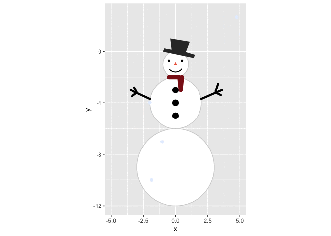<!-- -->

SNOW! Falling snow AND a snowman!
Can you feel my excitement?

Ok, one last element I want, I want a nice serene background.
Last year I made a uniform coloured background through the `theme` function.
This year we're going to make a gradient, using `geom_tile`. 
Making another dataset, we will do some rather fancy things. 
`geom_tile` is an interesting geom, and will in this case require all possible combinations of x and y coordinates to create a nice gradient effect.
To do this we will use `expand_grid`, which is a favourite of mine lately. 
By providing `expand_grid` with all possible values for x and for y, it will _expand_ on this, creating a dataframe that has all possible combinations of the values in each. 
Then, we will group everything by x, and have a cumulative count of the occurance of each unique x value, using `row_number()` in a mutate.
This will create a scalar numeric value, that increases as y increases, which is what a gradient is!
By using this dataset in `geom_tile` and using the 'id' column as the fill, we will get a heatplot, and then we alter the colour of the tiles so that we start with a soft dark blue, end end with a dark navy blue. 


```r
background <- expand_grid(
  x = seq(plot_window$x[1], 
          plot_window$x[2]),
  y = seq(plot_window$y[2], 
          plot_window$y[1], 
          length.out = 50)
) %>% 
  group_by(x) %>%
  mutate(id = row_number()) %>% 
  ungroup()

p + 
  geom_tile(data = background, 
            show.legend = FALSE,
            aes(x = x, y = y, fill = id)) +
  scale_fill_gradientn(
    colours = c("#463f94", "#2e2960")
  )
```

```
## Warning: Use of `snowman$x` is discouraged. Use `x` instead.
```

```
## Warning: Use of `snowman$y` is discouraged. Use `y` instead.
```

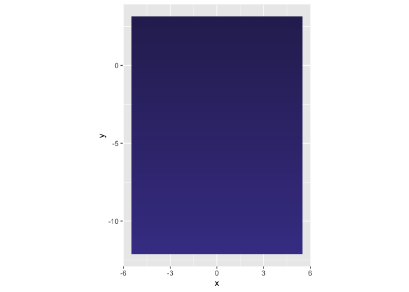<!-- -->
But oh no! The tiles are masking the rest of the plot!
No worries, this was expected.
Remember that ggplot layers are added in the sequence you provide them. 
Since the tiles are the last geom we add, it will be placed on top of the others. 
To fix this, we will remake the entire plot, and make sure things come in the other we want them to be, starting with the background.


```r
# Initiate plot
p <- ggplot() +
  
  # gradient background
  geom_tile(data = background,
            show.legend = FALSE,
            aes(fill = id, x = x, y = y)) +
  scale_fill_gradientn(
    colours = c("#463f94", "#2e2960")
  ) +
  
  # Snowman body
  geom_circle(data = snowman,
              aes(x0 = x, y0 = y, r = r),
              fill = "white", 
              colour = "lightgrey") + 
  
  # Snowman face
  geom_point(data = face, 
             show.legend = FALSE,
             size=2,
             aes(x = x, y = y, 
                 shape = type, 
                 colour = I(colour))
  ) +
  
  # Snowman mouth
  geom_arc(
    aes(x0 = snowman$x[nrow(snowman)], 
        y0 = snowman$y[nrow(snowman)], 
        start = 2.2, end = 4, r=.6)
  ) +
  
  # Body buttons
  geom_point(aes(x = 0, y = -3:-5), 
             size = 4) +
  
  # Body arms
  geom_line(data = arms, size = 1.5, 
            lineend = "round",
            aes(x = x, y = y, group = side)) +
  
  # Tophat
  geom_polygon(data = tophat, colour = "grey70",
               aes(x = x, y = y, group = id)
  ) +
  
  # Scarf
  geom_line(data = scarf,
            size = 3, lineend="round",
            colour = "firebrick4",
            aes(x = x, y = y)) +
  
  # Snow
  geom_point(data=snow, 
             aes(group=id, x = x, y = y), 
             colour="#e5efff", 
             shape=8, size=1) +
  
  # Fix coordinates for aspect ration preservance
  coord_fixed() +
  
  # Remove theme stuff (grey background, axes etc)
  theme_void() +
  
  # Animate the snow
  transition_time(time)

p
```

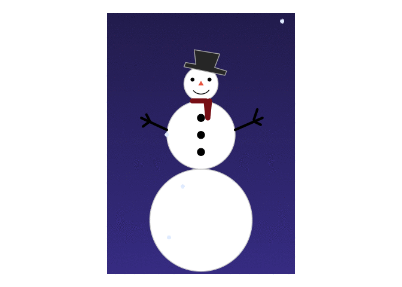<!-- -->

Look at him! :) I'm quite happy with this guy. 
Play around with it as you like, figure out what I did and how.
Show me your snowmen too!


```r
p +
  geom_text(aes(x = 0, y = -8, label = "Merry Christmas!"),
            colour = "goldenrod", vjust = 1, 
            angle = 10, size = 10, 
            family="Times", fontface = "italic")
```

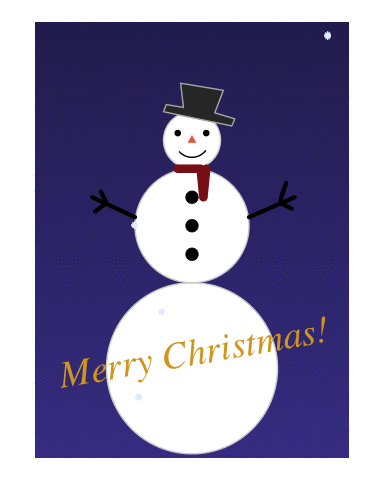<!-- -->

