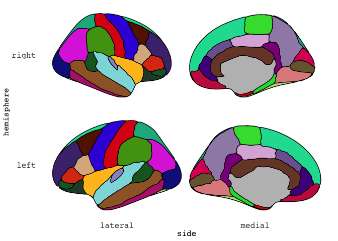
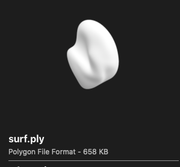

When you work with neuroimaging data like I do, you often find your self swapping back and forth between R and the imaging software of your choise. 
For me, that is usually [FSL](https://fsl.fmrib.ox.ac.uk/fsl/fslwiki/) or [Freesurfer](https://surfer.nmr.mgh.harvard.edu/).
Since the resolution of the brain we have is quite large and 3 dimensional, we often reduce the data to segments that meaningfully go together. 
For instance, areas of the brain that control language or visual processing, or areas of the brain with similar structural properties. 
If you have worked with Freesurfer, the Desikan Killany coortical atlas (aparc) is likely well known to you. 
This is an atlas that consist of 36 segments, which are well-defined ([Automatically Parcellating the Human Cerebral Cortex](https://surfer.nmr.mgh.harvard.edu/ftp/articles/fischl04-parcellation.pdf), Fischl et al., (2004). Cerebral Cortex, 14:11-22.) 

<!-- --><!-- -->

Since the brain is full of sulci (grooves), we often inflate the brain surface so we can more clearly see the entire brain.
This is what is shown  above. 
For those who have followed some of my posts, you might recognise this image to be similar to the default image from our [ggseg](https://lcbc-uio.github.io/ggseg/) package.


```r
library(ggseg)
```

```
## Loading required package: ggplot2
```

```r
ggseg(atlas = dk, mapping = aes(fill=region),
      position = "stacked", colour = "black", 
      show.legend = FALSE) + 
  scale_fill_brain("dk")
```

<!-- -->

Similarly is our package `ggseg3d`, where you can render the proper 3d version using plotly.


```r
library(dplyr, warn.conflicts = FALSE)
library(ggseg3d)
p <- ggseg3d(atlas = dk_3d) %>% 
  pan_camera(camera = "right lateral") %>% 
  remove_axes()
```

```r
p
```


<!--html_preserve--><iframe src="ggseg_1_widget.html" width="100%" height="500px"></iframe><!--/html_preserve-->

That is some nerdy fun!

But getting to the point of having this data was quite some road. 
And I'd like to share that road with you now. 
This entire pipeline is made into a function in our companion package [ggsegExtra](https://lcbc-uio.github.io/ggsegExtra/), the `aparc_2_mesh()` function. 

# Making Freesurfer files into plotly mesh files.
First step in this journey, was to take a binary file type that exists in Freesurfer called an annotation file (`annot`). 
The `annot` file contains information about the segments of the atlas, their colours etc. 
I had never worked with binary files before, and if is was not for the fact that I had some early PhD days where I did do some Matlab scripting, I'd likely not get any further. 
Luckily, I was able to decompose Freesurfer's own matlab script reading this binary file, and translate it into R. 
The result can be seen [here](https://github.com/muschellij2/freesurfer/blob/master/R/read_annotation.R) in the R package [freesurfer](https://github.com/muschellij2/freesurfer) by [John Muschelli](https://github.com/muschellij2). 
This was the first time I contributed a real piece of code to another persons package, and John has graciously added me to the list of authors for it. 
This makes me quite stoked!

The function resturns a list of three things:  
1. a vector of vertices  
2. a vector of labels  
3. a data.frame of colours and region names  


```r
# remotes::install_github("muschellij2/freesurfer")
annot_file <- "/Applications/freesurfer/subjects/fsaverage5/label/lh.aparc.annot"
dk_annot <- freesurfer::read_annotation(annot_file)
```

```
## Reading from version 2 
## colortable with 36 entries read (originally /autofs/space/amaebi_026/users/buckner_cortical_atlas/scripts/colortable_final.txt )
```

```r
str(dk_annot)
```

```
## List of 3
##  $ vertices  : int [1:10242] 0 1 2 3 4 5 6 7 8 9 ...
##  $ label     : int [1:10242] 14423100 9221140 10542100 8204875 14423100 1351760 9182740 11832480 1639705 3296035 ...
##  $ colortable:'data.frame':	36 obs. of  6 variables:
##   ..$ label: chr [1:36] "unknown" "bankssts" "caudalanteriorcingulate" "caudalmiddlefrontal" ...
##   ..$ R    : int [1:36] 25 25 125 100 120 220 220 180 220 180 ...
##   ..$ G    : int [1:36] 5 100 100 25 70 20 20 220 60 40 ...
##   ..$ B    : int [1:36] 25 40 160 0 50 100 10 140 220 120 ...
##   ..$ A    : int [1:36] 0 0 0 0 0 0 0 0 0 0 ...
##   ..$ code : num [1:36] 1639705 2647065 10511485 6500 3294840 ...
```

This data we will need to create brain segments per row in the data.frame returned. 
Since R is more happy with hexidecimal colour codes, we can go ahead and turn RGB to hex


```r
dk_annot$colortable <- mutate(dk_annot$colortable,
                     hex = grDevices::rgb(R, G, B, 
                                          maxColorValue = 255)
)

as_tibble(dk_annot$colortable) 
```

```
## # A tibble: 36 x 7
##    label                       R     G     B     A     code hex    
##    <chr>                   <int> <int> <int> <int>    <dbl> <chr>  
##  1 unknown                    25     5    25     0  1639705 #190519
##  2 bankssts                   25   100    40     0  2647065 #196428
##  3 caudalanteriorcingulate   125   100   160     0 10511485 #7D64A0
##  4 caudalmiddlefrontal       100    25     0     0     6500 #641900
##  5 corpuscallosum            120    70    50     0  3294840 #784632
##  6 cuneus                    220    20   100     0  6558940 #DC1464
##  7 entorhinal                220    20    10     0   660700 #DC140A
##  8 fusiform                  180   220   140     0  9231540 #B4DC8C
##  9 inferiorparietal          220    60   220     0 14433500 #DC3CDC
## 10 inferiortemporal          180    40   120     0  7874740 #B42878
## # … with 26 more rows
```

Next step is to convert the annotation file to what [Anderson Winkler](https://brainder.org/) so astoutly has called `data-per-vertex` file, or a `dpv` for short. 
This is technically an `ascii` file.
This is what we will use to combine all vertices into triangular meshes for 3d rendering. 
For this I made a function called `ggsegExtra::annot2dpv` for simplicity. 
What is does is map the labels from the annotation file, restructure the labels  so that we get a matrix with 5 columns.


```r
# remotes::install_github("LCBC-UiO/ggsegExtra")
dpv <- ggsegExtra::annot2dpv(annot_file, "annot.dpv")
```

```
## Reading from version 2 
## colortable with 36 entries read (originally /autofs/space/amaebi_026/users/buckner_cortical_atlas/scripts/colortable_final.txt )
```

```r
as_tibble(dpv)
```

```
## # A tibble: 10,242 x 5
##       V1    V2    V3    V4    V5
##    <int> <int> <int> <int> <int>
##  1     0     0     0     0    25
##  2     1     0     0     0    30
##  3     2     0     0     0    29
##  4     3     0     0     0    28
##  5     4     0     0     0    25
##  6     5     0     0     0    32
##  7     6     0     0     0    12
##  8     7     0     0     0    26
##  9     8     0     0     0     1
## 10     9     0     0     0    13
## # … with 10,232 more rows
```
This file is the basis for the triangular mesh we will soon make. 
The format tok me a while to understand, but it has two main parts:  
1. is X number of rows with information of the _face_ of the triangle (i.e. the surface area between three points)  
2. is Y number of rows with information about the _vertices_ for the triangles (i.e. the three connecting dots)  

Now that we have mapping of vertices and faces, we also need a surface to project on to. 
In Freesurfer, we have quite some surfaces to choose from, but we will go with inflated for now, and use the left hemisphere (`lh`).
This file we also need to convert into an ascii file, with the convenient `surf3asc()` function we made.


```r
surf_file <- "/Applications/freesurfer/subjects/fsaverage5/surf/lh.inflated"
surf <- ggsegExtra::surf2asc(surf_file, "~/Desktop/surf.dpv")
```

```
## Saving ~/Desktop/surf.dpv
```

```r
str(surf)
```

```
## List of 2
##  $ vertices:'data.frame':	10242 obs. of  4 variables:
##   ..$ V1: num [1:10242] -5.84 16.43 30.06 5.29 -36.14 ...
##   ..$ V2: num [1:10242] 2.5 -64.2 16.6 92.2 24.7 ...
##   ..$ V3: num [1:10242] 57.65 54.94 43.2 13.27 -2.76 ...
##   ..$ V4: int [1:10242] 0 0 0 0 0 0 0 0 0 0 ...
##  $ faces   :'data.frame':	10239 obs. of  4 variables:
##   ..$ V1: num [1:10239] -5.19 -4.16 -3.1 -2.28 -1.44 ...
##   ..$ V2: num [1:10239] -12.2 -11.7 -11.1 -13.7 -16.3 ...
##   ..$ V3: num [1:10239] -60.7 -60.1 -59.4 -57.5 -55.6 ...
##   ..$ V4: int [1:10239] 0 0 0 0 0 0 0 0 0 0 ...
```


This format we will turn into Stanford Polygon files (`.ply`) which are quite common for mesh data.
You can read more about this format in Anderson Winklers [blogpost](https://brainder.org/tag/ply/).

This is quite an easy transformation, as it's actually just chaging the text in the ascii  little, but a function always makes transformations easier!


```r
ply <- ggsegExtra::asc2ply("~/Desktop/surf.dpv","~/Desktop/surf.ply")
str(ply)
```

```
##  chr [1:30731] "ply" "format ascii 1.0" "element vertex 10242" ...
```

The fun part is that, despite this being a file made completely of text and might seem very niche, Mac's Finder recognises this format as a 3d object and can preview it for you!
Albeit in a strange angle, there it is!



The next step is to project the colours from the regions we know of, onto the currently white faces of the meshes. 
This, is easier said than done. 
While I would have loved to do this on a face-by-face way, I have yet to find a way to do so. 
The only way I know how to do this next step, and by no means truly understand what is happening, is by scouring through Anderson Winklers [areal scripts](https://github.com/andersonwinkler/areal). 
He does seem to have a graps of face-mapping though, so I'm preparing to contact him to learn more about it. 

This next step, will split the `.ply` file into several `.ply` files based on the information in the labels we previously made. 
The function `surfsplit()` is a doozy, and while it works, I can confidently say I dont know why. 
It is a piece of magic Anderson made, that I translated to R. 
I sat for several days with R and Matlab side by side, carefully making sure I was getting the same output for the functions. 
It was fun and gruelling at the same time. 
This function is so very specifically tailored to work within the overarching pipeline, that I have not made it an exported function. 
It works only internally. 

Sorry about that! But it really is such a piece I think not alot of people will find it particularly interesting. 

Once all .ply files are generated, all of them are collected in R using a nested data.frame. 

Running the entire pipeline, selecting the subject `fsaverage5`, right hemisphere, on an inflasted surface, for the `aparc`(Desikan Killany) atlas.


```r
subj <- "fsaverage5"
fs_subj_dir <- "/Applications/freesurfer/subjects/"

dk_atlas <- ggsegExtra::aparc_2_mesh(subject = subj,
                                     hemisphere = "rh",
                                     surface = "inflated",
                                     annot = "aparc",
                                     subjects_dir = fs_subj_dir,
                                     annot_dir = file.path(fs_subj_dir, subj, "label"),
                                     output_dir = "~/Desktop/",
                                     cleanup = FALSE,
                                     verbose = FALSE )
```

```r
dk_atlas
```

```
## # A tibble: 36 x 9
##    atlas surf   hemi  region       colour  mesh     label       roi   annot     
##    <chr> <chr>  <chr> <chr>        <chr>   <list>   <chr>       <chr> <chr>     
##  1 dk_3d infla… left  <NA>         <NA>    <named … lh_unknown  0001  unknown   
##  2 dk_3d infla… left  bankssts     #196428 <named … lh_bankssts 0002  bankssts  
##  3 dk_3d infla… left  caudal ante… #7D64A0 <named … lh_caudala… 0003  caudalant…
##  4 dk_3d infla… left  caudal midd… #641900 <named … lh_caudalm… 0004  caudalmid…
##  5 dk_3d infla… left  corpus call… #784632 <named … lh_corpusc… 0005  corpuscal…
##  6 dk_3d infla… left  cuneus       #DC1464 <named … lh_cuneus   0006  cuneus    
##  7 dk_3d infla… left  entorhinal   #DC140A <named … lh_entorhi… 0007  entorhinal
##  8 dk_3d infla… left  fusiform     #B4DC8C <named … lh_fusiform 0008  fusiform  
##  9 dk_3d infla… left  inferior pa… #DC3CDC <named … lh_inferio… 0009  inferiorp…
## 10 dk_3d infla… left  inferior te… #B42878 <named … lh_inferio… 0010  inferiort…
## # … with 26 more rows
```


Within the `mesh` column, are both the vertices and faced needed to make the mesh for plotting.
In a _very_ simplified version, the `ggseg3d()` function just loops through each segment and adds it as a trace to plotly.


```r
p = plotly::plot_ly()
for (tt in 1:nrow(dk_atlas)) {
  
  p = plotly::add_trace(p,
                        
                        # map vertices
                        x = dk_atlas$mesh[[tt]]$vertices$x, 
                        y = dk_atlas$mesh[[tt]]$vertices$y, 
                        z = dk_atlas$mesh[[tt]]$vertices$z, 
                        
                        # map faces
                        i = dk_atlas$mesh[[tt]]$faces$i - 1, 
                        j = dk_atlas$mesh[[tt]]$faces$j - 1, 
                        k = dk_atlas$mesh[[tt]]$faces$k - 1, 
                        
                        facecolor = rep(dk_atlas$colour[tt], nrow(dk_atlas$mesh[[tt]]$faces)), 
                        type = "mesh3d", 
                        showscale = FALSE
                        )
}
```


```r
p
```
 

<!--html_preserve--><iframe src="ggseg_2_widget.html" width="100%" height="500px"></iframe><!--/html_preserve-->

This tok me well over a week to pan out. :)
The translations of Andersons' scripts, the trying desperately to be able to map the faces to colour without splitting up into multiple `.ply`s. 
I learned so much, and it was really a fun challenge!

I hope the function to make the atlas is easy enough for you who need it, and that you will be able to create your own atlases compatible with ggseg3d!

