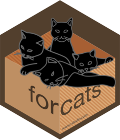
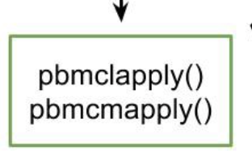
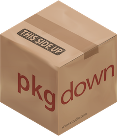

This year has been truly something different for us all. 
Blogging has definitely taken a toll, as real life has been quite something to handle.
So, in order to end the year with a bang, and something fun, I started a twitter advent calendar!




The advent calendar is one R-package per day that I personally use and find very useful in my work. 
The hope is that it would give people a mix of familiar and less familiar packages that might help their work too. 
In each package sub-thread, I try to highlight some functions or functionality from the various packages that I like in particular.
There are so many packages on CRAN and other online repositories (BioConductor, GitHub, Gitlab, NeuroConductor etc.), that it can be hard to find something to help you along. 
I hope this atleast points you in a good direction.
There are other packages that could cover some or all of the same functionality as the ones listed here, but these are the ones I personally use.


<div class="container">
  <ul id="postGrid">
<li class="square">
    <div class="squareIn">
      <a class="squareLink" href="https://twitter.com/DrMowinckels/status/1334054102905593861">
        
        <h1>distill</h1>
        <p style="padding-top: 5%">2020-12-01</p>
      </a>
    </div>
</li>
<li class="square">
    <div class="squareIn">
      <a class="squareLink" href="https://twitter.com/DrMowinckels/status/1334055725644058624">
        
        <h1>here</h1>
        <p style="padding-top: 5%">2020-12-02</p>
      </a>
    </div>
</li>
<li class="square">
    <div class="squareIn">
      <a class="squareLink" href="https://twitter.com/DrMowinckels/status/1334404923564437504">
        
        <h1>glue</h1>
        <p style="padding-top: 5%">2020-12-03</p>
      </a>
    </div>
</li>
<li class="square">
    <div class="squareIn">
      <a class="squareLink" href="https://twitter.com/DrMowinckels/status/1334770520953417729">
        
        <h1>holepunch</h1>
        <p style="padding-top: 5%">2020-12-04</p>
      </a>
    </div>
</li>
<li class="square">
    <div class="squareIn">
      <a class="squareLink" href="https://twitter.com/DrMowinckels/status/1335302958989398016">
        
        <h1>xaringan</h1>
        <p style="padding-top: 5%">2020-12-05</p>
      </a>
    </div>
</li>
<li class="square">
    <div class="squareIn">
      <a class="squareLink" href="https://twitter.com/DrMowinckels/status/1335691689764204544">
        
        <h1>usethis</h1>
        <p style="padding-top: 5%">2020-12-06</p>
      </a>
    </div>
</li>
<li class="square">
    <div class="squareIn">
      <a class="squareLink" href="https://twitter.com/DrMowinckels/status/1335858603891232768">
        
        <h1>nettskjemar</h1>
        <p style="padding-top: 5%">2020-12-07</p>
      </a>
    </div>
</li>
<li class="square">
    <div class="squareIn">
      <a class="squareLink" href="https://twitter.com/DrMowinckels/status/1336215088089493504">
        
        <h1>stringr</h1>
        <p style="padding-top: 5%">2020-12-08</p>
      </a>
    </div>
</li>
<li class="square">
    <div class="squareIn">
      <a class="squareLink" href="https://twitter.com/DrMowinckels/status/1336575636324954113">
        
        <h1>kableExtra</h1>
        <p style="padding-top: 5%">2020-12-09</p>
      </a>
    </div>
</li>
<li class="square">
    <div class="squareIn">
      <a class="squareLink" href="https://twitter.com/DrMowinckels/status/1336943011389992961">
        
        <h1>patchwork</h1>
        <p style="padding-top: 5%">2020-12-10</p>
      </a>
    </div>
</li>
<li class="square">
    <div class="squareIn">
      <a class="squareLink" href="https://twitter.com/DrMowinckels/status/1337305681385414656">
        
        <h1>rticles</h1>
        <p style="padding-top: 5%">2020-12-11</p>
      </a>
    </div>
</li>
<li class="square">
    <div class="squareIn">
      <a class="squareLink" href="https://twitter.com/DrMowinckels/status/1337869018129195012">
        
        <h1>forcats</h1>
        <p style="padding-top: 5%">2020-12-12</p>
      </a>
    </div>
</li>
<li class="square">
    <div class="squareIn">
      <a class="squareLink" href="https://twitter.com/DrMowinckels/status/1338028973708677120">
        
        <h1>vitae</h1>
        <p style="padding-top: 5%">2020-12-13</p>
      </a>
    </div>
</li>
<li class="square">
    <div class="squareIn">
      <a class="squareLink" href="https://twitter.com/DrMowinckels/status/1338400483229261824">
        
        <h1>pbmcapply</h1>
        <p style="padding-top: 5%">2020-12-14</p>
      </a>
    </div>
</li>
<li class="square">
    <div class="squareIn">
      <a class="squareLink" href="https://twitter.com/DrMowinckels/status/1338802526955728896">
        
        <h1>lubridate</h1>
        <p style="padding-top: 5%">2020-12-15</p>
      </a>
    </div>
</li>
<li class="square">
    <div class="squareIn">
      <a class="squareLink" href="https://twitter.com/DrMowinckels/status/1339110009427423233">
        
        <h1>magick</h1>
        <p style="padding-top: 5%">2020-12-16</p>
      </a>
    </div>
</li>
<li class="square">
    <div class="squareIn">
      <a class="squareLink" href="https://twitter.com/DrMowinckels/status/1339491287003783169">
        
        <h1>papayar</h1>
        <p style="padding-top: 5%">2020-12-17</p>
      </a>
    </div>
</li>
<li class="square">
    <div class="squareIn">
      <a class="squareLink" href="https://twitter.com/DrMowinckels/status/1339902456382296064">
        
        <h1>learnr</h1>
        <p style="padding-top: 5%">2020-12-18</p>
      </a>
    </div>
</li>
<li class="square">
    <div class="squareIn">
      <a class="squareLink" href="https://twitter.com/DrMowinckels/status/1340205260317581312">
        
        <h1>janitor</h1>
        <p style="padding-top: 5%">2020-12-19</p>
      </a>
    </div>
</li>
<li class="square">
    <div class="squareIn">
      <a class="squareLink" href="https://twitter.com/DrMowinckels/status/1340566661712257030">
        
        <h1>xaringanExtra</h1>
        <p style="padding-top: 5%">2020-12-20</p>
      </a>
    </div>
</li>
<li class="square">
    <div class="squareIn">
      <a class="squareLink" href="https://twitter.com/DrMowinckels/status/1340938927734222848">
        
        <h1>reactable</h1>
        <p style="padding-top: 5%">2020-12-21</p>
      </a>
    </div>
</li>
<li class="square">
    <div class="squareIn">
      <a class="squareLink" href="https://twitter.com/DrMowinckels/status/1341293669001932805">
        
        <h1>broom</h1>
        <p style="padding-top: 5%">2020-12-22</p>
      </a>
    </div>
</li>
<li class="square">
    <div class="squareIn">
      <a class="squareLink" href="https://twitter.com/DrMowinckels/status/1341655830337302531">
        
        <h1>rio</h1>
        <p style="padding-top: 5%">2020-12-23</p>
      </a>
    </div>
</li>
<li class="square">
    <div class="squareIn">
      <a class="squareLink" href="https://twitter.com/DrMowinckels/status/">
        
        <h1>pkgdown</h1>
        <p style="padding-top: 5%">2020-12-24</p>
      </a>
    </div>
</li>
  </ul>
</div>


## How I selected a package per day

Before I started the calendar (one day late!), I sat down and wrote a list of all the packages I wanted in my advent calendar.

The rules were:

- One package per day  
- I must personally use it  
- I can find easy examples of why I like using it  

The point of the calendar was to do something fun, that others might find useful, and that would highlight and give credit to great packages.
But I also did not have the possibility of spending lots of time researching other alternative options or the like, it was to be a light-weight and easy thing for me to do. 

So i wrote down my list in R:


```r
pks <- c("usethis", "rio", "distill", 
         "boom", "patchwork", "holepunch",
         "learnr", "xaringan", "magick",
         "nettskjemar", "pkgdown", "here",
         "rticles", "vitae", "xaringanExtra",
         "stringr", "forcats", "lubridate", 
         "glue", "janitor", "pbmcapply",
         "kableExtra", "papayar", "reactable")
```

Then I made a little function that would draw a random one every time I ran it, while omitting the ones I had drawn before


```r
get_todays <- function(completed, pkgs){
  days <- 1:24
  days <- days[!days %in% completed]
  k <- sample(days, 1)  
  cat(pkgs[k], "\n")
  k
}
```


Now I had an itty bitty function that would draw from my list by random each day, so I did not have to think about the order of things. 
Every day I drew a new package, tweeted about it, and added it to the completed list.


```r
completed <- c(3, 12, 19, 6, 8, 1, 
               10, 16, 22, 5, 
               17, 21, 18, 9, 7)

get_todays(completed, pks)
```

```
## xaringanExtra
```

```
## [1] 15
```

Now, there is a slight problem with my function.
I forgot to add a random seed, as pointed out by [Tobias Busch](https://twitter.com/tobilottii)



So, always room for improvement! If I do something similar next year, I'll be sure to add that!

Have a great Christmas, everyone!


