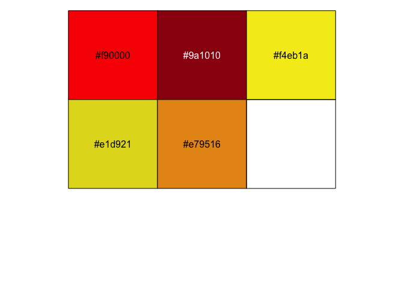

It's time for a new year, and I think we are all ready for it!
At least I am. 

This is just a short post, with a ggplot2 holiday card wishing you all a better 2021 than 2020!
Let's face it, there not much needed for that to happen, and with vaccines being distributed I have hopes. 

I hope the New Year, at some point, makes it possible to start going to conferences again and that I can get to meet ore R-aficionados when the time allows. 

As previous years, I wanted to make a holiday card for you all in ggplot2.
You may ask why I keep plotting these ridiculous things in ggplot2, but the answer is quite simple: why not?
Other than being fun, it's also a nice exercise in thinking about and exploring how data need to look to create a certain output. 
I find these holiday cards help me understand the geoms, how ggplot2 works, and how to think about grid structures.


## Making a holiday card

The first thing I do when starting a new plot, is make sure I have a decent colour palette going.
I browse through [hex palettes](https://www.color-hex.com/color-palette/) for palettes I like, and this time a choose one called [Chinese New Year - Rooster Color Palette](https://www.color-hex.com/color-palette/30281), that I thought might work.


```r
# Define a palette object
pal <- c("#f90000", "#9a1010", "#f4eb1a", "#e1d921", "#e79516")

# Have a look at the colours
scales::show_col(pal)
```

<!-- -->


Next, I had in mind a simple image, with some blurred coloured circles in the background of some white text. 
So I had so make a data.frame with the basis of some circles. 
I knew I wanted to use `ggforce::geom_circle` for this, which would need x and y coordinates for the center of the circle and the radius. 
So I needed a data.frame with that information, and also a colour for each circle. 


```r
library(tidyverse)

# Choose the number of circles to make
n_circles <- 15

# Create data.frame with coordinate, radius and colour drawn by random.
circles <- tibble(
  x = sample(1:20, n_circles),
  y = sample(1:20, n_circles),
  r = sample(seq(.5, 1.5, length.out = 20), n_circles),
  c = sample(pal, n_circles, replace = TRUE)
)

circles
```

```
## # A tibble: 15 x 4
##        x     y     r c      
##    <int> <int> <dbl> <chr>  
##  1    14     3 1.18  #9a1010
##  2     1    13 0.816 #9a1010
##  3    17    19 1.29  #f90000
##  4    19     7 0.868 #f4eb1a
##  5    18    15 1.24  #e1d921
##  6     4    10 1.39  #f90000
##  7     3     2 0.605 #e1d921
##  8     9     6 1.08  #9a1010
##  9    12    11 1.03  #e1d921
## 10     2     8 0.5   #e79516
## 11    16    20 0.553 #f4eb1a
## 12     8     1 0.974 #f4eb1a
## 13    15    12 0.711 #f90000
## 14    20     4 0.763 #9a1010
## 15    11     5 1.5   #9a1010
```


After that, I needed to do some stuff to make the circles blurred. 
I've opted for a simple solution, where I'd overlay circles of decreasing sizes on top of each other with high transparency, which should look like a blurring effect. 
To achieve that, I decided to keep to my tibble and tidyverse way of doing things.
First, I defined a separate tibble with the different sizes I want the radii to have for the blurring.


```r
transp <- tibble(
      size = seq(from = 1, to = 1.9, length.out = 10)
    )
transp
```

```
## # A tibble: 10 x 1
##     size
##    <dbl>
##  1   1  
##  2   1.1
##  3   1.2
##  4   1.3
##  5   1.4
##  6   1.5
##  7   1.6
##  8   1.7
##  9   1.8
## 10   1.9
```


Using this, I needed to make sure that each circle (every row in the `circles` tibble) gets this blurring working. 
The best way I know how, is nesting the data by everything but radius, then merge the radius tibble with the transparency tibble, and unnest again.
Lastly I can multiply the radius with the size, and get a large data.frame with lots of circles of different sizes, but many sharing a center and colour.


```r
# Nesting data moved all non-grouped columns into a "data" column
circles %>% 
  nest_by(x, y, c)
```

```
## # A tibble: 15 x 4
## # Rowwise:  x, y, c
##        x     y c                     data
##    <int> <int> <chr>   <list<tbl_df[,1]>>
##  1     1    13 #9a1010            [1 × 1]
##  2     2     8 #e79516            [1 × 1]
##  3     3     2 #e1d921            [1 × 1]
##  4     4    10 #f90000            [1 × 1]
##  5     8     1 #f4eb1a            [1 × 1]
##  6     9     6 #9a1010            [1 × 1]
##  7    11     5 #9a1010            [1 × 1]
##  8    12    11 #e1d921            [1 × 1]
##  9    14     3 #9a1010            [1 × 1]
## 10    15    12 #f90000            [1 × 1]
## 11    16    20 #f4eb1a            [1 × 1]
## 12    17    19 #f90000            [1 × 1]
## 13    18    15 #e1d921            [1 × 1]
## 14    19     7 #f4eb1a            [1 × 1]
## 15    20     4 #9a1010            [1 × 1]
```


Once the data is nested, the `radius` column is all alone, nested within the `data` column of the tibble.
This way we can safely merge the `transp` object with that data, which will duplicate the radius number for every row in the `transp` object.
Here, we must make sure that within the `mutate` the output of the merge is nested within a `list()`. 
The `data` colum is a so-called list-column, and as such the output of any manipulation of it must also be a list. 


```r
# Merge the data column with the transp object, 
# make sure it outputs into a list to work with nested data
circles %>% 
  nest_by(x, y, c) %>% 
  mutate(data = list(merge(data, transp)))
```

```
## # A tibble: 15 x 4
## # Rowwise:  x, y, c
##        x     y c       data             
##    <int> <int> <chr>   <list>           
##  1     1    13 #9a1010 <df[,2] [10 × 2]>
##  2     2     8 #e79516 <df[,2] [10 × 2]>
##  3     3     2 #e1d921 <df[,2] [10 × 2]>
##  4     4    10 #f90000 <df[,2] [10 × 2]>
##  5     8     1 #f4eb1a <df[,2] [10 × 2]>
##  6     9     6 #9a1010 <df[,2] [10 × 2]>
##  7    11     5 #9a1010 <df[,2] [10 × 2]>
##  8    12    11 #e1d921 <df[,2] [10 × 2]>
##  9    14     3 #9a1010 <df[,2] [10 × 2]>
## 10    15    12 #f90000 <df[,2] [10 × 2]>
## 11    16    20 #f4eb1a <df[,2] [10 × 2]>
## 12    17    19 #f90000 <df[,2] [10 × 2]>
## 13    18    15 #e1d921 <df[,2] [10 × 2]>
## 14    19     7 #f4eb1a <df[,2] [10 × 2]>
## 15    20     4 #9a1010 <df[,2] [10 × 2]>
```

Once they are merged, we can unnest and see that our new circles object has lots of new rows!

```r
# Unnest the data, so that a large tibble exposed (lots of rows!)
circles %>% 
  nest_by(x, y, c) %>% 
  mutate(data = list(merge(data, transp))) %>% 
  unnest(data)
```

```
## # A tibble: 150 x 5
## # Groups:   x, y, c [15]
##        x     y c           r  size
##    <int> <int> <chr>   <dbl> <dbl>
##  1     1    13 #9a1010 0.816   1  
##  2     1    13 #9a1010 0.816   1.1
##  3     1    13 #9a1010 0.816   1.2
##  4     1    13 #9a1010 0.816   1.3
##  5     1    13 #9a1010 0.816   1.4
##  6     1    13 #9a1010 0.816   1.5
##  7     1    13 #9a1010 0.816   1.6
##  8     1    13 #9a1010 0.816   1.7
##  9     1    13 #9a1010 0.816   1.8
## 10     1    13 #9a1010 0.816   1.9
## # … with 140 more rows
```

Then the `size` column can be multiplied with the `radius` column, to get circles of different sizes. 

```r
# multiply r with the size to get the "true" radius.
circles <- circles %>% 
  nest_by(x, y, c) %>% 
  mutate(data = list(merge(data, transp))) %>% 
  unnest(data) %>% 
  mutate(r = r*size)
circles
```

```
## # A tibble: 150 x 5
## # Groups:   x, y, c [15]
##        x     y c           r  size
##    <int> <int> <chr>   <dbl> <dbl>
##  1     1    13 #9a1010 0.816   1  
##  2     1    13 #9a1010 0.897   1.1
##  3     1    13 #9a1010 0.979   1.2
##  4     1    13 #9a1010 1.06    1.3
##  5     1    13 #9a1010 1.14    1.4
##  6     1    13 #9a1010 1.22    1.5
##  7     1    13 #9a1010 1.31    1.6
##  8     1    13 #9a1010 1.39    1.7
##  9     1    13 #9a1010 1.47    1.8
## 10     1    13 #9a1010 1.55    1.9
## # … with 140 more rows
```

Then it's all about plotting the data. 
Initially, I wanted a small animation like blinking of the circles, but I've decided to leave it as is for now. 

Loading in ggforce, we get the geom_circle available.
I'm also using a small colour hack a found a long time ago.
When I have the colours in the data.frame directly, as it's own column, I usually use the identity function (`I()`) directly in the ggplot2 calls, rather than `scale_colour_identity`. 
It's just something I got used to. 


```r
library(ggforce)
alpha = .1

ggplot(circles, aes(fill = I(c))) +
  # Add all the circles
  geom_circle(alpha = .1, colour = NA, 
              aes(x0 = x, y0 = y, r = r)) +
  # Add text at the center, but a little higher (+5)
  geom_text(aes(x = mean(circles$x), 
                y = mean(circles$y)+5, 
                label = "Happy New Year"),
            family = "Great Vibes",
            colour = "#fefefe",
            size = 14,
            show.legend = FALSE) +
  # Add text at the center but a little loswer (-5)
    geom_text(aes(x = mean(circles$x), 
                y = mean(circles$y)-5, 
                label = "Adios 2020!"),
              family = "Great Vibes",
            size = 8,
            colour = "#fefefe",
            show.legend = FALSE) +
  theme_void() +
  theme(plot.background = element_rect(fill="black")) +
  NULL
```


