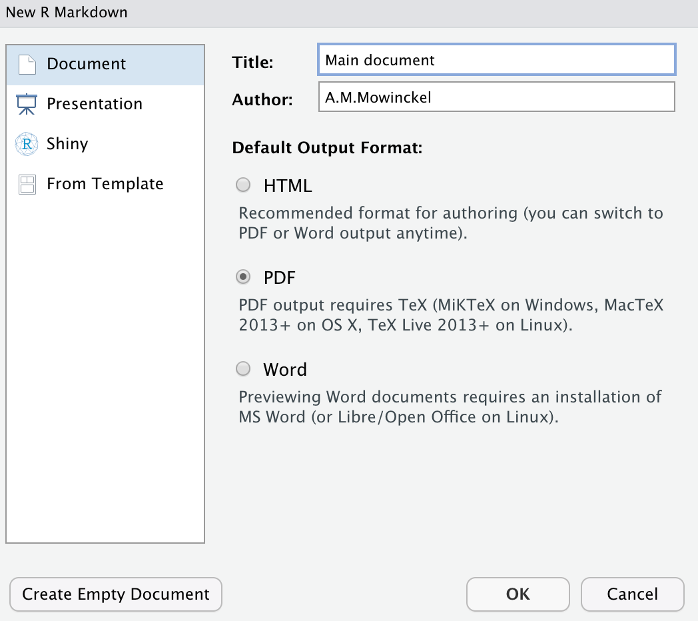

```{r setup, include=F}
```

I have recently been working on a set of analyses from a survey at work.
This has been really fun, but also a little tedious. 
The survey has two basic type of questions, likert-scale questions and binary yes/no questions.
For each of these two types of questions, I've needed to generate a set of descriptive plots and tables, as well as run a particular set of statistical models.

I was doing _a lot_ of copy and paste of code, with whole code chunks and text for each of the questions, then doing simple search and replace of data and strings.
Tedious. 

I know how to make Rmarkdown parametrised reports, and I kind of wanted something similar, but in a nested fashion.
Ideally, I wanted a type of Rmarkdown parametrised report I could provide data, titles and small text snippets to to generate a whole set of descriptives and statistics for me for the various questions.
But I could not find any of the sort.

As I often do, I went to the #Rstats twitter Gods for help.

{}


And this was not at all a super easy thing to do, it turns out!
We had some nice conversations and people offered awesome advice. 
#Rstats twitter really is the best!

In the end, I opted for a solution that looked really awesome, and I currently cannot find the tweet that pointed me in that direction (if anyone finds it, let me know so I can attribute properly!)

Let's make some files to test!

## Create the Rmd

First off, we will make an Rmd file, by going to File -> New file -> Rmarkdown ... in RStudio, then choose to create a PDF. 




Now we have a main document to create from. This is the document where we will call on other rmarkdown templates to be added.

I deleted everything in the [main document](https://github.com/Athanasiamo/DrMowinckels/tree/master/content/blog/`r rmarkdown::metadata$slug`/main-document.Rmd) (we could have just created an empty one in the step before also).

````md
---
title: "main document"
output: pdf_document
---

```{r setup, include=FALSE}`r ''`
knitr::opts_chunk$set(echo = TRUE)
```

````

SO we have a document now, that will knit to pdf, and where code chunk code will be rendered in the document.

Let us make some stuff to plot.
We'll use the palmerpenguins package and dataset, and make a plot of penguins bill length against bill depth, and a summary table of the mean, min and maximum values of these two measures.

```{r}
library(ggplot2)
library(dplyr)
library(palmerpenguins)

penguins %>% 
  ggplot(aes(x = bill_length_mm, y = bill_depth_mm)) +
  geom_point()
```

```{r}
library(tidyr)
penguins %>% 
  pivot_longer(ends_with("mm"),
               names_to = "cols",
               values_to = "mm", 
               values_drop_na = TRUE) %>% 
  group_by(cols) %>% 
  summarise(across(mm, 
                   .fns = list(mean = mean, 
                               min = min, 
                               max = max,
                               N = length),
                    .names = "{.fn}")
  )
```

We did quite a lot here, and I for once don't intend on digging into the details of what I did. 
You can read lots about [pivoting](https://tidyr.tidyverse.org/articles/pivot.html#longer-2) on the tidyverse pages.

ok. SO we now have an overall plot and table for all the penguins.
But say I want to have one section for each of the three penguins species.
And lets forget about grouping data and making colours in the plots to easily see the species. 
We want, one chapter per penguin species. 

How do we do that?

We could copy and paste the code, with filters to only grab the species we want.
But we'd have to do that three times, and if we wanted to change something, we'd have to change it in all three places. 
Things could easily get very cumbersome.

We can make a so-called "child"-document, and provide it with what it needed to create what we wanted. 
The child document will be another Rmd, that will depend on certain things existing in its `enviroment` to run. 
Since [child documents cannot be parametrised](https://github.com/yihui/knitr/issues/1884) this was in my opinion the smoothest solution. 

## Making the child document

Create a new Rmarkdown file like before, and name it something meaningful.
I'll call it [`species-child.Rmd`](https://github.com/Athanasiamo/DrMowinckels/tree/master/content/blog/`r rmarkdown::metadata$slug`/species-child.Rmd), in this case, choose the "Create empty document" in the RStudio UI.

This document will not have any other yaml than the type of output is should contain.

````md
---
output: pdf_document
---

````

Then we can copy in our plot and table code, so that we can build on that.
I'll choose the simplest way I can think of to do this, and that is by having a single object in the environment of the child document that will let our code know which species it should base it self on. 
We'll call the object `species`, and have a piece of code in our child document that creates an object called `data` which only contains that species from the penguins data set.

````md

## Species `r knitr::inline_expr('species')`

```{r setup, include=FALSE}`r ''`
knitr::opts_chunk$set(echo = TRUE)
library(ggplot2)
library(dplyr)
library(palmerpenguins)
library(tidyr)

# Filter the penguins data by species
data <- filter(penguins, species == species)
```

```{r}`r ''`
data %>% 
  ggplot(aes(x = bill_length_mm, y = bill_depth_mm)) +
  geom_point()
```

```{r}`r ''`
data %>% 
  pivot_longer(ends_with("mm"),
               names_to = "cols",
               values_to = "mm", 
               values_drop_na = TRUE) %>% 
  group_by(cols) %>% 
  summarise(across(mm, 
                   .fns = list(mean = mean, 
                               min = min, 
                               max = max,
                               N = length),
                    .names = "{.fn}")
  )
```
````

Ok, so out child doc is ready. 
How do we call it from the main document (parent) and how to we give it the species variable if we cannot give it parameters?

## Knitr child document

The knitr package has a particular function to knit child documents, and you can [read more about it in the Rmarkdown cookbook](https://bookdown.org/yihui/rmarkdown-cookbook/child-document.html).
We are going to do something not particularly highlighted there, and use an option in that function were you provide an R environment to the child document.
Child documents, just like all Rmarkdown documents, are knit in clean environments, making them awesome reproducible documents, they won't render if you rely on things existing in your environment that is not generated by code.
By using the `envir` option in the function, we can provide the species designation to the child document, so that it renders only the species we ask for!

In your main document, add the below code, which creates a new environment, adds an object `species` with the string "Adelie" in it, knits the child document and saves the output to an object in the main document, an then prints the output into the main document.

**NOTE** notice how the code chunk in the main document has `results = 'asis'` specified. This is important. Knitr will create the markdown needed to create the pdf, so the output of the code chunk is actually markdown that we want to be knitted to latex then pdf. 

````md
```{r, results = 'asis'}`r ''`
# Define new environment
child_env <- new.env()
child_env$species <- "Adelie"

# knit the document and save the character output to an object
res <- knitr::knit_child(
  "species-child.Rmd",
  envir = child_env,
  quiet = TRUE
)

# Cat the object to make it render in your main document
cat(res, sep = '\n')
```
`````

Now, we can copy and paste that code chunk for all three species, and have a neat little report made.
You can have a look at the documents in the github repo of this post, and hopefully it will make some sense. 

- [Main document](https://github.com/Athanasiamo/DrMowinckels/tree/master/content/blog/`r rmarkdown::metadata$slug`/main-document.Rmd)
- [Child document](https://github.com/Athanasiamo/DrMowinckels/tree/master/content/blog/`r rmarkdown::metadata$slug`/species-child.Rmd)


