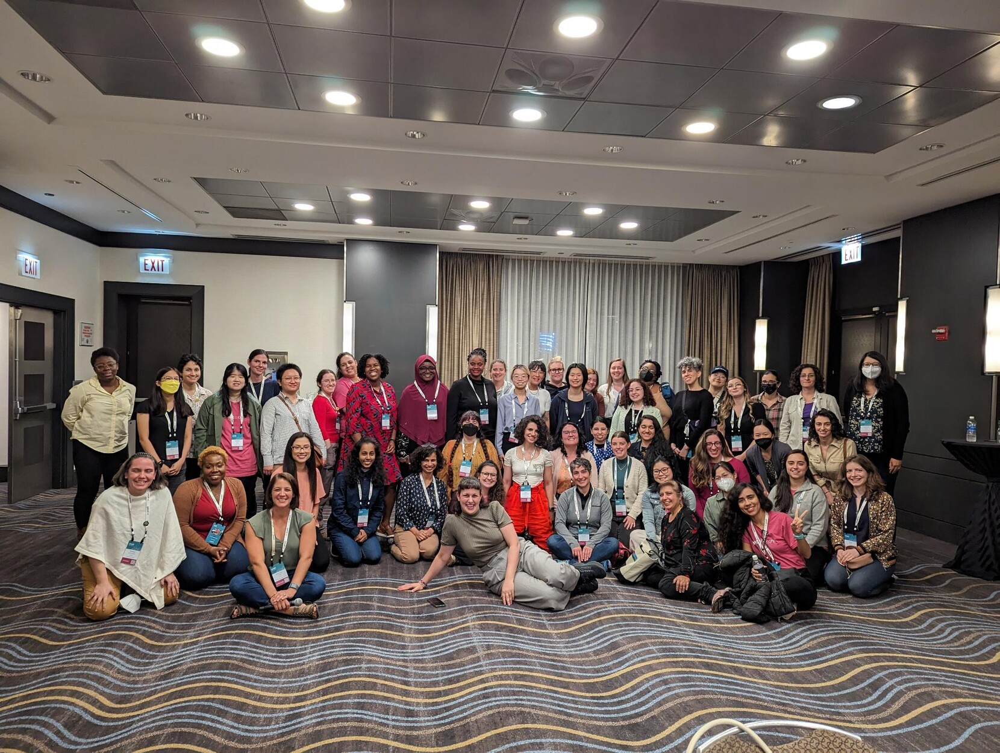

It's no secret that I have [loved going](/blog/2019-01-19-why-rstudio-conf-is-the-best-conference-experience-i-have-had/) to Posit::conf (then RStudio::conf) before.
There is a general air of excitement, nerdiness and support I just rarely feel at any other conf I go to.
It's like it gathers all the best Data science and R geeks in one place and we just go bananas in each others company.

Going to Chicago this year for the first ever Posit::conf was no exception to that.
If anything, my continued involvement in the R, rOpenSci and R-Ladies communities only increased my enjoyment at the conf.

I'd like to share some thoughts and joys I had in the 4 days of the conf, for my own sake, and I hope these might also bring you closer to joining us there one year.

## Preparing for conf
I have been pretty sequestered due to the pandemic and a domestic situation making it important for me to stay safe. 
I have still not ever been sick with Covid.
Posit::conf was my first large overseas adventure in 4 years, so I was both anxious and excited for going.

A part of that excitement was that I actually had a talk this year!
I had a [lightning talk](https://posit.co/resources/videos/make-a-package-make-some-friends/) at RStudio::global in 2019, and this full 20minute talk was kind of an extension of that tale.
Giving a talk at conf feels like a big deal for me.
I know its hard to get a spot, there are so many excellent people doing excellent things.
We know this from all the amazing talks of previous year.
Even getting that lightning talk felt like a huge ordeal, getting a full talk at a physical conf felt almost daunting.

Thankfully, Posit invests quite a lot in their speakers, and we all got great speaker training by [Articulation](https://www.articulationinc.com/).
They helped us sketch out outlines, progression, transitions and figure out our "angles". 
It was a great learning experience, and I will have something I can bring to any new talk I will do.

I also got to connect to other speakers before the conf, which were a great source of support and comfort. 
I am sad I could not see all their talks in person (so hard to catch everything!), but I am looking forward to when things come online.

My talk ended up great, and I can wait to share it with you all.
It's about [rOpenSci](https://ropensci.org/)'s [R-universe](https://ggseg.r-universe.dev/builds), and how its completely saved my skin in terms of user installation issues.
Huge shout out to [Jeroen Ooms](https://ropensci.org/author/jeroen-ooms/) for setting it up.
The talk has space journeys, wormholes, a lot of personal growth and presentation of a piece of R infrastructure I am completely invested in seeing to success.

## Workshops

I was lucky enough to attend two workshops this year.
[What they forgot to teach you about R (WTF)](https://reg.conf.posit.co/flow/posit/positconf23/attendee-portal/page/sessioncatalog?search=%22Shannon%20Pileggi%22&search.sessiontype=1675316728702001wr6r) and [Package Development Masterclass](https://reg.conf.posit.co/flow/posit/positconf23/attendee-portal/page/sessioncatalog?search=%22Package%20Development%20Masterclass%22&search.sessiontype=1675316728702001wr6r)

I had two very different reasons to attend each. 

### What they forgot
WTF I attended mostly because I wanted to learn more about teaching the concepts in the workshop to others.
These things are important to any project, and I would like a better approach when I teach them.
I feel at the end of it I did get a new understanding of how I can approach it, and am looking forward to implementing that in the future.
Mostly, this consist of using the very excellent resources already available in the [wtf website](https://rstats.wtf/), and through `usethis::use_course()`.

### Package dev masterclass
The package dev masterclass was very illuminating.
I particularly liked the very interactive nature of the instructors and the working on a package at the end with the possibility to seek advise from experts.

I jotted down some notes, and wanted to share them.

#### Function spec
Did you know factor ordering depends on language locale of computer! 
I didn't know that!
That makes for so many issues in international projects.
So, if you have behaviour in your package that relies on that, you'll need to deal with it somehow.

`missing()` actually let us know if the function was given user input or if it is using the default value (if it has one).
I didn't know that, I use this quite often, but always when the argument has no default, so I had not realized it also had this behaviour.

optional arguments should have defaults, required should not.

`…` goes after the required arguments, before the optional arguments.
This makes user input easier, and also forces the user to _name_ the optional inputs, so that future changes to a function does not break code that uses argument position rather than name.

optional arguments that require computation that is non-trivial, let default be NULL and do an if(is.null())` in the function it self before running the computation.
Don't clutter the argument in the function be cluttered by a large function. 

Maybe make a helper function for your self to get env variables, rather than sys, and then be able to use `is.null`, because your helper will return NULL if the variable does not exist. like `get_env` rather than `Sys.getenv` (which returns `""`).

`match.arg` is great, if you are already importing rlang, then use arg_match which does not do partial matching.

#### Testing

We spent a lot of time on testing, which was cool.
`usethis::use_testthat(3)` to opt into the new 3rd edition testthat.

Using the 3rd edition, also makes it possible to parallelise, runs each test file in parallell.
If you have many and long tests, this can really increase the speed of testing.

Have a test file - r file matching 1:1. so that its easy to know which file is testing what.

Use snapshot tests a little as possible, because they will always require human intervention.
Great for tests that making explicit expectations can be very hard to articulate, and at the end of the day a human anyway needs to decide if this is a problem or not.

#### Errors

Add `parent.frame()` to `cli abort` for error calls inside helper functions so that when it is erroring the error does not look like its coming from the helper, which is not informative for the user.

#### Advanced topics

`withCallingHandlers` captures more complicated things for good error messages.

custom object errors. returning errors like objects, like httr2 does. Where there is more context etc that needs to be relayed.

##### Improving test quality

Tests don't have to be very [DRY](https://www.baeldung.com/cs/dry-software-design-principle#:~:text=DRY%20stands%20for%20Don't,only%20once%20in%20the%20codebase.). Obvious >>> DRY

Use the helper files when appropriate
You can have multiple setup and helper files, they just need their respective prefixes

When you need to change options etc in tests, use `withr` to help deal with that, which will make sure that the changes are local and will not persist.

Don't mess with the `testthat.R` file. its only ever run by R CMD CHECK

`testthat::local_mocked_binding` helps you "overwrite" a function temporarily, so that you can bypass it and check the remaining function.

Those are maybe not the most legible notes when detached from the workshop, but I hope someone else than me still get something out of it.

One fun highlight, was getting a [Rubber Ducky](https://fosstodon.org/@Drmowinckels/111086687096952913) from [Jenny Bryan](https://jennybryan.org/) for asking a question.

## The conference
Conference started and boy did it start!
Packed with talks and people to meet.
Picking talks to go to was hard, but I noticed some trends, and I'll try summarising based on what I went to.

### Python & R 
Unsurprising, given Posit's clear new strategy marrying R and python, there were quite some talks about this. 
Many teams have successfully implemented both languages in their work and its very inspiring.
I did not personally attend many of these talks, but it really was a general buzz about it.

### Quarto all the way
There were so many Quarto talks!
and I attended many of them, eager to learn about new developments.
From how to implement your own themes, to new incoming features, there was a lot of new and interesting things to learn.

One of the most intriguing new features I am really looking forward to testing is [Quarto Manuscripts](https://quarto.org/docs/manuscripts/). 
This was out of the blue to me, and possibly solves a lot of the issues I have with getting coworkers adopting new ways of working.
With options to create several outputs together and commenting (!!!), I think this is a very innovative and needed progress in Quarto.

I'm eager to have the time to check out the [pre-release build](https://quarto.org/docs/download/prerelease.html) and start playing.

### Package management
Package management is an ever-present problem.
[{renv}](https://rstudio.github.io/renv/articles/renv.html) helps, [{pak}](https://pak.r-lib.org/) helps, [Posit Package Manager](https://packagemanager.posit.co/client/#/) helps, R-universe helps, but they are not all-solving. 

There are quite some new packages around hoping to solve various research issues, and I'm finding it very impressive.
I see more and more companies and teams taking advantage of internal (sometimes turned public) packages to help solve common issues when working on large projects in teams.
Many of these deal with package management, and if I can shout out to one it would be the [{slushy}](https://github.com/GSK-Biostatistics/slushy) package from GSK.

## The people
While there was much to be learned and to take back home from the conf, the best part truly is the people.
We are a bunch of [sticker loving](https://fosstodon.org/@hfrick@mastodon.social/111088505352043677), [bracelet making](https://fosstodon.org/@juliasilge/110963825715340536) nerds and everyone owns it.
Its pretty neat.

I connected with many new people, and among the best of that was introducing R-Ladies to so many new community members.

But bar none, the best bit was that R-Ladies Leadership actually was gathered in person for the first time.
Having taken over [Leadership of R-Ladies](https://rladies.org/news/2022-11-18-global-leadership-team-transition/) in November 2022, we have had regular meetings about the governance of R-Ladies Global.
We want our community to continue thriving and evolving, and to grow in a sustainable way.
Meeting in person was a much welcome occasion and helped us get to know each other in more personal ways, which is always good in a team doing something like we do.

Posit::conf was as expected, a lovely and exciting 4 days of learning and getting to know new people.
I'm looking forward to seeing what people get up to now, and to see what all the new R-Ladies will bring to our community!
