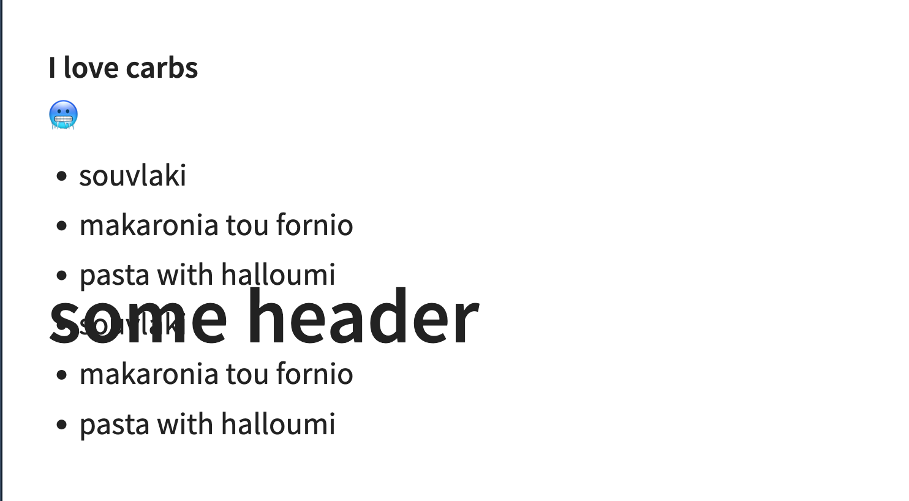
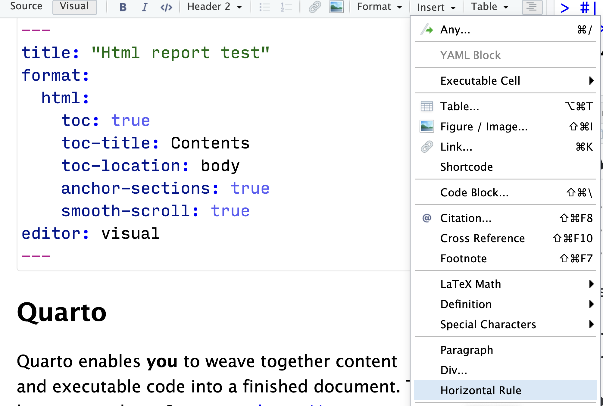
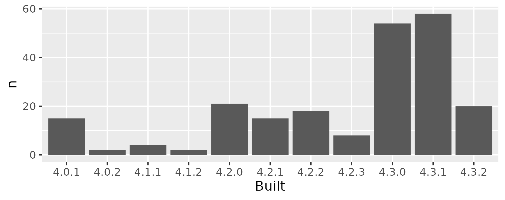

Teaching can be extremely rewarding.
I love teaching coding and programming, and helping scientists unlock a new way of working.
But while most learners go into my workshops think they will be completely on the receiving end, 
I know that I will also learn something new from them.
This, I think, is the beauty of teaching.

## Digital Scholarship Days at the Universtity of Oslo

My university hosts an annual event called [Digital Scholarship Days](https://www.ub.uio.no/english/courses-events/events/dsc/2024/digital-scholarship-days/00-mainpage.html), where we showcase digital tools and methods for research.
This is a volunteer effort on the instructor's part, and organised by the University Library.
Its a great way to get to know other researchers, and to learn about new tools and methods.

It is also one of those events I make sure I have time for both for instructing, but also to attend. 
I always learn something new, and I get to meet new people.

This year, I did two workshops:

- [Quartaki](https://drmowinckels.io/quartaki/) - my introduction to Quarto
- [R Project Management](https://www.capro.dev/workshop_rproj/) - (heavily) based on the [WTF workshop](https://github.com/rstats-wtf/wtf-workshop)

This short post is just some small notes to myself, and maybe others, about what the learners taught me about the things I was teaching them.

## Quartaki

### When your slides superimpose on eachother

I make _alot_ of slides in Quarto (and in Xaringan before that), and somehow I never managed to toggle this very very fun thing before.
Once we understood **why** it was happening, which wasn't my discovery, we had a good laugh about it, and the world made sense to me again.

Basically what we experiences was that this qmd text

```
# some header

#### I love carbs

🥶

-   souvlaki
-   makaronia tou fornio
-   pasta with halloumi

-   souvlaki
-   makaronia tou fornio
-   pasta with halloumi

```

produced a slide looking like this:



In the stress and responsibility of hosting a workshop, I could not get my head calm enough to see what was happening. 
But my learners payed more attention to what I was saying than myself, and one noted that level three headings (`###`) do no toggle new slides.
And then I could understand.

The level 1 heading for this css, places the heading in the middle of the slide, vertically, and as such, it will superimpose on the remaining content of the slide.
And there **is** more slide content, because the level three heading is not triggering another slide.

So, then it made perfect sense to me that I would not have experienced this myself.
I'm so comfortable making slides like this, that I naturally know that I need to add a level 2 heading or a horizontal rule to trigger a new slide.
With this information clear to me, I could also explain it to the learners, and we all were happy understanding more.
We added a horizontal rule and all was well.


```
# some header

---

#### I love carbs

🥶

-   souvlaki
-   makaronia tou fornio
-   pasta with halloumi

-   souvlaki
-   makaronia tou fornio
-   pasta with halloumi

```

### Horizontal rule or horizontal line?

So, when you have a whole line that spans an entire page in HTML, we call that a "Horizontal Rule", and its made by the HTML `<hr>` tag. 
Quarto rendering markdown, obviously also supports this, but what is it called?

After giving my learner's an exercise to add a horizontal rule to their slides, I got a question about what this was. 
Some finished within minutes, others' could not locate it at all.
And what determined the difference between these two groups?
One group was using the "insert" button in the RStudio IDE, the other were adding through the visual editors `/` shortcut that I had just shown them.


Adding horizontal rule through insert


Adding horizontal line through `/`

So what's its name? I made an [issue](https://github.com/quarto-dev/quarto/issues/350) in a Quarto repo, so I guess the developers will figure it out.
Consistency is key!


## Project Management

### Why does IT do this to us?

This is maybe not so much my learner's teaching me, but about IT making my teaching life harder.

So, there I am, talking about the do's and dont's of naming files and folder.

> "Don't use spaces in your file names, because it will make your life harder".

And there they are, on institutional computers, where IT creates folder for them that have spaces in them. 
Thanks, dudes. That's not helping me.

Obviously, my first thing is I jot this down to have a stern talking to IT later.
I don't know why they do this, it's not the first time, and likely not the last either. 
I try not to be a jerk about this, but this seriously makes me real miffed. 
I'm trying to teach people good IT practices, and then IT comes along and just ignores those.

Now, our IT has some awesome people and they do do some great stuff for us. 
I just think they forget that among the University as a whole, there are a lot of us using complex tools and programming to solve our scientific questions. 
Its a balance between making a system that works for us **and** the people who just need to write a paper in Word.

Anyway, e-mail to IT sent. Let's see what they say.


Coincidentally, Heidi Seibold wrote something about this on mastodon just a couple of days after this, which was lovely and validating to me.

<iframe src="https://fosstodon.org/@HeidiSeibold/111725444131565682>/embed" class="mastodon-embed" style="max-width: 100%; border: 0" width="400" height="400" allowfullscreen="allowfullscreen"></iframe>


### How many versions of R?

Anyone working on an institutional computer with networked drives, or shared spaces, likely also know that they will mess around with some of your R settings.
Some for good, some for good reasons but maybe not great for your work.

One of those things is setting up so-called `site` files for Rprofile and Renviron.
These make sense they do something with, good specified site files lift a heavy burden off users when circumstances call for them. 

Problems usually arise because IT don't themselves use R, so they have limited knowledge and experience about how people work in R and what are good things to do. 
So what I discovered in the workshop, was that on one of our shared project spaces, we had 5(!) R library paths at various levels. 
Maybe necessary, but likely not.
One of the paths was there, but completely empty, and therefore unnecessary.

And then, I discover the most fun part.
Exploring the R libraries and packages installed, I discovered that the packages I had access to in these various site folders, had been compiled across 11(!) different R versions!



I mean, sure, they're all same major version (R forces clean library at major releases), and its totally possible to have it like this.
But it is also a bit of a mess, and I'm not sure how it happened.

Another e-mail off it goes!


## Conclusion

So, teaching is awesome, and they are not the only ones learning!
That being said, it is also exhausting and I'm glad I don't do it all the time.
My voice is hoarse and energy levels are low, but I'm happy I did it.
The learners were so nice, and I think we all had a lovely time together.

