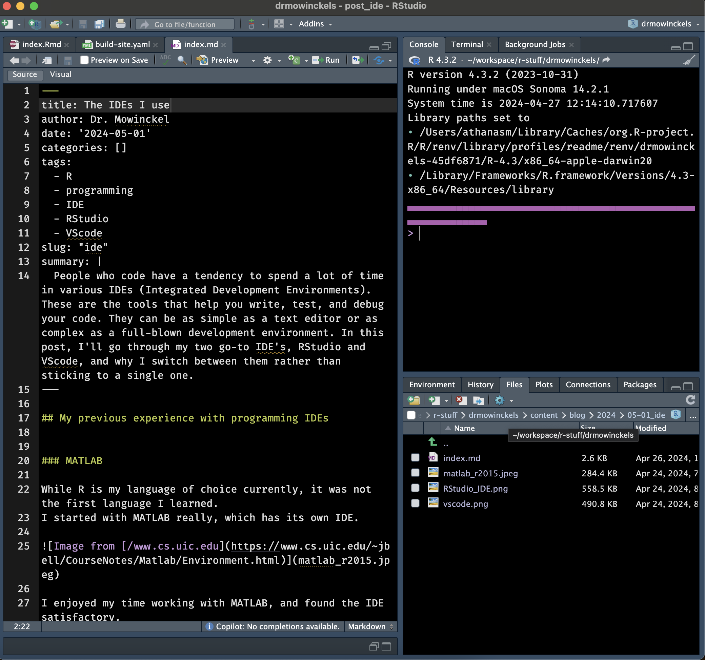
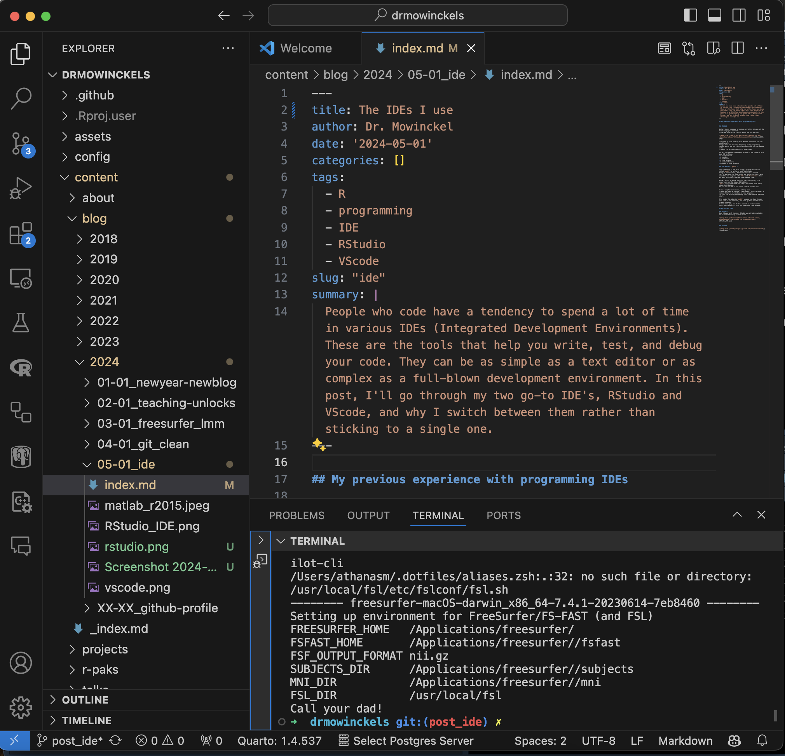

## My previous experience with programming IDEs

I thought it would be nice to start this post with a little history of my experience with IDEs.
Which, to be honest, is not that long, but I have used a few different ones.
I've probably tried several more that I can't even remember much of, but these are the ones that have stuck with me.

### MATLAB

While R is my language of choice currently, it was not the first language I learned.
I started with MATLAB really, which has its own IDE.

](matlab_r2015.jpeg)

I enjoyed my time working with MATLAB, and found the IDE satisfactory.
Though, this was the very beginning of my programming journey and I did not really have any other IDE to compare it to.
It had a lot of functionality I never used.

But all the general components of what I now found to be a good IDE is there: - A script editor - A console - A workspace - A file browser - A command history - Windows to view graphics

### GNU editor (`gedit`)

Simultaneously, I was also using a simple text editor called `gedit` to write my bash shell code.
Being in neuroscience, MATLAB was not all I needed.
Yes, it was good for some stats and plots etc, but I also needed to run programs like `FSL` and `Freesurfer` which are most efficiently called from command line.

While I still do quite a bit of shell scripting, I no longer rely on the simple GNU editor.
`gedit` is nice because its simple and comes with every Linux distribution.
But its not an IDE in the sense I think of IDEs now.

It is a simple text editor, nothing else.
It does not have a console, a workspace, a file browser, a command history, or windows to view graphics.
Its just for writing and saving text, that can be executed later.

It's harder to debug in `gedit` because you have to run your code in the terminal, and then go back to the editor to make changes.
It does it's job, and I still revert to it for simple stuff, but generally, it's not something I do anymore.

-   A script editor

### vi / vim

I also used `vi` and `vim` quite a bit.
Mostly not on purpose, but because that's what you get when you log into a server without a GUI.
I never really got the hang of it, and I still don't.
At this moment, I know the keystrokes for saving, closing and searching in vim, and that's about it.
To be honest, that does get you most of the way, but it is a rather tedious bit of software to use, in my opinion.
I know some people swear by it, but I'm not one of them.

It's especially the whole workflow of it that bothers me.
Since its a console IDE, it means that there's this continuous open vi, do edits, save, exit, try, repeat.
There's no console to run your code in, no workspace to keep track of your variables, no file browser to navigate your project, no command history to see what you've done before, and no windows to view graphics.
It's just a text editor, and a very powerful one at that, but it's not an IDE in how I think of it.

-   A script editor

## My current preferred IDEs

Ok, so at this point I have a bit more experience coding and working full-time with code.
That means I also get to have opinions on what is the most efficient way for me to work.

### RStudio

When I began my R journey, RStudio was already available and I have been using it ever since.
In the beginning, coming from MATLAB, I found it to be a very similar environment.
It was easy enough to navigate and had all the components I needed.
Workspace, console, script editor, file browser, command history, and windows to view graphics, and more.
I could re-arrange windows to how I'd like them (mostly), and I could customize the appearance to my liking, and since its open source there are also addins people make that can be very useful.

RStudio is still my go-to IDE, and I use it for most of my R coding.
In particular, it is completely unbeaten when it comes to working on an R-package.
The integration of devtools and usethis, and so many development tools, makes it a breeze to work on packages.
It has lots of lovely keystroke shortcuts to make your life easier while developing.

In fact, even as I was progressing in learning more languages, like js, css, html and hugo, I still used RStudio, and it was still good.
Not as good as for R, but still good.

-   A script editor
-   A console
-   A workspace
-   A file browser
-   A command history
-   Windows to view graphics

### VScode

I got introduced to vscode around 2019, and I have been using it more and more since then.
I started using it mostly because of the developers I work with, who are not R users.
Most of them are work in shell and python, with some make and other tools.
RStudio is not the best for these languages (good support for python now, though), and I saw how great vscode was working for them.

I started using it for my non-R projects, and I found it to be very good.
It was somewhat daunting, because it has so many features.
To be honest, I still somewhat find the amount of features and extensions to be a bit overwhelming.
Choosing the right ones, setting them up, customizing keystrokes etc.
Like, you can make vscode be exactly what you need it to be, but you have to put in the work to get there.
The majority of the functionality comes through the extensions, so that is really what needs to be done to make it work for you.

Through those, depending on language, you can get syntax highlighting, code completion, linting, debugging, and more.
You can also get git integration, terminal, and a lot of other things that are not language specific.
The file browser is excellent, and it's git integration is one of the main reasons I use it even for certain R projects.
It highlights what is changed, if its edited, deleted, added, conflicting etc.
Its so excellent and intuitive.

-   A script editor
-   A console
-   A workspace
-   A file browser
-   A command history
-   Windows to view graphics

## Comparison

| Feature         | RStudio | VScode | MATLAB |  vi  | gedit |
|:----------------|:-------:|:------:|:------:|:----:|:-----:|
| Script editor   |   ✅    |   ✅   |   ✅   |  ✅  |  ✅   |
| Console         |   ✅    |   ✅   |   ✅   |  ❌  |  ❌   |
| Workspace       |   ✅    |   ✅   |   ✅   |  ❌  |  ❌   |
| File browser    |   ✅    |   ✅   |   ✅   |  ❌  |  ✅   |
| Command history |   ✅    |   ✅   |   ✅   |  ❌  |  ❌   |
| View graphics   |   ✅    |   ✅   |   ✅   |  ❌  |  ❌   |
| Git integration |   ✅    |   ✅   |   ✅   |  ❌  |  ❌   |
| Terminal        |   ✅    |   ✅   |   ✅   |  ✅  |  ❌   |
| Customization   |   ✅    |   ✅   |   ✅   |  ✅  |  ✅   |
| Extensions      |   ✅    |   ✅   |   ✅   |  ❌  |  ❌   |
| Linting         |   ✅    |   ✅   |   ✅   |  ❌  |  ❌   |
| Code completion |   ✅    |   ✅   |   ✅   |  ❌  |  ❌   |
| Debugging       |   ✅    |   ✅   |   ✅   |  ❌  |  ❌   |
| Multi-language  |   ✅    |   ✅   |   ❌   |  ✅  | ✅ |
| Open source     |   ✅    |   ✅   |   ❌   |  ✅  |  ✅   |
| Free            |   ✅    |   ✅   |   ❌   |  ✅  |  ✅   |
| Cross-platform  |   ✅    |   ✅   |   ✅   |  ✅  |  ✅   |
| Learning curve  |   Low   | Medium |  Low   | High |  Low  |

It's difficult to make a hard comparison between all, and provide a definitive answers on WHY I like one over the over.
I think a lot of this in personal preference, and what you are used to.
I think the best way to find out what you like is to try them all out, and see what works for you.
I m just giving my points of view on it, and maybe it can help you think through what you like and why.

One thing I can say, is that I find the file browser in vscode to be the best of all.
It's so intuitive and easy to use.
The fact that is shows the file tree, rather than jumps between folders is a big plus for me.
It makes it easier to jump between files and folders, and I find it to be a big time saver.
It also helps me get a better overview of the project I'm working on.
The fact that the file browser is integrated with git, and highlights changes, is also a big plus for me.
The fact that it happens in the same place, makes it much simpler and intuitive to use than the one in RStudio.

Since RStudio does not show the file tree, I often find myself using the terminal to navigate between files and folders.
While I like the terminal, I find it to be a bit cumbersome to use for this purpose.
There is also a specific git pane in RStudio, but I've never liked how it worked. 
I much prefer git in the terminal than RStudio's git pane.

## When do I use which and why

### R

RStudio is my go-to for anything R-related.
It's just so good for that.
While I do some times use vscode for R, it's mostly if I'm in environments or projects where vscode is better integrated or multi-lingual.

I also need to mention here, that I am an avid user of the terminal pane in RStudio.
I use it for running shell commands, git commands, and hugo servers, among other things.
I know most RStudio users will use the built in tools in RStudio for these things, but my personal preference (due to my familiarity with the terminal) is to rather do these operations through the terminal.

### git conflicts and other git issues

However, if I get git conflicts etc, I will have a vscode window open in the same project, and resolve the issues in vscode.
Its just so much better for that, in my opinion.
As I mentioned, it highlights changed files and conflicted files in very intuitive ways.
Additionally, it has super convenient ways to accept incoming or current changes, rather than manually finding all of the `>>>> HEAD` instances and fix things.

### hugo

Now, depending on the hugo projects, I use either!
For hugo projects I have that create website content with Rmarkdown, I use RStudio.
For projects that do not have Rmarkdown, I use vscode.
I could easily use RStudio for both, but again, vscode just has so many extensions and great features, its lovely to work in.
And again, the file explorer is superior to RStudio, in my opinion.

### All other projects and languages

For everything else I use vscode.
It's just so good.
Again, I have not figured out all extensions and customization yet, but I'm getting there.
For instance, I work on a rather large project for work which integrates R, php, SQL, js, css, html, and shell.
It's a massive thing, and I use vscode for it.
It helps me by, through extensions, I can get overview of the SQL database when its populated and queried, I can get linting and code completion for php, js, css, and html, and I can get git integration for all of it.

## End thoughts

There it is, my IDE journey.
While I'm quite happy with where I am now, how about you?
What do you use and why?
Do you have other suggestions for me to give a go?
