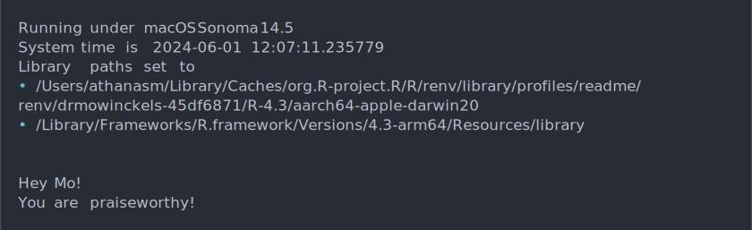
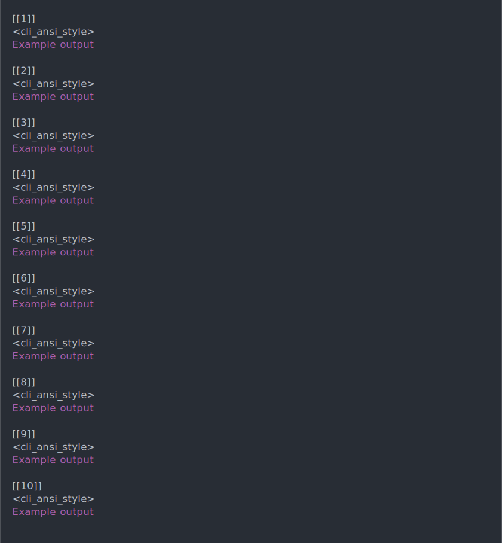
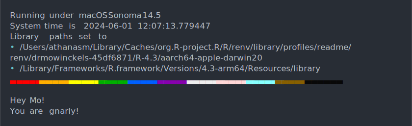

I love customizing things.
I seem to never let anything I work with that can be customized, not be customized.
Colours of the software, websites I work on.
I just like having things the way *I* like having things.

This ofcourse, also extends to R.
The R startup message is just, so much!
And when you have been working with it so long, it's just noise.

I mean, look at this:

``` r
R version 4.3.3 (2024-02-29) -- "Angel Food Cake"
Copyright (C) 2024 The R Foundation for Statistical Computing
Platform: aarch64-apple-darwin20 (64-bit)

R is free software and comes with ABSOLUTELY NO WARRANTY.
You are welcome to redistribute it under certain conditions.
Type 'license()' or 'licence()' for distribution details.

  Natural language support but running in an English locale

R is a collaborative project with many contributors.
Type 'contributors()' for more information and
'citation()' on how to cite R or R packages in publications.

Type 'demo()' for some demos, 'help()' for on-line help, or
'help.start()' for an HTML browser interface to help.
Type 'q()' to quit R.
```

Ok, it's all informative and meaningful information.
You just don't need that information every time, and wouldn't it be fun if we could make it more personal?

I had wanted to do this for a while, but never really got around to it.
Mostly because I tried finding ways of clearing the startup message, but just couldn't figure it out.

Enter Danielle Navarro and her amazingness.
Danielle is amazing in a multitude of ways, I respect and look up to her for so many reasons, coding and not.
She had a post on mastodon with a custom startup message, and I was like, "I need to do that!".

{}

## The user `.Rprofile`

The way to customise this is through the `.Rprofile` file. This file is a script that is run every time you start R.
It can be used to set up your environment, load packages, and do whatever you want to do every time you start R.

> Be cautious!
> Don't load packages in the `.Rprofile` if you want to work reproducibly.
> It's better to load packages in your script, so it's transparent to anyone wanting to run it what it need.

If you've used R a while, you have likely already tampered a little with this file.
Most commonly, we use it to set the default CRAN mirror, or to set the default options for R with the `options()` function.

There are two `.Rprofile` files you can use.
One is in your home directory, and one is in the R project directory.
The one in your home directory is the one you should use for anything you want to always apply to your R session.
The project `.Rprofile` is for things you want to apply only to that project.

> Note! If you have a project Rprofile, the home Rprofile will not be executed.
> This is to avoid conflicts between the two.
> There are ways around this, but I'm not going to recommend them here.
> Mostly because it's an advanced thing and you aught to have a good reason for doing it.

You can access these files easily with the {usethis} package.

``` r
# default opens user profile
usethis::edit_r_profile()

# opens the project profile
usethis::edit_r_profile(scope = "project")
```

## The common problem - CRAN mirror

For instance, in my `.Rprofile` I set not only CRAN mirror, but also the `ggseg` and `lcbc` repositories, from the [R-universe](https://ggseg.r-universe.dev/builds) which contain important packages for me that don't exist on CRAN.
Those settings can be set with the `options` function in R, in the `repos` argument.

``` r
# Set the default CRAN mirror
options(
  repos = c(
    ggseg = 'https://ggseg.r-universe.dev',
    lcbc = 'https://lcbc-uio.r-universe.dev',
    CRAN = "https://cloud.r-project.org/"
  )
)
```

Having this set means I don't have to set the repositories every time I install a package.
I can just use `install.packages` and it will know where to look.
It will look for the package I ask for in the order the repositories are listed.
Which is super convenient, and saves me a lot of time.

## Your daily praise.

But that was not the fun customisation I was talking about. That was just a useful customisation.

Let us maybe have a little praise every time we start R!
Days can be long and hard, and a little praise can go a long way.

We can do this with the {praise} package.
The {praise} package contains a list of praises that you can use to get a random praise every time you run the function `praise()`.

``` r
praise::praise()
```

    [1] "You are sublime!"

See? Isn't that nice? And it will be a different phrase every time you start R, it's a nice little boost.

To make this happen, we can add the following code to our `.Rprofile` file.

``` r
if("paise" %in% utils::installed.packages()){
  cat(
    "\nHey Mo!",
    praise::praise(),
    sep = "\n"
  )
}
```

There is a little to unpack in this code.
Firstly, we check if the package `praise` is installed.
I do this because R will error on startup if it is not and we don't want that.
So if you are doing this on a new computer etc, you will need to install the package first to actually get your little piece of daily praise.

We then use the `cat` function to print out the praise.
Because we want it to print in the console, not be returned as a value `## [1] "praise"`.
We use the `sep` argument to separate the praise from the "Hey Mo!" string, and we want it to be a new line, which is indicated with the `\n` character.

That is our first piece of fun customisation!
But that will still print the normal startup message, and then append our own praise at the end.

``` r
R version 4.3.3 (2024-02-29) -- "Angel Food Cake"
Copyright (C) 2024 The R Foundation for Statistical Computing
Platform: aarch64-apple-darwin20 (64-bit)

R is free software and comes with ABSOLUTELY NO WARRANTY.
You are welcome to redistribute it under certain conditions.
Type 'license()' or 'licence()' for distribution details.

  Natural language support but running in an English locale

R is a collaborative project with many contributors.
Type 'contributors()' for more information and
'citation()' on how to cite R or R packages in publications.

Type 'demo()' for some demos, 'help()' for on-line help, or
'help.start()' for an HTML browser interface to help.
Type 'q()' to quit R.

Hey Mo!
You are awesome!
```

## Clearing the console

We need a bit of code that clears the console before we print our praise.
This will remove the old message before printing the new one.

``` r
# Clear if running in terminal
system2("clear")
# Clear if running in RStudio
cat("\014")
```

Here we have two different ways to clear the console, because I interact with R in several ways.
I use RStudio, but I also use the terminal (and vscode), and I want the console to be cleared in both cases.
These two lines of code will clear the console in both cases.

## Print some system information

Now that we have cleared the console, we can print some system information.
This information is useful to have, and it's nice to see it every time you start R.
It can be useful to know what version of R you are running, what operating system you are on, and what time it is.
This can be useful for debugging, and it's just nice to know.

To do this, I'm going to use the {cli} package, which can print nice colours, bullet points and all sorts of fun things!

``` r
if("cli" %in% utils::installed.packages()){
  cli::cli_text(R.version.string)
  cli::cli_text("Running under {utils::osVersion}")
  cli::cli_text("System time is {Sys.time()}")
}
```


As with praise, we start with checking if the package is installed.
Just to be sure we don't get an error on startup.

Then we'll print the R version, the operating system version, and the system time.

Now that we have some meaningful system information, I also like to print my library paths as shown in the `.libPaths()` function.
This is useful to know where your packages are installed.
In particular, this will also help expose if you are in an {renv} project, as the library paths will be different.

``` r
# Exposes where library paths are set to
.libPaths()
```

    [1] "/Users/athanasm/Library/Caches/org.R-project.R/R/renv/library/profiles/readme/renv/drmowinckels-45df6871/R-4.3/aarch64-apple-darwin20"
    [2] "/Library/Frameworks/R.framework/Versions/4.3-arm64/Resources/library"                                                                 

Now that we know where out libraries are set to, we can print this information in a nice way using the {cli} package, with `cli_bullets`.

``` r
cli::cli_bullets(.libPaths())
```


Now, I can keep it to that, but I'm gonna over-think it.
I want my bullets to actually start with bullets!
In {cli} we can accomplish this having each element in the vector have an asterisk as its name.
This will make the bullets appear as bullets in the console.
To accomplish this, I'm going to use the `setNames` function from the {stats} package.

``` r
stats::setNames(.libPaths(),
                  rep("*", length(.libPaths())
                  ))
```

                                                                                                                                          * 
    "/Users/athanasm/Library/Caches/org.R-project.R/R/renv/library/profiles/readme/renv/drmowinckels-45df6871/R-4.3/aarch64-apple-darwin20" 
                                                                                                                                          * 
                                                                     "/Library/Frameworks/R.framework/Versions/4.3-arm64/Resources/library" 

Now that we have all the pieces, we can feed them to cli_bullets.

``` r
cli::cli_bullets(
  stats::setNames(.libPaths(),
                  rep("*", length(.libPaths())
                  )))
```


Now we have a nice list of library paths, with bullets, in the console.
Let's put all we have for now together in our `.Rprofile` file.

``` r
system2("clear")
cat("\014")
```

``` r
instl <- utils::installed.packages()
if("cli" %in% instl){
  cli::cli_text(R.version.string)
  cli::cli_text("Running under {utils::osVersion}")
  cli::cli_text("System time is {Sys.time()}")
  cli::cli_text("Library paths set to")
  cli::cli_bullets(
    stats::setNames(
      .libPaths(),
      rep("*", length(.libPaths())
      )))
} # end if cli installed

cat("\n")
if("praise" %in% instl){
  cat(
    "\nHey Mo!",
    praise::praise(),
    sep = "\n"
  )
} # end if praise installed
```



## A colour bar, because we can!

The last bits of magic in my profile are a colour bar.
My colourbar is R-Ladies purple, except for June, when its rainbow pride colours.
It just makes my Pride month happier to see a rainbow in my console.

But getting there is a little chore!
Let us start with the single colour purple bar, then expand to the pride bar later.
We first make a vector of 10 purple colours.

``` r
colour <- rep("#88398a", 10)
colour
```

     [1] "#88398a" "#88398a" "#88398a" "#88398a" "#88398a" "#88398a" "#88398a"
     [8] "#88398a" "#88398a" "#88398a"

Now, we have to do some fancy work to make this into a colour bar.
We have to convert the hex colours to ANSI colours.
This is done using the `cli::make_ansi_style` function.
We can use `sapply` to apply this function to each element in the vector.
If you don't know about the `apply` functions, then [I have a post on that](blog/2022/lets-get-applying).
In short, its a type of loop, that applies the same function to all values of a vector.

``` r
colour <- rep("#88398a", 10)
lapply(colour, cli::make_ansi_style) 
```



Now we have a vector of ANSI colours, next we need to apply them to a character.
To make a colourbar, I'm going to use the ANSI character for 'LOWER THREE EIGHTHS BLOCK', which is a thick underscore, and I'm going to make it 6 characters long for each colour.

``` r
rep("\u2583", 6)
```

    [1] "▃" "▃" "▃" "▃" "▃" "▃"

To make a single line colour bar, we can use `paste0` to paste the colour and the block together.
We can use `collapse = ""` to make it a single string.

``` r
thick_bar <- paste0(rep("\u2583", 6), collapse = "")
thick_bar
```

    [1] "▃▃▃▃▃▃"

Here is the true tricky part.
The ansi-colour style we have is actually a list of functions that can be applied to a string.

``` r
thick_bar <- paste0(rep("\u2583", 6), collapse = "")
style <- cli::make_ansi_style("#88398a") 
style(thick_bar)
```


Lastly, we need to `cat` this again, to print it nicely to the console.

``` r
thick_bar <- paste0(rep("\u2583", 6), collapse = "")
style <- cli::make_ansi_style("#88398a") 
cat(style(thick_bar))
```


Now, since we want a longer bar, we need to apply across all the 10 colours specified.

``` r
thick_bar <- paste0(rep("\u2583", 6), collapse = "")
colour <- rep("#88398a", 10)
lapply(colour, cli::make_ansi_style) |>
  lapply(\(x){
    cat(x(thick_bar))
  })
```


The colourbar looks great. But all those NULLs, Ack!
We can use `invisible` to suppress the output of the `cat` function.

``` r
thick_bar <- paste0(rep("\u2583", 6), collapse = "")
colour <- rep("#88398a", 10)

invisible(
  lapply(colour, cli::make_ansi_style) |>
    lapply(\(x){
      cat(x(thick_bar))
    })
)
```


Now we have a nice purple colour bar.
We are going to make the pride bar now.
We need to make a vector of the pride colours.
I'm going to use the hex codes for the pride flag colours.

``` r
thick_bar <- paste0(rep("\u2583", 6), collapse = "")
colour <- c("#e50000", "#ff8d00", "#ffee00",
                    "#028121", "#004cff", "#770088",
                    "#ffffff", "#ffafc7", "#73D7EE",
                    "#613915", "#000000")
invisible(
  lapply(colour, cli::make_ansi_style) |>
    lapply(\(x){
      cat(x(thick_bar))
    })
)
```


Now, we need something that will detect that we are in the month of June, so we can toggle the pride colours rather than the purple.

The `Sys.Date()` function will give us the current date, and we can discern that its June by looking for "-06-" in the date.
We can use this logic in the `grepl` function, which will return `TRUE` if the pattern is found in the string.

``` r
Sys.Date() 
```

    [1] "2024-06-01"

``` r
grepl("-06-", Sys.Date() )
```

    [1] TRUE

Putting it all together as chunk together, we get a piece of code that will create our custom colourbar.

``` r
thick_bar <- paste0(rep("\u2583", 6), collapse = "")
colour <- rep("#88398a", 10)
if(grepl("-06-", Sys.Date() )){
  colour <- c("#e50000", "#ff8d00", "#ffee00",
              "#028121", "#004cff", "#770088",
              "#ffffff", "#ffafc7", "#73D7EE",
              "#613915", "#000000")
}
invisible(
  lapply(colour, cli::make_ansi_style) |>
    lapply(\(x){
      cat(x(thick_bar))
    })
)
```


Alrighty!
We now have can make a file that:

1.  Clears the console
2.  Prints system info in a nice consise way
3.  Prints a fun colourbar
4.  Gives a random praise

``` r
if(interactive()){
  system2("clear")
  cat("\014")
  instl <- utils::installed.packages()
  if("cli" %in% instl){
    cli::cli_text(R.version.string)
    cli::cli_text("Running under {utils::osVersion}")
    cli::cli_text("System time is {Sys.time()}")
    cli::cli_text("Library paths set to")
    cli::cli_bullets(
      stats::setNames(.libPaths(),
                      rep("*", length(.libPaths())
                      )))
    thick_bar <- paste0(rep("\u2583", 6), collapse = "")
    (function(){
      colour <- rep("#88398a", 10)
      if(grepl("-06-", Sys.Date() )){
        colour <- c("#e50000", "#ff8d00", "#ffee00",
                    "#028121", "#004cff", "#770088",
                    "#ffffff", "#ffafc7", "#73D7EE",
                    "#613915", "#000000")
      }
      invisible(
        lapply(colour, cli::make_ansi_style) |>
          lapply(\(x){
            cat(x(thick_bar))
          })
      )
    })()
  }
  cat("\n")
  if("praise" %in% instl){
    cat(
      "\nHey Mo!",
      praise::praise(),
      sep = "\n"
    )
  }
  rm(instl, thick_bar, colour)
}
```

``` r
instl <- utils::installed.packages()
if("cli" %in% instl){
  cli::cli_text(R.version.string)
  cli::cli_text("Running under {utils::osVersion}")
  cli::cli_text("System time is {Sys.time()}")
  cli::cli_text("Library paths set to")
  cli::cli_bullets(
    stats::setNames(.libPaths(),
                    rep("*", length(.libPaths())
                    )))
  thick_bar <- paste0(rep("\u2583", 6), collapse = "")
  (function(){
    colour <- rep("#88398a", 10)
    if(grepl("-06-", Sys.Date() )){
      colour <- c("#e50000", "#ff8d00", "#ffee00",
                  "#028121", "#004cff", "#770088",
                  "#ffffff", "#ffafc7", "#73D7EE",
                  "#613915", "#000000")
    }
    invisible(
      lapply(colour, cli::make_ansi_style) |>
        lapply(\(x){
          cat(x(thick_bar))
        })
    )
  })()
}
cat("\n")
if("praise" %in% instl){
  cat(
    "\nHey Mo!",
    praise::praise(),
    sep = "\n"
  )
}
```



There you have it!
The piece of (rather long) code that customised my R startup to something shorter, more informative and also that makes me smile every time.

Do you customise your startup in any way, or put anything in particular in your `.Rprofile`?
