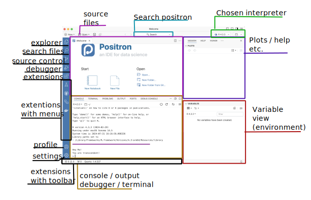
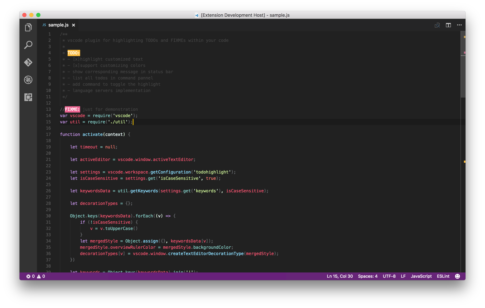

[Positron](https://github.com/posit-dev/positron?tab=readme-ov-file) is a clone of Visual Studio Code (VScode), but tweaks for data science.
I think this was a smart move by Posit's team.
VScode is a great IDE, and it's free, open-source, and cross-platform, and it has so many developers on board already, and has an extensive library of extensions.
Many of these extensions are also available to Positron, which is a huge advantage!

## Comparison

I'm going to start where I ended the last post, with a comparison of my favorite IDE's, adding Positron to the first column.
Positron has all the features I'm after, and as you can see, it ticks all the boxes just like RStudio and VScode do.
But just like VScode, it has a bit of a learning curve.

| Feature         | Positron | RStudio | VScode | MATLAB |  vi  | gedit |
|:----------------|:--------:|:-------:|:------:|:------:|:----:|:-----:|
| Script editor   |    ✅    |   ✅    |   ✅   |   ✅   |  ✅  |  ✅   |
| Console         |    ✅    |   ✅    |   ✅   |   ✅   |  ❌  |  ❌   |
| Workspace       |    ✅    |   ✅    |   ✅   |   ✅   |  ❌  |  ❌   |
| Variable view   |    ✅    |   ✅    |   ❌   |   ✅   |  ❌  |  ❌   |
| File browser    |    ✅    |   ✅    |   ✅   |   ✅   |  ❌  |  ✅   |
| Command history |    ✅    |   ✅    |   ✅   |   ✅   |  ❌  |  ❌   |
| View graphics   |    ✅    |   ✅    |   ✅   |   ✅   |  ❌  |  ❌   |
| Git integration |    ✅    |   ✅    |   ✅   |   ✅   |  ❌  |  ❌   |
| Terminal        |    ✅    |   ✅    |   ✅   |   ✅   |  ✅  |  ❌   |
| Customization   |    ✅    |   ✅    |   ✅   |   ✅   |  ✅  |  ✅   |
| Extensions      |    ✅    |   ✅    |   ✅   |   ✅   |  ❌  |  ❌   |
| Linting         |    ✅    |   ✅    |   ✅   |   ✅   |  ❌  |  ❌   |
| Code completion |    ✅    |   ✅    |   ✅   |   ✅   |  ❌  |  ❌   |
| Debugging       |    ✅    |   ✅    |   ✅   |   ✅   |  ❌  |  ❌   |
| Multi-language  |    ✅    |   ✅    |   ✅   |   ❌   |  ✅  |  ✅   |
| Open source     |    ✅    |   ✅    |   ✅   |   ❌   |  ✅  |  ✅   |
| Free            |    ✅    |   ✅    |   ✅   |   ❌   |  ✅  |  ✅   |
| Cross-platform  |    ✅    |   ✅    |   ✅   |   ✅   |  ✅  |  ✅   |
| Learning curve  |  Medium  |   Low   | Medium |  Low   | High |  Low  |

The learning curve really mostly comes from the way to customise it to work the way *you* want it to work.
If you are coming from Vscode, and do a lot of data science, Positron is *much better*, in my opinion.
Seeing a proper workspace with variables, plotting and console in one window is a game-changer.

If you are coming from RStudio, you might find it a bit harder to get used to.
That comes mostly from the fact that things need to be customised in Positron, while in RStudio things are more or less set up for you.
This is both good and bad, and kind of depends on what you are after.

I think RStudio is more beginner friendly if you are starting out with R, and want to just get into it.
But, if you are in a multi-lingual environment and want to use the same IDE for all your coding, Positron may be the way to go.

## Quick Overview of Positron

Let's get an idea of the default setup of Positron.
There are a lot of similarities to RStudio, in that its divided into various quadrants.
But it is arranged differently than RStudio, which makes sense since it is, afterall, something else.
The default setup is as follows:



Anyone who has used VScode will notice how similar it is, but with a couple of changes.
Now we also have an environment pane, and plots pane etc, things that make it easier to work with data and visualization.
Really, really nice. 
It also has a specific place at the top right where you choose your interpreter.
Since it's made for polyglots and data science in general, it's super nice for it to actually search through your system and detect what you have installed and give you the option to choose what you want to use.

Let us have a look at what it looks like when you have a file and project open, and have run some code.


As you can see, we have everything we want to see all in one place.
And you don't have to stick with this setup, you can customise as you want, and add as many quadrants as you want!
No seriously, I've had a colleagues (in VScode) have about 10 different quadrants open at the same time.
Each giving us overview of various project elements.
Super convenient (if your screen is large enough!).

In addition to this, one major difference from VSCode is that you can easily crtl+enter to run a line of code, just like in RStudio.
This was a thing I never really got working in VScode and it drove me nuts.
But in Positron, it works like a charm.
Truly, it's a much easier IDE for data science out-of-the-box than VScode, in my opinion.

## Making Positron work for you

Firstly, you might want to have a peak at the [documentation](https://github.com/posit-dev/positron/wiki), which has some excellent information on how to get started.
I'll go through some of the things I've done to make Positron work for me.

### Extensions

With all the possible extensions, you can also make sure it works the way *you* want it to work.
*Most* of the extensions for VScode work in Positron, but not all.
It all depends if the developer of the extension also made it available on [Open VSX](https://open-vsx.org/). 
I'll go through some of the extensions I'm using.

#### [Raindbow CSV](https://open-vsx.org/extension/mechatroner/rainbow-csv)

This extension is great for viewing CSV files in a more readable way.
It is a must have extensions for anyone who works with CSV files.
It's a great way to quickly see what's in the file, and it's much easier to read than the default CSV viewer.
Each column's content is colored differently, which makes it easier to read.
Very convenient!


#### [Prettier - Code formatter](https://open-vsx.org/extension/esbenp/prettier-vscode)

This extension is great for formatting your code.
Of course, it's opinionated and whatnot, but it does help!
This won't help with R or Python, you'll need your own linters for that if you don't like how they work out of the box.
But for JavaScript, TypeScript, HTML, CSS, Yaml, etc., it's great!
While I don't use these languages very often, it's great to have when you need it.

#### [TODO Highlight](https://open-vsx.org/extension/wayou/vscode-todo-highlight)

This extension is great for highlighting TODO and FIXME in your code.
While I don't often add this to my code, I have colleagues that do and it helps me when looking at a project that has this type of setup.



#### [Git Graph](https://open-vsx.org/extension/mhutchie/git-graph)

This extension is great for visualizing your git history.
I don't use it often, but it's great to have when you need it to review what's going on in a project or when you need to you need to backtrace an issue.


#### [Git Actions](https://open-vsx.org/extension/GitHub/vscode-pull-request-github)

This extension is great for working with GitHub Actions.
I like continuous integration with GitHub Actions very much, and this extension makes it easier to see what's going on with your actions.
It helps with syntax highlighting and auto-completion, which is very convenient.
Additionally, you can see the status of your actions in the bottom bar, review the logs and failures, and that makes debugging them so much easier!

#### [GitHub Pull Requests](https://open-vsx.org/extension/GitHub/vscode-pull-request-github)

Another great GitHub integration feature.
This extension makes it easier to work with pull requests.
I always seem to bungle working with PR's locally, and this extension just makes the process so much smoother when I need to do code changes to another person's PR.

### Command Palette / Keybindings / Keystrokes

The command palette is a great way to find commands, and you can also assign keystrokes to them.
We can all agree that it's much easier to use a keystroke than to use the mouse, 
and a good keystroke setup can really make you very much more efficient.

Now, why have I combined all these three things together?
Because, I don't really understand the difference between them and how they are stored.
And when [looking into it](https://github.com/posit-dev/positron/wiki/Keyboard-Shortcuts), I still don't know the difference.
No matter, no matter, I will still show the little changes I've made.
That being said, I've only made two changes, and they are both for rendering quarto documents.
I've made the following changes to the `keybindings.json` file:

``` json
[
    {
        "key": "ctrl+cmd+k",
        "command": "quarto.renderDocument"
    },
    {
        "key": "shift+cmd+k",
        "command": "-quarto.preview",
        "when": "!quartoRenderScriptActive"
    }
]
```

In this case, I've made a change to the standard keybindings for rending quarto, which also creates a preview of the document.
I don't want to default to also starting up a server to preview quarto changes.
Now, most people will like this as the default, but given my work with Hugo websites, it's just not for me.
I usually have my hugo server running, and want to see the rendered website, not the rendered stand-alone document.

You can also access the command palette from the bottom left corner, where you have the option to edit keystrokes directly.
You can search terms and edit as you like.

 

Be aware though!
One of VScode's (and therefore Positron's) gotcha's is its many keybindings.
You will very likely quickly run into issues with overwriting existing keybindings.

### Profiles

Now, the last thing I will mention is the profiles.
For those of us with _opinions_ and very idiosyncratic ways of working, this is a great feature.
You can create different profiles for different projects, and have different settings for each.


Why do I love profiles so much, I can just customize RStudio to exactly what I want?
True, but when I need to switch to the default setup when teaching, I need to _redo all my settings for one day_ and re-apply them later.
I've always found that super annoying.

Novice learners get easily confused when they have a different setup than the instructor.
Having something that can easily switch between a default teaching profile and my preferred working profile is really such a game changer!

Now, this all only really applies if I ever decide to start teaching with Positron rather than RStudio.
Right now, that is not going to happen.
Since I mainly teach novice R users, I think RStudio is very much the most beginner friendly.
Also, Positron is still in beta, so switching to it for teaching is quite premature.

That being said, I think it does have a lot of potential, and I'm excited to see where it goes.
And I'm quite certain it will become my preferred IDE over time.

## When does Positron not work for me?

As I've said, I'm on long term sick leave, so my testing has not been super extensive.
There are a couple of things I have noticed though, that I'd like to point out.

### Rmd rendering

But I have found that working with `Rmd` files is not as smooth as I would like.
Positron will use Quarto to render `Rmd` files, which is not as great at it as you would think. 
There is front matter differences and it's not been the greatest.
If you need an excuse to switch all your `Rmd` to `qmd`, starting to use Positron might give you a kick in the right direction.

### Hugo websites (blogdown)

For me, it has not yet managed to get to a point where I am very fond of using Positron for my Hugo website projects.
Mainly because of `qmd` files also starting a server when knitting them, and I really don't want that.
My keybinding changes noted above are a workaround for this, but it's not really doing it for me yet.
I'm sure I'll figure it out over time, but right now, its not the best for that.

And if you are using blogdown, that does not integrate with Positron.
So you will need to alter the way you work with hugo websites if you want to use Positron.
[I don't use blogdown](/blog/2020/changing-you-blogdown-workflow/), so this is not a problem for me, but it might be for you.

### RStudio projects and the {here}-package

The second this just not working for me are all my RStudio projects.
Not that things don't work, but I have all my projects set up with the `{here}`-package, 
and Positron does not seem to adhere to this.
Now, Positron uses workspaces, which are fairly similar to RStudio projects.
When you open positron in a folder, your working directory in R is set in that folder.
So far, working with files from that folder is all fine. 

The problem arises if you open a sub-directory of your project,
then {here} will start from that sub-directory, not the main directory of your RStudio project.
This can create some issues depending on how you work and how your project is set up.

That being said, I think there will likely be a way to make magic happen even if this is the case.
We just need to explore more and see what we can do.

## Conclusion

And as mentioned several times, Positron is still in beta, so anyone who is trying it out needs to also have that in mind.
It will have some bugs and issues, and it's not going to be perfect.
But the team developing it are very resposive and seem genuinely happy for feedback and ideas, so I'm absolutely sure it will become a brilliant product.
It's already half way there.

If you want to learn more about Positron, there is a [session](https://reg.conf.posit.co/flow/posit/positconf24/publiccatalog/page/publiccatalog/session/1712707493462001KPj8) at this year's posit::conf about it, and I'm sure it will be very interesting.
You can even attend [virtually](https://posit.co/blog/posit-conf-2024-virtual-experience-registration/) for really good prices (or even free given the right circumstances).

And there are several others who have written about this new IDE already, so you can read more about it from [Appsilon](https://www.appsilon.com/post/introducing-positron), [Andrew Heiss](https://www.andrewheiss.com/blog/2024/07/08/fun-with-positron/), and [InfoWorld](https://www.infoworld.com/article/2510428/maker-of-rstudio-launches-new-r-and-python-ide.html).
There are also lots of [youtube](https://www.youtube.com/results?search_query=positron+IDE) videos already, so you have lots of options to learn more.

Now we need to convince VScode extension developers to make their extensions also published on Open VSX, so we can have all the extensions we need in Positron as well.
What do you think? 
Will you give Positron a go?
