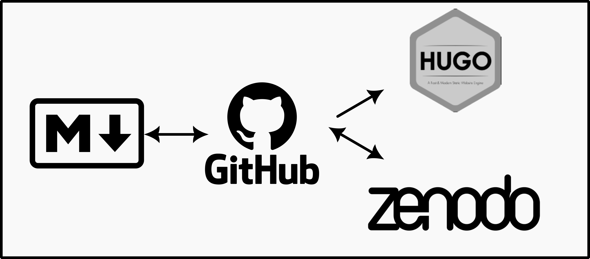

_This post was featured on the [R Weekly highlights podcast](https://serve.podhome.fm/episodepage/r-weekly-highlights/issue-2024-w37-highlights) hosted by Eric Nantz and Mike Thomas._

I have subscribed to [Heidi Seibold](https://heidiseibold.com/)'s newsletter for a good while, she has some really great reflections on data, data literacy, programming and open-science.
Reading her [August newsletter](https://heidiseibold.ck.page/posts/making-my-newsletter-fair) about making it FAIR ((Findable, Accessible, Interoperable, and Reusable)) she it was really an eye-opener about my own content and archiving it.
Reading her [August newsletter](https://heidiseibold.ck.page/posts/making-my-newsletter-fair) about making it FAIR was really an eye-opener about my own content and archiving it.
I know there are old links to my posts that are broken.
I have used Hugo's internal way of making sure this does not happen, but this needs me to actually remember all links I might have used...
I might not have detected all the broken links.
And, I might change my home-page url at some point, and that will be really hard to do anything about.


So, setting up a pipeline for making sure my posts are archived, given a persistent identigier (DOI, digital object identifier), is a way of making sure what I write is actually around even if my website dies.
I prepach about making research as [FAIR](https://faircookbook.elixir-europe.org/content/recipes/introduction/brief-FAIR-principles.html) as possible, so I should really make sure I also do as I say.
Even if it's "just" my own blog.

## Heidi's approach

First, let us just have a quick look at Heidi's setup.

- ​Jekyll website (hosted via GitLab pages), that allows me to write Markdown posts and creates an Atom feed.
- Kit newsletter service that can turn an Atom feed into newsletter posts automatically.
- Add blog to [Rogue Scholar](https://rogue-scholar.org/), an archive for scholarly blogs, which provides long-term archiving, DOIs and metadata.

This is nice an very streamlined, I think.
Now, I'm not making my Newletter FAIR, but my blog, so step 2 we can omit.
It's very easy for me to adapt the remaining to the tools I use myself.

## My approach

The run-down of my approach is

- **Hugo** website (hosted via **GitHub** pages), that allows me to write Markdown posts and creates an RSS feed.
- Run GitHub action that registeres a new post to Zenodo using the Zenodo API, and also adds this DOI to the markdown frontmatter.



There are some reasons my approach ended up differently than Heidi's.
Firstly, since I primarily use GitHub, it made sense staying there.
I never really liked Jekyll, but Hugo does the same purpose for what we are talking about here (mostly).
While Rogue Scholar seems like a very excellent resource, it was not something I could ultimately use unless I changed how my Hugo website creates RSS feeds.
Rogue scholar requires that the _entire content_ of the post is in the RSS feed.
Hugo, by default, will make a minimal RSS feed with just some simple meta-data on title, author, date, link and summary of the content.
While I am fully able to adapt the Hugo template to what Rogue Scholar requires, I did not like this idea.
That RSS feed will just be a monster of a thing, so I descided to explore other avenues.

For this process we are going to need 3 packages: httr2 to access the Zenodo API, yaml to extract metadata for Zenodo from the markdown frontmatter, and Quarto to generate pdf's of the content for archiving.
My first attempts I archived the pure markdown content, but this did not go so well, as it did not display content output etc and looked messy.
While the pdf's are not perfect, they at least contain the most important aspects of the posts in a much better way than did the markdown data alone.

```r
# Connecting to API
library(httr2)

# Dealing with yaml frontmatter
library(yaml)

# Creating pdf for archiving
library(quarto)
```

Now that we have the libraries loaded, we can prepare some information

### Preparing content to archive

Before I continue with describing how to arvhive on Zenodo, we need to prepare the data for archiving.
We need two basic pieces of information:

- post meta-data
- the post itself

In my Hugo setup, I have all my blogposts as page bundles, meaning that every post is stored in an `index.md` within its own directory.
I need to find all these files so I can process them.
The `list.files` function is great for this, and we will use a couple extra arguments to make sure we capture the correct files.

```r
# Read Hugo content files
content_dir <- "content/blog"
posts <- list.files(
  content_dir,
  pattern = "^index\\.md$", # search for index.md
  recursive = TRUE, # Look through all subdirectories
  full.names = TRUE # return the entire path
)
```

The most difficult part here is the pattern matching.
This is something called [regular expression](https://omni.wikiwand.com/en/articles/Regular_expression) (regexp for short) and can be really tricky.
In this case, I'm looking for files inside directories that are called `index.md` and nothing else.
I also have some files called `_index.md` (its a Hugo section file), and these are not blogposts for archiving.
But the regexp is specific enough here that those files will not be listed.

### Extracting metadata from frontmatter

To start off a Zenodo archive, we'll need to have some metadata about what we are archiving.
This metadata we will capture from the yaml frontmatter of the markdown files.

```r
# Select a single post to process
post <- posts[1]
post
```

    [1] "content/blog/2018/04-05-gamm-random-effects/index.md"

```r
# Read in the entire content of the file
post_content <- readLines(post)
```

```r
# Preview the first 20 lines in the file
post_content[1:20]
```

     [1] "---"
     [2] "title: GAMM random effects"
     [3] "author: DrMowinckels"
     [4] "date: '2018-04-05'"
     [5] "output:"
     [6] "  html_document:"
     [7] "    keep_md: yes"
     [8] "tags: [R, GAMM]"
     [9] "image: 'index_files/figure-html/unnamed-chunk-10-1.png'"
    [10] "slug: \"gamm-random-effects\""
    [11] "aliases:"
    [12] "  - '/blog/2018-04-05-gamm-random-effects'"
    [13] "---"
    [14] ""
    [15] ""
    [16] ""
    [17] "I'm working a lot with Generalized Additive Mixed Models (GAMMs) lately, and so, it seems I will be doing a small series on them as we go now. After a little feedback, I did some small alterations to the last post, hopefully it is a little easier to follow, you can read it [here](blog/gamm-spaghetti-plots-in-r-with-ggplot/). "
    [18] ""
    [19] "For this part I'd like to talk about random effects in `mgcv::gamm` as they are a little different from what I am used to from, for instance `lme4` or even a standard GAM."
    [20] ""

Now we will have the entire content of the markdown file stored as a vector of strings in the `post_content` object.
In this object, each line in the markdown file is an element, so we can capture the frontmatter with some more regexp magic.

We need to extract the yaml frontmatter from the markdown file to populate Zenodo with the necessary information it needs.
I used to have a really long, complicated and convoluted way to do this, untill my good friend [Maëlle](https://masalmon.eu/) told me about a _very_ convenient function from the {rmarkdown} package.

```r
# Extract YAML front matter
metadata <- rmarkdown::yaml_front_matter(post)
metadata
```

    $doi
    [1] "10.5281/zenodo.13256615"

    $title
    [1] "GAMM random effects"

    $author
    [1] "DrMowinckels"

    $date
    [1] "2018-04-05"

    $output
    $output$html_document
    $output$html_document$keep_md
    [1] TRUE


    $tags
    [1] "R"    "GAMM"

    $image
    [1] "index_files/figure-html/unnamed-chunk-10-1.png"

    $slug
    [1] "gamm-random-effects"

    $aliases
    [1] "/blog/2018-04-05-gamm-random-effects"

Ok, now we have the majority of the meta-data we need.
The last piece we need is a description of the content.
Zenodo requires this piece of information for a deposition to be valid, so we need to figure something out.

The majority of my post are old, and don't include a summary in the yaml.
This means I need to create a summary for all the old posts!
Now, I am lazy, it's why I program :P

So, I made a piece of code that will detect where the first empty line in the markdown content is, assuming that the first paragraph of my post outlines what the post is about.

The following function will look for this empty line, and return that index so I can use it to create the summary I need.

```r
#' Find line index where first post paragraph ends
#'
#' Looks for the indeces of empty lines surrounding
#' paragraphs. Specifically looking for the index that
#' ends the first paragraph, using this as the post
#' summary for Zenodo meta-data.
#'
#' @param x path to content .md
find_end <- function(x){
  char <- grep("^$", x, invert = TRUE)
  char_lag <- c(char[2:length(char)], NA)
  start_index <- which(abs(char - char_lag) > 1)
  char[start_index[1]]
}
```

Now that we have that, I can use it to grab the first paragraph and add it to the metadata.

```r
if(is.null(metadata$summmary)){
  end_yaml <- grep("---", post_content)[2]+2
  post_summary <- post_content[end_yaml:length(post_content)]
  metadata$summary <- post_summary[1:find_end(post_summary)]
  metadata$summary <- sprintf(
    "Dr. Mowinckel's blog: %s",
    paste0(metadata$summary, collapse = " ")
  )
}
metadata$summary
```

    [1] "Dr. Mowinckel's blog:   I'm working a lot with Generalized Additive Mixed Models (GAMMs) lately, and so, it seems I will be doing a small series on them as we go now. After a little feedback, I did some small alterations to the last post, hopefully it is a little easier to follow, you can read it [here](blog/gamm-spaghetti-plots-in-r-with-ggplot/). "

I believe we have all the meta-data we need to create the deposition, i.e. to initiate an archive on Zenodo.
We will create a list that has all the information Zenodo requires for an archive to be valid.
The following list I created after lots of trial and error, looking at the API documentation and other's code who successfully archived on Zenodo.

```r
# Create Zenodo deposition metadata
zenodo_metadata <- list(
  metadata = list(
    title = metadata$title,
    description = metadata$summary,
    creators = list(list(
      name = "Athanasia Monika Mowinckel",
      orcid = "0000-0002-5756-0223"
    )),
    upload_type = "publication",
    publication_type = "other",
    publication_date = metadata$date,
    url = sprintf("https://drmowinckels.io/blog/%s/%s",
      substr(metadata$date, 1, 4),
      metadata$slug),
    access_right = "open",
    license = "cc-by",
    keywords = metadata$tags,
    language = "eng"
  )
)
zenodo_metadata
```

    $metadata
    $metadata$title
    [1] "GAMM random effects"

    $metadata$description
    [1] "Dr. Mowinckel's blog:   I'm working a lot with Generalized Additive Mixed Models (GAMMs) lately, and so, it seems I will be doing a small series on them as we go now. After a little feedback, I did some small alterations to the last post, hopefully it is a little easier to follow, you can read it [here](blog/gamm-spaghetti-plots-in-r-with-ggplot/). "

    $metadata$creators
    $metadata$creators[[1]]
    $metadata$creators[[1]]$name
    [1] "Athanasia Monika Mowinckel"

    $metadata$creators[[1]]$orcid
    [1] "0000-0002-5756-0223"


    $metadata$upload_type
    [1] "publication"

    $metadata$publication_type
    [1] "other"

    $metadata$publication_date
    [1] "2018-04-05"

    $metadata$url
    [1] "https://drmowinckels.io/blog/2018/gamm-random-effects"

    $metadata$access_right
    [1] "open"

    $metadata$license
    [1] "cc-by"

    $metadata$keywords
    [1] "R"    "GAMM"

    $metadata$language
    [1] "eng"

### Preparing the full content for archiving

Next step is to get the entire content prepared for archiving.
My first attempt at this process passed the markdown file it self to Zenodo, but that was quite unsatisfactory.
Submitting the markdown would mean also submitting all the extra files needed (image files etc) separately too.
I didn't really like the idea of that.
Additionally, it meant that the file on Zenodo would it self not actually show all the content (just relative paths to images etc).

So, the next bit is all about rendering the content to pdf, so that it can be easily read on Zenodo it self.
A pdf will necessarily include all the images etc that are needed, so that the content should be understandable without any extra files needed.

To do this, I'm going to use [Quarto](https://quarto.org/) as it renders Rmd and qmd nicely to pdf.
Again, I needed a couple of attempts to get it working as I wanted, as my first idea was to use Quarto's typst format, to render to pdf without needing a LaTeX compiler to do so.
Since my idea is to have GitHub actions do this for me, not having to install LaTeX would make the process faster.

However, I found that images were not being resized nicely to fit the pdf-pages with typst.
So you could not see all my content as you'd need this way.
This was very unfortunate, and meant I had to switch to the standard latex-to-pdf formatting.

```r
# Create a meaningful filename
pdf_file <- sprintf(
  "drmowinckels_%s_%s.pdf",
  metadata$date,
  metadata$slug
)
pdf_file
```

    [1] "drmowinckels_2018-04-05_gamm-random-effects.pdf"

```r
# Try rendering pdf, if errors returns FALSE so we can abort.
render_status <- tryCatch({
    quarto_render(
      post,
      output_format = "pdf",
      output_file = pdf_file,
      as_job = FALSE
    )
    TRUE
  },
  error = function(e) {FALSE}
)
```

```r
render_status
```

    [1] TRUE

The pdf is rendering and returning `TRUE`,
so, my `tryCatch` is doing exactly what I want.
This is important when we create a full pipeline, so that we can abort the process if the pdf is not being generated.

Now that all the meta-data and the content pdf we need to initiate an archive is ready in our list, we need to start talking to Zenodo.

### Using the Zenodo API with {httr2}

I already have a Zenodo account, as I have several software projects linked between GitHub and Zenodo for arhiving and version-tracking.
I also know Zenodo has a strong API, so I could programatically figure out a way to create an automatic way of archiving my posts there to retrieve a DOI.
This could also allow me to get the doi directly into the post front-matter, so I could display it on my blog, along with information on how to cite the content.

```r
# Zenodo API settings
zenodo_api_endpoint <- "https://zenodo.org/api/deposit/depositions"
zenodo_api_token <- Sys.getenv("ZENODO_API_TOKEN")
```

The Zenodo api endpoint is where you connect to all the funcionality of Zenodo you can access programatically.
This is the base URL for any other URL we will construct.

The `ZENODO_API_TOKEN` is a token you can grab from your Zenodo profile that allows you to use their API by authenticating you.
I have this stored in my `.Renviron` file, which I **do not** commit to git.
Now, make **very sure** you do not commit a plain-text file with an API token in it to git, as it exposes your personal token to the world.
It's like telling people your credit card number, anyone can use it, and you don't want that.
In stead, we add this token also in the [Secrets section](https://docs.github.com/en/actions/security-for-github-actions/security-guides/using-secrets-in-github-actions) of Github settings for the repository in question, and the script will be able to pick it up from there.

This first thing we will do, is upload the meta-data to Zenodo.
This initiates an archive, and we can add the pdf to it later.
Using {httr2} we can build a curl request to the Zenodo API so that our archive is initiated.
There are (usually) three main parts of most queries to API's,

1.  the API URL to query
2.  an authenticating part
3.  something we sent to the API (the body)

In {httr2} this process is done through a series of steps that we usually will pipe into each other like below.
Here we initiate a curl `request` to the Zenodo API, we add a `BEARER TOKEN` which is a common authentication step for APIs,
and then we add the Zenodo meta-data to the body of the request.

Once our request looks like we want to, we finish with `performing` the request.
Notice how all these functions start with the `req_` prefix, indicating that these are functions to building a request.
Soon, we will see the other part of the {httr2} functions, which are the response `resp_` functions for dealing with the responses from the API.

```r
query <- request(zenodo_api_endpoint) |>
  req_auth_bearer_token(zenodo_api_token) |>
  req_body_json(zenodo_metadata, auto_unbox = TRUE)

# Show the query without performing it
req_dry_run(query)
```

    POST /api/deposit/depositions HTTP/1.1
    Host: zenodo.org
    User-Agent: httr2/1.0.2 r-curl/5.2.1 libcurl/8.7.1
    Accept: */*
    Accept-Encoding: deflate, gzip
    Authorization: <REDACTED>
    Content-Type: application/json
    Content-Length: 723

    {"metadata":{"title":"GAMM random effects","description":"Dr. Mowinckel's blog:   I'm working a lot with Generalized Additive Mixed Models (GAMMs) lately, and so, it seems I will be doing a small series on them as we go now. After a little feedback, I did some small alterations to the last post, hopefully it is a little easier to follow, you can read it [here](blog/gamm-spaghetti-plots-in-r-with-ggplot/). ","creators":[{"name":"Athanasia Monika Mowinckel","orcid":"0000-0002-5756-0223"}],"upload_type":"publication","publication_type":"other","publication_date":"2018-04-05","url":"https://drmowinckels.io/blog/2018/gamm-random-effects","access_right":"open","license":"cc-by","keywords":["R","GAMM"],"language":"eng"}}

If we are happy with how the request looks, we go ahead and perform it, meaning we actually send the request to Zenodo.

```r
# Upload metadata to initiate DOI
response <- req_perform(query)
response
```

    <httr2_response>
    POST https://zenodo.org/api/deposit/depositions
    Status: 201 Created
    Content-Type: application/json
    Body: In memory (1935 bytes)

What we get back is a curl response indicating that the request had been accepted and an archive has been initiated.
Status says `201 Created`, which is what we are after.
Now, that is **not** the response I got for many attempts while I figured out which meta-data components were necessary for the deposition (what Zenodo calls an initiated archive) to be accepted.

Now, the deposition actually contains information we need for the next step in our process: a link to where we can upload the pdf to accompany all the meta-data.
Zenodo returns this information in a json, which we can have a look at using one of the `resp_` functions.

```r
deposition <- resp_body_json(response)
deposition
```

    $created
    [1] "2024-08-19T17:25:45.834974+00:00"

    $modified
    [1] "2024-08-19T17:25:45.886678+00:00"

    $id
    [1] 13344546

    $conceptrecid
    [1] "13344545"

    $metadata
    $metadata$title
    [1] "GAMM random effects"

    $metadata$publication_date
    [1] "2018-04-05"

    $metadata$description
    [1] "I'm working a lot with Generalized Additive Mixed Models (GAMMs) lately, and so, it seems I will be doing a small series on them as we go now. After a little feedback, I did some small alterations to the last post, hopefully it is a little easier to follow, you can read it [here](blog/gamm-spaghetti-plots-in-r-with-ggplot/)."

    $metadata$access_right
    [1] "open"

    $metadata$creators
    $metadata$creators[[1]]
    $metadata$creators[[1]]$name
    [1] "Athanasia Monika Mowinckel"

    $metadata$creators[[1]]$affiliation
    NULL

    $metadata$creators[[1]]$orcid
    [1] "0000-0002-5756-0223"


    $metadata$keywords
    $metadata$keywords[[1]]
    [1] "R"

    $metadata$keywords[[2]]
    [1] "GAMM"


    $metadata$language
    [1] "eng"

    $metadata$license
    [1] "cc-by-4.0"

    $metadata$imprint_publisher
    [1] "Zenodo"

    $metadata$upload_type
    [1] "publication"

    $metadata$publication_type
    [1] "other"

    $metadata$prereserve_doi
    $metadata$prereserve_doi$doi
    [1] "10.5281/zenodo.13344546"

    $metadata$prereserve_doi$recid
    [1] 13344546


    $title
    [1] "GAMM random effects"

    $links
    $links$self
    [1] "https://zenodo.org/api/deposit/depositions/13344546"

    $links$html
    [1] "https://zenodo.org/deposit/13344546"

    $links$badge
    [1] "https://zenodo.org/badge/doi/.svg"

    $links$files
    [1] "https://zenodo.org/api/deposit/depositions/13344546/files"

    $links$bucket
    [1] "https://zenodo.org/api/files/42fcbc54-55cd-4579-a56d-37a42344a41e"

    $links$latest_draft
    [1] "https://zenodo.org/api/deposit/depositions/13344546"

    $links$latest_draft_html
    [1] "https://zenodo.org/deposit/13344546"

    $links$publish
    [1] "https://zenodo.org/api/deposit/depositions/13344546/actions/publish"

    $links$edit
    [1] "https://zenodo.org/api/deposit/depositions/13344546/actions/edit"

    $links$discard
    [1] "https://zenodo.org/api/deposit/depositions/13344546/actions/discard"

    $links$newversion
    [1] "https://zenodo.org/api/deposit/depositions/13344546/actions/newversion"

    $links$registerconceptdoi
    [1] "https://zenodo.org/api/deposit/depositions/13344546/actions/registerconceptdoi"


    $record_id
    [1] 13344546

    $owner
    [1] 87533

    $files
    list()

    $state
    [1] "unsubmitted"

    $submitted
    [1] FALSE

Lots and lots and lots of information there.
Just for future reference, this is all a deposition I have deleted, I'm just using it for an example here.
As part of the deposition response, there are lots of links, of those links there is a `bucket` we can upload files to.
This time, we will build a request using the URL from the deposition, addint the file name we want to create as an extra path argument to the url, which is what Zenodo uses to create new files.
We need to provide our token as before, and provide the actual file we want to upload with `req_body_file`.
I did this for so many attempts and could not get the API to accept my request.

I turned to the rOpenSci folks for help, I can always trust someone in there has tried what I'm trying before.
The last piece of the puzzle was switching to the `PUT` curl method, rather than the default `POST` method.
I had been looking at the curl commands needed as stated on the Zenodo docs, and just completely missed the fact that it was a `PUT` method rather than a `POST` method.

```r
# Upload the pdf file
upload_response <- request(deposition$links$bucket) |>
  req_url_path_append(pdf_file) |>
  req_auth_bearer_token(zenodo_api_token) |>
  req_body_file(pdf_file) |>
  req_method("PUT") |>
  req_perform()
```

We are looking for another positive result of that, like a 201 again.
Once we have that, our last piece for httr2 code is to actually publish the archive.
Everything we have done untill now can still be undone.
Meaning we can delete the entire archive, because it has not been published yet.
Once we publish though, we have a DOI, which is persistent and we can't take it back.
Something I am painfullly aware of in that I have a post that was published twice under two different DOIs as I was working on the pipeline.

I feel silly that happened, but now that it's done it's done. I can't take it back, it's there for perpetuity... or until interwebs are no longer a thing.

Ok, back to the process.
We want to actually publish the results.

```r
pub_response <- request(zenodo_api_endpoint) |>
  req_url_path_append(deposition$id, "actions", "publish") |>
  req_auth_bearer_token(zenodo_api_token) |>
  req_method("POST") |>
  req_perform()

pub_deposition <- resp_body_json(pub_response)
```

We are back to using the standard Zenodo API url, and this time we are using the deposition id to indicate we want to publish the results.
This time, we want a `202` response from the server, indicating that the deposition has been published.

### Adding the DOI to the post yaml

The very last thing we are doing, is adding the doi to the post yaml frontmatter.
We want to make sure we know which posts have a DOI, and what that DOI is.
Let's face it, I will forget.
I also have a section on my blog about citing information, and I want the DOI to be shown there.

```r
# Update YAML front matter with DOI
post_content <- c(
  post_content[1],
  sprintf("doi: %s", pub_deposition$metadata$doi),
  post_content[2:length(post_content)]
)
post_content[1:10]
```

     [1] "---"
     [2] "doi: 10.5281/zenodo.13344546"
     [3] "title: GAMM random effects"
     [4] "author: DrMowinckels"
     [5] "date: '2018-04-05'"
     [6] "output:"
     [7] "  html_document:"
     [8] "    keep_md: yes"
     [9] "tags: [R, GAMM]"
    [10] "image: 'index_files/figure-html/unnamed-chunk-10-1.png'"

I'm taking a simple approach here.
I add the DOI to the top of the yaml, meaning I don't need lots of complicated code to find the bottom of the yaml etc.
I'll add the DOI to the second line of the file (after the starting `---`), and then just add the remaining post after that.

We write the content back to the file, and now we have the post updated with DOI!

```r
writeLines(post_content, post)
```

### The entire pipeline

Just to have it clearly, I'm adding the entire pipeline here.
There are some things here that are different from what I've shown so far, that is because as the pipeline is made, I also needed to make sure that it aborts when needed, i.e. when things are not right.

The best way to do this, is to make sure your critical parts are in a function.
There is no way to abort a `script` in R (that I know of), but we can error inside a function.
So, my approach is to put the entire process of submitting to Zenodo in a function, so I can abort if the status codes returned from the API are not what I am after.

```r
library(httr2)
library(yaml)
library(quarto)

#' Find line index where first post paragraph ends
#'
#' Looks for the indeces of empty lines surrounding
#' paragraphs. Specifically looking for the index that
#' ends the first paragraph, using this as the post
#' summary for Zenodo meta-data.
#'
#' @param x path to content .md
find_end <- function(x){
  char <- grep("^$", x, invert = TRUE)
  char_lag <- c(char[2:length(char)], NA)
  start_index <- which(abs(char - char_lag) > 1)
  char[start_index[1]]
}

#' Check if post needs DOI
#'
#' Will check if the post frontmatter
#' indicates the post needs DOI.
#' The post date needs to be in the past or
#' today, it cannot be listed as a draft, and
#' it should not already have a DOI.
#'
#' @param x path to content .md
#'
needs_doi <- function(x){
  frontmatter <- readLines(x, 30)

  # Don't process if draft
  draft <- frontmatter[grep("^draft:", frontmatter)]
  if(length(draft) != 0){
    if(grepl("true", draft))
      return(FALSE)
  }

  # Don't process if already has DOI
  if(any(grep("^doi:", frontmatter))){
    return(FALSE)
  }

  # Don't process if date is in future
  date <- frontmatter[grep("^date:", frontmatter)]
  date <- yaml.load(date)$date
  if(as.Date(date) > Sys.Date()){
    return(FALSE)
  }

  return(TRUE)
}

#' Publish blogpost to Zenodo
#'
#' Function will read in meta-data from yaml,
#' and create pdf for archiving to Zenodo.
#' If run with \code{uplad = FALSE} will prepare
#' meta-data and create the pdf, without submitting
#' to Zenodo.
#'
#' @param post character. path to the post .md
#' @param upload logical. If the information should be uploaded
#'
publish_to_zenodo <- function(post, upload = FALSE){
  post_content <- readLines(post)

  # Extract YAML front matter
  metadata <- rmarkdown::yaml_front_matter(post)

  if(is.null(metadata$summmary)){
    end_yaml <- grep("---", post_content)[2]+2
    post_summary <- post_content[end_yaml:length(post_content)]
    metadata$summary <- post_summary[1:find_end(post_summary)]
    metadata$summary <- sprintf(
      "Dr. Mowinckel's blog: %s",
      paste0(metadata$summary, collapse = " ")
    )
  }

  # Create Zenodo deposition metadata
  zenodo_metadata <- list(
    metadata = list(
      title = metadata$title,
      description = metadata$summary,
      creators = list(list(
        name = "Athanasia Monika Mowinckel",
        orcid = "0000-0002-5756-0223"
      )),
      upload_type = "publication",
      publication_type = "other",
      publication_date = metadata$date,
      url = sprintf("https://drmowinckels.io/blog/%s/%s", substr(metadata$date, 1, 4), metadata$slug),
      access_right = "open",
      license = "cc-by",
      keywords = metadata$tags,
      language = "eng"
    )
  )

  pdf_file <- sprintf(
    "drmowinckels_%s_%s.pdf",
    metadata$date,
    metadata$slug
  )

  # Try rendering pdf, if errors returns FALSE so we can abort.
  render_status <- tryCatch({
    quarto_render(
      post,
      output_format = "pdf",
      output_file = pdf_file,
      as_job = FALSE
    )
    TRUE
  },
  error = function(e) {FALSE}
  )

  if(!render_status)
    stop(
      sprintf("Error during PDF conversion: %s\n", e$message),
      call. = FALSE
    )

  if(upload){
    # Upload metadata to initiate DOI
    response <- request(zenodo_api_endpoint) |>
      req_auth_bearer_token(zenodo_api_token) |>
      req_body_json(zenodo_metadata, auto_unbox = TRUE) |>
      req_perform()

    if (!resp_status(response) %in% c(200, 201)) {
      stop(sprintf(
        "Failed to create DOI for %s: %s", post, resp_status(response)),
        call. = FALSE
        )
    }

    deposition <- resp_body_json(response)

    # Upload the pdf file
    upload_response <- request(deposition$links$bucket) |>
      req_url_path_append(pdf_file) |>
      req_auth_bearer_token(zenodo_api_token) |>
      req_method("PUT") |>
      req_body_file(pdf_file) |>
      req_perform()

    if (!resp_status(upload_response) %in% c(200, 201)) {
      stop(sprintf("Failed to upload %s to Zenodo: %s", post, resp_status(upload_response)),
      call. = FALSE
      )
    }

    message(sprintf("Successfully uploaded %s to Zenodo", post))

    # Publish the deposition
    pub_response <- request(zenodo_api_endpoint) |>
      req_url_path_append(deposition$id, "actions", "publish") |>
      req_auth_bearer_token(zenodo_api_token) |>
      req_method("POST") |>
      req_perform()

    if (!resp_status(pub_response) %in% c(200, 201, 202)) {
      stop(sprintf("Failed to publish %s on Zenodo: %s", pdf_file, resp_status(pub_response)),
      call. = FALSE)
    }

    message(sprintf("Successfully published %s on Zenodo", pdf_file))
    pub_deposition <- resp_body_json(pub_response)

    # Update YAML front matter with DOI
    post_content <- c(
      post_content[1],
      sprintf("doi: %s", pub_deposition$metadata$doi),
      post_content[2:length(post_content)]
    )

    writeLines(post_content, post)
  }

  return(pdf_file)
}

# Zenodo API settings
zenodo_api_endpoint <- "https://zenodo.org/api/deposit/depositions"
zenodo_api_token <- Sys.getenv("ZENODO_API_TOKEN")

# Read Hugo content files
posts <- list.files(
  "content/blog",
  pattern = "^index\\.md$",
  recursive = TRUE,
  full.names = TRUE
)

# Only process files without doi and that are published
posts <- posts[sapply(posts, needs_doi)]

# Run thorugh all posts that need a doi.
sapply(posts,
  publish_to_zenodo,
  upload = FALSE
)
```

That is the entire process.
Now, I just need to have it working on GitHub Actions, which I won't be able to truly test before this post goes live.
Wish me luck!!

I'm happy now that I can archive all my posts in perpetuity like this, making it easier for people in the future to find them again even if my website goes down.
I don't know how useful they will be for long, but they are there at least!
Also, they are not possible to find through other means than just search engines like google.
Being archived on a platform that is for science output of various types means more people may be able to find them.

## Newsletter

While this entire post is about making my blog posts FAIR, I did also get very inspired my Heidi having a Newsletter, so I am launching my own!

It's not anything fancy, it's basically just a way to get notified in your e-mail when I have a new post.
In the future, I might also post regarding upcoming talks etc, but I promise I won't spam you!

<center>
<script async data-uid="f8d3131d6d" src="https://drmowinckels.ck.page/f8d3131d6d/index.js"></script>
</center>
