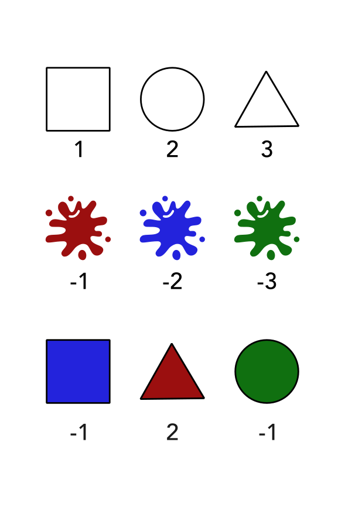
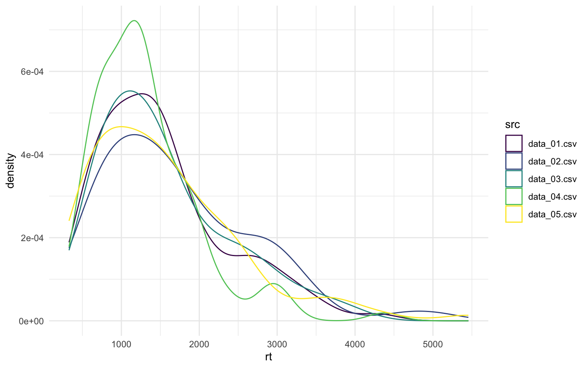

I've written about how to use [apply-functions](/blog/2022/11-07-lets-get-applying) before, and did promise to expand on this topic.
Next on the list is how to use apply to read in multiple files without needing to loop to iterate over the files.

Let me tell you, looking at my old scripts from my PhD I did this in a very very cumbersome way.
To start exploring my journey of reading in files, we'll need some data files to work with.

I'm not gonna explain the code too much, I hope the comments and naming will be fairly straight forward.
The data is of an imaginary experiment on participants, where we have one data set (file) per participant.
The participants are shown on a computer screen a coloured shape, where they have already learned to associate a positive number with the shape, and a negative number with the colour.
Seeing the coloured shape, they are asked to accumulate as many points as possible by rejecting net negative objects and accept net positive objects.
They are asked to be as quick as possible, as we also log in milliseconds how long they take to respond.

<figure class="uk-thumbnail">


<figcaption class="uk-thumbnail-caption uk-text-small uk-text-muted" aria-hidden="true">Experiment setup</figcaption>
</figure>

First, I'm creating a function that will generate stimuli values as named vectors.
This is a nice way to store the stimuli information.

```r
#' Function to generate stimuli
#' @param stimuli string vector
#' @param sign either 1 or -1, depending if the associated
#'    values should be positive or negative
#' @return named vector of values
generate_stimuli <- function(stimuli, sign = 1){
  # make sure sign either 1 or 1
  if(!sign %in% c(1, -1)){
    stop("argument 'sign' can only be 1 or -1.", call. = FALSE)
  }
  setNames(1:length(stimuli), stimuli) * sign
}

generate_stimuli(c("triangle", "diamond", "circle", "square"))
```

    triangle  diamond   circle   square
           1        2        3        4

```r
generate_stimuli(c("red", "blue", "green", "orange"), sign = -1)
```

       red   blue  green orange
        -1     -2     -3     -4

Then I'm going to generate the mock response files.

```r
#' Function to generate random data
#' @params n_rows how many rows the data should have
generate_data <- function(n_rows) {
  shapes <- generate_stimuli(
    c("square", "triangle", "circle", "rhombus", "diamond", "squiggle"),
    sign = 1
  )
  colours <- generate_stimuli(
    c("red", "blue", "green", "yellow", "purple", "orange"),
    sign = -1
  )

  # Initiate data
  data <- data.frame(
    trial  = 1:n_rows,
    shape  = sample(names(shapes), n_rows, replace = TRUE),
    colour = sample(names(colours), n_rows, replace = TRUE)
  )

  # Get corresponding value of the stimuli
  data$shape_value  <- shapes[match(data$shape, names(shapes))]
  data$colour_value <- colours[match(data$colour, names(colours))]

  # Get total value of stimuli
  data$value  <- data$shape_value + data$colour_value

  # Generate mock response
  data$choice <- ifelse(0 < rnorm(data$value, mean = 1, sd = 2), "accept", "reject")
  data$rt <- ceiling(rgamma(n_rows, shape = 2, scale = 600) + 300 )

  # Calculate accuracy based on value and choice
  data$accuracy <- dplyr::case_when(
    data$value == 0 ~ 1,
    data$value > 0 & data$choice == "accept" ~ 1,
    data$value < 0 & data$choice == "reject" ~ 1,
    TRUE ~ 0
  )

  data
}

#' Generate files with data
#' @params i number to append to file name
generate_files <- function(i){
  # Generate a random number of rows between 75 and 100
  num_rows <- sample(75:100, 1)

  # Generate the data
  data <- generate_data(num_rows)

  # Construct the file name
  file_name <- sprintf(
    "%s/data_%02d.csv",
    here::here("content/blog/2024/11-01_lapply_files/data"),
    i
  )

  # Write the data to a CSV file, silently
  invisible(write.csv(data, file = file_name, row.names = FALSE))
}

# iterate through sequence of file numbers to generate the files
sapply(1:5, generate_files)
```

Ok, now we have some files to work with!
And notice how I used an `apply` variant to generate the files?
Just to recap, that an `sapply` will iterate through the vector given as the first argument (`1:num_files`), and pass those values to the first argument of the given function (`generate_files`).

```r
files <- list.files(here::here("content/blog/2024/11-01_lapply_files/data"), full.names = TRUE)
files
```

    [1] "/Users/athanasm/workspace/r-stuff/drmowinckels/content/blog/2024/11-01_lapply_files/data/data_01.csv"
    [2] "/Users/athanasm/workspace/r-stuff/drmowinckels/content/blog/2024/11-01_lapply_files/data/data_02.csv"
    [3] "/Users/athanasm/workspace/r-stuff/drmowinckels/content/blog/2024/11-01_lapply_files/data/data_03.csv"
    [4] "/Users/athanasm/workspace/r-stuff/drmowinckels/content/blog/2024/11-01_lapply_files/data/data_04.csv"
    [5] "/Users/athanasm/workspace/r-stuff/drmowinckels/content/blog/2024/11-01_lapply_files/data/data_05.csv"

Now, I'm also gonna input here that I am using base R's function to explore files I am looking for.
If you want a really nice and consistent interface towards the file system, you should really be looking into the [fs](https://fs.r-lib.org/) package.
It has some dependencies, so if you struggle with that, like me, then it could be tricky, but it's an excellent package.
I'm not going to go into that here, because frankly, Danielle Navarro has such an [excellent post](https://blog.djnavarro.net/posts/2024-10-06_fs/) on it that it would be completely redundant!

## The loopy version

So during my PhD, which was early in my R learning, I would loop through to read in the files and append them together.
Let us start with noticing that in this specific example, the files are organised in the same way.
While containing different number of rows, the columns are named the same and contain the same type of data.
This makes them easy to combine so we can analyse it all together.

So how do we do that?
We want to combine the data **row-wise**, meaning we get a really **tall** dataset.

The way I used to do it with loops, would be something like this:

```r
# initiate data with only headers
data <- read.csv(files[[1]], nrows=1)
data <- data[0, ]
data
```

    [1] trial        shape        colour       shape_value  colour_value
    [6] value        choice       rt           accuracy
    <0 rows> (or 0-length row.names)

```r
# Read in all files
for(file in files){
  # Read in the file
  tmp <- read.csv(file)
  # Add file name as src column
  tmp$src <- basename(file)
  # Bind rows together
  data <- rbind(data, tmp)
}

# Check thow the data look
str(data)
```

    'data.frame':   418 obs. of  10 variables:
     $ trial       : int  1 2 3 4 5 6 7 8 9 10 ...
     $ shape       : chr  "triangle" "squiggle" "triangle" "square" ...
     $ colour      : chr  "green" "purple" "yellow" "yellow" ...
     $ shape_value : int  2 6 2 1 1 5 2 1 3 5 ...
     $ colour_value: int  -3 -5 -4 -4 -6 -4 -5 -1 -5 -6 ...
     $ value       : int  -1 1 -2 -3 -5 1 -3 0 -2 -1 ...
     $ choice      : chr  "accept" "reject" "accept" "accept" ...
     $ rt          : int  1003 631 556 2832 432 757 2126 1240 2240 1842 ...
     $ accuracy    : int  0 0 0 0 0 1 0 1 1 1 ...
     $ src         : chr  "data_01.csv" "data_01.csv" "data_01.csv" "data_01.csv" ...

See how our data is 443 rows and 11 columns?
This means all the data is appended together, exactly what I was wanting.

## The apply version

Let's explore how we can do this with apply!

```r
data <- lapply(files, read.csv)

# Inspect what the data object contains
str(data)
```

    List of 5
     $ :'data.frame':   79 obs. of  9 variables:
      ..$ trial       : int [1:79] 1 2 3 4 5 6 7 8 9 10 ...
      ..$ shape       : chr [1:79] "triangle" "squiggle" "triangle" "square" ...
      ..$ colour      : chr [1:79] "green" "purple" "yellow" "yellow" ...
      ..$ shape_value : int [1:79] 2 6 2 1 1 5 2 1 3 5 ...
      ..$ colour_value: int [1:79] -3 -5 -4 -4 -6 -4 -5 -1 -5 -6 ...
      ..$ value       : int [1:79] -1 1 -2 -3 -5 1 -3 0 -2 -1 ...
      ..$ choice      : chr [1:79] "accept" "reject" "accept" "accept" ...
      ..$ rt          : int [1:79] 1003 631 556 2832 432 757 2126 1240 2240 1842 ...
      ..$ accuracy    : int [1:79] 0 0 0 0 0 1 0 1 1 1 ...
     $ :'data.frame':   81 obs. of  9 variables:
      ..$ trial       : int [1:81] 1 2 3 4 5 6 7 8 9 10 ...
      ..$ shape       : chr [1:81] "circle" "rhombus" "diamond" "circle" ...
      ..$ colour      : chr [1:81] "orange" "red" "yellow" "orange" ...
      ..$ shape_value : int [1:81] 3 4 5 3 3 4 3 4 5 2 ...
      ..$ colour_value: int [1:81] -6 -1 -4 -6 -6 -2 -2 -3 -4 -2 ...
      ..$ value       : int [1:81] -3 3 1 -3 -3 2 1 1 1 0 ...
      ..$ choice      : chr [1:81] "reject" "accept" "accept" "accept" ...
      ..$ rt          : int [1:81] 1318 1779 1228 1130 2062 2523 1431 661 545 912 ...
      ..$ accuracy    : int [1:81] 1 1 1 0 0 0 1 0 0 1 ...
     $ :'data.frame':   91 obs. of  9 variables:
      ..$ trial       : int [1:91] 1 2 3 4 5 6 7 8 9 10 ...
      ..$ shape       : chr [1:91] "squiggle" "circle" "squiggle" "rhombus" ...
      ..$ colour      : chr [1:91] "orange" "blue" "green" "red" ...
      ..$ shape_value : int [1:91] 6 3 6 4 1 6 2 4 2 4 ...
      ..$ colour_value: int [1:91] -6 -2 -3 -1 -4 -2 -3 -5 -2 -4 ...
      ..$ value       : int [1:91] 0 1 3 3 -3 4 -1 -1 0 0 ...
      ..$ choice      : chr [1:91] "accept" "accept" "accept" "accept" ...
      ..$ rt          : int [1:91] 1764 1006 1826 2715 1979 792 944 1527 1176 3731 ...
      ..$ accuracy    : int [1:91] 1 1 1 1 0 1 1 0 1 1 ...
     $ :'data.frame':   80 obs. of  9 variables:
      ..$ trial       : int [1:80] 1 2 3 4 5 6 7 8 9 10 ...
      ..$ shape       : chr [1:80] "rhombus" "diamond" "rhombus" "diamond" ...
      ..$ colour      : chr [1:80] "blue" "orange" "purple" "purple" ...
      ..$ shape_value : int [1:80] 4 5 4 5 6 5 2 6 3 5 ...
      ..$ colour_value: int [1:80] -2 -6 -5 -5 -5 -1 -5 -4 -1 -4 ...
      ..$ value       : int [1:80] 2 -1 -1 0 1 4 -3 2 2 1 ...
      ..$ choice      : chr [1:80] "accept" "accept" "accept" "accept" ...
      ..$ rt          : int [1:80] 713 726 391 2212 1118 1153 2956 1047 966 1357 ...
      ..$ accuracy    : int [1:80] 1 0 0 1 0 1 1 1 1 1 ...
     $ :'data.frame':   87 obs. of  9 variables:
      ..$ trial       : int [1:87] 1 2 3 4 5 6 7 8 9 10 ...
      ..$ shape       : chr [1:87] "diamond" "squiggle" "triangle" "square" ...
      ..$ colour      : chr [1:87] "red" "blue" "yellow" "orange" ...
      ..$ shape_value : int [1:87] 5 6 2 1 6 6 4 5 5 1 ...
      ..$ colour_value: int [1:87] -1 -2 -4 -6 -2 -4 -3 -6 -1 -3 ...
      ..$ value       : int [1:87] 4 4 -2 -5 4 2 1 -1 4 -2 ...
      ..$ choice      : chr [1:87] "accept" "reject" "reject" "accept" ...
      ..$ rt          : int [1:87] 509 542 516 1909 1434 825 1129 915 1392 1454 ...
      ..$ accuracy    : int [1:87] 1 0 1 0 1 1 1 0 1 0 ...

Ok.
So this is very different.
All the data is now in a _list_, where each data set is an element in the list.
So we have a _list_ with 5 data.frames in them.
Cool, but how do we combine them?
Keeping to base R, we are going to use a function called `do.call`.
Now, I really struggle to explain `do.call` because it can do several things depending on what function you profide and what the list you give it is.
In all honestly, the only scenario I can use the function is this exact one.
How it works in my head is that it takes all the elements in the list you provide and applies the function you provide it to them all.

Out of curiousity, my friend [Maëlle](https://masalmon.eu/) had a [search on GitHub](https://github.com/search?q=+language%3AR+do.call%28&type=code&ref=advsearch) and found that at least on public repos on GitHub, my usecase is quite common.

```r
data <- do.call(rbind, data)
str(data)
```

    'data.frame':   418 obs. of  9 variables:
     $ trial       : int  1 2 3 4 5 6 7 8 9 10 ...
     $ shape       : chr  "triangle" "squiggle" "triangle" "square" ...
     $ colour      : chr  "green" "purple" "yellow" "yellow" ...
     $ shape_value : int  2 6 2 1 1 5 2 1 3 5 ...
     $ colour_value: int  -3 -5 -4 -4 -6 -4 -5 -1 -5 -6 ...
     $ value       : int  -1 1 -2 -3 -5 1 -3 0 -2 -1 ...
     $ choice      : chr  "accept" "reject" "accept" "accept" ...
     $ rt          : int  1003 631 556 2832 432 757 2126 1240 2240 1842 ...
     $ accuracy    : int  0 0 0 0 0 1 0 1 1 1 ...

The only thing we are missing now, is the src column!
We'll need to do some adaptations to make that work.

```r
data <- lapply(files, function(x){
  dt <- read.csv(x)
  dt$src <- basename(x)
  dt
})
data <- do.call(rbind, data)
str(data)
```

    'data.frame':   418 obs. of  10 variables:
     $ trial       : int  1 2 3 4 5 6 7 8 9 10 ...
     $ shape       : chr  "triangle" "squiggle" "triangle" "square" ...
     $ colour      : chr  "green" "purple" "yellow" "yellow" ...
     $ shape_value : int  2 6 2 1 1 5 2 1 3 5 ...
     $ colour_value: int  -3 -5 -4 -4 -6 -4 -5 -1 -5 -6 ...
     $ value       : int  -1 1 -2 -3 -5 1 -3 0 -2 -1 ...
     $ choice      : chr  "accept" "reject" "accept" "accept" ...
     $ rt          : int  1003 631 556 2832 432 757 2126 1240 2240 1842 ...
     $ accuracy    : int  0 0 0 0 0 1 0 1 1 1 ...
     $ src         : chr  "data_01.csv" "data_01.csv" "data_01.csv" "data_01.csv" ...

Here we did some magick straight in the `lapply`.
Because I wasn't expecting to use the reading function that adds the source file in any other instance, so I defined it straight in the `lapply`.

I think this code is so much more consise and clear than the for loop.
I also found that it iterates faster through a large number of files.

## The really pretty version

While this post is all about the `lapply`, I would be amiss if I didn't mention the most elegant solution of all.
I've mentioned lots of times that I work in an environment where sticking to base R can make life and reproducibility much easier.
But, when I can, I use the tidyverse version, which is just soo good.

```r
library(readr)
library(dplyr)
```

    Attaching package: 'dplyr'

    The following objects are masked from 'package:stats':

        filter, lag

    The following objects are masked from 'package:base':

        intersect, setdiff, setequal, union

```r
data <- read_csv(files, id = "src") |>
  mutate(src = basename(src))
```

    Rows: 418 Columns: 10

    ── Column specification ────────────────────────────────────────────────────────
    Delimiter: ","
    chr (3): shape, colour, choice
    dbl (6): trial, shape_value, colour_value, value, rt, accuracy

    ℹ Use `spec()` to retrieve the full column specification for this data.
    ℹ Specify the column types or set `show_col_types = FALSE` to quiet this message.

```r
str(data)
```

    tibble [418 × 10] (S3: tbl_df/tbl/data.frame)
     $ src         : chr [1:418] "data_01.csv" "data_01.csv" "data_01.csv" "data_01.csv" ...
     $ trial       : num [1:418] 1 2 3 4 5 6 7 8 9 10 ...
     $ shape       : chr [1:418] "triangle" "squiggle" "triangle" "square" ...
     $ colour      : chr [1:418] "green" "purple" "yellow" "yellow" ...
     $ shape_value : num [1:418] 2 6 2 1 1 5 2 1 3 5 ...
     $ colour_value: num [1:418] -3 -5 -4 -4 -6 -4 -5 -1 -5 -6 ...
     $ value       : num [1:418] -1 1 -2 -3 -5 1 -3 0 -2 -1 ...
     $ choice      : chr [1:418] "accept" "reject" "accept" "accept" ...
     $ rt          : num [1:418] 1003 631 556 2832 432 ...
     $ accuracy    : num [1:418] 0 0 0 0 0 1 0 1 1 1 ...

Look at that!
So clean, so fast!
It really is the absolutely best version in my opinion.
But the `lapply` variation I find to be just as satisfying when I need it.

Do you have any particular hacks for reading in this type of data?

```r
library(ggplot2)
data |>
  ggplot() +
  geom_density(aes(x = rt, group = src, colour = src)) +
  scale_colour_viridis_d() +
  theme_minimal()
```


