With the latest mass flee'ing from Xitter, a "new" social media platform seems to have emerged as a home for the R community. 
Bluesky has been around for a while, and next to Threads and Mastodon was one of the initial contenders when the first wave fled Xitter about two years ago.
Now, I think Mastodon ended up at first as where most of us placed our bet. 
The open source, federated system really appealed to a lot of tech savvy folks.
However, while I am happy for what we have there, I at least never managed to get a proper feel for community there.
The engagement is much less than hoped for.

With the results of the current US electing sparking fear for what is to come, and Musk's involvement and continued shitification of Xitter, people have had enough.
Bluesky seems to have become the favoured platform for this exodus, so I decided to make an account also and see what it was.

I must say, I am happy I did. 
The sense of community is much more and engagement is much larger.
Now, it's still early days of the R community on Bluesky, so it's hard to say if it will continue this way, but there are some signs.

<blockquote class="bluesky-embed" data-bluesky-uri="at://did:plc:iz6v2itga76zik4okvzlv6di/app.bsky.feed.post/3lawelexzwk2w" data-bluesky-cid="bafyreibgkj65ox44yt5yqowlw7dny37c4uhu2qqtd4i7nhbh7cw2ll7exi"><p lang="en">Bluesky really is the new #rstats twitter because we have the first base R vs tidyverse flame war 🤣</p>&mdash; Hadley Wickham (<a href="https://bsky.app/profile/did:plc:iz6v2itga76zik4okvzlv6di?ref_src=embed">@hadleywickham.bsky.social</a>) <a href="https://bsky.app/profile/did:plc:iz6v2itga76zik4okvzlv6di/post/3lawelexzwk2w?ref_src=embed">Nov 14, 2024 at 18:18</a></blockquote><script async src="https://embed.bsky.app/static/embed.js" charset="utf-8"></script>

## Starter Packs

I think one of the reasons it exploded, was the emergence of the [Bluesky Starter Packs](https://bsky.social/about/blog/06-26-2024-starter-packs).
Starter Packs are created by users to make it easier to connect with their communities, or find people you might be interested in following.

Personally, I started out with Jeremy Allens' [Rstats starter pack](https://bsky.app/starter-pack/jeremy-data.bsky.social/3l6x3agttsg2r).
It was just so simple to easily find the community I wanted to connect to again.
If you are thinking of giving it a go, here are some starter packs that might be of interest to people reading this blog!

You can easily "follow all" or cherry pick whoever you want from each pack.
Remember to also check out if they have any recommended Feeds!

Sure, here is the markdown table with only the photo column and the hyperlinked text column:


Certainly! Here is the markdown table with the categories bolded:

| Category     | Pack | Preview |
| :------      | ----: | ------- |
| **R**        | My Rstats picks       | [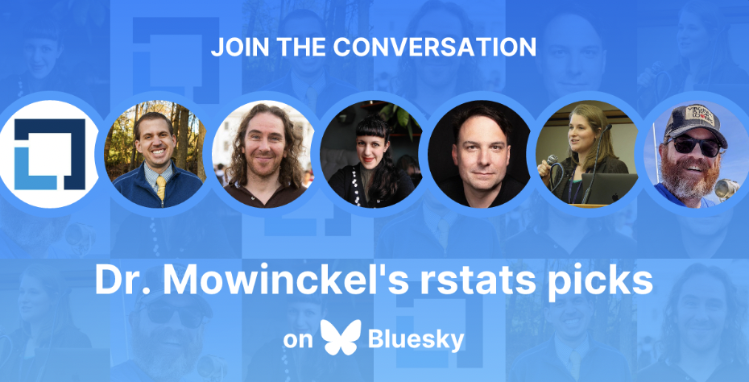](https://bsky.app/starter-pack/drmowinckels.io/3l76bq6sdms2z) |
| **R**        | R-Ladies Starter Pack     | [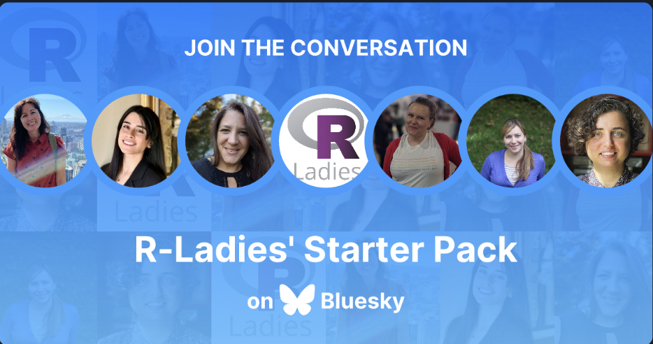](https://bsky.app/starter-pack/rladies.org/3lawoimij4m2e) |
| **R**        | Jeremy Allen's Rstats Starter Pack | [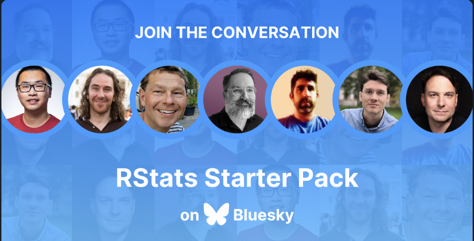](https://bsky.app/starter-pack/jeremy-data.bsky.social/3l6x3agttsg2r) |
| **R**        | Ansgar Wolsing ggplot2 Starter Pack | [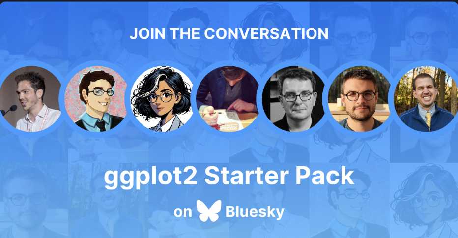](https://bsky.app/starter-pack/ansgarw.bsky.social/3l6xrq3f4fe24) |
| **R**        | Noam Ross' rOpenSci Starter Pack | [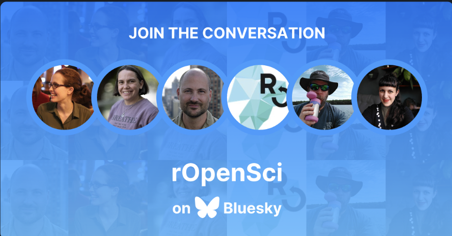](https://bsky.app/starter-pack/noamross.net/3land3z3fez2z) |
| **R/Neuro**  | My Neuro Rstats Starter Pack | [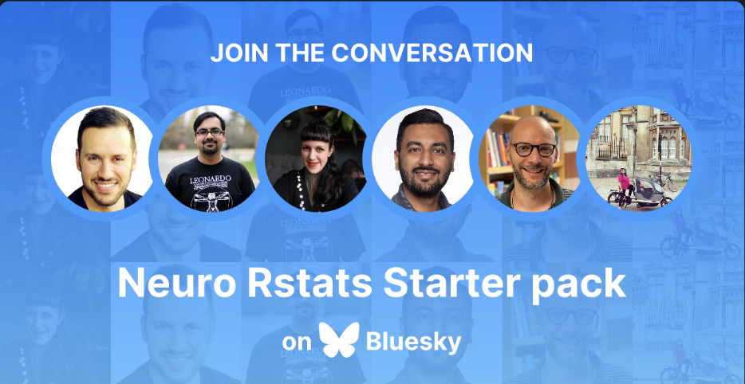](https://bsky.app/starter-pack/drmowinckels.io/3larl2jajog2o) |
| **R/python** | Garrick Aden-Buie's Shiny Dev | [](https://bsky.app/starter-pack/grrrck.xyz/3lahi4wmmkq2h) |
| **python**   | Cosima Meyer's PyLadies | [](https://bsky.app/starter-pack/cosima.bsky.social/3l7zmdn5tsp26) |
| **Coding**   | Milos' Free Tutorials Starter Pack | [](https://bsky.app/starter-pack/milos-makes-maps.bsky.social/3lau5bzm53p2j) |
| **UiO**      | Dan Quintana's UiO Community Starter Pack | [](https://bsky.app/starter-pack/dsquintana.bsky.social/3lalcn3lzo72f) |
| **Data**     | Christian Minich's Data People Starter Pack | [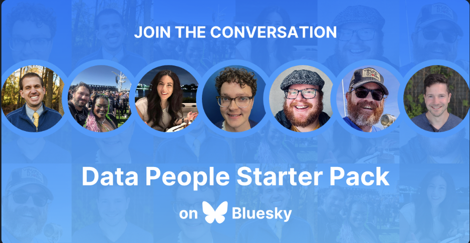](https://bsky.app/starter-pack-short/8TdEfdK) |
| **AI**       | Catherine Breslin's Women in AI | [](https://bsky.app/starter-pack-short/LaGDpqg) |
| **Viz**      | Francis Gagnon's Data visualization community | [](https://go.bsky.app/R3nSyyy) |
| **Cog/Neuro**      | Micah Allen's Cognitive neuroscience 1 | [](https://go.bsky.app/2n84SRM) |
| **Cog/Neuro**      | Micah Allen's Cognitive neuroscience 2 | [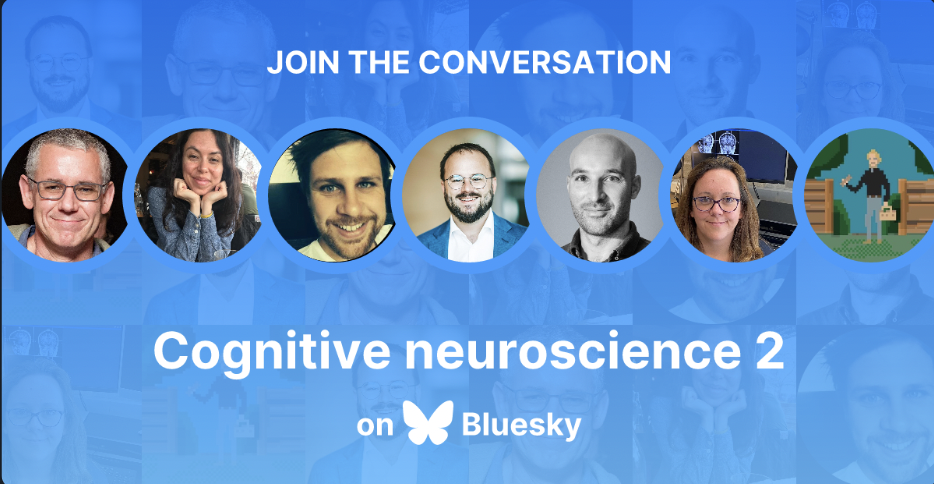](https://go.bsky.app/HQeoP7D) |
| **Cog/Psy**      | Allie Sinclair's Cognitive Psychology | [](https://go.bsky.app/NsFhnV) |
| **EEG**      | Maëlan Menétrey's EEG Research | [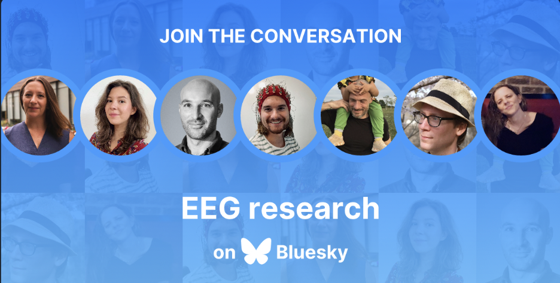](https://go.bsky.app/H2URVjv) |
| **MRI**      | Todd Woodward's Task-based fMRI | [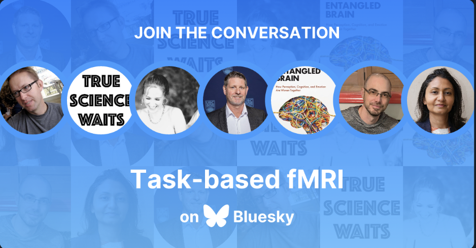](https://go.bsky.app/Ai1f67H) |


That should get you more than started!

## Posting to Bluesky from R

While I have been on somewhat of an API spree with [httr2](https://httr2.r-lib.org/) lately, this time I think we will stick to using a package.
I did start off doing this myself, but then found that creating links and tags in Bluesky through the API is [_much more_](https://docs.bsky.app/docs/advanced-guides/post-richtext) work than just sending some plaintext, so I abandoned that to someone how has already figured out how it works.

Christopher Kenny has amazingly created [bskyr](https://christophertkenny.com/bskyr/) to aid us in sending an receiving data from the Bluesky API.
The documentation was really very easy to follow, so I don't really have lots more information to provide than the code I use to automatically create a post once a new blogpost is published on my site.

I have set this up as a script that will be called from a Github action, and the script takes an argument, which is the path to the new post's `index.md`

The first lines are all about catching this input, and making sure its actually provided and singular.
Then we read in the posts frontmatter, cleanup the tags, and build the complete URL to the post.
Because this is going on social media, I also have a selection of emoji's that I randomly select from each time, just for fun.
Then I construct the message I want, using all these bits, and a frontmatter parameter I call "seo". 
I have previously used "summary" here, but have now decided I both want a longer summary of my post (400-500 characters) and a simpler 155 character SEO. 
Because social media have strict character limits, I use the SEO for that.
Lastly, I make sure I have the complete path to the post image I want to use.

```r
#!/usr/bin/env Rscript

post <- commandArgs(trailingOnly = TRUE)

# Check if arguments are provided
if (length(post) == 0) {
  stop(
    "No arguments provided. Script needs a file to process.", 
  call. = FALSE
  )
}else if(length(post) > 1) {
  warning("Several arguments provided. Processing only first one.", call. = FALSE)
  post <- post[1]
}

frontmatter <- rmarkdown::yaml_front_matter(post)

# fix tags
tags <- paste0("#", frontmatter$tags)
tags <- sub("^#r$", "#rstats", tags)
tags <- paste(tags, collapse=", ")

# build URL
uri <- sprintf("https://drmowinckels.io/blog/%s/%s",
  basename(dirname(dirname(post))),
  frontmatter$slug
)

emojis <- c("🦄", "🦜", "🦣", "🦥", "🦦", "🦧", "🦨", "🦩", "🦪", 
"🦫", "🦬", "🦭", "🦮", "🦯", "🦰", "🦱", "🦲", "🦳", "🦴", 
"🦵", "🦶", "🦷", "🦸", "🦹", "🦺", "🦻", "🦼", "🦽", "🦾",
"🦿", "🧀", "🧁", "🧂", "🧃", "🧄", "🧅", "🧆", "🧇", "🧈",
"🧉", "🧊", "🧋", "🧌", "🧍", "🧎", "🧏", "🧐", "🧑", "🧒",
"🧓", "🧔", "🧕", "🧖", "🧗", "🧘", "🧙", "🧚", "🧛", "🧜",
"🧝", "🧞", "🧟", "🧠", "🧡", "🧢", "🧣", "🧤", "🧥", "🧦",
"🧧", "🧨", "🧩", "🧪", "🧫", "🧬", "🧭", "🧮", "🧯", "🧰",
"🧱", "🧲", "🧳", "🧴", "🧵", "🧶", "🧷", "🧸", "🧹", "🧺",
"🧻", "🧼", "🧽", "🧾", "🧿")
emoji <- sample(emojis, 1)

# Create message
message <- glue::glue(
  "📝 New blog post 📝 

  '{frontmatter$title}'
  
  {emoji} {frontmatter$seo} 
  
  👀  Read at: {uri} 
  
  {tags}"
)

# Add image
image <- here::here(dirname(post), frontmatter$image)

```

Now that we have all the bits and bobs lined up, let's get posting!

```r
# Post to Bluesky
bskyr::bs_post(
  text = message,
  images = image,
  images_alt = "Blogpost featured image",
  langs = "US-en",
  user = "drmowinckels.io"
)
```

and that's it! 
It's so short and simple. 
I really love it when package creators make life this easy.
And all the links and tags are correctly formatted like bluesky wants, and it even preserves linesbreaks (which I've found Bluesky to be a little tricky with!)

I know this post is all about Bluesky, but I am also not abandoning Mastodon.
And in the spirit of simplicity, let's use [rtoot](https://gesistsa.github.io/rtoot/articles/auth.html) to post to it too.

```r
# Post to Mastodon
rtoot::post_toot(
  status = message,
  media = image,
  alt_text = "Blogpost featured image",
  visibility = "public",
  language = "US-en"
)
```

## The GitHub Action job

I'll show you how the GitHub action (mainly) looks like too.
I've skipped showing the `build` step, as its not necessary for this post,
and very specific to my setup.

First I set up that the workflow should run when I push or PR to main, or manually by triggering it.
Then I have three jobs:
  - check: sets up build parameters. Bash commands to figure out the post path, and date, the r-version in the renv-lock file etc.
  - build: builds and pushes the website to the gh-pages branch
  - announce: send social media announcements if its the same day as a new blogpost is published.

I hope the code comments give you the general idea of what is going on.


```yaml
on:
  workflow_dispatch:
  pull_request:
    branches:
      - main
  push:
    branches:
      - main

name: Update website

jobs:
  checks:
    name: Set-up build params
    if: github.ref == 'refs/heads/main'
    runs-on: ubuntu-latest
    outputs:
      POST:      ${{ steps.check-post.outputs.POST }}
      POST_DATE: ${{ steps.check-date.outputs.POST_DATE }}
      ANNOUNCE:  ${{ steps.check-date.outputs.ANNOUNCE }}
      DOI:       ${{ steps.check-doi.outputs.DOI }}
      RVER:      ${{ steps.check-rver.outputs.RVER }}
    env:
      GITHUB_PAT: ${{ secrets.GITHUB_TOKEN }}
    steps:
      - name: Checkout repo
        uses: actions/checkout@v4

      - name: 📝 Get latest blog post 📝
        id: check-post
        env:
          BLOG_PATH: "content/blog"
        run: |
          # Find the latest blog post
          latest_post=$(find "${BLOG_PATH}" | grep /index.md$ | grep -v "XX-XX" | sort | tail -n1)
          echo "POST=${latest_post}" >> $GITHUB_OUTPUT

      - name: Check post date
        id: check-date
        run: |
          post_date=$(grep "^date:" "${{ steps.check-post.outputs.POST }}" | sed 's/^date: //' | sed 's/["'\'']//g')
          echo "POST_DATE=${post_date}" >> $GITHUB_OUTPUT

          one_day_ago=$(date -d "-1 days" +%Y-%m-%d)
          echo "ANNOUNCE=false" >> $GITHUB_OUTPUT
          if (( ${post_date} < ${one_day_ago} )); then
            echo "ANNOUNCE=true" >> $GITHUB_OUTPUT
          fi

      - name: Check if needs DOI
        id: check-doi
        run: |
          # Does the post need a DOI?
          echo "DOI=true" >> $GITHUB_OUTPUT
          if head -n 10 "${{ steps.check-post.outputs.POST }}" | grep -q "doi:"; then
            echo "DOI=false" >> $GITHUB_OUTPUT
          fi

      - name: Get R versions
        id: check-rver
        run: |
          rver=$(cat renv.lock | jq '.R.Version' | tr -d '"')
          echo "RVER=${rver}" >> $GITHUB_OUTPUT

  build:
    name: Build site
    #redacted for simplicity ...

  announce:
    name: Announce new blog post
    runs-on: ubuntu-latest
    needs: [build, checks]
    if: needs.checks.outputs.ANNOUNCE == 'true'
    env:
      GITHUB_PAT: ${{ secrets.GITHUB_TOKEN }}
      RENV_PROFILE: social_media
    steps:
      - uses: actions/checkout@v4

      - name: Install cURL Headers
        run: |
          sudo apt-get update
          sudo apt-get install libcurl4-openssl-dev
          
      - name: Setup R
        uses: r-lib/actions/setup-r@v2
        with:
          r-version: ${{ needs.checks.outputs.RVER }}

      - name: Setup renv
        uses: r-lib/actions/setup-renv@v2

      - name: Announce the post
        env:
          BLUESKY_APP_PASS: ${{ secrets.BLUESKY_PWD }}
        run: |
          echo RTOOT_DEFAULT_TOKEN="${{ secrets.RTOOT_TOKEN }}" >> .Renviron
          echo KIT_SECRET="${{ secrets.KIT_KEY }}" >> .Renviron
          Rscript .github/scripts/announce.R ${{ needs.checks.outputs.POST }}
```

All this creates a workflow that looks like this

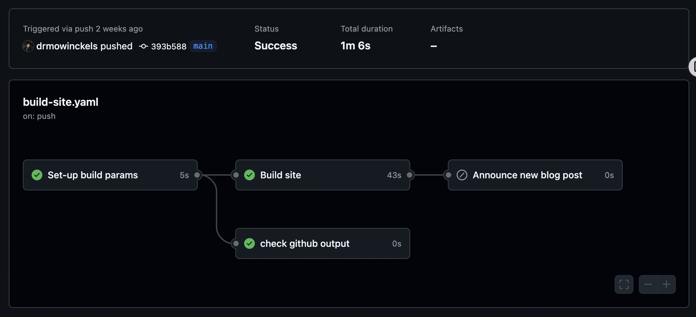

And with that my life gets less and less complicated arround announcing new blogposts.
I've been toying with the LinkedIn API, but y'all...
It's got me stumped...

So far, I'm happy getting posting to Bluesky and Mastodon off smoothly.
