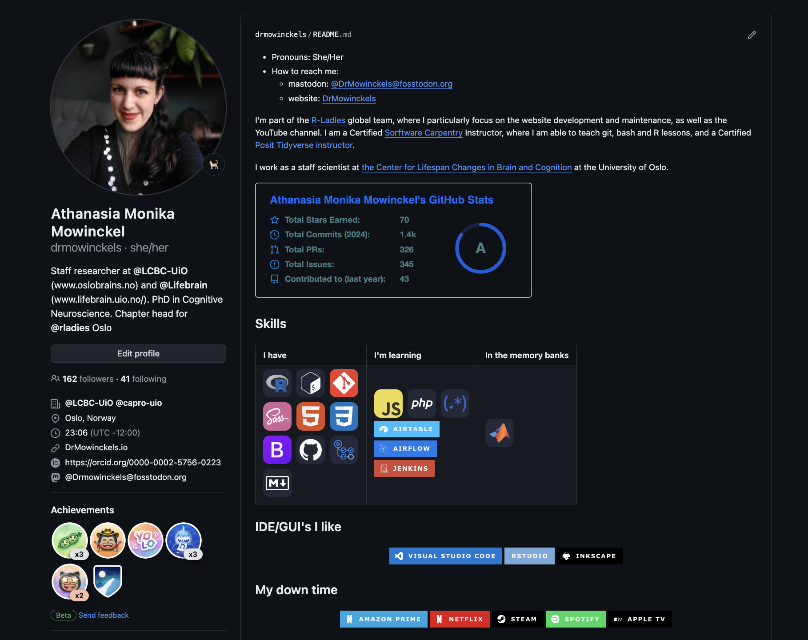

I've been meaning to improve my GitHub profile for a while, but I never got around to it.
I've seen some really cool ones, and I wanted to make one myself.
I finally got around to it, and I'm really happy with the result.

I've written a short tutorial on how I did it, and how you can too.

## What is a GitHub profile?

GitHub profiles are a way to showcase your work on GitHub.
It's a great way to show off your work, and to show your skills.
It's also a great way to learn new skills, and to learn how to use GitHub.

## How do I make a GitHub profile?
To create a GitHub profile, the landing page when you go to your GitHub account, you need to create a repository with the same name as your GitHub username.
For me, that's `drmowinckels`, so I created a repository called `drmowinckels`.
This repository needs to be public, and it needs to have a README.md file.
This README.md file is what will be displayed on your GitHub profile.

## How do I make a cool GitHub profile?
There are many ways to make a cool GitHub profile.
I've seen some really cool ones, and I've seen some really simple ones.
Until recently, mine was one of the simple ones.
I wanted to make a cool one, but I never got around to it.
I finally did, and I'm really happy with the result and would like to share what I've done!

## How I made my cool GitHub profile

My inspiration was coming across a blog post by [Kshyun28](https://dev.to/kshyun28/how-to-make-your-awesome-github-profile-hog) on how to make your GitHub profile awesome.
This popped up in my google chrome news feed, and it got me intrigued!

After that, I kind of went on down a rabbit hole of GitHub profile READMEs and found some really cool ones, based on all the links Kshyun28 provide in their blogpost.

### Github stats

I started by adding my GitHub stats to my profile.
There are several options, but I went with [anuraghazra/github-readme-stats]((https://github.com/anuraghazra/github-readme-stats).

It's somewhat customizable, and it's easy to use, customizations basically happen by adding query parameters to the URL.

### Coding languages/skills

I also added a section with my coding languages and skills.
Here, I divided things into three categories:
- Skills I have
- Skills I'm learning
- Skills in the memorybanks

There were a couple of considerations while I was making that.
First, I wanted to make it look nice.
So I made it as a table, with each category its own column.
Now, since this is made in a README.md file, you think I'd make a markdown table.
But that just looked terrible in plain text, and hard to tell which sections belonged to which category.
Since, markdown takes html code, I decided to make it as an html table instead.
This made it easier to see everything that fit in the same cateogry, and it looked a lot nicer.

Second, I wanted to use icons rather than text, as it looks more fun.
I wanted them to similar to each other, adhering to the same style.
This meant I couldn't just google for logos, as they would be in different styles.
There are lots of different icon libraries out there, and I could not find a single one that had all the badges I wanted.
So I ended up using a combination of [Image Shield](https://img.shields.io/badge/) and [Simple Icons](https://simpleicons.org/).

That created the following table:

<table border="0">
 <tr>
    <td><b style="font-size:30px">I have</b></td>
    <td><b style="font-size:30px">I'm learning</b></td>
    <td><b style="font-size:30px">In the memory banks</b></td>
 </tr>
 <tr>
    <td>
        
    </td>
    <td>
      
       
       
       
       
    </td>
    <td>
      
    </td>
 </tr>
</table>

Downside was that there were badges I could not find in either of the libraries. 
Which sucked, and it means they are missing.
I've opened issue tickets on both libraries, so hopefully they will be added soon.

### The IDE's I prefer
If you've followed me a while, you know I have _opinions_ on IDE's.
So I thought I'd showcase the IDE's I prefer also.

  
  
  

### What I do in my down time

Now, this again will only pertain to tech stuff I use in my down time.
I love lots of things that are not tech related, but finding badges for those was a bit harder.
So I decided to stick to tech stuff.

  
  
  
  
  

But I really would love to add badges for carpentry, ballet, gardening, and cooking.

### What is missing

I really want to add some stats from my blog too, like number of posts and post frequency.
But that means accessing information in another repo, and I didn't feel like working on that just yet.
But I hope to get that in there soon too.

## Conclusion

You can see my [GitHub profile](https://github.com/drmowinckels) as it's rendered, and look at the [source code](https://github.com/drmowinckels/DrMowinckels/blob/main/README.md?plain=1) for it too.
Since GitHub is such a massive platform, it's a great place to showcase your skills and interests, particularly if you are on the job marked or looking for collaborators.

Have you seen any GitHub profiles with fun and interesting features?
How about your own?
