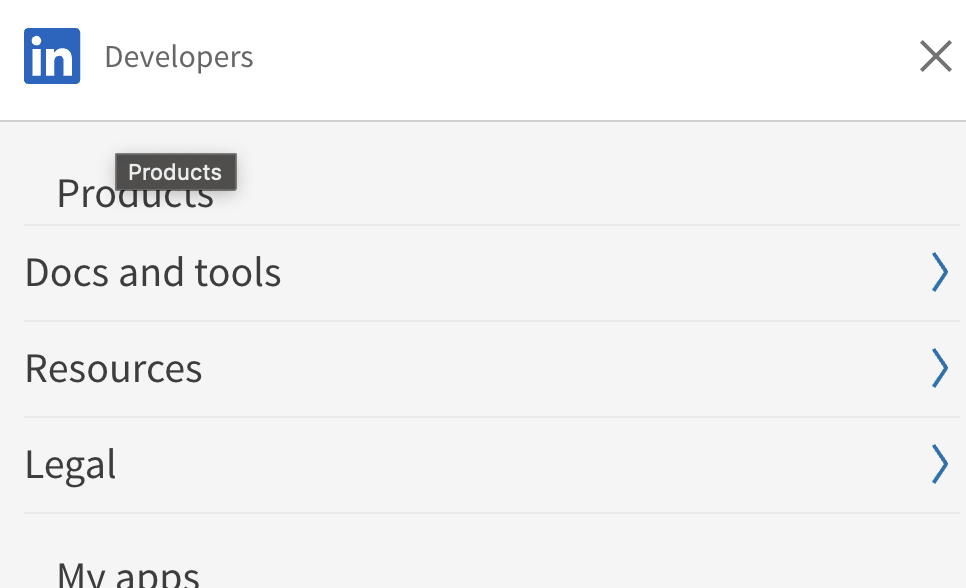
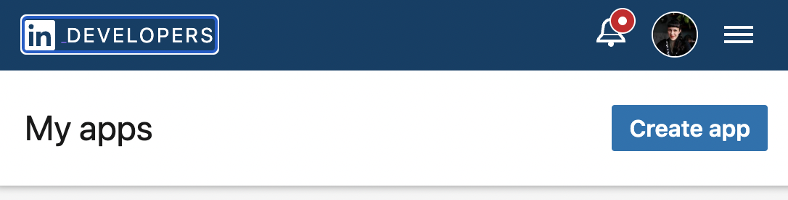
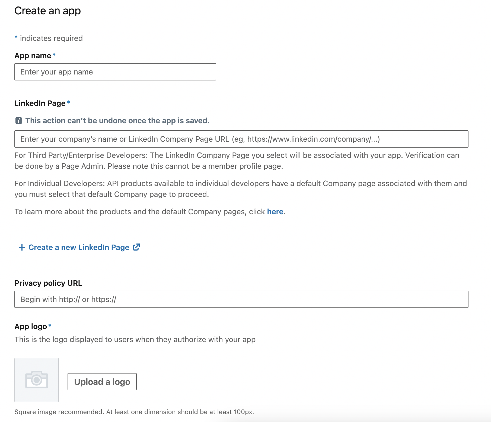
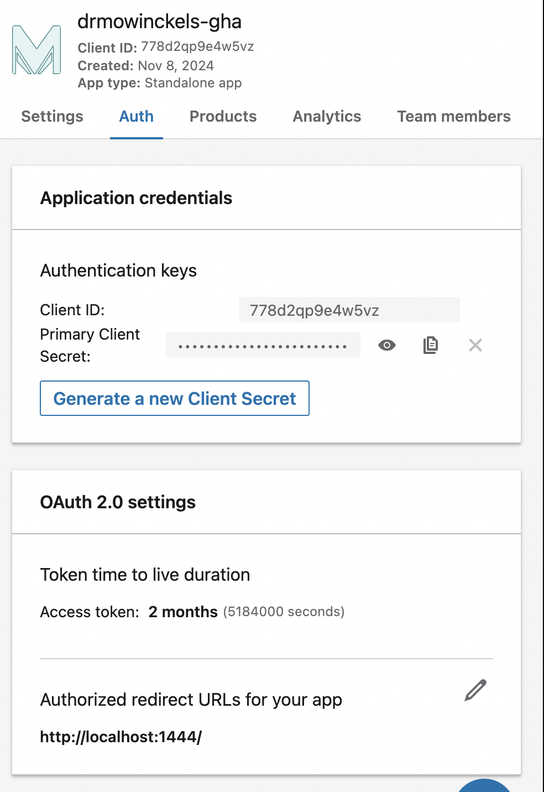
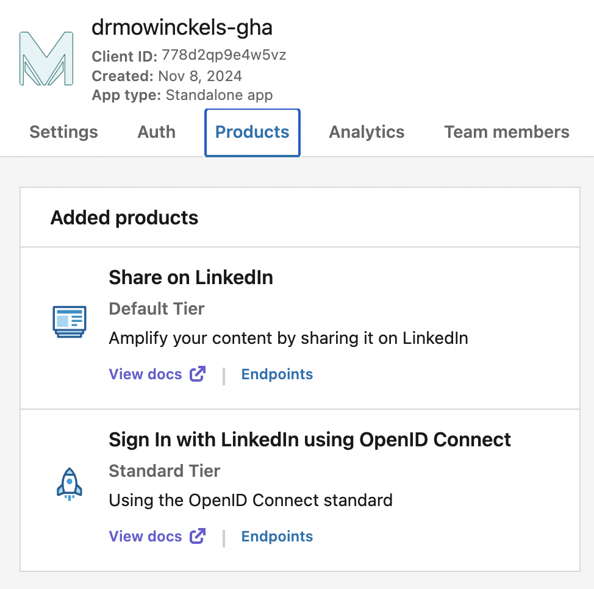
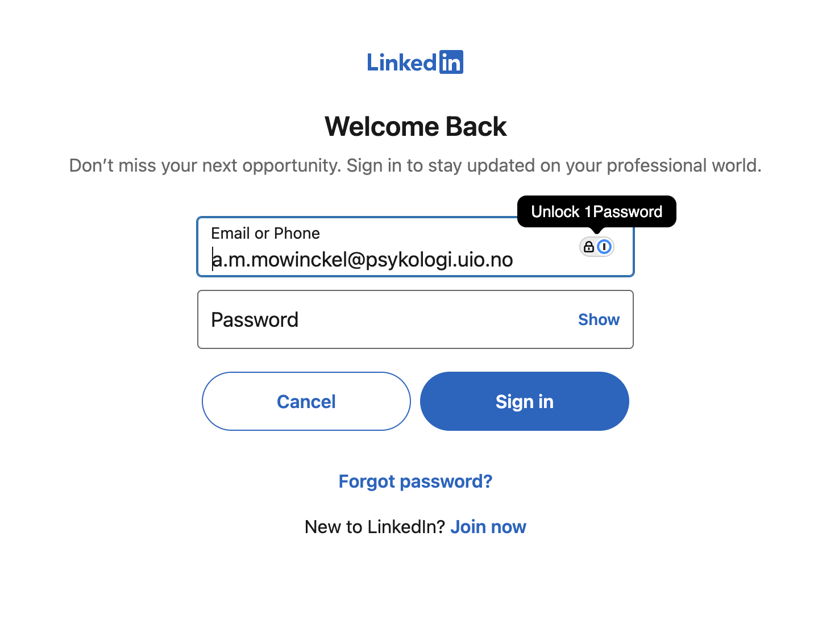
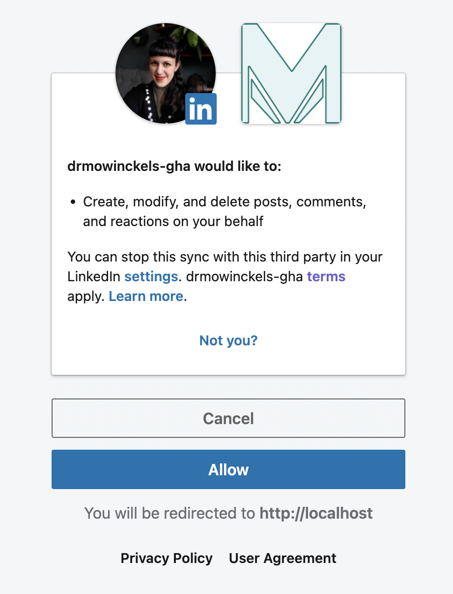
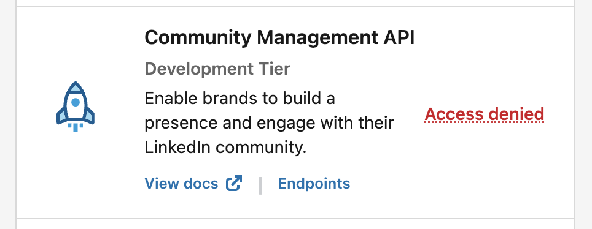
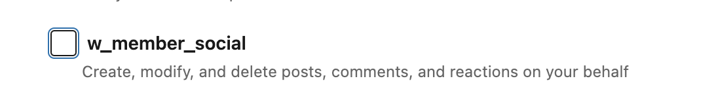

_This post has been featured in Chris Brownlie's [This week in R](https://www.linkedin.com/posts/cnbrownlie_rstats-programming-news-activity-7293576879184236544-GhW8?utm_source=share&utm_medium=member_desktop&rcm=ACoAABNDt20BP2SReTkJa8gH1-ZOkiYBysNsgPc)_

So I've had several posts past year about using [httr2](https://httr2.r-lib.org/) in R to connect to various API's, like [Zenodo](/blog/2024/fair-blog).
In that journey, I have been trying to get things working with LinkedIn too, which is one of the three social-media type platforms I use to communicate. 
In that quest, there has been... much frustration.
I feel like I am becoming more and more comfortable with API's, both from R and from the shell. 
But LinkedIn had me thoroughly confused.
The documentation was hard to grasp and navigate.
The process was extremely obscure and I just could not _GET it_.

Finally, after much aid from both [Jon Harmon](https://jonthegeek.com/) and [Steffi LaZerte](https://steffilazerte.ca/) through my connection to [rOpenSci](https://ropensci.org/), we were able to get it working!
I can't tell you how happy I was when I finally got that test post to LinkedIn through the API, the journey has been alsmot 5 months!
That being said, those five months means extremely sporadic trying given [my current health status](/blog/2025/the-difficult-year), but still.

In this post I want to lay out the process I use as a _person_ to post to LinkedIn through their API.
I want to make sure this is very clear, as a _person_, not as a person on behalf of an organisation (which part of the confusion in this process stemmed from). 

## Getting LinkedIn API access

The first thing one needs to do, is to actually get access to the LinkedIn API.
The API is available through the [LinkedIn developers portal](https://developer.linkedin.com/).
Here, you should be able to log in with your LinkedIn credentials, or already be logged in if you are logged in to LinkedIn already.



There's a lot of information you can access from this page, like docs etc. 

## Creating an authentication client

Next step is to "Create an app", which is what is going to make it possible for you to authenticate your self towards the API.
Unlike other API's we've dealth with before, this API requires a somewhat more complex authentication process.



When creating an app, there are quite some things that need to be specified. 
I've made an app so many times to get things right!
So let's walk through it!



**App name**: simple enough, it needs a name. This can be anything you want.

**LinkedIn Page**: this is confusing and so weird.

> For Individual Developers: API products available to individual developers have a default Company page associated with them and you must select that default Company page to proceed.

Meaning, you need a Company page associated with your app, so you need to make one...
I [made a company page](https://business.linkedin.com/marketing-solutions/linkedin-pages) called [Dr. Mowinckel's](https://www.linkedin.com/company/dr-mowinckel-s/) on LinkedIn, which will see no activity as far as I am concerned.
Once that was made, I could associate that page with my app, and things seemed to be just fine.

**Privacy policy URL** not required, and if you are using it for yourself, totally not needed.

**App logo** self explanatory, I think. I'm mostly surprised its required!


Once those settings are done, you will have an app you can use to access the LinkedIn API through. 
You will get information about your "Client" inside the App page, which will look like something as the above.

But wait, there are still things that need to be set before we can actually use it.



In the auth tab, the only thing that really needs setting is a redirect URL.
You need this if you want to use an interactive authentication process to get a token.
I thought that sounded neat, and since Steffi had code for it, I followed her [instructions in her code](https://github.com/ropensci-org/promoutils/blob/main/R/linkedin.R#L151) to set redirect url to local host.



In the "Products" tab, you will find various services you can add to your app.
**These are very important**.
My main problem getting started with the API was from the lack of the correct products associated with my app.
Not that this is information that is easy to find, the docs in general are super difficult to navigate, in my opinion.

The different products give you access to different API endpoints,
meaning if you don't have the correct products, you won't have access to the API as expected.

I quickly and easily added the "Share on LinkedIn" Product, which has the endpoints for adding posts, videos, images etc. 
And for a _very long time_ this was the only product I had, and you will realise during this post that that was at the core of my issues.

## Getting an access token

After getting code from Jon and Steffi, I started playing around with the code to get things working.
With [Steffi's code](https://github.com/ropensci-org/promoutils/blob/main/R/linkedin.R#L180-L201), I was able to get a bit of code that created a login screen for me, and that I could get a token in the console!
This was the first time for me really working with an [OAuth workflow](https://httr2.r-lib.org/articles/oauth.html).
I had some minimal experience from the [meetupr](https://rladies.org/meetupr/) package, but I was not the one who worked on that bit of the code, so I can't really take any credit for it.
Very happy Steffi and Jon had some code I could work on.

```r
# Set endpoint version for LinkedIn
Sys.setenv(
  LI_ENDPOINT = "rest"
)

#' Setup client id for LinkedIn API
#'
#' Expects to find the "Client Secret" in the .Renviron file under
#' LI_CLIENT_SECRET (Or as a general environemental variable through GitHub
#' actions).
#'
#' @noRd
li_client <- function(endpoint_version = "v2") {
  httr2::oauth_client(
    name = "drmowinckels_linkedIn",
    id = Sys.getenv("LI_CLIENT_ID"),
    token_url = sprintf("https://www.linkedin.com/oauth/%s/accessToken", endpoint_version),
    secret = Sys.getenv("LI_CLIENT_SECRET")
  )
}


#' Authorize a client with LinkedIn
#'
#' This authorizes the rOpenSci client with **your** credentials (and you must
#' be part of the rOpenSci organization as an admin).
#' Make sure to take note of the 'refresh_token' as that is what you'll
#' add to your .Renviron file for local work, or the GitHub secrets for
#' the comms/scheduled_socials workflow.
#'
#' This function authorizes with a redirect url of "http://localhost:1444/",
#' this *must* be the same as that listed in the LinkedIn Developer App,
#' https://www.linkedin.com/developers/apps.
#'
#' **If you retrieve a new token, you will have to put it in the .Renviron
#' and the re-start your R session to continue**
#'
#' This function authorizes with the scopes:
#'
#' - w_member_social (default)
#' - w_organization_social (special request)
#' - r_organization_social (special request)
#' - r_organization_admin (special request)
#'
#' @return httr2 authorization
#' @export
#'
#' @references
#'   - Refresh tokens API: https://learn.microsoft.com/en-us/linkedin/shared/authentication/programmatic-refresh-tokens
#'
#' @examples
#'
#' \dontrun{
#' # Only run if you need to update the scopes or get a new token (otherwise
#' # you'll have to replace all your tokens)
#' t <- li_oauth()
#' t$refresh_token
#' }
li_oauth <- function(
  scopes = c("w_member_social"),
  state = "drmowinckels_token"
) {
  auth_url <- "https://www.linkedin.com/oauth/v2/authorization"

  auth_url <- httr2::oauth_flow_auth_code_url(
    client = li_client(),
    auth_url = auth_url,
    state = state
  )

  httr2::oauth_flow_auth_code(
    client = li_client(),
    auth_url = auth_url,
    redirect_uri = "http://localhost:1444/",
    scope = paste(scopes),
    pkce = FALSE
  )
}
```

The process will open a browser window that you can open to log into LinkedIn with, and therefore get an access token.

```r
t <- li_oauth()
```




And at the end of it all, I got a token!

```r
t
```

```
<httr2_token>
token_type: bearer
access_token: <REDACTED>
expires_at: 2025-03-10 16:43:18
scope: w_member_social
```

But there is a problem with my token, it does not include a `refresh_token` like the example from [Steffi's code](https://github.com/ropensci-org/promoutils/blob/main/R/linkedin.R#L177).

```r
names(t)
```

```
[1] "token_type"   "access_token" "expires_at"   "scope"
```

Why?!
Off I went down a rabbit hole to figure out why I was missing a refresh code.
I was quite sure I needed it to get things working in Github Actions.
Then I read on StackOverflow and somewhere in the docs, that refresh tokens can only be provided with the Community Management API product.

So I went to add that, only to realise you cannot have community management and share on linkedin on the same app.
So I made a new app, so I could give it a go.



It was denied because I am, in fact, not a community :P
To get this product you need to have a legally registered entity, and since I don't have that, I had no success.
Back to figuring out what was happening.

I started looking at [Jon's code](https://github.com/rfordatascience/ttpost/blob/main/helpers-linkedin.R#L11-L12) and noticed a section talking about refreshing the refresh token.
Alright!

I went to that link, and did indeed get a token!
But it looked suspiciously like the token I got from Steffi's oauth client approach, and there was no mention of a refresh token anywhere.

I also noticed I could only get a single "scope", which dictates what type of permissions (endpoints) I could access.
While both Steffi and Jon listed a whole bunch (`r_basicprofile`, `r_emailaddress`, `r_liteprofile`, `r_member_social`, `r_organization_social`, `w_member_social`, `w_organization_social`), I had a single one
`w_member_social`.



It was eady enough to understand that the `organization` ones where not for me, but that still left things like `r_basicprofile`, `r_emailaddress`, `r_liteprofile`, `r_member_social`, I'm sure those are nexessary for something?
I set it aside for now, to continue testing things (that was, in hind-sight, not a great idea).

I had a token, and some code. 
I wanted to test.
Maybe I could use the access token as a refresh token?
Worth trying.

## Getting information from the API

I needed information about myself, because to post to LinkedIn, you need to know your so called [urn](https://learn.microsoft.com/en-us/linkedin/shared/api-guide/concepts/urns) which is a type of user identifier. 

Steffi had some [code](https://github.com/ropensci-org/promoutils/blob/main/R/linkedin.R#L90-L111) to get this information, so I thought that would be a good thing to try out.
It did not work.

```r
#' Fetch your personal URN number
#'
#' This is required to post on LinkedIn to your personal account
#'
#' @return A string with your URN in the format of "urn:li:person:XXXX"
#' @export
#'
#' @examples
#'
#' \dontrun{
#' li_urn_me()
#' }
li_urn_me <- function() {
  id <- httr2::request(base_url = "https://api.linkedin.com/v2/me") |>
    li_req_auth() |>
    httr2::req_url_query(projection = "(id)") |>
    httr2::req_perform() |>
    httr2::resp_body_json() |>
    unlist()
  paste0("urn:li:person:", id)
}

li_urn_me()
```

```
Error in `token_refresh()`:
! OAuth failure [access_denied]
• Refresh token not allowed
```

What does even `Refresh token not allowed` mean?
I was googling, Steffi and Jon were communicating with me on slack, it was just so... frustratingly obfuscated.

Then Jon had the _brilliant_ idea that maybe I needed to use a Bearer token, rather than an oauth flow when I was interacting as a single user.
Brilliant, so meaningful.
This is the way I am _used to_ interacting with API's, but I was blindly following Jon and Steffi's code, which was made mostly for an organizational setup (i.e. multiple users being able to post to the company page).

I switched Steffi's oauth flow with my authentication to bearer instead, and things got better, but were still failing!

```r
#' Create authorization for LinkedIn
#' 
#' This uses the bearer token auth, which would
#' not work for organisation posting.
#'
#' @param req httr2 request
#' @param token Access token
#'
#' @noRd
li_req_auth <- function(req, token = Sys.getenv("LI_TOKEN")) {
  req |> 
    httr2::req_auth_bearer_token(token)
}

li_urn_me()
```

```
<httr2_response>
GET https://api.linkedin.com/rest/me
Status: 403 Forbidden
Content-Type: application/json
Body: In memory (132 bytes)
```

Digging more into that error gave me proper idea of what was going wrong now.

```r
httr2::last_response() |> httr2::resp_body_json()
```

```
$status
[1] 403

$serviceErrorCode
[1] 100

$code
[1] "ACCESS_DENIED"

$message
[1] "Not enough permissions to access: partnerApiMe.GET.20241101"
```

I didn't have access to the endpoints that could give me my urn ("me" or "userinfo").
See, we are now circling back to the point I set aside before, I only had a single scope I could access `w_member_social` which only gave me access to post.
But I could not post without knowing my urn!

I started digging to figure out how I could get access to those endpoints.
And a merry merry-go-round I went on indeed!
After much digging, and confusion, and poor Jon trying to help me on Slack, we figured out I needed another Product to get things going.
"Sign in with LinkedIn".
It seems so obvious in hindsight, I needed to be able to authenticate myself through LinkedIn.
In my defence though, this seems like such an integral part of an API that having it as a separate thing was just too ludicrous to think about.

Alrighty, so now I had two products, one that allowed me to authenticate myself and one that allowed me to post to LinkedIn.
Time to try getting the urn again.

```r
li_urn_me()
```

```
[1] "urn:li:person:[myurn]"
```

Finally returned my urn! 
HUZZAH!

✅ I have API access  
✅ I have a token  
✅ I have my urn  

It's time to get posting!

## Post to LinkedIn through R

Here comes a little code dump.
This is a mix of both Steffi and Jon's approaches, with the changes I needed to the authorization.
Some of this code are just helpers to make things run smoothly in the long run, others are necessary to get things working correctly.


First bit of code I got from Steffi, that helps escaping certain characters so that the post gets written correctly to LinkedIn.
I'm so happy I didn't have to trial-and-error this over time!

```r
# LinkedIn Chars to escape
escape_linkedin_chars <- function(x) {
  chars <- c("\\|", "\\{", "\\}", "\\@", "\\[", "\\]", "\\(", "\\)", "\\<", "\\>", "\\#", "\\\\", "\\*", "\\_", "\\~")
  p <- stats::setNames(paste0("\\", chars), chars)
  stringr::str_replace_all(x, p)
}
```

Second one here is from Jon, and is a bit of code that creates a string for the API version I want to access.
Adding this string is required for the API call to work, and they release a new version around every 2 months, without major changes.

```r
# Automatically set the LinkedIn API endpoint_version to 2 months ago since they
# constantly change that without changing core features.
li_get_version <- function(){
  li_version_date <- lubridate::rollback(lubridate::rollback(lubridate::today()))

  paste0(
    lubridate::year(li_version_date), 
    stringr::str_pad(lubridate::month(li_version_date), 2, pad = "0")
  )
}
```

And this bit of code sets up a general function for LinkedIn API requests.
It makes sure the necessary headers are present, and makes sure the authencitation is in place.

```r
#' Create setup for connecting to LinkedIn API
#' 
#' Sets up API url, version endpoint, and necessary
#' headers for making resuests from the API.
#' Does not perform any actual calls to the API.
#' 
#' @param endpoint_version character. Sets the endpoint version,
#'    should likely be either "v2" or "rest"
#' 
#' @export
#' 
li_req <- function(endpoint_version = Sys.getenv("LI_ENDPOINT")){
  if(endpoint_version == ""){
    warning(
      "`endpoint_version` not set in Renviron, setting to 'rest'.", call. = FALSE
    )
    endpoint_version = "rest"
  }

  httr2::request("https://api.linkedin.com") |> 
    httr2::req_url_path_append(endpoint_version) |> 
    httr2::req_headers(
      "LinkedIn-Version" = li_get_version(),
      "X-Restli-Protocol-Version" = "2.0.0",
      "Content-Type" = "application/json"
    ) |>
    li_req_auth() 
}
```

And finally, we come to the code that will actually post the content!
And again, this mix of Steffi and Jon's code. 
There is so much going on in this call to make the post, I'm so happy I didn't have to figure it all out on my own.

```r
#' Post to LinkedIn
#'
#' @param author Character. URN. Either yours (see `li_urn_me()` 
#'    or an organisation's).
#' @param body Character. The body of the post as you would like 
#'    it to appear.
#'
#' @return A string of the URN for the post id.
#' @export
#'
#' @examples
#'
#' # Dry-run
#' id <- li_post_write(
#'   author = li_urn_me(), 
#'   body = "Testing out the LinkedIn API via R and httr2!",
#' )
#'
#' \dontrun{
#' # Real post
#' response <- li_post_write(
#'   author = li_urn_me(), 
#'   body = "Testing out the LinkedIn API via R and httr2!"
#' )
#' }
li_post_write <- function(body, author) {

  # Need to escape () around links in the body or we lose them and everything following
  body <- escape_linkedin_chars(body)

  r <- li_req() |> 
    httr2::req_url_path_append("posts") |>
    httr2::req_body_json(list(
      author = author,
      commentary = body,
      visibility = "PUBLIC",
      distribution = list(
        "feedDistribution" = "MAIN_FEED",
        "targetEntities" = list(),
        "thirdPartyDistributionChannels" = list()
      ),
      lifecycleState = "PUBLISHED",
      isReshareDisabledByAuthor = FALSE
    ), 
    auto_unbox = TRUE)
  
  r |> 
    httr2::req_retry(
      is_transient = \(x) httr2::resp_status(x) %in% c(401, 403, 425, 429),
      max_tries = 10,
      backoff = ~ 3
    ) |> 
    httr2::req_perform() |>
    httr2::resp_header("x-restli-id")
}
```

Cool!
I ran some tests, and they all worked now.
Finally!
I tell you, after months of this simmering in my head, I was so happy to get it working.

Of course, you know I wouldn't finish it off completely here?
Notice what I'm missing?
I always post with an image, the featured image of my post.
Now, that's code neither Steffi nor Jon had ready, so off I went to the docs, and got lost again.

I cannot overstate how difficult the docs are to navigate.
Finding the correct version of the docs for the endpoints I was using was so hard.
After lots and lots of trial and error and trying out various variations, I finally ended up with a posting function that could optionally handle an image as well.

As is common with API's, we first need a function that will upload the image to LinkedIn.
This particular part was actually the easiest part to get down.

```r
#' Upload image to LinkedIn
#' 
#' @param author Character. URN. Either yours (see `li_urn_me()` 
#'    or an organisation's).
#' @param image Character. Path to the image you want to use
#' 
#' @return image urn asset
li_media_upload <- function(author, media){
  r <- li_req() |> 
    httr2::req_url_path_append("images") |>
      httr2::req_url_query(action="initializeUpload") |> 
      httr2::req_body_json(list(
        initializeUploadRequest = list(
          owner = author
        )
      ),
      auto_unbox = TRUE
    ) |> 
    httr2::req_perform() |> 
    httr2::resp_body_json()

  img_r <- httr2::request(r$value$uploadUrl) |> 
    httr2::req_body_file(image) |> 
    httr2::req_perform()
  
  r$value$image
}
```

The difficult part was figuring out how to add the image to the post.
You would think it was easy, and the solution **is** easy, but figuring it out was not.
I don't know why their docs are such a mess, likely because the have a new API version every 2 months, and they can't seem to decide on a consistent way to update the docs across the various versions, or get them linked from meaningful places.
Anyway, this is now the newly formed posting function!

```r
#' Post to LinkedIn
#'
#' @param author Character. URN. Either yours (see `li_urn_me()` 
#'    or an organisation's).
#' @param text Character. The body of the post as you would like 
#'    it to appear.
#' @param image Character. Path to the image you want to use
#' @param image_alt Character. String describing the image.
#'
#' @return A string of the URN for the post id.
#' @export
#'
#' @examples
#'
#' \dontrun{
#' # Real post
#' response <- li_post_write(
#'   author = li_urn_me(),
#'   body = "Testing out the LinkedIn API via R and httr2!"
#' )
#' }
li_post_write <- function(author, text, image = NULL, image_alt = "") {

  text <- escape_linkedin_chars(text)

  body <- list(
    author = author,
    lifecycleState = "PUBLISHED",
    commentary = text,
    visibility = "PUBLIC",
    distribution = list(
      `feedDistribution` = "MAIN_FEED",
      `targetEntities` = list(),
      `thirdPartyDistributionChannels` = list()
    ),
    isReshareDisabledByAuthor = FALSE
  )

  if(!is.null(image)){
    body <- c(
      body,
      list(
        content = list(
          media = list(
            id = li_media_upload(author, image),
            title = image_alt
          )
        )
      )
    )
  }
  
  resp <- li_req() |> 
    httr2::req_url_path_append("posts") |>
    httr2::req_body_json(
      body,
      auto_unbox = TRUE
    ) |> 
      httr2::req_retry(
        is_transient = \(x) httr2::resp_status(x) %in% c(401, 403, 425, 429),
        max_tries = 10,
        backoff = ~ 3
      ) |> 
    httr2::req_perform() |>
    httr2::resp_header("x-restli-id")

  message(file.path(
    "https://www.linkedin.com/feed/update/",
    resp
  ))

  invisible(resp)
}
```

After this, I can now finally add linkedIn to my [announce script](https://github.com/drmowinckels/drmowinckels.github.io/blob/main/.github/scripts/announce.R) on GitHub actions, 
and hopefully I will now have a fully automated pipeline for announcing my posts on bluesky, mastodon, linkedin and as a newsletter!

Neat-O!

If you want to use my linkedIn functions, you can source them [from this file](https://github.com/drmowinckels/drmowinckels.github.io/blob/main/.github/scripts/linkedin.R).
