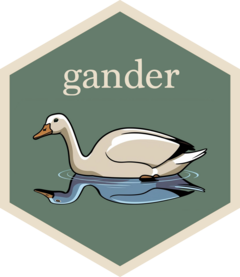

---
editor_options:
  markdown:
    wrap: sentence
title: Harness Local LLMs and GitHub Copilot for Enhanced R Package Development
format: hugo-md
author: Dr. Mowinckel
date: '2025-03-03'
categories: []
tags:
  - R
  - Ollama
  - API
  - LLM
slug: ollama
image: images/featured.jpg
image_alt: >-
  A digital illustration combining the Ollama logo and the R statistical
  software logo. The design features a clean and sleek integration of both
  logos. The color scheme is tech-inspired, with smooth gradients and modern
  aesthetics, ensuring a blend of the two logos.
summary: >-
  In this post I explore local large language models (LLMs) with R for code
  assistance, using tools like chores, ensure, gander, and continue in Positron.
  I discover limitations with smaller models on local machines and balance
  computational resources with model capabilities. The post explores R options
  and keybindings for various tools, adjusting settings to optimize performance.
  Lastly, I switch to GitHub Copilot for better results, encountering rate
  limits but finding workarounds to control autocomplete triggers. The summary
  highlights the journey of setting up LLMs for efficient coding in R,
  emphasizing customization and optimization.
seo: >-
  Unlocking code assistance with local LLMs & GitHub Copilot! Discover R
  optimization & streamline your workflow.
---


Large Language Models as code helpers are really one of the biggest changes to programmers daily lives for a good while.
While LLMs can't fix our applications for us, they can help us work a little faster and maybe get a first proof-of-concept out of the door.
Before starting to use Positron, I relied on GitHub co-pilot (I am a registered Educator on GitHub so I have that for free) in both RStudio and VSCode to help me out.
After switching to Positron, I lost that connection as Positron does not have GitHub Co-pilot integration.

Mostly, I was using the GPT run by my University to help me out when I needed it.
But the back and forth between a browser and my IDE was a much less enjoyable experience than having it all in one place.
Especially when I've been working on an update to a work package wrapping an API and needed tests for the new functionality, a GPT is just not as great as a proper co-pilot.

So, as I usually do, I complained to Maêlle, and through the R-Ladies grapevine (meaning [Hannah Frick](https://www.frick.ws/)) she told me about [this post](https://www.tidyverse.org/blog/2025/01/experiments-llm) on the Tidyverse blog about R packages to accomplish some functionality I was after.
Knowing [Simon Couch](https://www.simonpcouch.com/), I was sure this had to be good.
I had notice him talk about his [chores](https://simonpcouch.github.io/chores/) package before, and thought it looked good, and then he adds two more packages [gander](https://simonpcouch.github.io/gander/) and [ensure](https://simonpcouch.github.io/ensure/) to help out during package development and testing.
Genius!

After reading the post, I knew I wanted to give them a go, and finally get my new setup LLM integrated.
But, I am also cheap, I don't want to pay for LLM usage.
I fist had a look at my Unis LLM API, and I think my usage of it would be low enough that I would not be billed.
But that also meant having to figure out and set up an [ellmer](https://ellmer.tidyverse.org/) function to that API, and that was a little more work than I wanted right now.

The next natural step was then to use [Ollama](https://ollama.com/) which can run locally on your own computer.
Depending on the power of your computer, this is a good option for free LLM aid.
My Mac has 16 cores, so I thought it was worth a try.

## Working with Ollama

First of all, you'll need to [download the Ollama application](https://ollama.com/download), and then install it as your OS requires.
It runs on Mac, Linux and Windows, so people should be more or less covered.
Once installed, you will need to get a model you can run.
Ollama offers many [different models](https://ollama.com/search), so it's mostly about what you want.
To test, I grabbed [deekseek-r1](https://ollama.com/library/deepseek-r1), since DeepSeek is getting all the hype lately, and [ollama3.3](https://ollama.com/library/llama3.3) in case I wanted to test one of Ollama's own models.

``` sh
ollama pull deepseek-r1
ollama llama3.3
```

``` sh
ollama list
```

    NAME                  ID              SIZE      MODIFIED    
    deepseek-r1:latest    0a8c26691023    4.7 GB    5 days ago    
    llama3.1:latest       46e0c10c039e    4.9 GB    5 days ago  

Alrighty, we have some models we can run!
So, we'd better run them.

``` sh
ollama run deepseek-r1
>>> 
Use Ctrl + d or /bye to exit.
>>> hello
<think>

</think>

Hello! How can I assist you today? 😊

>>> I just wanted to check if this was working. What can you help me with?
<think>
Alright, so the user just said they wanted to check if something was 
working and asked what I can help them with. Looking back at our 
conversation history, I had previously greeted them with a friendly 
"Hello! How can I assist you today?" Now they're following up.

Hmm, maybe they were testing my response or checking if everything is up 
and running smoothly. It's good to acknowledge their follow-up and invite 
them to ask about specific topics. I want to make sure they feel 
comfortable asking whatever they need help with.

I should respond in a friendly manner, letting them know I'm here to 
assist and prompt them to share what they need help with. Keeping the tone 
positive and open-ended encourages them to communicate effectively.
</think>

Great! If you have any questions or need assistance with something, feel 
free to ask. I'm here to help! What can you tell me about what you'd like 
to check or find out? 😊
```

Great.
It's running and responding, and even "thinks" back to me, so I can evaluate if its understood my instructions.
I also asked it to generate a tidyverse-style code for the Gapminder data to plot it.
And it did, the code was indeed somewhat bloated and did not grab the data from the correct source, however the code did work once some small things were adapted.
Good proof of concept, that I could tidy up and work on further if I wanted.

This was running in my terminal, but I wanted it running from within my IDE, Positron.
Let us have a look at how that could look.

### Working with Ellmer

[Ellmer](https://ellmer.tidyverse.org/) is Posits package for interacting with LLM's from within R.
Ellmer already comes with a function to easily communicate with [Ollama as a chat](https://ellmer.tidyverse.org/reference/chat_ollama.html) from within R.

Ellmer uses R6 objects, which I really need to get a little more comfy with.
They feel quite different than "standard" R methods, so it's all a little foreign.
Basically, with R6, you have an object that it self has functions to call on.
On the case of Ellmer, the most essential functionality to chat with the LLM is the `chat()` function.

I'm gonna call my Ollama Chat Ola, which is one of the most common names in Norway.

``` r
ola <- ellmer::chat_ollama(model="deepseek-r1")
ola$chat("Hey. how are you doing?")
```

    <think>

    </think>

    Hi! I'm just a virtual assistant, so I don't have feelings, but I'm 
    here and ready to help you with whatever you need. How are *you* doing
    today? 😊

Cool.
And thanks for reminding me that you don't have feelings, because I am one of those who does indeed thank her LLM's for providing assistance.
(I want my slate clean when the AI uprising happens, maybe they will spare me.)

Now we can chat with Ole from within R if we want.
That can be quite convenient.
But we want more :D

### Setting up chores <a href="https://github.com/simonpcouch/chores"></a>

Chores (previously known as pal) can help out with certain repetitive tasks during package development.
These are exactly the things I *love* getting help with, as stated in the package README

-   `"cli"`: [Convert to
    cli](https://simonpcouch.github.io/chores/reference/cli_helper.html)
-   `"testthat"`: [Convert to testthat
    3](https://simonpcouch.github.io/chores/reference/testthat_helper.html)
-   `"roxygen"`: [Document functions with
    roxygen](https://simonpcouch.github.io/chores/reference/roxygen_helper.html)

It's so convenient and helpful!


To get that working, we need to add some R options so that chores knows which LLM you want to use.
Chores uses ellmer chats, so we know from above already that we have an Ollama chat we can use.

Open your `.Rprofile` (either by knowing where it is or using `usethis::edit_r_profile()`).

Depending on what you might already have in there, it can either be empty or have lots of stuff ([like I have](blog/2024/rproject)).
You need to add this option about what ellmer chat option you want to use.

``` r
options(
  .chores_chat = ellmer::chat_ollama(model="deepseek-r1")
)
```

Once that is in your `.Rprofile` you'll need to restart your R-session for it to become available.

You will also want a keyboard shortcut for ease of use!
In RStudio, navigate to Tools \> Modify Keyboard Shortcuts \> Search "Chores", and Simon suggests `Ctrl+Alt+C` (or `Ctrl+Cmd+C` on macOS).

Adding keybindings in Positron is a little different.
To add custom keybindings, open the keybindings helper with `cmd + k cmd + s` (keep `cmd` pressed and then type `k` then `s` in succession).
From there, you can open the `keybindings.json` file from the upper right hand corner of the file pane.


Now, add the following to create a shortcut using the `ctrl + cmd + c` combination.

``` json
{
    "key": "Ctrl+Cmd+C",
    "command": "workbench.action.executeCode.console",
    "when": "editorTextFocus",
    "args": {
      "langId": "r",
      "code": "chores::.init_addin()",
      "focus": true
    }
}
```

Of course, if you want another combination, you can alter the first part of the code to whatever works for you!

At this point I tested my new chores plugin, and it was not good.
To no fault of the tool, but to my choice of model!
`deepseek-r1` is a reasoning model, where it thinks outloud before returning something verbose to you.
That does not work well if you have code you want overwritten.
My test-function was being overwritten with lots of verbose LLM thinking and resoning.
Not that lovely output as shown in the chores README.

So I went looking for other LLM's that might do the trick.

<blockquote class="bluesky-embed" data-bluesky-uri="at://did:plc:sgdhwgqd2ulz4zf5i4n4clnd/app.bsky.feed.post/3liwdo3taty2y" data-bluesky-cid="bafyreidypleisvw3qgvsuvwayx6vxjtd44x5vbe2inm7m4djwz723dnaea">
<p lang>

I\'m working on a blogpost connecting #rstats with a local #Ollama #llm for code assistance. I\'m struggling to find a good model for this. Deepseek-r1 is nice for chatting, but I\'d like a model that can output pure code, without lots of reasoning.

I\'d love to hear from people with Ollama experience<br><br><a href="https://bsky.app/profile/did:plc:sgdhwgqd2ulz4zf5i4n4clnd/post/3liwdo3taty2y?ref_src=embed">\[image or embed\]</a>
</p>
--- ᴅʀ. ᴍᴏᴡɪɴᴄᴋᴇʟ\'ꜱ (<a href="https://bsky.app/profile/did:plc:sgdhwgqd2ulz4zf5i4n4clnd?ref_src=embed">@drmowinckels.io</a>) <a href="https://bsky.app/profile/did:plc:sgdhwgqd2ulz4zf5i4n4clnd/post/3liwdo3taty2y?ref_src=embed">Feb 24, 2025 at 13:23</a>
</blockquote>
<script async src="https://embed.bsky.app/static/embed.js" charset="utf-8"></script>

Turning to social media network for help, as my social media mainly consist of other researchers and developer.
I got some nice replies that helped me explore a little more, and also let me think more about my prompts to the models.
Some people noted that local LLMs are slower and not as powerful as the ones you get running on a cluster.
Well, that mostly depends on your local computer, that is.
I have a MacBook Air with an M2 silicone chip with 24Gb memory, so I can manage a decent size model locally, I think.

After some discussions on LinkedIn, Bluesky and Mastodon, I started properly testing the [qwen2.5-coder](https://ollama.com/library/qwen2.5-coder) model, and it does indeed seem pretty good.
I also reached out to Simon directly to ask if he had any tips.
The downside is that I cannot run the full 32b model, but had to go all the way down to the 7b model, the larger models were just taking too long (and I assume that is because they are too large for my computer to really work).


That leaves a lot to be desired, really.
It likely is doing poorly because I can't run a larger and better model.
What I noticed with all my chores tests was that it looks like the prompts seem to be ignored.
I know Simon put a lot of instruction into the chores shortcuts and a lot of them seem to be ignored by these small models (Simon's words, not mine).
So, that's a downside to running local models, the inability to run large models if you dont have the power for it.

### Setting up Ensure

I'm not giving up though.
Ok, so chores didnt do it yet, let me take [ensure](https://simonpcouch.github.io/ensure/) out for a ride and see.
Ensure is supposed to help with generating tests for R functions in packages.
I love that!
I've been quite laxing in my testing in my packages lately, maybe this will help me get better at it?

As before, we need to add some R options to set it all up.

``` r
options(
  .ensure_fn = "chat_ollama", 
  .ensure_args = list(model = "qwen2.5-coder:7b")
)
```

and then I read further down the README and get to

> The ensurer is currently not available in Positron as Positron has yet to implement document ids that the package needs to toggle between source and test files.

Darn!
Oh well, hopefully they will get that sorted in not too long.

### Setting up gander <a href="https://github.com/simonpcouch/gander"></a>

Last one to try is Gander.
This one is more flexible in a way, than both chores and ensure.
It's a chat, but it has access to your R environment, so it can make some better decisions on code you are asking for.
That sounds really swell!

as before, we need some R options

``` r
options(
  .gander_chat = ellmer::chat_ollama(model = "qwen2.5-coder:7b")
)
```

and some keybindings

``` json
{
  "key": "Ctrl+Cmd+G",
  "command": "workbench.action.executeCode.console",
  "when": "editorTextFocus",
  "args": {
    "langId": "r",
    "code": "gander::gander_addin()",
    "focus": true
  }
}
```

and let's give it a go!


Now, that is much better!
The code still needs some fixing, but it is much better than what I got with chores.
Likely because I could give it less instructions, so it remembered it all and could follow.

It's not going to be a huge game changer, but I find adapting code very easy, since I am proficient enough in R to have been able to generate it all on my own, it's just nice to take some shortcuts.

### Using the Continue extension in Positron

The last thing I want to talk about is using the [continue](https://docs.continue.dev/) extension in Positron (or VSCode if you use that).
This extension is really really nice, and I had tried setting it up before I saw all these lovely extra R packages for LLM help in coding.
But I didn't really set it up correctly, and gave up a little.
Because I was working on this post though, I decided to really give it another go.

There are two MAIN features in continue, a chat (with possibility of setting up custom slash commands with precreated prompts etc), and code completion *while you code*.
This was a copilot feature I missed from VSCode, as I found it very helpful as I was working.

Continue is not too difficult to set up, if you actually set aside a little time to do so.
First install the [extension from openVSX](https://open-vsx.org/extension/Continue/continue).
Once its done installing, it should pop up in your sidebar, and by clicking it you can start setting up models you want to have access to.


For Ollama, I have set it up for chat model and autocomplete model.
For simplicity, I'm only showing the part of my config file for continue (it will open once you add a model through the wizard) that sets up the models.
There are lots more settings in the config for special commands.

``` json
{
  "models": [
    {
      "title": "Qwen 2.5 Coder 14b",
      "model": "qwen2.5-coder:14b",
      "provider": "ollama",
      "systemMessage": "You are an expert software developer. You give helpful and concise responses."
    }
  ],
  "tabAutocompleteModel": {
      "title": "Qwen 2.5 Coder 14b",
      "model": "qwen2.5-coder:14b",
      "provider": "ollama",
      "systemMessage": "You are an expert software developer. You give helpful and concise responses."
  }
}
```

How does the chat look?


It does the job, verbose and all, but is quite slow.
Here I was running the 14b model, which is more accurate, but it was running somewhat slowly.
7b was faster, but made less desirable suggestions.

### Are we happy about how Ollama is working with these tools?

Ok, so I think we can all agree that all this testing has showed that there are definite limitations to doing all this on a local machine that can't run the largest models.
That being said, I still think there is help from the models in this process, especially for smaller-scale tasks or prototyping.

One thing that was [pointed out to me on Bluesky](https://bsky.app/profile/matteomics.bsky.social/post/3lj45bgmgek2j) was that we could set the timeout limit for Ellmer.
Because Ellmer is powering all these other tools, setting good options for ellmer seems like a good way to go.
I added an option to increase the timeout limit for Ellmer requests to 3 minutes (rather than the 1 minute that is the default)
This did indeed help, and enabled me to run some larger models and things were looking much better.

So now it looks like this for me.

``` r
options(
  ellmer_timeout_s = 2*60,
  .chores_chat = ellmer::chat_ollama(model = "qwen2.5-coder:14b"),
  .ensure_fn = "chat_ollama", 
  .ensure_args = list(model = "qwen2.5-coder:14b"),
  .gander_chat = ellmer::chat_ollama(model = "qwen2.5-coder:14b")
)
```

I'm sure there are still also lots of Ollama tips and tricks I could do to make things better, but for now this is where I have landed.
[Fluxmind](https://fosstodon.org/@fluxmind@ioc.exchange) shared with me his [Ollama FAQ](https://github.com/maglore9900/personal_Ollama_FAQ) that he's put together based on what he's seen on the Ollama discourse.

## Connecting with GitHub

As I was working on all this, I noticed ellmer has a `chat_github()` function.
I thought maybe if this connected with my free copilot stuff (since I am a registered educator on GitHub I have free [GitHub Pro](https://docs.github.com/en/get-started/learning-about-github/githubs-plans#github-pro)), that would be a nice way to get good code help for free.

So I switched everything to GitHub chat for elllmer, and it was sooooo smooth.
Much faster, much better and just really really cool.

For that to work I just switched it all, and didn't really need to do anything else.

``` r
options(
  .chores_chat = ellmer::chat_github(model = "gpt-4o"),
  .ensure_fn = "chat_github", 
  .ensure_args = list(model = "gpt-4o"),
  .gander_chat = ellmer::chat_github(model = "gpt-4o")
)
```

If you already have your system connected to GitHub, check with `usethis::git_sitrep()` for your status from R and it will aid you in getting setup correctly for it.
But I reiterate, I have a educator free copilot thing, so be careful you don't be charged if you don't have the same free access or permissions.


My models setup in the continue config.json now looks like this:

``` json
{
  "models": [
    {
      "model": "gpt-4o",
      "title": "GPT-4o",
      "systemMessage": "You are an expert software developer. You give helpful and concise responses.",
      "apiKey": "<<insert from gitcreds::gitcreds_get()$password>>",
      "provider": "openai",
      "apiBase": "https://models.inference.ai.azure.com"
    },
    {
      "title": "Qwen 2.5 Coder 14b",
      "model": "qwen2.5-coder:14b",
      "provider": "ollama"
    }
  ],
  "tabAutocompleteModel": {
    "model": "gpt-4o",
    "title": "GPT-4o",
    "systemMessage": "You are an expert software developer. You give helpful and concise responses to code.",
    "apiKey": "<<insert from gitcreds::gitcreds_get()$password>>",
    "provider": "openai",
    "apiBase": "https://models.inference.ai.azure.com"
  }
}
```

Oh! I finally had auto-complete, which I missed so much.
And it was all so fast.
Then, I started getting this error:


Oops!!
Seems like I really fast hit rate limiting with that setup.
I wasn't used to that from co-pilot in VScode, it likely has some exception for that not to happen.
That being said, the rate limit is for 50 requests per 24hours, so that is not a whole lot.
So I guess you'd only use this if you had no better options.

I couldn't find a way to fix the rate limiting in continue itself, but did find a way where autocomplete would only be triggered if I asked it to (rather than automatically).
This was something I wanted to do anyway, as I wasn't too happy with how triggerhappy it was.
It was autocompleting even as I was writing prose for my blog.
I only want to use it for code assistance.

Firstly, I had a look on the [options Continue have for autocomplete](https://docs.continue.dev/customize/deep-dives/autocomplete).

I firstly set it up to ignore all markdown files, I don't want code assistance in those.


I did that by listing them as files to be excluded with the string

\``*/.md, */.?md`

Next, I went to Positron settings and searched for `editor.inlineSuggest.enabled` and set it to false.
This would mean that the suggestions would not pop up by themselves.
Then I needed to specify a keycombination that would enable me to trigger the suggestion on demand.
So I opened my Positron keybindings as indicated before, and added the following

``` json
{
  "key": "ctrl+cmd+l",
  "command": "editor.action.inlineSuggest.trigger"
}
```

Now I can trigger autocompletion in R files with `cmd + ctrl + l`.
I also tried gander and chores and the results were really a lot nicer.
Downside is only doing 50 of these per day... but I'm not working yet, so it won't be an issue for a good long while yet.


## Conclusion

All in all, I'm quite happy with this exploration.
I know how to get things working locally, and to connect to GH and I'm looking forward to using all this when I'm back to work.

Will you be trying these things out, or have other solutions I should know of?
