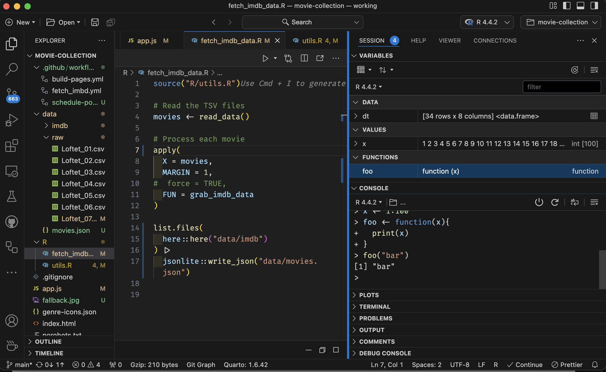
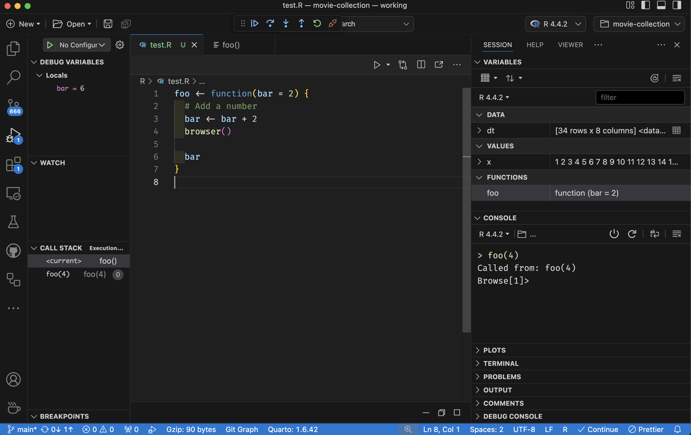
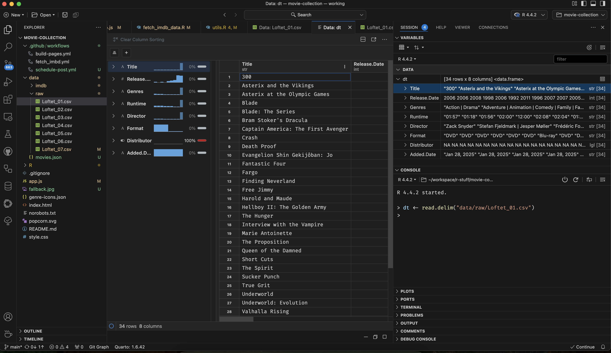

_This post is on request from [Maëlle Salmon](https://masalmon.eu/), who has finally decided to give Positron a go!_


I started using [Positron last year](/blog/2024/positron).
We all know [I'm not working](/blog/2025/longcovid), so it's not like I've been totally immersed in Positron. 
I have, on the other hand, been doing some side-projects for myself and R-Ladies, and writing blog posts exclusively in Positron for about 6 months now.
I have not needed RStudio for all this time, and it's at the point where I feel uninstalling it is just around the corner.

I thought I'd give you an update about what I'm enjoying with it and what my very last pain point is: the debugger.

## Why I enjoy Positron

This list is not particularly different from my [initial post](/blog/2024/positron). 
All the points of why I like Positron still stand.

### 1. It's a much more modern IDE

The interface and setup is just much much more contemporary.
RStudio feels dated in comparison.
The file explorer is so neat, and I love that it's a tree, rather than having to look at a single folder at the time like in RStudio.

### 2. Polyglot

While you _can_ code in other languages in RStudio, it's not inherently made for it.
So you don't easily have access to linters and other nice enhancement tools.
Positron, since it's based on VSCode, can deal with any language, and all the extensions mean you can get all these extra tools to enhance your work.
Like [ESLint](https://open-vsx.org/extension/dbaeumer/vscode-eslint) for linting your javascript.
I'm sure there are lots of extensions for languages I don't use, so search for what you might want and test things out!

Of my fav things right now is the [Air](https://www.tidyverse.org/blog/2025/02/air/) extension, which will auto-format your code upon saving the file!
No more finnicky stylizing the code so it looks better, it happens automagically when the file is saved.
To be fair, you can get Air for RStudio also, but it's much easier to set up for Positron.
Note that Air is for R, there are other similar tools for other languages.

### 3. Environment viewer

In comparison to VSCode, its much better for Data Science, since you have the environment viewer.
One thing I never likes in VSCode, was that I felt like working completely uninformed about my project state compared to RStudio, not being able to get an easy overview of what was in my working environment.



### 4. RStudio viewer pane compatibility

A feature that did not exist when I write the last post, was that Positron "shims" the RStudio viewer pane.
This means that any package that has functionality that sends something to the viewer pane, should also work in Positron!

Blogdown users should rejoice, as this makes the popular `blogdown::serve_site()` now work in Positron, and other Shiny addins should also work.
Suuuuper nice!


## What are my remaining pain points?

### The debugger

Ok, so debugging in Positron is know to have some quirks.
As I do, I asked on social media for tips.



I got some nice replies, from the developers and other power users, which did help!
But it also revealed that there are definite bugs in there.
I'll summarise what was discussed h below.

Instead, you need to enter the Debug section of the left sidebar.
Unlike RStudio, your working environment _is not_ changed into the function you are debugging. 
In stead, you need to enter the Debug section of the left sidebar.

[Screenshot of the Positron Debugger pane. Notice how my working environment (upper right) does not contain the debugging variable, but the debugger (left side) has it. ](img/debugger1.png)

This is easy enough to get used to, and also highlights that while you are in the function, R technically still has access to your working environment, so that might still trip up your functions in other settings. 


#### Autofocus to function tab
In RStudio, when you enter the debugger in your own functions, you auto-focus on the function in whatever file you have it in.
In Positron, a [new tab is opened with the contents of the function](https://github.com/posit-dev/positron/issues/3151) as it is, for you to run through, but you cannot alter the code because it's in memory, not an actual file.
This is a huge annoyance.
Notice in the screenshot above, how the middle pane, which usually contains my scripts, has a tab open with the greyed out function code.
This is what you autofocus to when you enter the debugger.



This means that a workflow I use a lot, which is make an (almost) empty function, and jump into it to start writing the function while in debugger mode is kind of frustratingly hard.
It means jumping back and forth between a 'useless' tab (with the original contents of the function) and where I have defined the function in my `.R`file.

Hopefully, there will be a better solution for this in the near future.

#### History from debugger remains in main environment
Everything you do while debugging (like running next line code with `n`), [remains in your console history](https://github.com/posit-dev/positron/issues/4478).
Which means you R history get seriously bloated with non-senscical code.
For those of us who repeatedly navigate through R history to pick up recent lines of code to rerun, this is quite frustrating.

#### Running code while in the debugger
What the struggle is, in my opinion, is _how to run the code_ when you are in the debugger.
My previous workflow would be to copy and paste sections I wanted to run into the console, allowing me to jump back and forth between different parts of the function while I figured out a solution.

This [will not work](https://github.com/posit-dev/positron/issues/5928) in Positron currently.
Pasting into the console while in debugging mode, will leave your console forever waiting for input, as if you have not closed a bracket or parentheses correctly.
You can double check your code as much as you like, nothing will help.
It's a bug in Positron, and they don't have a solution yet.

How do you exit this strange scenario??
You spam the `ctrl` + `c` combo until you are out of it.
How many times you need to do this, varies, I have not found a systematic reason for the number of button clicks needed.
But rest assured, you _will_ be able to exit this hanging state.


Running code in the debugger can be done with `ctrl` + `enter`, which will run the code line by line from the `browser()`, breakpoint or other debugging marker you have used.
If I've moved the cursor for some reason, whenever I do `ctrl` + `enter`, it just is stuck at my `browser()`, without running other code. 
However, if you've moved the cursor manually, that might not work, for reasons I don't know.
If I've moved the cursor for some reaason, whenever I do `ctrl` + `enter`, it just is stuck at my `browser()`, without running other code. 


#### Exiting the debugger
It also tok me a little while to learn how to exit the debugger correctly.
In RStudio, I have to admit to exiting with the pointy-clicky method in the IDE.
This is, kind of weird, as I usually always opt for keyboard solutions for things, but I think it was just a thing that has stuck around from my novice days and I never transitioned out of it.
Now, however, Positron does not necessarily have an super pointy-clicky way to exit, which it great!
Because now I've learned to exit properly by typing `Q` in the console and hitting enter.
Much better workflow!

So, while there still are annoying things with the debugger in Positron, I must admit that it has helped me better understand the R debugger as a tool.
Before, I very much relied on the help RStudio was giving me with debugging, but I think I understand better how it actually works now.

I'd you'd like to see a live demo of the debugger, you can see [James Balamuta's video on YouTube](https://www.youtube.com/watch?v=p_4ZS-nnQ2Q).


### The data viewer
So, the data viewer is really nice, and mimmicks RStudio's viewer well. It does have some exceptions, though.
While looking at normal data.frames, its very convenient. 
But it does not handle labelled data, which I have become a recent fan of thanks to [Shannon Pileggi](https://www.youtube.com/watch?v=eoI9QZdHBMw), while RStudio has had that support a really long time.
It also does not give you the option to explore lists like a tree, like RStudio does. 
And that's a real bummer! 
I more often used to inspect lists in RStudio's data viewer rather than data.frames, I more often print data.frames to the console and subset them to inspect various aspects of them.



One other thing that annoys me with it, is that it also is used to display text-files with common tabular data extension (csv, tsv, etc.).
I prefer using the [Rainbow csv extension](https://open-vsx.org/extension/mechatroner/rainbow-csv) in Positron for looking at tabular text file content, as I often either am looking for incorrect data entries, or data I manually want to alter (because I made the data and just want a quick fix).


Thankfully, writing this post I also noticed the little tab at the top of the data viewer while looking at a csv file that says `Open as plan text` and presto!
I could view my file with ranbow csv in stead.
So I guess this is no longer a pain point, really!


## My current Positron settings file

Just for the sake of it, I'll also include here what I have in my Positron settings file.
These help control the IDE and some extensions to behaviours or appearance that I prefer.
You can quickly open your settings file by `cmd` + `k`, and then choosing the "open file" icon on the right hand side of the settings pane.

```json
{
    "editor.wordWrap": "bounded",
    "editor.inlineSuggest.enabled": false,
    "editor.fontFamily": "'Fira Code', monospace",
    "editor.fontLigatures": true,
    "editor.fontSize": 14,
    "[r]": {
        "editor.formatOnSave": true
    },
    "[quarto]": {
        "editor.formatOnSave": true
    },
    "workbench.colorTheme": "Default Dark Modern",
    "workbench.editor.enablePreview": false,
    "positron.r.quietMode": true,
    "database-client.autoSync": true,
    "git.autofetch": true,
    "githubPullRequests.pullBranch": "never",
    "githubPullRequests.pushBranch": "always",
    "python.defaultInterpreterPath": "/opt/homebrew/bin/python3",
    "gitlens.defaultDateFormat": "YYYY-MM-D hh:mm",
    "gitlens.defaultDateShortFormat": "YYYY-MM-D",
    "gitlens.defaultTimeFormat": "hh:mm"
}
```

## Where are we now?

Positron is quickly shaping up to be a great go-to tool for development _and_ for data science. 
In terms of replacing RStudio, it's done it for me.
I'm still uncertain if I would teach beginners with Positron rather than RStudio, the setup is for sure more daunting and I don't want beginners confused by something that is supposed to help them.
But don't worry, RStudio is not going anywhere!

I think the future for Positron is very bright, and I'm happy for all the resources Posit are putting into its development.

Have you tried it yet?
What are your pro's and con's so far?
