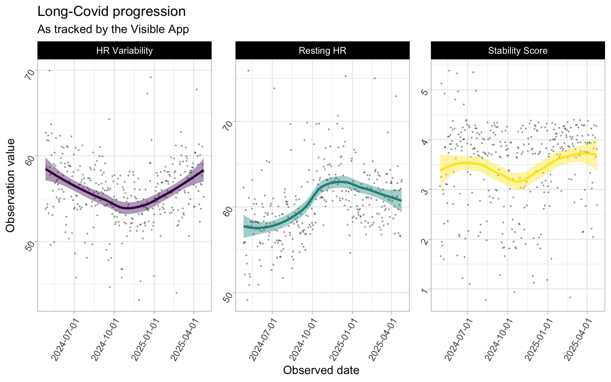
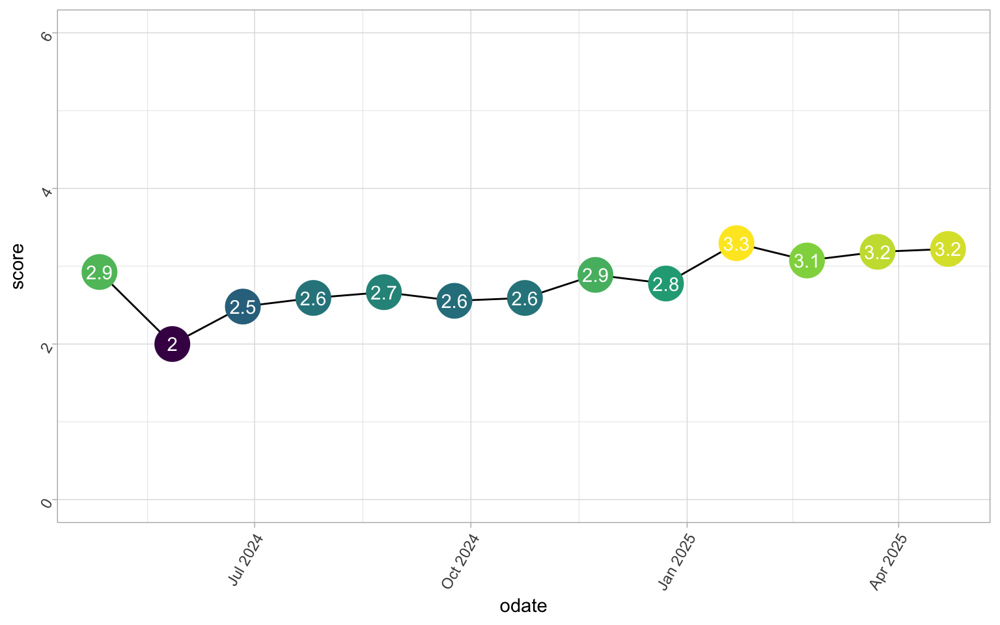

---
editor_options:
  markdown:
    wrap: sentence
title: A year with Visible Long-Covid Tracking
format: hugo-md
author: Dr. Mowinckel
date: '2025-05-01'
categories: []
tags:
  - R
  - health-data
  - longcovid
slug: visible
image: index.markdown_strict_files/figure-markdown_strict/featured-1.png
image_alt: >-
  A line graph shows a score fluctuating over time from May 2024 to April 2025.
  The score starts at 2.9, dips to 2 in June 2024, then gradually increases and
  plateaus around 2.6 until late December 2024. It then rises to 2.9, 2.8, 3.3,
  3.1, 3.2, and ends at 3.2. The points on the line are colored on a gradient
  from dark purple (low score) to bright yellow (high score).
summary: >-
  This post dives into a year of tracking Long Covid symptoms and progress using
  the Visible app. Dr. Mowinckel, a quantitative scientist, shares their
  experience monitoring heart rate, heart rate variability (HRV), daily
  symptoms, and functional capacity using the app's features and the FUNCAP27
  questionnaire. Discover how this data provides insights into pacing
  strategies, identifies potential warning signs like HRV spikes, and reveals
  meaningful clusters of interconnected symptoms and experiences. Explore the
  journey of living with and managing Long Covid through the lens of personal
  health data.
seo: >-
  Tracking Long Covid with Visible app: 1 year of health data. Insights & pacing
  strategies.
---


[I have previously](./blog/2025/the-difficult-year) written about having been sick with long covid for a year.
It's not a picnic, and recovery is a slow and tedious process of extremely slowly trying to increase what I can manage to do within a single day.

Pretty early on, I started tracking my symptoms and experiences.
Well, I am a quanitiative scientist, am I not?

I got myself a mid-tier Garmin watch, the Forerunner 165 Music, to monitor my heart in particular, throughout the day.
I felt it racing for absolutely nothing (just walking inside, or taking a shower).
With my watch in hand, I could document my heart rate climbing up to 140 beats per minute while taking a shower...
That just could not be normal, that's heart rate for exercising, not a relaxing shower!
Well, truth be told, with that heart rate there is nothing relaxing with my showers anymore.

Initially, I had my own little survey that I answered every day.
I have that data, but as usual, I was being too thorough and the data is just not easy to use.
It's not my field, survey data.
And it totally is an artform to develop good survey data.

In April of last year, I was told about the [Visible app](https://www.makevisible.com/) for daily tracking of "invisible" illnesses, like Long covid, Me, POTS etc.
I downloaded it and started using it.
They do also have a wearable device for continuous heart rate monitoring, but that is not available in my location.
The app, though, does a daily measurement of 1 minute heart rate through the camera.
Its really quite nifty, you cover the camera lens with a finger, while the flash is on, and the camera records fluctuations in the red colour of your skin to estimate heart rate and heart rate variability.
It also includes a question in the morning to rate your sleep on a 4 point scale, and questions in the evening about your symptoms that day and their severity, your activity level, and if you experienced a crash or got your period that day.
This was better suited for me to answer than my own survey, so I stopped filling that out when I started with Visible.

Visible also has a monthly questionnaire where you evaluate what you are able to to do for various activities over the month and what it costs you to do that activity.
The [FUNCAP27](https://pmc.ncbi.nlm.nih.gov/articles/PMC11204454/) was developed and validated on ME/CFS patients, and is a great tool for assessing functional capacity.

<figure>

<figcaption aria-hidden="true">Functional capacity score of 3.2 out of 6.0, lower than a healthy person’s score. There is a semi-circle (like a rainbow shape) where one side i 0.0, while other side is 6.0 (max score). The semi-circle is filled with a yellow colour untill a little over half way. Breakdown shows impact on daily activities, particularly reactions to light and sound.</figcaption>
</figure>

With this, I have *DATA*.
The App has several tools inside to get an idea of how you are progressing, and if you are pacing well.
These have been nice to look at and monitor how I'm doing.

<figure>

<figcaption aria-hidden="true">A line graph (with bars in the background) shows two trends from October 27, 2024, to April 24, 2025. The top graph for morning stability, in blue, fluctuates between roughly 3 and 4. The bottom graph for heart rate variability, in orange, fluctuates between roughly 40 and 70.</figcaption>
</figure>

I thought 1 year of data was a good place to sit down with the exported data and have my own take on looking at the data.

## Getting my data

Getting my Visible data is really very easy.
Inside the app, in your profile, there is a "Export Health Data" button, which exports the data as a csv.
And now, we can have a look!

``` r
library(tidyverse)
```

    ── Attaching core tidyverse packages ──────────────────────── tidyverse 2.0.0 ──
    ✔ dplyr     1.1.4     ✔ readr     2.1.5
    ✔ forcats   1.0.0     ✔ stringr   1.5.1
    ✔ ggplot2   3.5.2     ✔ tibble    3.2.1
    ✔ lubridate 1.9.4     ✔ tidyr     1.3.1
    ✔ purrr     1.0.4     
    ── Conflicts ────────────────────────────────────────── tidyverse_conflicts() ──
    ✖ dplyr::filter() masks stats::filter()
    ✖ dplyr::lag()    masks stats::lag()
    ℹ Use the conflicted package (<http://conflicted.r-lib.org/>) to force all conflicts to become errors

``` r
visible <- read_csv(here::here(
  "content/blog/2025/05-01_visible/visible.csv"
))
```

    Rows: 11632 Columns: 4
    ── Column specification ────────────────────────────────────────────────────────
    Delimiter: ","
    chr  (3): tracker_name, tracker_category, observation_value
    date (1): observation_date

    ℹ Use `spec()` to retrieve the full column specification for this data.
    ℹ Specify the column types or set `show_col_types = FALSE` to quiet this message.

``` r
glimpse(visible)
```

    Rows: 11,632
    Columns: 4
    $ observation_date  <date> 2025-04-24, 2025-04-24, 2025-04-24, 2025-04-24, 202…
    $ tracker_name      <chr> "Sleep", "HR Variability", "Resting HR", "Stability …
    $ tracker_category  <chr> "Sleep", "Measurement", "Measurement", "Measurement"…
    $ observation_value <chr> "1", "55", "63", "3", "2", "0", "0", "0", "0", "1", …

And my heart is so happy seeing this data.
I'm so used to getting data in all sort of weird formats, but look at this!
Nice, tidy, tall data for me to play with.
We barely need ANY data munging to start getting plots of *everything*!
But we need a little :P

``` r
# What are our categories
unique(visible$tracker_category)
```

     [1] "Sleep"                "Measurement"          "Cognitive"           
     [4] "Pain"                 "Brain"                "Muscles"             
     [7] "Heart and Lungs"      "Gastrointestinal"     "Social"              
    [10] "General"              "Menstrual"            "Experience"          
    [13] "Emotional"            "Physical"             "Sensory"             
    [16] "Funcap_concentration" "Funcap_upright"       "Funcap_hygiene"      
    [19] "Funcap_outside"       "Funcap_walking"       "Funcap_light"        
    [22] "Funcap_communication" "Funcap_home"          "Note"                

``` r
# What are our trackers
unique(visible$tracker_name)
```

     [1] "Sleep"                                                                                     
     [2] "HR Variability"                                                                            
     [3] "Resting HR"                                                                                
     [4] "Stability Score"                                                                           
     [5] "Mentally demanding"                                                                        
     [6] "Stomach pain"                                                                              
     [7] "Lightheadedness"                                                                           
     [8] "Headache"                                                                                  
     [9] "Muscle weakness"                                                                           
    [10] "Shortness of breath"                                                                       
    [11] "Diarrhea"                                                                                  
    [12] "Socially demanding"                                                                        
    [13] "Anxiety"                                                                                   
    [14] "Joint pain"                                                                                
    [15] "Allergies"                                                                                 
    [16] "Palpitations"                                                                              
    [17] "Brain Fog"                                                                                 
    [18] "Memory issues"                                                                             
    [19] "Period"                                                                                    
    [20] "Nausea"                                                                                    
    [21] "Crash"                                                                                     
    [22] "Emotionally stressful"                                                                     
    [23] "Depression"                                                                                
    [24] "Physically active"                                                                         
    [25] "Blurred vision"                                                                            
    [26] "Dizziness"                                                                                 
    [27] "Noise sensitivity"                                                                         
    [28] "Muscle aches"                                                                              
    [29] "Light sensitivity"                                                                         
    [30] "Fatigue"                                                                                   
    [31] "Nerve pain"                                                                                
    [32] "Constipation"                                                                              
    [33] "Reading a short text such as a mobile phone text message"                                  
    [34] "Standing up for approx. 5 minutes e.g. while queuing or while cooking"                     
    [35] "Using the toilet (not bedpan or bedside commode)"                                          
    [36] "Going to a shop for groceries"                                                             
    [37] "Focusing on a task for approx. 2 hours continuously"                                       
    [38] "Physical activity with increased heart rate for approx. 15 min"                            
    [39] "Staying in a noisy environment (shopping mall café or open plan office) for approx. 1 hour"
    [40] "Managing a full working day (non-physical work such as office work classes or lectures)"   
    [41] "Walking a short distance indoors from one room to another"                                 
    [42] "Stepping right outside your home"                                                          
    [43] "Using public transport (bus or train)"                                                     
    [44] "Showering standing up"                                                                     
    [45] "Participating in organized leisure activities such as classes sports etc."                 
    [46] "Having a conversation for approx. 5 minutes"                                               
    [47] "Participating in a dinner party party or family event"                                     
    [48] "Staying in a room with normal lighting without sunglasses for approx. 1 hour"              
    [49] "Heavier housework (washing floors vacuuming etc.) for approx. ½ hour continuously"         
    [50] "Sitting in bed for approx. ½ hour"                                                         
    [51] "Walking between approx. 100m and 1km on level ground (length of 1 to 10 football fields)"  
    [52] "Sitting in an upright chair (dining chair) with feet on floor for approx. 2 hours"         
    [53] "Reading and understanding a non-fiction text such as an official document one A4 page long"
    [54] "Participating in a conversation with three people for approx. ½ hour"                      
    [55] "Staying outdoors in daylight without sunglasses for approx. 2 hours"                       
    [56] "Focusing on a task for approx. 10 minutes continuously"                                    
    [57] "Cooking a complicated meal from scratch approx. 1 hour of preparation"                     
    [58] "Using social media to stay in touch with others"                                           
    [59] "Getting dressed in regular clothes"                                                        
    [60] "Lack of appetite"                                                                          
    [61] "Acid Reflux"                                                                               
    [62] "Note"                                                                                      

Great.
The data are decently structured.
Not overly fond of having all values ac "character", but given the format I guess its the easiest way to deal with that.
Through the categories and tracker names, I have a decent idea of how to go about looking at this.

The value column is a character vector though, which is incovenient.
I know there is a "Note" field in there, so let's get that in its own column, and make sure the values are numeric.
We'll also simplify the column names just a little, for convenience.

``` r
visible <- visible |>
  group_by(observation_date) |>
  mutate(
    note = if_else(tracker_name == "Note", observation_value, ""),
    note = paste(unique(note), collapse = ","),
    note = if_else(note == "", NA, note)
  ) |>
  filter(tracker_name != "Note") |>
  ungroup() |>
  transmute(
    odate = observation_date,
    category = tracker_category,
    tracker = tracker_name,
    value = as.numeric(observation_value),
    note = note
  )
```

Lets start by plotting only measurements.

## Getting a look at the data

### Morning measurements

In the morning, before I get out of bed, I take my morning measurement with the camera.
Based on this, I get measurements of Heart rate and Heart rate variability (HRV).
These two, together with my symptom ratings of the evening before, produce a calculated ["stability score"](https://www.makevisible.com/blog/introducing-the-morning-stability-score), which indicates how my state is for the day on a 5 point scale, 1 being very poorly and 5 being well.

``` r
# Set some ggplot2 defaults
theme_set(theme_light())
theme_update(
  strip.background = element_rect(fill = "#000"),
  axis.text = element_text(angle = 60, hjust = 1)
)

options(
  "ggplot2.discrete.colour" = scale_colour_viridis_d,
  "ggplot2.discrete.fill" = scale_fill_viridis_d,
  "ggplot2.continuous.colour" = scale_colour_viridis_c,
  "ggplot2.continuous.fill" = scale_fill_viridis_c
)


visible |>
  filter(category == "Measurement") |>
  ggplot(aes(
    x = odate,
    y = value
  )) +
  geom_jitter(alpha = .3, size = .2) +
  geom_smooth(
    aes(
      group = tracker,
      colour = tracker,
      fill = tracker
    ),
    show.legend = FALSE
  ) +
  facet_wrap(~tracker, scales = "free_y") +
  scale_x_date(date_breaks = "3 months") +
  labs(
    title = "Long-Covid progression",
    subtitle = "As tracked by the Visible App",
    x = "Observed date",
    y = "Observation value"
  )
```

    `geom_smooth()` using method = 'loess' and formula = 'y ~ x'



From this, it kind of looks like I was progressively getting worse (lower HRV, higher resting heart rate, and lower stability score) until about July/August, then started improving.
One thing you can notice, is that in the beginning I was getting some "5" (best score) for my morning stability, but I have not had them since.
I believe the ones I got in the start were before the App had enough data to calibrate to how I was doing, and interpreting my data incorrectly.
Which is also something they do explicitly state in the beginning, the longer they have measurements, the better they can be sure of the stability score.

This coincides with my own experience.
From February to June, there was little to no improvement, in how I was feeling.
I was more or less completely bed bound and it was absolutely awful.

In July, my wife found out about a German sports researcher doing research on long covid.
I don't know from where exactly (I think it was a long covid/ME group on facebook), but [this article](https://covidinstitute.org/pem-and-pacing/) seems to cover what it was.
Dr. Simon's research into chronic fatigue syndromes, including Long Covid, reveals that patients often experience blood circulation issues leading to oxygen deficits in tissues despite normal blood oxygen saturation.
This hypoxia triggers compensatory over-breathing and a faster heartbeat, resulting in post-exertional malaise (PEM) even from minor, unbalanced muscle exertion lasting over 30 seconds or from mental overstimulation.
Recovery involves intensive consultation to teach patients to avoid prolonged, unbalanced exertion and to incorporate "awarding breaks" of 30 seconds to 1 minute after every 30 seconds of activity, including mental tasks, to allow tissue recovery and prevent PEM.

In August I for real started practising what was recommended by Dr. Simon.
Taking frequent breaks of 30 seconds, trying to let my body regain the oxygen it needed.
I thought I had been pacing before this, but I was deteriorating, so I obviously was not doing it well.
Using this method, we slowly started seeing progress, which these plots also show!
And with my progress, I could finally plan on going to rehab, as I so desperately wanted.

I'm so happy to see things are looking like they are going in the right direction.
I want to note one thing that makes me very optimistic, not only are the trends looking like they are going in the right direction, but generally the variance in my readings are also narrowing.
I read this as things becoming more stable.
For sure a positive sign!

But let us look at some more data!

### Evening assessment

There are a bunch of datapoints that I can tell are my own self assessments in the evening about how the day has been in terms of symptoms, activity and other notable occurrences.
These are basically all the remaining tracker categories when you take away Measurements, and all the Funcap measures.

``` r
visible <- visible |>
  mutate(
    type = case_match(
      category,
      c(
        "Gastrointestinal",
        "Muscles",
        "Brain",
        "Heart and Lungs",
        "Pain",
        "Sensory",
        "General",
        "Menstrual",
        "Allergies",
        "Fatigue"
      ) ~
        "Symptoms",
      c(
        "Cognitive",
        "Emotional",
        "Physical",
        "Social"
      ) ~
        "Activity",
      c("Crash", "Period") ~ "Event"
    )
  )

visible |>
  filter(type == "Activity") |>
  ggplot(aes(
    x = odate,
    y = value
  )) +
  geom_jitter(alpha = .3, size = .2) +
  geom_smooth(
    aes(
      group = tracker,
      colour = tracker,
      fill = tracker
    ),
    show.legend = FALSE
  ) +
  facet_wrap(~tracker) +
  scale_x_date(date_breaks = "3 months") +
  labs(
    title = "Daily activity",
    subtitle = "As tracked by the Visible App",
    x = "Observed date",
    y = "Observation value"
  )
```

    `geom_smooth()` using method = 'loess' and formula = 'y ~ x'


As you can see, my general activity level is pretty low.
And that is a consequence of what I am going through, and also something I *strive* to keep low.
But, there is some improvement, in that activity is a little higher, and I'm improving in my metrics (as seen above).
I had an increase in socially demading activities before Christmas, which was due to my rehab stay and a week at my parents.
Then after that our Cat got sick, so I had a more demanding period (look at the dots around that time for all categories are spread quite high).
But that leveled out again once our cat got better with anti-biotics.

Let's have a look at symptoms.

``` r
visible |>
  filter(type == "Symptoms") |>
  ggplot(aes(
    x = odate,
    y = value
  )) +
  geom_jitter(alpha = .3, size = .2) +
  geom_smooth(
    aes(
      group = tracker,
      colour = tracker,
      fill = tracker
    ),
    show.legend = FALSE
  ) +
  facet_wrap(~tracker) +
  scale_x_date(date_breaks = "3 months") +
  labs(
    title = "Daily Symptom Tracking",
    subtitle = "As tracked by the Visible App",
    x = "Observed date",
    y = "Observation value"
  )
```

    `geom_smooth()` using method = 'loess' and formula = 'y ~ x'


In general, things are quite flat here too.
Again, thats a good sign.
But using "loess" models for data on a 5 point scale is... not really doing any justice.
But it's a quick and easy view.

As you can see, my symptoms here are scored quite low.
This is because I really struggle with self-evaluation of this kind.
I'm really quite in denial, and I just can't seem deal with how bad it **can** be at times.

Like, I'm sure both light and sound sensitivity should be scored higher.
I cannot stay in a normally lit room (we have dimmers on all our lightbulbs), and need sunglasses and a hat for going outside no matter how overcast.
I place my fatigue at 1 on most days, which for most people this sounds absurd, given that I am largely bedbound.
This is because given the scale, and how **extremely** poorly I am when I crash, 1 is where I am at most days I think, where I am able to do about 1-2 hours of gentle activity throughout the day (and activity here is everything; showering, walking around the house etc).
So, these daily questions hardly capture good variation, but it's always a dilemma right.
Getting good data is hard, and making good scales for metrics is hard.

Which is why its so great they include a monthly Funcap27, a validated tool for evaluating functional capacity.

### Functional Capacity

One thing you cannot easily see in the app, is your funcap27 measurements over time.
I think I would really like to look at that, despite knowing I have had little change according to the summary score.

``` r
visible <- visible |>
  mutate(
    type = if_else(
      is.na(type),
      gsub("Funcap_", "", category),
      type
    ),
    category = if_else(
      grepl("Funcap_", category),
      "FunCap27",
      category
    )
  )


visible |>
  filter(category == "FunCap27") |>
  ggplot(aes(
    x = odate,
    y = value
  )) +
  geom_jitter(alpha = .3, size = .2) +
  geom_smooth(
    aes(
      fill = type,
      colour = type,
      group = type,
    ),
    show.legend = FALSE
  ) +
  facet_wrap(~type) +
  scale_x_date(date_breaks = "3 months") +
  labs(
    title = "Functional Capacity Progression",
    subtitle = "As tracked by the Visible App's Funcap27 monthly check-ins",
    x = "Date",
    y = "Self-evaluation"
  )
```

    `geom_smooth()` using method = 'loess' and formula = 'y ~ x'


As expected, the improvements are not so visible here.
I think there are several reasons for that though:

1.  In the beginning, I absolutely underestimated how poorly I really was (pretty much denial).
2.  Progress is truly slow and I can't expect it to change too much too fast.

But there for sure are improvements though.
I think if we split the panels by each question in the questionnaire, though, we might see progress better.

``` r
visible |>
  filter(category == "FunCap27") |>
  ggplot(aes(
    x = odate,
    y = value
  )) +
  geom_jitter(alpha = .3, size = .2) +
  geom_smooth(
    aes(
      fill = type,
      colour = type,
      group = tracker,
    ),
    show.legend = FALSE
  ) +
  facet_wrap(
    ~ type + tracker,
    labeller = labeller(
      tracker = label_wrap_gen(20)
    )
  ) +
  scale_x_date(date_breaks = "3 months") +
  labs(
    title = "Functional Capacity Progression",
    subtitle = "As tracked by the Visible App's Funcap27 monthly check-ins",
    x = "Date",
    y = "Self-evaluation"
  )
```

    `geom_smooth()` using method = 'loess' and formula = 'y ~ x'


Here, I think we can see that I **am** getting better in several individual metrics, while the overall metrics don't change too much.

Walking is for sure better, and there are slight improvements in being upright and doing things in the home.
The light category (light and noise sensitivity) looks like it got worse and then stayed that way.
In reality, I think it was always what is is now, but as mentioned above, I was in denial in the beginning.

My Funcap summary score will need a little data manipulation.
It's the mean of all the categories together, so we'll need to reorganise the data somewhat.
Thankfully, scoring is just the mean of each day.

``` r
funcap_sum <- visible |>
  filter(category == "FunCap27") |>
  group_by(odate) |>
  summarise(
    score = mean(value)
  )

funcap_sum |>
  ggplot(aes(
    x = odate,
    y = score
  )) +
  geom_line() +
  geom_point(
    size = 9,
    show.legend = FALSE,
    aes(colour = score)
  ) +
  geom_text(
    aes(
      label = round(score, 1)
    ),
    colour = "white"
  ) +
  scale_y_continuous(limits = c(0, 6))
```



Simple, yet satisfying.
And you can clearly see my denial for my first score.
That was about 1 month after my absolute **worst** illness period, I was **not** that well.
While not the biggest change here either, it **is** going the right way.

### Zooming in on time periods

While all the plots above do help me see the larger trends, these are not what are helping me pace myself on a day-to-day basis.
They are just great for getting optimistic about where things are going, never mind how slowly.

We really need to zoom in on smaller timeframes to get a proper view on how this data can help people with fatigue related illnesses pace better.

``` r
visible <- visible |>
  mutate(
    panels = cut(odate, 4, labels = FALSE)
  )

measurements <- visible |>
  filter(category == "Measurement")

zooms <- split(measurements, measurements$tracker) |>
  lapply(function(x) {
    ggplot(
      x,
      aes(
        x = odate,
        y = value
      )
    ) +
      geom_bar(
        alpha = .8,
        stat = "identity",
        aes(fill = value)
      ) +
      geom_smooth() +
      facet_wrap(~panels, ncol = 1, scales = "free") +
      scale_x_date(date_breaks = "2 weeks") +
      labs(
        title = paste(
          "Long-Covid progression:",
          unique(x$tracker)
        ),
        subtitle = "As tracked by the Visible App",
        x = "Observed date",
        y = "Observation value"
      )
  })

zooms$`HR Variability`
```

    `geom_smooth()` using method = 'loess' and formula = 'y ~ x'


Ok.
Lots to unpack here.
Some may notice the unholy combination of base R `split` and `lapply` with the `ggplot` rather than what I'd normally do with grouping and nesting.
Well, its just what came easiest in the moment for me, so that's what I did.

I think interpreting my HR and HRV is difficult here.
My (resting) HR has been fairly stable around 60 beats per minute, which is a decent resting HR for someone my age and sex.

``` r
zooms$`Resting HR`
```

    `geom_smooth()` using method = 'loess' and formula = 'y ~ x'


Something you can notice in my HRV plots, is that whenever I have a HRV spike (sudden high HRV), I tend to get very low HRV the following days.
This is a trend I've been monitoring for a while, and have looked into.
Apparently, getting a HRV spike is something many with long covid see right before they have a crash.
It's seen as a warning sign.
So while we generally talk about higher HRV being positive, that is stabily higher HRV is positive, but spikes or plummets in HRV are warning signs.

After noticing this, I've started being extra careful the day of and following a HRV spike measurement.
Often, of HRV spike days, I feel *great*, so I'm also at risk for doing more that day.
So it is very much a thing I need to be careful of, and knowing that now, I feel I can see I have lower plummets after a spike, and I interpret that as doing the right thing.

``` r
zooms$`Stability Score`
```

    `geom_smooth()` using method = 'loess' and formula = 'y ~ x'


I think the really interesting part is my stability score over time.
I think the first panel, the first 3 months of measurements is completely chaotic.
Fluctuating between 5's and 1's and I'm all over the place.
There is no stability there.
I think that is two-fold: both that I was extremely volatile in that period, but also that the app was still calibrating to my measurements so it was more off in general.

But notice how my score has got more and more stable over time.
The last panel is the most exciting, in my opinion.
I've been doing really well since the new year, and it feels really good to see that.
At the end of February this year, I overdid it, and gave myself a proper crash after a combined vet and trip to the post office.
I should have know better, but I was over-optimistic.
I have been struggling to get back to my end of January, mid February stability since.
Despite that, though, I still am *much more* stable now after rehab than before.

## Analysing the data

We've had a little look at how the data looks.
And it all makes me curous if we can find any trends in the data, other than some smooth lines.
I have my own personal experiences, and I am curious to if any of them can be detected with what we have at hand.

We start by getting the data into wide format, which is necessary for most analyses.

``` r
visible_wide <- visible |>
  filter(category != "FunCap27") |>
  unite(type, c(type, category, tracker)) |>
  pivot_wider(
    id_cols = odate,
    names_from = type,
    values_from = value
  )
visible_wide
```

    # A tibble: 366 × 35
       odate      Sleep_Sleep_Sleep Measurement_Measurement…¹ Measurement_Measurem…²
       <date>                 <dbl>                     <dbl>                  <dbl>
     1 2025-04-24                 1                        55                     63
     2 2025-04-23                 0                        58                     63
     3 2025-04-22                 0                        59                     62
     4 2025-04-21                 0                        61                     57
     5 2025-04-20                 0                        58                     57
     6 2025-04-19                 0                        57                     60
     7 2025-04-18                 0                        54                     62
     8 2025-04-17                 0                        57                     57
     9 2025-04-16                 0                        60                     60
    10 2025-04-15                 0                        52                     65
    # ℹ 356 more rows
    # ℹ abbreviated names: ¹​`Measurement_Measurement_HR Variability`,
    #   ²​`Measurement_Measurement_Resting HR`
    # ℹ 31 more variables: `Measurement_Measurement_Stability Score` <dbl>,
    #   `Activity_Cognitive_Mentally demanding` <dbl>,
    #   `Symptoms_Pain_Stomach pain` <dbl>, Symptoms_Brain_Lightheadedness <dbl>,
    #   Symptoms_Brain_Headache <dbl>, `Symptoms_Muscles_Muscle weakness` <dbl>, …

I know the column names are a little much here, but this way I can keep some important information about each data intact.

Then, I need a simple function that will help me clean the data a little.
A lot of analyses don't deal well with data that have a lot of `NA` and there are some of those here, like evening evaluations I stopped doing because they never occur.
So, I make a function that will remove columns with a certain amount of NA's from the dataset, for convenience.

``` r
remove_na_columns <- function(df, threshold = 0.5) {
  # Check if threshold is valid
  if (threshold <= 0 || threshold >= 1) {
    warning("threshold must be between 0 and 1. Returning original dataframe.")
    return(df)
  }

  # Calculate the percentage of NA values in each column
  na_percentages <- colMeans(is.na(df))

  # Identify columns to keep (NA percentage <= threshold)
  columns_to_keep <- names(df)[na_percentages <= threshold]

  # Return the dataframe with the selected columns
  df[, columns_to_keep, drop = FALSE]
}
```

### Heat map

Now that that's done, let'd doe a simple matrix correlation.
Matrix correlations need full observations (no `NA`s), and only numeric data.

``` r
visible_wide_num <- visible_wide |>
  remove_na_columns() |>
  select(where(is.numeric)) |>
  drop_na()

cordat <- cor(visible_wide_num) |>
  as_tibble()
```

    Warning in cor(visible_wide_num): the standard deviation is zero

``` r
cordat$var <- names(cordat)

cordat |>
  pivot_longer(-var) |>
  ggplot(aes(
    x = name,
    y = var,
    fill = value
  )) +
  geom_tile()
```


What can we see here?
When I'm depressed, I also tend to get nauseated.
I knew that, its a hallmark for me recognising I'm in a depressed state.
Fatigue & Crashes go with depression, I think mostly because I get pretty down when I realised I'm more poorly, and anxiety tends to follow along (with thoughts of "what if I never get better").
And Fatigue and Crashes seem to correlate quite a bit with when I've had emotionally taxing activities.
I think all this makes pretty intuitive sense (ok, the heatplot is not intuituve, but what it's telling me is).

Next I see is that morning stability score correlates with Resting HR, HRV, sleep score and fatigue.
That all makes sense, as I know the stability score is calculated based on those measures.
It would be nice to know how things cluster together though, so let's try some hierarchical clustering.

First we make another function to cleanup some special data.
There are some columns that only have `0`'s, which makes the clustering fail.
So, we make this function to remove columns with only `0`s in them.

``` r
# Remove cols with only 0's
remove_0_cols <- function(data) {
  idx <- apply(data, 2, function(x) {
    all(x == 0)
  }) |>
    which()
  data[, idx * -1]
}
```

### Clustering

Just for better modelling, we scale the data, then fit a Ward.D2 model with eucledian distance.
Then we plot it to have a look at what the results are telling us.

``` r
library(cluster)
library(pvclust)
library(ggraph)
library(tidygraph)

clust <- visible_wide_num |>
  remove_0_cols() |>
  scale() |>
  pvclust(
    method.hclust = "ward.D2",
    method.dist = "euclidean",
    nboot = 1000
  )
```

    Bootstrap (r = 0.5)... Done.
    Bootstrap (r = 0.6)... Done.
    Bootstrap (r = 0.69)... Done.
    Bootstrap (r = 0.8)... Done.
    Bootstrap (r = 0.9)... Done.
    Bootstrap (r = 1.0)... Done.
    Bootstrap (r = 1.1)... Done.
    Bootstrap (r = 1.2)... Done.
    Bootstrap (r = 1.3)... Done.
    Bootstrap (r = 1.4)... Done.

``` r
clust_graph <- as_tbl_graph(clust$hclust)

# Make prettier names
clustdt <- as.list(clust_graph)
clustdt$nodes <- clustdt$nodes |>
  separate(label, c("type", "category", "tracker"), sep = "_")
```

    Warning: Expected 3 pieces. Missing pieces filled with `NA` in 27 rows [4, 5, 8, 11, 12,
    17, 18, 19, 20, 21, 24, 27, 31, 32, 33, 34, 38, 39, 42, 43, ...].

``` r
clustdt <- as_tbl_graph(clustdt)

ggraph(clustdt, "circlepack") +
  geom_node_circle(
    aes(fill = depth),
    n = 50,
    show.legend = FALSE
  ) +
  geom_node_label(
    aes(label = tracker),
    repel = TRUE,
    size = 2
  ) +
  coord_fixed()
```

    Warning: Removed 27 rows containing missing values or values outside the scale range
    (`geom_label_repel()`).


And there we have some nice clustering!
What we see here, is more or less what I described above with the heatplot, just much much more intuitive to interpret.
I'd say there are about 4 main clusters:

1.  **Menstruation:** period, muscles aches, stomach pain, light sensitivity, and constipation
2.  **Exertion**: stability score, heart rate variablility, mental and physical exertion, and lightness of breath
3.  **Emotional**: Emotional exertion, depression, and nausea
4.  **Neurological**: Fatigue, Sleep, joint pain, headache, palpitations, resting heart rate, anxiety, and crash (PEM).

What I love about clustering is when results come out so very meaningful like here.
I think these clusters make a lot of intuitive sense, and while they are not in any way revolutionary, they help provide some insight in how things are connected for me.

### Other analyses

This is a tease.
I had planned trying out some linear mixed models, or some survival analyses, or even a sliding window approach.
But my brain gave out, I could barely wrap my head around wrangling my data into the correct shapes, let alone make clear decisions on modelling approaches.
So, I'll leave it at this for now.

What would you test with data like this?

## Conclusion

I feel I get a lot of help from Visible tracking my daily progress.
Especially having the morning evaluation helps remind me to take it easy and not overdo myself.
I do have a tendency to do too many things on good days, and then end up in a crash later.
Avoiding crashes is **key** to managing illness and getting better, so that is top priority!

Maybe at a later date, I'll dig into my Garmin data too.
Right now, though, I think Visible is an excellent and *easy* tool to use and help me stay on track to recovery.
