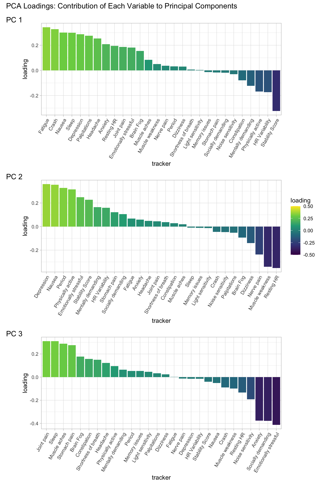
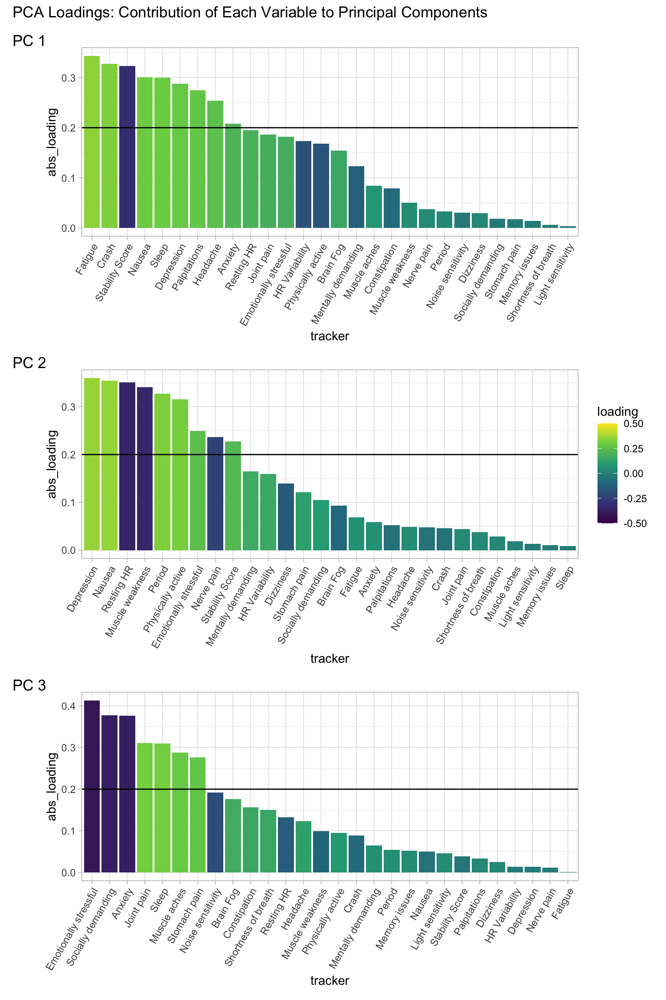
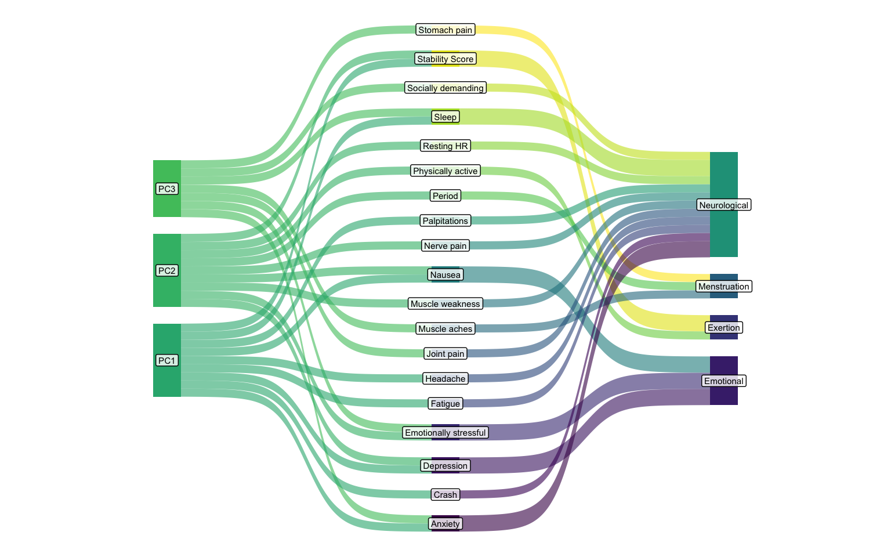

---
editor_options:
  markdown:
    wrap: sentence
title: 'Unmasking Long Covid: PCA & Clustering Analysis of Symptom Syndromes'
format: hugo-md
author: Dr. Mowinckel
date: '2025-06-01'
categories: []
tags:
  - R
  - health-data
  - longcovid
slug: visible-clusters
image: index.markdown_strict_files/figure-markdown_strict/pca-sankey-1.png
image_alt: >-
  A Sankey diagram showing flows from Principal Components (PCs) on the left, to
  individual health trackers/symptoms in the middle, and then to four defined
  symptom clusters (Neurological, Menstruation, Exertion, Emotional) on the
  right. The thickness of the colored bands indicates the strength of the
  relationships.
summary: >
  This blog post delves into the my personal Long Covid data, collected via the
  Visible app, using Principal Component Analysis (PCA). I detail four key
  clusters: Menstruation, Exertion, Emotional, and Neurological and then compare
  these clusters to the principal components derived from PCA. The analysis aims
  to provide a validated, data-driven framework for exploring my symptoms during
  this condition, using clear visualisations to showcase the results.
seo: >-
  See how data-driven and domain-knowledge approaches align to define distinct
  symptom clusters and inform management strategies.
---


I thought I'd continue on exploring my long covid data this month too.
My [last post](./blog/2025/visible) we dived a little into the data I have gathered using the [Visible app](https://www.makevisible.com/) for over a year now.
I showed you how the Visible app helped me monitor my heart rate and HRV, gave me a "stability score" each morning, and provided monthly functional capacity assessments (the awesome FUNCAP27).
We looked at how my data hinted at progress, particularly after I started implementing Dr. Simon's pacing strategies (taking frequent micro-breaks, even for small tasks).

But the really cool part I touched on was when I used clustering analysis to see how my symptoms grouped together.
It was fascinating to see the data confirm connections I'd felt instinctively but hadn't quite put into words.
It revealed four distinct "syndromes" of symptoms that tended to show up together for me.

So, in this next post, I'm going to take an even deeper dive into those clusters, giving you a more personal, anecdotal look at what those symptom groups mean for my daily life and how understanding them is helping me manage this tricky illness.

## Recapping the Clusters: Unmasking the Symptom Syndromes

Last time, we dipped our toes into the fascinating world of clustering.
For those who aren't familiar, imagine trying to organize a messy pile of LEGO bricks.
You might group all the red ones together, all the long ones, or all the ones with wheels.
Clustering in data does something similar: it finds items (in this case, my symptoms and tracked metrics) that are naturally similar or tend to show up together, and groups them.

<figure>

<figcaption aria-hidden="true">Image of several mounds of LEGO sorted neatly by colour.</figcaption>
</figure>

It was an affirming moment for me when I ran this analysis.
I'd always felt that certain symptoms seemed to "travel together," but seeing it laid out by the data was incredibly validating.
And one thing that is very good when you have a hidden illness like this (like, I don't *look* sick) is seeing some validation that stuff is going on.

<figure>

<figcaption aria-hidden="true">Plot of clustered symptoms and trackers, showing four top level clusters, with varying degrees and number of items inside.</figcaption>
</figure>

From the analysis, four main clusters emerged, each telling its own story about how my body experiences Long Covid. Here they are:

1.  **Menstruation:** This cluster grouped "period," "muscles aches," "stomach pain," "light sensitivity," and "constipation."
    -   *My initial thought:* "Okay, this makes so much sense. This is'nt long-covid stuff, it's 'just' period stuff. These are all (except light sensitivity) symptoms that have always plagued me during my period."
2.  **Exertion:** Here, we saw "stability score," "heart rate variability," "mental and physical exertion," and "lightness of breath."
    -   *My initial thought:* "This is the core of what stability score is based on, isn't it? The physical output directly impacting my energy and my heart's response. Biggest surprise was that resting heart rate was **not** in here, but seeing 'lightness of breath' in here confirms that feeling of struggling to breathe after minimal effort especially on poor days."
3.  **Emotional:** This cluster contained "emotional exertion," "depression," and "nausea."
    -   *My initial thought:* "This one is a no brainer for me, yeah, that is my brain doing its thing. As a person who generally struggles with depression and low mood, this clustering is meaningful. Biggest surprise here was that anxiety was not clustered in with it all."
4.  **Neurological:** This was the largest cluster, including "fatigue," "sleep," "joint pain," "headache," "palpitations," "resting heart rate," "anxiety," and "crash (PEM)."
    -   *My initial thought:* "This really encapsulates the 'Long Covid feeling.' All these symptoms are the heavy hitters that define my worst days. It's the central hub of what pulls me down. While there is clear meaning behind anxienty being in here (because on poor days I get feelings of despair around not improving), I still though it would cluster together with depression."

## Unpacking Symptom Dimensions with Principal Component Analysis (PCA)

While the hierarchical clustering helped us group symptoms that co-occur, sometimes we want to understand the underlying *dimensions* or *factors* that explain the most variation in our data.
This is where **Principal Component Analysis (PCA)** comes in -- it's a powerful technique for dimensionality reduction that finds new, uncorrelated variables (principal components) that capture the most variance in our original dataset.

While the hierarchical clustering we did last time helped us group symptoms that love to hang out together, sometimes we want to understand the underlying dimensions or factors that explain the most variation in our data. This is where Principal Component Analysis (PCA) comes in.

Imagine you have a giant, intricate LEGO creation -- not just loose bricks in piles.
PCA is like taking that complex structure and figuring out the core building blocks or main axes around which the whole thing is constructed.

<figure>

<figcaption aria-hidden="true">Image of a LEGO Orchid I built while I was in rehabilitation, which has more complex pieces than the classic rectangular LEGO blocks.</figcaption>
</figure>

It doesn't just put bricks into piles; it reveals the fundamental themes or underlying "stories" that make up the overall shape of your health data.
For example, one principal component might represent "all the pieces related to my daily energy levels," another "all the pieces for my body's inflammation state."
If my symptom clusters are truly meaningful, we'd expect to see them emerge as significant principal components, confirming these underlying "dimensions" in my Long Covid experience.

For this analysis, we'll use our `visible_wide` dataset, which is already cleaned and only keep the numeric daily observations that are suitable for PCA.
Scaling the data is crucial for PCA, especially when your variables are on different scales (like heart rate vs. a 1-5 symptom score), to ensure that variables with larger values don't disproportionately influence the components.

``` r
library(tidyverse)
```

    ── Attaching core tidyverse packages ──────────────────────── tidyverse 2.0.0 ──
    ✔ dplyr     1.1.4     ✔ readr     2.1.5
    ✔ forcats   1.0.0     ✔ stringr   1.5.1
    ✔ lubridate 1.9.4     ✔ tibble    3.2.1
    ✔ purrr     1.0.4     ✔ tidyr     1.3.1
    ── Conflicts ────────────────────────────────────────── tidyverse_conflicts() ──
    ✖ dplyr::filter() masks stats::filter()
    ✖ dplyr::lag()    masks stats::lag()
    ℹ Use the conflicted package (<http://conflicted.r-lib.org/>) to force all conflicts to become errors

``` r
# Remove cols with only 0's
remove_0_cols <- function(data) {
  idx <- apply(data, 2, function(x) {
    all(x == 0)
  }) |>
    which()
  data[, idx * -1]
}

visible_wide_num <- visible_wide |>
  select(where(is.numeric)) |>
  drop_na() |>
  remove_0_cols()

# Perform PCA
pca_result <- prcomp(visible_wide_num, scale = TRUE)

# Let's peek at the summary to see explained variance
summary(pca_result)
```

    Importance of components:
                              PC1     PC2     PC3     PC4     PC5     PC6     PC7
    Standard deviation     2.1979 1.55385 1.28818 1.24050 1.22930 1.18079 1.13446
    Proportion of Variance 0.1725 0.08623 0.05926 0.05496 0.05397 0.04979 0.04596
    Cumulative Proportion  0.1725 0.25876 0.31803 0.37299 0.42696 0.47675 0.52272
                               PC8     PC9    PC10    PC11    PC12    PC13    PC14
    Standard deviation     1.08729 1.05145 1.04469 0.99201 0.96958 0.96368 0.93438
    Proportion of Variance 0.04222 0.03948 0.03898 0.03515 0.03357 0.03317 0.03118
    Cumulative Proportion  0.56494 0.60442 0.64340 0.67855 0.71212 0.74529 0.77647
                              PC15    PC16    PC17    PC18    PC19    PC20   PC21
    Standard deviation     0.87395 0.84684 0.79606 0.75958 0.75488 0.71402 0.6777
    Proportion of Variance 0.02728 0.02561 0.02263 0.02061 0.02035 0.01821 0.0164
    Cumulative Proportion  0.80375 0.82936 0.85199 0.87260 0.89295 0.91116 0.9276
                             PC22    PC23    PC24    PC25    PC26    PC27    PC28
    Standard deviation     0.6608 0.60687 0.58803 0.55125 0.52772 0.45893 0.29081
    Proportion of Variance 0.0156 0.01315 0.01235 0.01085 0.00995 0.00752 0.00302
    Cumulative Proportion  0.9432 0.95631 0.96866 0.97951 0.98946 0.99698 1.00000

You get a table out with, in this case, 28 components, and showing how much each component explains of the variance, and the standard deviation of the component.
PCA's are always sorted from *most explained* to *least explained*, so the first components are ultimately what we are generally most interested in.

### Interpreting the Principal Components

A **scree plot** is often the first visual we look at to see how many components are meaningful.
It plots the variance explained by each component in descending order.
We look for an "elbow" in the plot, where the explained variance sharply drops off.

First, we need to create a data.frame we can use for plotting.
For data from prcomp, I like to extract it's summary table and coerce it into a data.frame.
It's a little sneaky, but also convenient.

``` r
# Create nice data frame of components
prcomp_to_df <- function(prcomp) {
  spca <- summary(prcomp)
  df <- data.frame(t(spca$importance))
  names(df) <- c("stdev", "var_exp", "cumu_prop")
  df$component <- 1:nrow(df)
  df[, c("component", "stdev", "var_exp", "cumu_prop")]
}

# Create a dataframe for the scree plot
pca_variance <- prcomp_to_df(pca_result)
pca_variance
```

         component     stdev var_exp cumu_prop
    PC1          1 2.1979404 0.17253   0.17253
    PC2          2 1.5538478 0.08623   0.25876
    PC3          3 1.2881845 0.05926   0.31803
    PC4          4 1.2405038 0.05496   0.37299
    PC5          5 1.2293042 0.05397   0.42696
    PC6          6 1.1807868 0.04979   0.47675
    PC7          7 1.1344565 0.04596   0.52272
    PC8          8 1.0872894 0.04222   0.56494
    PC9          9 1.0514460 0.03948   0.60442
    PC10        10 1.0446901 0.03898   0.64340
    PC11        11 0.9920069 0.03515   0.67855
    PC12        12 0.9695849 0.03357   0.71212
    PC13        13 0.9636828 0.03317   0.74529
    PC14        14 0.9343759 0.03118   0.77647
    PC15        15 0.8739546 0.02728   0.80375
    PC16        16 0.8468355 0.02561   0.82936
    PC17        17 0.7960570 0.02263   0.85199
    PC18        18 0.7595843 0.02061   0.87260
    PC19        19 0.7548804 0.02035   0.89295
    PC20        20 0.7140210 0.01821   0.91116
    PC21        21 0.6776940 0.01640   0.92756
    PC22        22 0.6608451 0.01560   0.94316
    PC23        23 0.6068691 0.01315   0.95631
    PC24        24 0.5880283 0.01235   0.96866
    PC25        25 0.5512463 0.01085   0.97951
    PC26        26 0.5277224 0.00995   0.98946
    PC27        27 0.4589327 0.00752   0.99698
    PC28        28 0.2908108 0.00302   1.00000

Once we have that, we can get our neat scree plot.

``` r
ggplot(pca_variance, aes(x = component, y = var_exp)) +
  geom_line() +
  geom_point() +
  labs(
    title = "Scree Plot: Variance Explained by Each Principal Component",
    x = "Principal Component",
    y = "Proportion of Variance Explained"
  ) +
  scale_x_continuous(breaks = scales::pretty_breaks(n = 10))
```


**What the Scree Plot tells us:** This plot helps us decide how many principal components are worth interpreting.
Usually, we focus on the components before the "elbow."
For my data, we can see that the first three components are the major ones.

## Comparing clusters and PCA

The real magic of PCA for our purpose lies in the **loadings**.
Loadings are the coefficients that show how much each original variable (symptom or tracker) contributes to each principal component.
High absolute loading values (either positive or negative) indicate a strong contribution.
Variables with positive loadings on a component move in the same direction, while those with negative loadings move in opposite directions.

Let's look at the loadings for the first few principal components,
and also make sure we split up the tracker information into components again.

``` r
# Extract loadings (rotations)
loadings_df <- as.data.frame(pca_result$rotation) |>
  rownames_to_column(var = "tracker") |>
  separate(tracker, c("type", "category", "tracker"), sep = "_") |>
  as_tibble()

loadings_df |>
  select(tracker, PC1, PC2, PC3) |>
  arrange(desc(abs(PC1)))
```

    # A tibble: 28 × 4
       tracker            PC1      PC2      PC3
       <chr>            <dbl>    <dbl>    <dbl>
     1 Fatigue          0.343  0.0684   0.00162
     2 Crash            0.328 -0.0460  -0.0888 
     3 Stability Score -0.323  0.227   -0.0392 
     4 Nausea           0.301  0.355   -0.0505 
     5 Sleep            0.300 -0.00906  0.310  
     6 Depression       0.287  0.360   -0.0136 
     7 Palpitations     0.275 -0.0522   0.0338 
     8 Headache         0.254  0.0490   0.123  
     9 Anxiety          0.208  0.0588  -0.376  
    10 Resting HR       0.195 -0.351   -0.133  
    # ℹ 18 more rows

Now we have a nice data.frame with all our loadings for the top 3 components.
We can create a nice barchart to show these loadings fairly easily with ggplot2

``` r
loadings_df |>
  pivot_longer(
    cols = starts_with("PC"),
    names_to = "pc",
    values_to = "loading"
  ) |>
  filter(pc %in% c("PC1", "PC2", "PC3")) |>
  ggplot(
    aes(x = tracker, y = loading, fill = loading)
  ) +
  geom_bar(stat = "identity") +
  facet_wrap(~pc) +
  labs(
    title = "PCA Loadings",
    subtitle = "Contribution of Each Variable to Principal Components",
    x = "",
    y = "Loading"
  )
```


Downside with using facets here, is that while the trackers are the same across each plot, it also makes it harder in this case to clearly see which trackers contribute the most to each component.
I'll make a special function that will order the x-axis according to the loading value, and then make each plot individually before we put them together again with {patchwork}.

``` r
library(patchwork)

pca_bar <- function(data) {
  data |>
    arrange(desc(loading)) |>
    mutate(tracker = fct_inorder(tracker)) |>
    ggplot(
      aes(x = tracker, y = loading, fill = loading)
    ) +
    geom_bar(stat = "identity")
}

loadings_df |>
  pivot_longer(
    cols = starts_with("PC"),
    names_to = "pc",
    values_to = "loading"
  ) |>
  filter(pc %in% c("PC1", "PC2", "PC3")) |>
  nest_by(pc, .key = "data") |>
  group_by(pc) |>
  mutate(plot = map(data, pca_bar)) |>
  pull(plot) |>
  wrap_plots(ncol = 1) +
  plot_layout(
    guides = 'collect',
    axes = "collect"
  ) &
  scale_fill_continuous(limits = c(-0.5, 0.5)) &
  plot_annotation(
    title = "PCA Loadings: Contribution of Each Variable to Principal Components",
    tag_levels = '1',
    tag_prefix = 'PC '
  )
```



This is starting to looks much easier to interpret now.
Now, we can focus on the trackers that contribute most on each end of the scale.
I'm still searching for a better visualisation though, and I think we can keep the colours, but use their absolute loading value to plot.
This will place all the most important components in order at the very left of the plot, and we can distinguish between positive and negative by their colour.

``` r
pca_bar2 <- function(data) {
  data |>
    mutate(abs_loading = abs(loading)) |>
    arrange(desc(abs_loading)) |>
    mutate(tracker = fct_inorder(tracker)) |>
    ggplot(
      aes(x = tracker, y = abs_loading, fill = loading)
    ) +
    geom_bar(stat = "identity") +
    geom_hline(yintercept = 0.2)
}

loadings_df |>
  pivot_longer(
    cols = starts_with("PC"),
    names_to = "pc",
    values_to = "loading"
  ) |>
  filter(pc %in% c("PC1", "PC2", "PC3")) |>
  nest_by(pc, .key = "data") |>
  group_by(pc) |>
  mutate(plot = map(data, pca_bar2)) |>
  pull(plot) |>
  wrap_plots(ncol = 1) +
  plot_layout(
    guides = 'collect',
    axes = "collect"
  ) &
  scale_fill_continuous(limits = c(-0.5, 0.5)) &
  plot_annotation(
    title = "PCA Loadings: Contribution of Each Variable to Principal Components",
    tag_levels = '1',
    tag_prefix = 'PC '
  )
```



I like this plot much better.
The directionality of the most important factors are very clear, and we can more easily see what contributes the most.
I also added a horizontal line at the `0.2` loading value, to give us a general threshold to determine which factors we have some confidence in being in each component.
Usually, people will use `0.3` or higher for larger samples.
But my data is very little for a PCA, and we are just using it here as a fun way to explore my condition and symptoms, but as a rule to decide with scientific rigour.

#### **Principal Component 1 (PC1): The "Overall Severity" or "Neurological Burden" Component**

Looking at the top plot for **PC1**, we see strong positive loadings (tall green bars) for `Fatigue`, `Nausea`, `Crash`, `Depression`, and `Headache`.
These are clearly my most debilitating and pervasive Long Covid symptoms.
On the negative side (purple/blue bars), `Resting HR`, `HR Variability`, and `Stability Score` have strong negative loadings.
This means that when these symptoms (fatigue, crash, depression, etc.) are high, my stability score is low, my resting heart rate is high, and my HRV is low.

#### **Principal Component 2 (PC2): The "Inflammatory/Physical Discomfort" Component**

Moving to the middle plot for **PC2**, we see different strong contributors. `Depression`, `Period`, `Nausea`, and `Physically active` (surprisingly, or perhaps inversely related) have high positive loadings.
On the negative side, `Resting HR` and `Muscle weakness` show strong negative loadings.

This component seems to capture a dimension related to more general physical discomfort, potentially linked to inflammatory responses, and surprisingly, how physically active I *can be* (or how that activity impacts this cluster).

#### **Principal Component 3 (PC3): The "Exertion & Recovery Balance" Component**

The bottom plot for **PC3** is interesting.
We see high positive loadings for `Joint pain`, `Sleep`, `Muscle aches`, and `Brain fog`.
On the negative side, `Emotional exertion` and `Resting HR` (again) are prominent.

This component might represent the delicate balance of exertion and recovery.
Symptoms like `joint pain` and `muscle aches` can be aggravated by activity, while `sleep` (ideally restorative) pulls in the opposite direction.
The strong negative loading for `Emotional exertion` here is fascinating; it suggests that this particular "recovery" state (low joint pain, good sleep) is inversely related to emotional taxing days.

Maybe we can see the connections between the principal components and the clusters better through a Sankey diagram?

### Comparing PCA and clustering results

Now that we have explored the dimensionality of the data with two different approaches, we should have a clear comparison between them.
First, we need to define which factors go into each cluster from before.

``` r
clusters_df <- list(
  Menstruation = c(
    "Period",
    "Muscle aches",
    "Stomach pain",
    "Light sensitivity",
    "Constipation"
  ),
  Exertion = c(
    "Stability Score",
    "HR Variability",
    "Physically active",
    "Mentally demanding",
    "Shortness of breath"
  ),
  Emotional = c(
    "Emotionally stressful",
    "Depression",
    "Nausea"
  ),
  Neurological = c(
    "Fatigue",
    "Sleep",
    "Joint pain",
    "Headache",
    "Palpitations",
    "Resting HR",
    "Anxiety",
    "Crash",
    "Brain Fog",
    "Memory issues",
    "Dizziness",
    "Muscle weakness",
    "Nerve pain",
    "Noise sensitivity",
    "Socially demanding"
  )
) |>
  enframe(
    name = "cluster",
    value = "tracker"
  ) |>
  unnest(cols = tracker)

clusters_df
```

    # A tibble: 28 × 2
       cluster      tracker            
       <chr>        <chr>              
     1 Menstruation Period             
     2 Menstruation Muscle aches       
     3 Menstruation Stomach pain       
     4 Menstruation Light sensitivity  
     5 Menstruation Constipation       
     6 Exertion     Stability Score    
     7 Exertion     HR Variability     
     8 Exertion     Physically active  
     9 Exertion     Mentally demanding 
    10 Exertion     Shortness of breath
    # ℹ 18 more rows

Then we combine the clusters data with the loadsings for the three top components, and the loadings of the factors over `0.2` to keep it neat (else the sankey plot will show lines for every tracker out of each Principal component).
I'm using the [ggsankey](https://github.com/davidsjoberg/ggsankey) package by [David Sjoberg](David%20Sjoberg) here, which is *not* on CRAN, but I think makes the most beautiful Sankey diagram
(hint hint David, get it on CRAN, will ya?).

This package contains a very convenient function `make_long` which translates your data into the necessary format for the plot.
It tok me a really good while to get the data looking as I needed, despite the code looking this clean.

I *think* the trick was placing the columns into the function *in the order I wanted my x-axis*.

``` r
library(ggsankey)

sankey_df <- loadings_df |>
  left_join(clusters_df) |>
  pivot_longer(
    cols = starts_with("PC"),
    names_to = "pc",
    values_to = "loading"
  ) |>
  filter(
    pc %in% c("PC1", "PC2", "PC3"),
    abs(loading) > 0.2
  ) |>
  make_long(pc, tracker, cluster, value = loading)
```

    Joining with `by = join_by(tracker)`

``` r
sankey_df
```

    # A tibble: 75 × 5
       x       node         next_x  next_node        value
       <fct>   <chr>        <fct>   <chr>            <dbl>
     1 pc      PC1          tracker Sleep            0.300
     2 tracker Sleep        cluster Neurological     0.300
     3 cluster Neurological <NA>    <NA>             0.300
     4 pc      PC3          tracker Sleep            0.310
     5 tracker Sleep        cluster Neurological     0.310
     6 cluster Neurological <NA>    <NA>             0.310
     7 pc      PC2          tracker Resting HR      -0.351
     8 tracker Resting HR   cluster Neurological    -0.351
     9 cluster Neurological <NA>    <NA>            -0.351
    10 pc      PC1          tracker Stability Score -0.323
    # ℹ 65 more rows

With this data, we can finally get a nice flowchart of the trackers between the two analysis approaches.

``` r
sankey_df |>
  ggplot(aes(
    x = x,
    next_x = next_x,
    node = node,
    next_node = next_node,
    fill = node
  )) +
  geom_sankey(
    show.legend = FALSE,
    flow_alpha = 0.6
  ) +
  geom_sankey_label(
    aes(label = node),
    alpha = 0.8,
    size = 2,
    color = "black",
    fill = "white"
  ) +
  theme_void()
```



The Principal Component Analysis (PCA) is represented by the **leftmost two stages (PC -\> Tracker)**.
This shows how individual symptoms (trackers) load onto the underlying, statistically derived principal components (PC1, PC2, PC3).
This is an **unsupervised, data-driven grouping** based on variance.

The Hierarchical Clustering is represented by the **rightmost two stages (Tracker -\> Cluster)**.
This shows which trackers belong to my manually (or previously) defined symptom clusters (Neurological, Menstruation, Exertion, Emotional).
This is a type of **domain-knowledge driven grouping**.

**The Neurological Cluster** appears to be significantly influenced by trackers that load heavily on **PC1** and **PC3**.
Trackers like "Anxiety", "Crash", "Depression", "Fatigue", "Headache", and "Joint pain" show substantial flow from PC1, while "Anxiety", "Brain Fog" and others also draw from PC3.
This indicates an alignment between the two approaches: the symptoms grouped as "Neurological" indeed represent a dimension (or dimensions) that PCA also highlights.

**The Emotional Cluster** draws its main components like "Depression" and "Emotionally stressful" primarily from **PC1**.
This suggests PC1 captures a strong emotional/mental dimension that aligns well with the "Emotional" cluster.

**The Menstruation Cluster** includes hallmark markers like "Period" and importantly, "Stomach pain" and "Muscle aches".
While these latter two symptoms also draw from PC1 and PC2, the "Period" tracker itself shows a prominent flow from **PC3**, suggesting PC3 might capture some cyclical or hormonal aspects.
But given the very few trackers in this cluster, it doesn't seem to have a distinct connection to any partilcar principal component.

In the **Exertion Cluster**, trackers like "Stability Score" and "Physically active" primarily flow from **PC3**, while "Resting HR" seems connected from PC1.
This suggests the "Exertion" cluster is composed of elements that load on a mix of PCs, but PC3 seems to capture key aspects of physical state.

Notice how some trackers (e.g., "Anxiety", "Depression", "Fatigue") have multiple bands from different PCs converging on them before flowing to a single cluster.
This means these symptoms are complex and influenced by several underlying PCA dimensions.
Conversely, some trackers (e.g., "Period" from PC3, "Physically active" from PC3) show a more direct dominant link from one PC, suggesting that PC captures a very specific and strong aspect of that tracker.

This is one of the reasons a direct comparison between the cluster analysis and the PCA is a little tricky.
As in the PCA **each** component will have a value for every tracker, with the value indicating both directionality and strength.
The clustering gives us neither strength nor directionality, and a single "location" for each tracker.

Despite this, we see that there is some meaningful overlap between the two that can help us evaluate what we are looking at.
