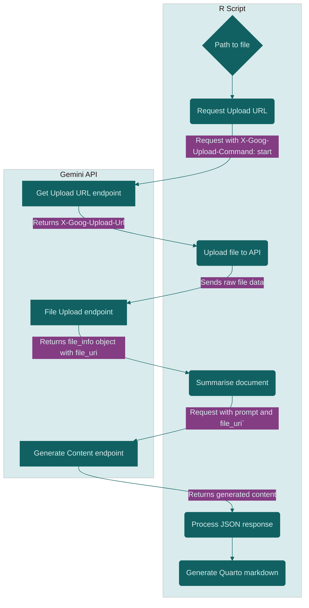

If you are on LinkedIn, you may have seen the carousel posts that allow you to share multiple images in a single post.
These carousels are a great way to showcase your work, share insights, or tell a story.
Creating engaging LinkedIn carousels can be time-consuming.
What if you could automate the process using R and a powerful AI?
I wanted to explore how to create these carousels from R, that would summarise the content of a blog post.

## Creating summaries

To summarize the content, I chose to leverage the power of a large language model (LLM).
As always, I'd like to keep things free, so I opted to using Google's [Gemini](https://gemini.google.com/app), which would allow me to use the free tier of the API.

I've already tested Gemini in the browser for smaller tasks, and thought it did a decent job in summarising content.
I also know it is used in the background for the [R-Ladies bot](https://cosimameyer.com/post/2023-04-25-building-mastodon-bots-and-promoting-the-community/).
So I set out to create a function that would summarise the content of a markdown file into a series of points suitable for a LinkedIn carousel.

I had planned to use the [`gemini.R`](https://github.com/jhk0530/gemini.R) package, which provides a convenient interface to the Gemini API.
This package allows you to send prompts to the Gemini model and receive responses in a structured format.
Since I plan on using this function to summarise a blog post, which is typically in Markdown format, I decided to use the `gemini_docs()` function from the package.
This conveniently takes a file path, file type and a prompt, and returns the response from the Gemini model.
However, the current version was failing to return a response, so I decided to create my own function.
Once I have a working function, I will consider submitting a PR to the package to include it.

## Connecting to Gemini through R

To connect to the Gemini API, you need to [set up a project in the Google Cloud Console](https://developers.google.com/workspace/guides/create-project), [enable the Gemini API](https://console.cloud.google.com/apis/library/generativelanguage.googleapis.com), and obtain an API key from [Google AI Studio](https://aistudio.google.com/).
From here, we can start playing with the API.

One of the simplest examples in AI Studio is this curl snippet:

``` bash
curl 'https://generativelanguage.googleapis.com/v1beta/models/gemini-2.0-flash:generateContent' \
  -H 'Content-Type: application/json' \
  -H 'X-goog-api-key: GEMINI_API_KEY' \
  -X POST \
  -d '{
    "contents": [
      {
        "parts": [
          {
            "text": "Explain how AI works in a few words"
          }
        ]
      }
    ]
  }'
```

To use this in R, we can use the `httr2` package to make the API call.
As mentioned in my [previous post](./blog/2025/httr2_client/), httr2 also has a nice function [`curl_translate()`](https://httr2.r-lib.org/reference/curl_translate.html) for translating curl commands to an httr2 command chain.
We will use that here to create a test call to the API.

``` r
library(httr2)

curl_translate(
  "curl 'https://generativelanguage.googleapis.com/v1beta/models/gemini-2.0-flash:generateContent' \
  -H 'Content-Type: application/json' \
  -H 'X-goog-api-key: GEMINI_API_KEY' \
  -X POST \
  -d '{
    \"contents\": [
      {
        \"parts\": [
          {
            \"text\": \"Explain how AI works in a few words\"
          }
        ]
      }
    ]
  }'
"
)
```

    request("https://generativelanguage.googleapis.com/v1beta/models/gemini-2.0-flash:generateContent") |>
      req_method("POST") |>
      req_headers(
        `X-goog-api-key` = "GEMINI_API_KEY",
      ) |>
      req_body_json(
        data = list(contents = list(list(parts = list(list(text = "Explain how AI works in a few words"))))),
      ) |>
      req_perform()

Now that we have the translated curl command in httr2, we can use it to make the API call.
First, we need to replace the `GEMINI_API_KEY` with our actual API key.
I will place my API key in a `.Renviron` file, so I can access it using `Sys.getenv("GEMINI_API_KEY")`.

``` r
resp <- request(
  "https://generativelanguage.googleapis.com/v1beta/models/gemini-2.0-flash:generateContent"
) |>
  req_method("POST") |>
  req_headers(
    `X-goog-api-key` = Sys.getenv("GEMINI_API_KEY"),
  ) |>
  req_body_json(
    data = list(
      contents = list(list(
        parts = list(list(text = "Explain how AI works in a few words"))
      ))
    ),
  ) |>
  req_perform()

resp_body_json(resp)
```

    $candidates
    $candidates[[1]]
    $candidates[[1]]$content
    $candidates[[1]]$content$parts
    $candidates[[1]]$content$parts[[1]]
    $candidates[[1]]$content$parts[[1]]$text
    [1] "AI learns from data to make decisions or predictions.\n"


    $candidates[[1]]$content$role
    [1] "model"


    $candidates[[1]]$finishReason
    [1] "STOP"

    $candidates[[1]]$avgLogprobs
    [1] -0.09323899


    $usageMetadata
    $usageMetadata$promptTokenCount
    [1] 8

    $usageMetadata$candidatesTokenCount
    [1] 11

    $usageMetadata$totalTokenCount
    [1] 19

    $usageMetadata$promptTokensDetails
    $usageMetadata$promptTokensDetails[[1]]
    $usageMetadata$promptTokensDetails[[1]]$modality
    [1] "TEXT"

    $usageMetadata$promptTokensDetails[[1]]$tokenCount
    [1] 8


    $usageMetadata$candidatesTokensDetails
    $usageMetadata$candidatesTokensDetails[[1]]
    $usageMetadata$candidatesTokensDetails[[1]]$modality
    [1] "TEXT"

    $usageMetadata$candidatesTokensDetails[[1]]$tokenCount
    [1] 11


    $modelVersion
    [1] "gemini-2.0-flash"

    $responseId
    [1] "w_OLaIufN7O71PIP2dSJ8QU"

We have lift-off!
The response from the API is a JSON object containing the generated content, and some more meta-data regarding the model and the request.
Now that we have a working API call, we can start building our function to summarise the content of a blog post.

Looking at the documentation for the `generateContent` endpoint, we can see that it takes a list of contents, each containing a list of parts.
Each part can contain text, images, or other media.
We will use the `text` part to generate the summary of the blog post, and the `file_data` to include the entire blog post content.
This approach requires three steps:

1.  get a uri from the API to upload the file,
2.  upload the file to the uri,
3.  call the `generateContent` endpoint with the file uri and the prompt.

Because step1 has a different URL than step 3, I first created a function to generate the gemini url for each endpoint.

``` r
gemini_url <- function(
  version = "v1beta",
  model = "gemini-1.5-flash",
  upload = FALSE
) {
  baseurl <- "https://generativelanguage.googleapis.com"

  if (upload) {
    return(file.path(
      baseurl,
      "upload",
      version,
      "files"
    ))
  }

  sprintf(
    "%s/%s/models/%s:generateContent",
    baseurl,
    version,
    model
  )
}

gemini_url()
```

    [1] "https://generativelanguage.googleapis.com/v1beta/models/gemini-1.5-flash:generateContent"

``` r
gemini_url(upload = TRUE)
```

    [1] "https://generativelanguage.googleapis.com/upload/v1beta/files"

With this function, we can easily switch between the two endpoints, and even update the API version or model if needed.
I thought this would give me the most flexibility in the future.

Next, I needed a function to upload the file to the Gemini API, which will cover both step 1 and 2.

### Step 1: Getting the upload URL

To upload a file to the Gemini API, we first need to get an upload URL.
You can do this by making a request to the `upload` endpoint with the appropriate headers and body.
It's basically giving the API a heads up that we want to upload a file, and it will return an upload URL in the response header.

``` r
api_key <- Sys.getenv("GEMINI_API_KEY")

if (!nzchar(api_key)) {
  cli::cli_abort(
    "{.val GEMINI_API_KEY} environment variable not set. Please set it before running."
  )
}

# To get information about the file
file_raw_content <- readBin(
  path,
  "raw",
  n = file.info(path)$size
)

# Get upload URL -- step 1
upload_resp_start <- gemini_url(upload = TRUE) |>
  httr2::request() |>
  httr2::req_headers(
    "x-goog-api-key" = api_key,
    "X-Goog-Upload-Protocol" = "resumable",
    "X-Goog-Upload-Command" = "start",
    "X-Goog-Upload-Header-Content-Length" = length(file_raw_content),
    "X-Goog-Upload-Header-Content-Type" = "text/markdown"
  ) |>
  httr2::req_body_json(list(
    file = list(
      display_name = basename(dirname(path)),
      mime_type = "text/markdown"
    )
  )) |>
  httr2::req_perform()

upload_url <- httr2::resp_header(upload_resp_start, "X-Goog-Upload-Url")

if (is.null(upload_url)) {
  cli::cli_abort("Failed to get upload URL from Files API start request.")
}
upload_url
```

Since the heads up request is not sending the file content, it is a very lightweight request.
However, its still important to give the correct type of heads up, so the API knows what to expect.
In this case, we are uploading a markdown file, so we set the `Content-Type` to `text/markdown`.
And, we also set the `X-Goog-Upload-Header-Content-Length` to the size of the file (in bytes) we are uploading.
The `display_name` is just a human-readable name for the file, which we set to the name of the parent directory of the file we are uploading (because I typically store my blog posts in a subdirectory named after the post).
This function will return the upload URL in the response header, which we can then use to upload the file content in the next step.
I had never worked with a response that returns the upload URL in the header, so I was a bit confused at first.
But once I figured it out, it was quite straightforward.

### Step 2: Uploading the file content

Now that we have the upload URL, we can upload the file content.
You will notice that this function is quite similar to the first step, but this time we are sending the actual file content in the request body.
I opted to read the file content as raw bytes, which is a common practice when uploading files to APIs, and it was what worked most reliably during testing.

``` r
# Upload file content -- step 2
upload_content_resp <- httr2::request(upload_url) |>
  httr2::req_headers(
    "Content-Type" = "text/markdown",
    "X-Goog-Upload-Command" = "upload, finalize",
    "X-Goog-Upload-Offset" = "0",
    "x-goog-api-key" = api_key
  ) |>
  httr2::req_body_raw(file_raw_content) |>
  httr2::req_error(
    is_error = function(resp) FALSE
  ) |>
  httr2::req_perform()

if (resp_status(upload_content_resp) != 200) {
  stop(paste(
    "File content upload failed with status:",
    resp_status(upload_content_resp),
    "-",
    resp_body_json(upload_content_resp)
  ))
}
file_info <- resp_body_json(upload_content_resp)
cli::cli_alert_info(
  "File uploaded successfully! File Name: {.path {file_info$file$name}}"
)
file_info$file
```

Also notice the `req_error()` function, which is used to handle errors in a more graceful way.
By default, `httr2` will stop execution if the request fails with a non-200 status code.
While this is useful in many cases, I wanted to handle the error myself and return a more informative message.
In my experience, the Gemini API returns quite long and sometimes cryptic error messages, so I wanted to include the status code and the error message in the output.

### Combining the steps into a function

Now that we have the two steps to upload a file to the Gemini API, we can combine them into a single function that will handle both steps.

``` r
gemini_upload_file <- function(path) {
  api_key <- Sys.getenv("GEMINI_API_KEY")

  if (!nzchar(api_key)) {
    cli::cli_abort(
      "{.val GEMINI_API_KEY} environment variable not set. Please set it before running."
    )
  }

  # To get information about the file
  file_raw_content <- readBin(
    path,
    "raw",
    n = file.info(path)$size
  )

  # Get upload URL -- step 1
  upload_resp_start <- gemini_url(upload = TRUE) |>
    httr2::request() |>
    httr2::req_headers(
      "x-goog-api-key" = api_key,
      "X-Goog-Upload-Protocol" = "resumable",
      "X-Goog-Upload-Command" = "start",
      "X-Goog-Upload-Header-Content-Length" = length(file_raw_content),
      "X-Goog-Upload-Header-Content-Type" = "text/markdown"
    ) |>
    httr2::req_body_json(list(
      file = list(
        display_name = basename(dirname(path)),
        mime_type = "text/markdown"
      )
    )) |>
    httr2::req_perform()

  upload_url <- httr2::resp_header(upload_resp_start, "X-Goog-Upload-Url")

  if (is.null(upload_url)) {
    cli::cli_abort("Failed to get upload URL from Files API start request.")
  }

  # Upload file content -- step 2
  upload_content_resp <- httr2::request(upload_url) |>
    httr2::req_headers(
      "Content-Type" = "text/markdown",
      "X-Goog-Upload-Command" = "upload, finalize",
      "X-Goog-Upload-Offset" = "0",
      "x-goog-api-key" = api_key
    ) |>
    httr2::req_body_raw(file_raw_content) |>
    httr2::req_error(
      is_error = function(resp) FALSE
    ) |>
    httr2::req_perform()

  if (resp_status(upload_content_resp) != 200) {
    stop(paste(
      "File content upload failed with status:",
      resp_status(upload_content_resp),
      "-",
      resp_body_json(upload_content_resp)
    ))
  }
  file_info <- resp_body_json(upload_content_resp)
  cli::cli_alert_info(
    "File uploaded successfully! File Name: {.path {file_info$file$name}}"
  )
  return(file_info$file)
}
```

With this function, we can now upload a file to the Gemini API and get the file information back.
We can test this out by uploading the markdown file from my previous blog post.

``` r
file <- here::here("content/blog/2025/07-01_httr2_client/index.md")
file_info <- gemini_upload_file(file)
```

    ℹ File uploaded successfully! File Name: 'files/tvpow4yhdy27'

``` r
file_info
```

    $name
    [1] "files/tvpow4yhdy27"

    $displayName
    [1] "07-01_httr2_client"

    $mimeType
    [1] "text/markdown"

    $sizeBytes
    [1] "31073"

    $createTime
    [1] "2025-07-31T22:52:54.522339Z"

    $updateTime
    [1] "2025-07-31T22:52:54.522339Z"

    $expirationTime
    [1] "2025-08-02T22:52:53.772515346Z"

    $sha256Hash
    [1] "MDhlZTQ0N2ExZDdhMGQ4NjAyYTlmNTA1Mjk1NGJhZDA0ZWExOThhYTE2OTc5MzMzMGExZDliYTU1Y2IwZjhmMA=="

    $uri
    [1] "https://generativelanguage.googleapis.com/v1beta/files/tvpow4yhdy27"

    $state
    [1] "ACTIVE"

    $source
    [1] "UPLOADED"

A nice feature here is that Gemini will retain the file only for a limited time (48 hours), so you don't have to worry about cleaning up old files.
It's also worth noting that the file is not stored in your Google Drive, but rather in the Gemini API's storage.

### Step 3: Generating the content

Now we have the file information, we can use it to call the `generateContent` endpoint with the prompt.
Using a similar approach as before, I created a function to generate the content from the Gemini API.
The function takes the file information and a prompt as input, and returns the generated content.

``` r
doc_summary <- function(
  file_info,
  prompt = "Please summarize the attached  document concisely, focusing on its overview, key accomplishments, challenges, and next steps."
) {
  api_key <- Sys.getenv("GEMINI_API_KEY")

  if (!nzchar(api_key)) {
    cli::cli_abort(
      "{.val GEMINI_API_KEY} environment variable not set. Please set it before running."
    )
  }

  body <- list(
    contents = list(list(
      parts = list(
        list(text = prompt),
        list(
          file_data = list(
            mime_type = file_info$mimeType,
            file_uri = file_info$uri
          )
        )
      )
    ))
  )

  resp <- gemini_url(upload = FALSE) |>
    httr2::request() |>
    httr2::req_headers(
      "x-goog-api-key" = api_key,
      "Content-Type" = "application/json"
    ) |>
    httr2::req_body_json(
      body,
      auto_unbox = TRUE
    ) |>
    httr2::req_throttle(rate = 50 / 60) |>
    httr2::req_error(
      is_error = function(resp) FALSE
    ) |>
    httr2::req_perform()

  if (resp_status(resp) != 200) {
    body <- ""
    if (httr2::resp_has_body(resp)) {
      body <- httr2::resp_body_json(resp)
    }
    cli::cli_abort(
      "Summary API Request failed with status: 
      {.val {resp_status(resp)}} - 
      {.val {resp_status_desc(resp)}} - 
      {.val {body}}"
    )
  }

  json <- httr2::resp_body_json(resp)
  json$candidate[[1]]$content$parts[[1]]$text
}
```

I struggled a little here, as creating the body for the request was a bit tricky.
I also kept getting errors about not having access to project `542708778979`, which is I project I don't have access to.
I googled around, and even found a post in the [google ai discussions](https://discuss.ai.google.dev/t/error-while-using-my-project-changes-to-unkown-project/93735) mentioning this with the same exact error message.
After some trial and error, I noticed what I had overlooked.
My initial function forgot to set the API key in the request headers, which resulted in the error message.
We can all agree, that this is a very misleading error message!
I assume the project ID is a default project that the API uses when no API key is provided, it would have been much clearer if the error message had mentioned that the API key was missing.

After fixing that and getting the request body structure correct, I was able to successfully generate a summary of the blog post.

``` r
summary <- doc_summary(file_info)
summary
```

    [1] "This blog post details the author's experience rewriting an R package to connect to a university's survey platform, focusing on migrating from `httr` to `httr2` for OAuth2 Machine-to-Machine (M2M) authentication.  The key accomplishment is creating a robust and reliable client using `httr2::oauth_client` that handles authentication and token management efficiently, resolving previous issues with manual token caching.  Challenges included understanding the unfamiliar M2M flow (as opposed to the more common U2M flow), correctly configuring the `oauth_client` (specifically using `auth = \"header\"`), and setting up a comprehensive test suite using `vcr` for recording API calls and `testthat` with `local_mocked_bindings` to mock functions for reliable testing across different environments (e.g., GitHub Actions).  Next steps involve exploring `vcr::local_cassette` for improved testing readability and implementing a weekly GitHub Action to proactively test the API for changes.  The author also details how they handle vignette knitting to ensure API calls within vignettes function correctly.\n"

I was quite pleased with the result, as it provided a concise summary of the blog post.
Next step, was to create a function that would generate a series of points suitable for a LinkedIn carousel slide.

## Creating a suitable prompt

A good prompt is crucial for getting the best results from an LLM.
The prompt should be clear, concise, and provide enough context for the model to understand what is expected.
I started with a simple prompt that asked the model to summarise the content of a blog post into a series of points suitable for a LinkedIn carousel slide.
A carousel can be maximally 10 slides, so I wanted to generate between 5 and 8 points.

``` r
prompt_text <- paste(
  "Summarize the following blog post into a series of distinct points, each suitable for a LinkedIn carousel slide.",
  "For each point, provide:",
  "1. A concise, attention-grabbing title (max 10 words).",
  "2. A brief, engaging description (max 50 words) that elaborates on the title.",
  "Ensure there are at least 5 and no more than 8 points.",
  "Use code input and output in examples for engagement in extra slides after slides that mention code solutions.",
  sep = "\n"
)

doc_summary(file_info, prompt_text)
```

    [1] "Here's a LinkedIn carousel post summarizing the blog post, designed for maximum engagement:\n\n**Slide 1: Title: Conquer OAuth2 M2M with httr2**\n\nDescription:  Master machine-to-machine OAuth2 authentication in R using the powerful httr2 package. This post guides you through seamless client setup and robust API testing.\n\n\n**Slide 2: Title:  From U2M to M2M: Understanding the Difference**\n\nDescription: Learn the key distinctions between User-to-Machine (U2M) and Machine-to-Machine (M2M) OAuth2 flows.  See visual diagrams illustrating each authentication process.  (Include the first Mermaid diagram here.)\n\n\n**Slide 3: Title:  Building Your httr2 OAuth2 Client**\n\nDescription:  Discover how to create a robust httr2 client for M2M authentication. Learn how to leverage environment variables for secure credential management.\n\n\n**Slide 4: Code Example 1 (Client Creation):**\n\n```r\nns_client <- function(client_id, client_secret, client_name = \"nettskjemar\") {\n  # ... (Code from blog post) ...\n}\n```\n\n**Slide 5: Title:  Mastering httr2's `req_oauth_client_credentials`**\n\nDescription:  Effectively utilize httr2's `req_oauth_client_credentials` function to authenticate your API requests and simplify token management.\n\n\n**Slide 6: Code Example 2 (API Request):**\n\n```r\nhttr2::request(\"https://nettskjema.no/api/v3/\") |>\n  ns_req_auth() |>\n  httr2::req_url_path_append(\"me\") |>\n  httr2::req_perform() |>\n  httr2::resp_body_json()\n```\n\n\n**Slide 7: Title:  Rock-Solid API Testing with vcr & Mocking**\n\nDescription:  Learn how to use `vcr` to record and replay API calls for consistent testing, and how to mock functions for comprehensive test coverage. Includes a visual explanation why mocking is important in specific cases.\n\n\n**Slide 8: Code Example 3 (Mocking with `local_mocked_bindings`):**\n\n```r\nwith_mocked_nettskjema_auth <- function(expr) {\n  testthat::local_mocked_bindings(\n    ns_has_auth = function(...) TRUE,\n    .package = \"nettskjemar\"\n  )\n  force(expr)\n}\n```\n\n\n**Slide 9: Title:  Automated API Checks: Future-Proof Your Code**\n\nDescription: Implement a GitHub Actions workflow to periodically test your API calls and receive email notifications for failures. Ensures your code remains compatible with API changes.  (Include relevant parts of YAML file.)\n\n\n**Slide 10: Conclusion:  Level Up Your R API Skills**\n\nDescription:  By mastering these techniques, you can significantly improve the reliability and maintainability of your R-based API interactions.  Share your experiences in the comments!\n\n\nThis structure provides a clear, concise, and engaging narrative flow suitable for a LinkedIn carousel post.  Remember to use relevant visuals and keep the text concise to maintain reader interest.\n"

The result is pretty good, the summaries and points seem to be relevant and engaging.
The problem is that the output is not in a format that is easy to use for creating a carousel.
So I decided to modify the prompt to output the information in a single line JSON format.
Since I also mainly write about coding, I wanted to include code input and output in the examples for engagement.

This meant adding a few more instructions to the prompt, to add more points and improve the output format.

``` r
prompt_text <- paste(
  "Summarize the following blog post into a series of distinct points, each suitable for a LinkedIn carousel slide.",
  "For each point, provide:",
  "1. A concise, attention-grabbing title (max 10 words).",
  "2. A brief, engaging description (max 50 words) that elaborates on the title.",
  "Ensure there are at least 5 and no more than 8 points.",
  "Use code input and output in examples for engagement in extra slides after slides that mention code solutions.",
  "Use image paths from the post where appropriate to create more engaging slides",
  "Conclude with a final summary slide title and description encouraging engagement.",
  "Output the information in a single line json, not pretty, without backslashes and information on file type (omit ```json).",
  "{title:<input>,slides:[s1:{title, body, input, output}].",
  sep = "\n"
)

dsum <- doc_summary(file_info, prompt_text)
dsum
```

    [1] "{\"title\": \"Decoding OAuth2 M2M with httr2\", \"slides\": [{\"title\": \"OAuth2: U2M vs M2M\", \"body\": \"Understanding the difference between User-to-Machine (U2M) and Machine-to-Machine (M2M) OAuth2 flows is crucial for successful API integration.  This post focuses on M2M.\", \"input\": null, \"output\": null}, {\"title\": \"M2M Authentication Flow\", \"body\": \"M2M uses client credentials (ID & secret) to directly obtain an access token, eliminating user interaction.  This simplifies programmatic access.\", \"input\": null, \"output\": null}, {\"title\": \"Setting up the httr2 Client\", \"body\": \"Create a robust httr2 client for your M2M needs using client ID, secret, and specifying `auth = \\\"header\\\"` for correct authentication.\", \"input\": \"httr2::oauth_client(id = client_id, secret = client_secret, name = client_name, token_url = \\\"https://authorization.nettskjema.no/oauth2/token\\\", auth = \\\"header\\\")\", \"output\": null}, {\"title\": \"Using the httr2 Client\", \"body\": \"Employ `req_oauth_client_credentials` to authenticate your requests with the newly created client.  It seamlessly handles token management.\", \"input\": \"httr2::request(\\\"https://nettskjema.no/api/v3/\\\") |> ns_req_auth() |> httr2::req_url_path_append(\\\"me\\\") |> httr2::req_perform() |> httr2::resp_body_json()\", \"output\": \"{\\n  \\\"isPersonalDataResponsible\\\": false,\\n  \\\"displayName\\\": \\\"ccda25ce-8256-4c6f-ba71-7a4357dc6caf@apiclient\\\",\\n  ...\\n}\\n\"}, {\"title\": \"Testing with VCR & Mocking\", \"body\": \"Use `vcr` to record and replay API calls, ensuring consistent test results.  Mock functions like `ns_has_auth` for reliable testing, avoiding external dependencies during testing.\", \"input\": null, \"output\": null}, {\"title\": \"Mocking ns_has_auth\", \"body\": \"Use `testthat::local_mocked_bindings` to mock the `ns_has_auth` function, ensuring tests always pass authentication checks regardless of environment variables.\", \"input\": \"testthat::local_mocked_bindings(ns_has_auth = function(...) TRUE, .package = \\\"nettskjemar\\\")\", \"output\": null}, {\"title\": \"GitHub Actions for API Testing\", \"body\": \"Implement a weekly GitHub Actions workflow to automatically test your API calls, ensuring your package remains compatible with the API over time.  Get email alerts for failures.\", \"input\": null, \"output\": null}, {\"title\": \"Knitting Vignettes with API Calls\", \"body\": \"Handle vignettes that require API interaction by creating separate `.orig` files and building them using an internal function.  This prevents build issues.\", \"input\": null, \"output\": null}], \"conclusion\": {\"title\": \"Mastering OAuth2 M2M Testing\", \"body\": \"Learn how to effectively test your OAuth2 M2M API interactions using httr2, VCR, and mocking. Share your mocking strategies in the comments!\"}}\n"

Now we are getting closer, though you might still find that output daunting.
And it is! Until we read that json into an R list!

``` r
jdsum <- jsonlite::fromJSON(dsum)
jdsum
```

    $title
    [1] "Decoding OAuth2 M2M with httr2"

    $slides
                                  title
    1                OAuth2: U2M vs M2M
    2           M2M Authentication Flow
    3       Setting up the httr2 Client
    4            Using the httr2 Client
    5        Testing with VCR & Mocking
    6               Mocking ns_has_auth
    7    GitHub Actions for API Testing
    8 Knitting Vignettes with API Calls
                                                                                                                                                                                     body
    1          Understanding the difference between User-to-Machine (U2M) and Machine-to-Machine (M2M) OAuth2 flows is crucial for successful API integration.  This post focuses on M2M.
    2                                   M2M uses client credentials (ID & secret) to directly obtain an access token, eliminating user interaction.  This simplifies programmatic access.
    3                                               Create a robust httr2 client for your M2M needs using client ID, secret, and specifying `auth = "header"` for correct authentication.
    4                                         Employ `req_oauth_client_credentials` to authenticate your requests with the newly created client.  It seamlessly handles token management.
    5 Use `vcr` to record and replay API calls, ensuring consistent test results.  Mock functions like `ns_has_auth` for reliable testing, avoiding external dependencies during testing.
    6                     Use `testthat::local_mocked_bindings` to mock the `ns_has_auth` function, ensuring tests always pass authentication checks regardless of environment variables.
    7   Implement a weekly GitHub Actions workflow to automatically test your API calls, ensuring your package remains compatible with the API over time.  Get email alerts for failures.
    8                         Handle vignettes that require API interaction by creating separate `.orig` files and building them using an internal function.  This prevents build issues.
                                                                                                                                                                 input
    1                                                                                                                                                             <NA>
    2                                                                                                                                                             <NA>
    3 httr2::oauth_client(id = client_id, secret = client_secret, name = client_name, token_url = "https://authorization.nettskjema.no/oauth2/token", auth = "header")
    4          httr2::request("https://nettskjema.no/api/v3/") |> ns_req_auth() |> httr2::req_url_path_append("me") |> httr2::req_perform() |> httr2::resp_body_json()
    5                                                                                                                                                             <NA>
    6                                                                      testthat::local_mocked_bindings(ns_has_auth = function(...) TRUE, .package = "nettskjemar")
    7                                                                                                                                                             <NA>
    8                                                                                                                                                             <NA>
                                                                                                                        output
    1                                                                                                                     <NA>
    2                                                                                                                     <NA>
    3                                                                                                                     <NA>
    4 {\n  "isPersonalDataResponsible": false,\n  "displayName": "ccda25ce-8256-4c6f-ba71-7a4357dc6caf@apiclient",\n  ...\n}\n
    5                                                                                                                     <NA>
    6                                                                                                                     <NA>
    7                                                                                                                     <NA>
    8                                                                                                                     <NA>

    $conclusion
    $conclusion$title
    [1] "Mastering OAuth2 M2M Testing"

    $conclusion$body
    [1] "Learn how to effectively test your OAuth2 M2M API interactions using httr2, VCR, and mocking. Share your mocking strategies in the comments!"

This gives us a structured list that we can more easily manipulate in R.

## Creating a Quarto document for the carousel

Next piece of the puzzle is to create a LinkedIn carousel from the generated content.
I opted for using Quarto to create the carousel, as it allows for easy formatting and customization.
The idea being that I can generate a Quarto document that can render a reveal.js presentation, which I can then turn into a pdf for a LinkedIn carousel.
This allows me to optimize the layout and design of the carousel, and to have an intermediate step where I can review the content before posting it on LinkedIn.
LLMs are great, but I still want to have some control over the final output.

``` r
generate_md_carousel <- function(
  content,
  output_file = "highlights.qmd"
) {
  markdown_lines <- c(
    "---",
    paste("title: ", gsub(":", " -", content$title)),
    "format:",
    "  revealjs:",
    "    theme: default",
    "    slide-number: false",
    "    controls: false",
    "    fragment: false",
    "    hash-for-ids: true",
    "    embed-resources: true",
    "    self-contained: true",
    "---",
    ""
  )

  for (i in 1:nrow(content$slides)) {
    slide_data <- content$slides[i, ]

    if (!is.na(slide_data$title) && slide_data$title != "") {
      markdown_lines <- c(
        markdown_lines,
        paste0("# ", slide_data$title),
        ""
      )
    }

    if (!is.na(slide_data$body) && slide_data$body != "") {
      markdown_lines <- c(
        markdown_lines,
        slide_data$body,
        ""
      )
    }

    if (!is.na(slide_data$input) && slide_data$input != "") {
      markdown_lines <- c(
        markdown_lines,
        "",
        slide_data$input,
        ""
      )
    }

    if (!is.na(slide_data$output) && slide_data$output != "") {
      markdown_lines <- c(
        markdown_lines,
        "",
        slide_data$output,
        ""
      )
    }
  }

  writeLines(
    markdown_lines,
    output_file,
    useBytes = TRUE
  )
  cli::cli_text("Quarto Markdown file generated: {.path {output_file}}")
  invisible(markdown_lines)
}
```

Again, a rather large function, but since the output is structured, we can easily iterate over the slides and generate the markdown content.
The function starts by creating the YAML header for the Quarto document, setting the title and format options.
Then, it loops through each slide in the content, adding the title, body, input, and output sections as needed.
It stores all the markdown lines in a character vector called `markdown_lines`, which is then written to a file specified by `output_file`.

``` r
qmd <- generate_md_carousel(jdsum)
```

    Quarto Markdown file generated: 'highlights.qmd'

``` r
qmd
```

     [1] "---"                                                                                                                                                                                
     [2] "title:  Decoding OAuth2 M2M with httr2"                                                                                                                                             
     [3] "format:"                                                                                                                                                                            
     [4] "  revealjs:"                                                                                                                                                                        
     [5] "    theme: default"                                                                                                                                                                 
     [6] "    slide-number: false"                                                                                                                                                            
     [7] "    controls: false"                                                                                                                                                                
     [8] "    fragment: false"                                                                                                                                                                
     [9] "    hash-for-ids: true"                                                                                                                                                             
    [10] "    embed-resources: true"                                                                                                                                                          
    [11] "    self-contained: true"                                                                                                                                                           
    [12] "---"                                                                                                                                                                                
    [13] ""                                                                                                                                                                                   
    [14] "# OAuth2: U2M vs M2M"                                                                                                                                                               
    [15] ""                                                                                                                                                                                   
    [16] "Understanding the difference between User-to-Machine (U2M) and Machine-to-Machine (M2M) OAuth2 flows is crucial for successful API integration.  This post focuses on M2M."         
    [17] ""                                                                                                                                                                                   
    [18] "# M2M Authentication Flow"                                                                                                                                                          
    [19] ""                                                                                                                                                                                   
    [20] "M2M uses client credentials (ID & secret) to directly obtain an access token, eliminating user interaction.  This simplifies programmatic access."                                  
    [21] ""                                                                                                                                                                                   
    [22] "# Setting up the httr2 Client"                                                                                                                                                      
    [23] ""                                                                                                                                                                                   
    [24] "Create a robust httr2 client for your M2M needs using client ID, secret, and specifying `auth = \"header\"` for correct authentication."                                            
    [25] ""                                                                                                                                                                                   
    [26] ""                                                                                                                                                                                   
    [27] "httr2::oauth_client(id = client_id, secret = client_secret, name = client_name, token_url = \"https://authorization.nettskjema.no/oauth2/token\", auth = \"header\")"               
    [28] ""                                                                                                                                                                                   
    [29] "# Using the httr2 Client"                                                                                                                                                           
    [30] ""                                                                                                                                                                                   
    [31] "Employ `req_oauth_client_credentials` to authenticate your requests with the newly created client.  It seamlessly handles token management."                                        
    [32] ""                                                                                                                                                                                   
    [33] ""                                                                                                                                                                                   
    [34] "httr2::request(\"https://nettskjema.no/api/v3/\") |> ns_req_auth() |> httr2::req_url_path_append(\"me\") |> httr2::req_perform() |> httr2::resp_body_json()"                        
    [35] ""                                                                                                                                                                                   
    [36] ""                                                                                                                                                                                   
    [37] "{\n  \"isPersonalDataResponsible\": false,\n  \"displayName\": \"ccda25ce-8256-4c6f-ba71-7a4357dc6caf@apiclient\",\n  ...\n}\n"                                                     
    [38] ""                                                                                                                                                                                   
    [39] "# Testing with VCR & Mocking"                                                                                                                                                       
    [40] ""                                                                                                                                                                                   
    [41] "Use `vcr` to record and replay API calls, ensuring consistent test results.  Mock functions like `ns_has_auth` for reliable testing, avoiding external dependencies during testing."
    [42] ""                                                                                                                                                                                   
    [43] "# Mocking ns_has_auth"                                                                                                                                                              
    [44] ""                                                                                                                                                                                   
    [45] "Use `testthat::local_mocked_bindings` to mock the `ns_has_auth` function, ensuring tests always pass authentication checks regardless of environment variables."                    
    [46] ""                                                                                                                                                                                   
    [47] ""                                                                                                                                                                                   
    [48] "testthat::local_mocked_bindings(ns_has_auth = function(...) TRUE, .package = \"nettskjemar\")"                                                                                      
    [49] ""                                                                                                                                                                                   
    [50] "# GitHub Actions for API Testing"                                                                                                                                                   
    [51] ""                                                                                                                                                                                   
    [52] "Implement a weekly GitHub Actions workflow to automatically test your API calls, ensuring your package remains compatible with the API over time.  Get email alerts for failures."  
    [53] ""                                                                                                                                                                                   
    [54] "# Knitting Vignettes with API Calls"                                                                                                                                                
    [55] ""                                                                                                                                                                                   
    [56] "Handle vignettes that require API interaction by creating separate `.orig` files and building them using an internal function.  This prevents build issues."                        
    [57] ""                                                                                                                                                                                   

Look at that Quarto markdown file!
I'm really quite happy with how this turned out.
It's not perfect, but it gives me a good starting point for manually tweaking the content before posting it on LinkedIn.

## The Orchestration Function

Now that we have all the pieces in place, we can create a function that takes a markdown file path and generates a LinkedIn carousel from it.
The `create_li_carousel()` function brings together the logic we developed earlier.

It performs the following steps:

1.  **Define the Prompt:** It first sets up the detailed prompt we crafted to get a JSON-formatted, multi-slide summary from Gemini.
    This prompt is crucial as it guides the LLM to provide exactly what we need for our carousel.
2.  **Prepare the File:** It calls the `gemini_upload_file()` function to upload the specified markdown file to Gemini.
3.  **Generate the Content:** It calls the `generate_doc_summary()` function, passing the file path and our specific prompt.
    Inside `generate_doc_summary()`, the file is uploaded to the Gemini API, and the summary is requested.
4.  **Parse the JSON:** The raw text response from the API is a single-line JSON string.
    The function uses `jsonlite::fromJSON()` to parse this into a structured R list, making it easy to work with.
5.  **Create the Quarto File:** Finally, it calls the `generate_md_carousel()` function with the structured R list.
    This function iterates through the slides and their content to dynamically create a `.qmd` file.

This entire process is wrapped into a single, convenient function call.

``` r
create_li_carousel <- function(path) {
  prompt_text <- paste(
    "Summarize the following blog post into a series of distinct points, each suitable for a LinkedIn carousel slide.",
    "For each point, provide:",
    "1. A concise, attention-grabbing title (max 10 words).",
    "2. A brief, engaging description (max 50 words) that elaborates on the title.",
    "Ensure there are at least 5 and no more than 8 points.",
    "Use code input and output in examples for engagement in extra slides after slides that mention code solutions.",
    "Use image paths from the post where appropriate to create more engaging slides",
    "Conclude with a final summary slide title and description encouraging engagement.",
    "Output the information in a single line json, not pretty, without backslashes and information on file type (omit ```json).",
    "{title:<input>,slides:[s1:{title, body, input, output}].",
    sep = "\n"
  )

  gemini_upload_file(path) |>
    doc_summary(prompt_text) |>
    jsonlite::fromJSON() |>
    generate_md_carousel(
      output_file = here::here(
        dirname(path),
        "highlights.qmd"
      )
    )
}

qmd <- here::here("content/blog/2025/07-01_httr2_client/index.md") |>
  create_li_carousel()
```

    ℹ File uploaded successfully! File Name: 'files/hpiwjmsnculj'

    Quarto Markdown file generated:
    '/Users/athanasm/workspace/random/drmowinckels.github.io/content/blog/2025/07-01_httr2_client/highlights.qmd'

``` r
qmd
```

     [1] "---"                                                                                                                                                                                                                                                                                                                                                                                                                                                                                                                                                                                                                                                                                                                                                                                                                                                                                                    
     [2] "title:  Decoding OAuth2 M2M with httr2"                                                                                                                                                                                                                                                                                                                                                                                                                                                                                                                                                                                                                                                                                                                                                                                                                                                                 
     [3] "format:"                                                                                                                                                                                                                                                                                                                                                                                                                                                                                                                                                                                                                                                                                                                                                                                                                                                                                                
     [4] "  revealjs:"                                                                                                                                                                                                                                                                                                                                                                                                                                                                                                                                                                                                                                                                                                                                                                                                                                                                                            
     [5] "    theme: default"                                                                                                                                                                                                                                                                                                                                                                                                                                                                                                                                                                                                                                                                                                                                                                                                                                                                                     
     [6] "    slide-number: false"                                                                                                                                                                                                                                                                                                                                                                                                                                                                                                                                                                                                                                                                                                                                                                                                                                                                                
     [7] "    controls: false"                                                                                                                                                                                                                                                                                                                                                                                                                                                                                                                                                                                                                                                                                                                                                                                                                                                                                    
     [8] "    fragment: false"                                                                                                                                                                                                                                                                                                                                                                                                                                                                                                                                                                                                                                                                                                                                                                                                                                                                                    
     [9] "    hash-for-ids: true"                                                                                                                                                                                                                                                                                                                                                                                                                                                                                                                                                                                                                                                                                                                                                                                                                                                                                 
    [10] "    embed-resources: true"                                                                                                                                                                                                                                                                                                                                                                                                                                                                                                                                                                                                                                                                                                                                                                                                                                                                              
    [11] "    self-contained: true"                                                                                                                                                                                                                                                                                                                                                                                                                                                                                                                                                                                                                                                                                                                                                                                                                                                                               
    [12] "---"                                                                                                                                                                                                                                                                                                                                                                                                                                                                                                                                                                                                                                                                                                                                                                                                                                                                                                    
    [13] ""                                                                                                                                                                                                                                                                                                                                                                                                                                                                                                                                                                                                                                                                                                                                                                                                                                                                                                       
    [14] "# OAuth2: U2M vs. M2M"                                                                                                                                                                                                                                                                                                                                                                                                                                                                                                                                                                                                                                                                                                                                                                                                                                                                                  
    [15] ""                                                                                                                                                                                                                                                                                                                                                                                                                                                                                                                                                                                                                                                                                                                                                                                                                                                                                                       
    [16] "Understanding the difference between User-to-Machine (U2M) and Machine-to-Machine (M2M) OAuth2 flows is crucial for successful API integration.  M2M authentication, used in this project, requires client credentials for direct resource access."                                                                                                                                                                                                                                                                                                                                                                                                                                                                                                                                                                                                                                                     
    [17] ""                                                                                                                                                                                                                                                                                                                                                                                                                                                                                                                                                                                                                                                                                                                                                                                                                                                                                                       
    [18] "# U2M Flow Diagram"                                                                                                                                                                                                                                                                                                                                                                                                                                                                                                                                                                                                                                                                                                                                                                                                                                                                                     
    [19] ""                                                                                                                                                                                                                                                                                                                                                                                                                                                                                                                                                                                                                                                                                                                                                                                                                                                                                                       
    [20] "Visual representation of the U2M flow (User initiates, gets redirected to Auth Server for consent, then client receives token)."                                                                                                                                                                                                                                                                                                                                                                                                                                                                                                                                                                                                                                                                                                                                                                        
    [21] ""                                                                                                                                                                                                                                                                                                                                                                                                                                                                                                                                                                                                                                                                                                                                                                                                                                                                                                       
    [22] ""                                                                                                                                                                                                                                                                                                                                                                                                                                                                                                                                                                                                                                                                                                                                                                                                                                                                                                       
    [23] "```mermaid\nsequenceDiagram\n    title U2M (User-to-Machine) Flow: Authorization Code Grant\n    actor User\n    participant ClientApp as Client App\n    participant AuthServer as Authorization Server\n    participant ResourceServer as Resource Server\n\n    User->>+ClientApp: 1. Initiates action (e.g., clicks 'Log in')\n    ClientApp-->>-User: 2. Redirects browser to Auth Server for authorization\n\n    User->>+AuthServer: 3. Logs in and grants consent\n    AuthServer-->>-User: 4. Redirects browser back to Client App with Authorization Code\n\n    ClientApp->>+AuthServer: 5. Exchanges Authorization Code for Access Token (back-channel)\n    AuthServer-->>-ClientApp: 6. Responds with Access Token & Refresh Token\n\n    ClientApp->>+ResourceServer: 7. Requests protected resource with Access Token\n    ResourceServer-->>-ClientApp: 8. Returns requested data\n```"
    [24] ""                                                                                                                                                                                                                                                                                                                                                                                                                                                                                                                                                                                                                                                                                                                                                                                                                                                                                                       
    [25] "# M2M Flow Diagram"                                                                                                                                                                                                                                                                                                                                                                                                                                                                                                                                                                                                                                                                                                                                                                                                                                                                                     
    [26] ""                                                                                                                                                                                                                                                                                                                                                                                                                                                                                                                                                                                                                                                                                                                                                                                                                                                                                                       
    [27] "Illustrates the simplified M2M flow (Client directly requests a token using its credentials)."                                                                                                                                                                                                                                                                                                                                                                                                                                                                                                                                                                                                                                                                                                                                                                                                          
    [28] ""                                                                                                                                                                                                                                                                                                                                                                                                                                                                                                                                                                                                                                                                                                                                                                                                                                                                                                       
    [29] ""                                                                                                                                                                                                                                                                                                                                                                                                                                                                                                                                                                                                                                                                                                                                                                                                                                                                                                       
    [30] "```mermaid\nsequenceDiagram\n    title M2M (Machine-to-Machine) Flow: Client Credentials Grant\n    participant ClientApp as Client App\n    participant AuthServer as Authorization Server\n    participant ResourceServer as Resource Server\n\n    ClientApp->>+AuthServer: 1. Requests Access Token using its credentials (client_id, client_secret)\n    AuthServer-->>-ClientApp: 2. Validates credentials and returns Access Token\n\n    ClientApp->>+ResourceServer: 3. Requests protected resource with Access Token\n    ResourceServer-->>-ClientApp: 4. Returns requested data\n```"                                                                                                                                                                                                                                                                                                       
    [31] ""                                                                                                                                                                                                                                                                                                                                                                                                                                                                                                                                                                                                                                                                                                                                                                                                                                                                                                       
    [32] "# httr2 Client Setup"                                                                                                                                                                                                                                                                                                                                                                                                                                                                                                                                                                                                                                                                                                                                                                                                                                                                                   
    [33] ""                                                                                                                                                                                                                                                                                                                                                                                                                                                                                                                                                                                                                                                                                                                                                                                                                                                                                                       
    [34] "Creating an httr2 OAuth2 client using client ID and secret. The `auth = \"header\" ` argument was crucial for successful authentication."                                                                                                                                                                                                                                                                                                                                                                                                                                                                                                                                                                                                                                                                                                                                                               
    [35] ""                                                                                                                                                                                                                                                                                                                                                                                                                                                                                                                                                                                                                                                                                                                                                                                                                                                                                                       
    [36] ""                                                                                                                                                                                                                                                                                                                                                                                                                                                                                                                                                                                                                                                                                                                                                                                                                                                                                                       
    [37] "```r\nns_client <- function(\n  client_id,\n  client_secret,\n  client_name = \"nettskjemar\"\n) {\n  # ... (function body) ...\n}\n```"                                                                                                                                                                                                                                                                                                                                                                                                                                                                                                                                                                                                                                                                                                                                                                
    [38] ""                                                                                                                                                                                                                                                                                                                                                                                                                                                                                                                                                                                                                                                                                                                                                                                                                                                                                                       
    [39] "# Using the httr2 Client"                                                                                                                                                                                                                                                                                                                                                                                                                                                                                                                                                                                                                                                                                                                                                                                                                                                                               
    [40] ""                                                                                                                                                                                                                                                                                                                                                                                                                                                                                                                                                                                                                                                                                                                                                                                                                                                                                                       
    [41] "Leveraging `req_oauth_client_credentials` for authenticated API requests.  This function handles token retrieval and caching, simplifying API interaction."                                                                                                                                                                                                                                                                                                                                                                                                                                                                                                                                                                                                                                                                                                                                             
    [42] ""                                                                                                                                                                                                                                                                                                                                                                                                                                                                                                                                                                                                                                                                                                                                                                                                                                                                                                       
    [43] ""                                                                                                                                                                                                                                                                                                                                                                                                                                                                                                                                                                                                                                                                                                                                                                                                                                                                                                       
    [44] "```r\nhttr2::request(\"https://nettskjema.no/api/v3/\") |>\n  ns_req_auth() |>\n  httr2::req_url_path_append(\"me\") |>\n  httr2::req_perform() |>\n  httr2::resp_body_json()\n```"                                                                                                                                                                                                                                                                                                                                                                                                                                                                                                                                                                                                                                                                                                                     
    [45] ""                                                                                                                                                                                                                                                                                                                                                                                                                                                                                                                                                                                                                                                                                                                                                                                                                                                                                                       
    [46] ""                                                                                                                                                                                                                                                                                                                                                                                                                                                                                                                                                                                                                                                                                                                                                                                                                                                                                                       
    [47] "```\n$isPersonalDataResponsible\n[1] FALSE\n\n$displayName\n[1] \"ccda25ce-8256-4c6f-ba71-7a4357dc6caf@apiclient\"\n\n$logoutLink\n[1] \"/signout\"\n\n$isSuperUser\n[1] FALSE\n\n$isAuthenticated\n[1] TRUE\n\n$userType\n[1] \"UNKNOWN_ROLE\"\n\n$hasAcceptedTos\n[1] TRUE\n\n$isSupportUser\n[1] FALSE\n\n$isAdministrativeUser\n[1] TRUE\n\n$isInLdapGroupUioTils\n[1] FALSE\n```"                                                                                                                                                                                                                                                                                                                                                                                                                                                                                                                  
    [48] ""                                                                                                                                                                                                                                                                                                                                                                                                                                                                                                                                                                                                                                                                                                                                                                                                                                                                                                       
    [49] "# Testing with VCR"                                                                                                                                                                                                                                                                                                                                                                                                                                                                                                                                                                                                                                                                                                                                                                                                                                                                                     
    [50] ""                                                                                                                                                                                                                                                                                                                                                                                                                                                                                                                                                                                                                                                                                                                                                                                                                                                                                                       
    [51] "Using `vcr` to record and replay API calls for reliable and repeatable tests.  `filter_sensitive_data` protects secrets during testing."                                                                                                                                                                                                                                                                                                                                                                                                                                                                                                                                                                                                                                                                                                                                                                
    [52] ""                                                                                                                                                                                                                                                                                                                                                                                                                                                                                                                                                                                                                                                                                                                                                                                                                                                                                                       
    [53] ""                                                                                                                                                                                                                                                                                                                                                                                                                                                                                                                                                                                                                                                                                                                                                                                                                                                                                                       
    [54] "```r\ntest_that(\"test user information\", {\n  vcr::use_cassette(\"ns_get_me\", {\n    me <- ns_get_me()\n  })\n\n  expect_is(me, \"list\")\n  expect_length(me, 10)\n})\n```"                                                                                                                                                                                                                                                                                                                                                                                                                                                                                                                                                                                                                                                                                                                         
    [55] ""                                                                                                                                                                                                                                                                                                                                                                                                                                                                                                                                                                                                                                                                                                                                                                                                                                                                                                       
    [56] ""                                                                                                                                                                                                                                                                                                                                                                                                                                                                                                                                                                                                                                                                                                                                                                                                                                                                                                       
    [57] "```yml\nhttp_interactions:\n  - request:\n      method: get\n      uri: https://nettskjema.no/api/v3/me\n      body:\n        encoding: \"\"\n        string: \"\"\n      headers: []\n    response:\n      status:\n        status_code: 200\n        message: OK\n      headers: ...\n```"                                                                                                                                                                                                                                                                                                                                                                                                                                                                                                                                                                                                            
    [58] ""                                                                                                                                                                                                                                                                                                                                                                                                                                                                                                                                                                                                                                                                                                                                                                                                                                                                                                       
    [59] "# Mocking Functions"                                                                                                                                                                                                                                                                                                                                                                                                                                                                                                                                                                                                                                                                                                                                                                                                                                                                                    
    [60] ""                                                                                                                                                                                                                                                                                                                                                                                                                                                                                                                                                                                                                                                                                                                                                                                                                                                                                                       
    [61] "Using `testthat::local_mocked_bindings` to mock the authentication check function (`ns_has_auth`) during API testing, ensuring tests run even without proper environment setup."                                                                                                                                                                                                                                                                                                                                                                                                                                                                                                                                                                                                                                                                                                                        
    [62] ""                                                                                                                                                                                                                                                                                                                                                                                                                                                                                                                                                                                                                                                                                                                                                                                                                                                                                                       
    [63] ""                                                                                                                                                                                                                                                                                                                                                                                                                                                                                                                                                                                                                                                                                                                                                                                                                                                                                                       
    [64] "```r\nwith_mocked_nettskjema_auth <- function(expr) {\n  testthat::local_mocked_bindings(\n    ns_has_auth = function(...) TRUE,\n    .package = \"nettskjemar\"\n  )\n  force(expr)\n}\n```"                                                                                                                                                                                                                                                                                                                                                                                                                                                                                                                                                                                                                                                                                                           
    [65] ""                                                                                                                                                                                                                                                                                                                                                                                                                                                                                                                                                                                                                                                                                                                                                                                                                                                                                                       
    [66] "# GitHub Actions for API Testing"                                                                                                                                                                                                                                                                                                                                                                                                                                                                                                                                                                                                                                                                                                                                                                                                                                                                       
    [67] ""                                                                                                                                                                                                                                                                                                                                                                                                                                                                                                                                                                                                                                                                                                                                                                                                                                                                                                       
    [68] "Weekly automated API testing using GitHub Actions to detect API changes and ensure ongoing functionality. "                                                                                                                                                                                                                                                                                                                                                                                                                                                                                                                                                                                                                                                                                                                                                                                             
    [69] ""                                                                                                                                                                                                                                                                                                                                                                                                                                                                                                                                                                                                                                                                                                                                                                                                                                                                                                       
    [70] ""                                                                                                                                                                                                                                                                                                                                                                                                                                                                                                                                                                                                                                                                                                                                                                                                                                                                                                       
    [71] "```yaml\n# ... (GitHub Actions YAML)\n```"                                                                                                                                                                                                                                                                                                                                                                                                                                                                                                                                                                                                                                                                                                                                                                                                                                                              
    [72] ""                                                                                                                                                                                                                                                                                                                                                                                                                                                                                                                                                                                                                                                                                                                                                                                                                                                                                                       
    [73] "# API-Driven Vignette Generation"                                                                                                                                                                                                                                                                                                                                                                                                                                                                                                                                                                                                                                                                                                                                                                                                                                                                       
    [74] ""                                                                                                                                                                                                                                                                                                                                                                                                                                                                                                                                                                                                                                                                                                                                                                                                                                                                                                       
    [75] "Creating vignettes that dynamically interact with the API.  An internal function handles knitting and image management."                                                                                                                                                                                                                                                                                                                                                                                                                                                                                                                                                                                                                                                                                                                                                                                
    [76] ""                                                                                                                                                                                                                                                                                                                                                                                                                                                                                                                                                                                                                                                                                                                                                                                                                                                                                                       
    [77] ""                                                                                                                                                                                                                                                                                                                                                                                                                                                                                                                                                                                                                                                                                                                                                                                                                                                                                                       
    [78] "```r\nknit_vignettes <- function() {\n  # ... (function body) ...\n}\n```"                                                                                                                                                                                                                                                                                                                                                                                                                                                                                                                                                                                                                                                                                                                                                                                                                              
    [79] ""                                                                                                                                                                                                                                                                                                                                                                                                                                                                                                                                                                                                                                                                                                                                                                                                                                                                                                       
    [80] "# Wrap Up & Engage!"                                                                                                                                                                                                                                                                                                                                                                                                                                                                                                                                                                                                                                                                                                                                                                                                                                                                                    
    [81] ""                                                                                                                                                                                                                                                                                                                                                                                                                                                                                                                                                                                                                                                                                                                                                                                                                                                                                                       
    [82] "Learn how to use httr2 for OAuth2 M2M, test effectively with VCR, and mock functions. Share your testing strategies in the comments!"                                                                                                                                                                                                                                                                                                                                                                                                                                                                                                                                                                                                                                                                                                                                                                   
    [83] ""                                                                                                                                                                                                                                                                                                                                                                                                                                                                                                                                                                                                                                                                                                                                                                                                                                                                                                       

This function can now be used to generate a LinkedIn carousel from any markdown file.

With the individual components of our workflow now in place, let's visualize how they all fit together.
The following diagram illustrates the flow of communication between our R script and the Gemini API, from uploading the file to generating the final content.



This visual representation makes it easier to understand the full orchestration of the process.
At least for me, it helps to see how the different components interact and how data flows through the system.

## What about the LinkedIn post?

I was of course exploring how to post the generated carousel to LinkedIn directly from R.
Unfortunately, LinkedIn's API is quite restrictive when it comes to posting carousels.
You can post images, but not in a carousel format, at least not in the free tier.
From what I can gather, you need the [LinkedIn Advertising API](https://learn.microsoft.com/en-us/linkedin/marketing/integrations/ads/advertising-targeting/version/carousel-ads-integrations?view=li-lms-2025-06&tabs=http) to post carousels, which is not available for free.
So I will have to manually upload the generated Quarto markdown file as a PDF to LinkedIn.

## Conclusion

This was a fun and challenging exercise in using the Gemini API to generate content for a LinkedIn carousel.
While I'm disappointed that I can't post the carousel directly to LinkedIn from R, I'm still very pleased with the results.
This automated workflow gives me a robust starting point for creating polished, professional-looking content without having to start from scratch.
This gives you the best of both worlds: automation for efficiency and human oversight for quality.

Would you use a process like this to generate content for your LinkedIn posts?
If you're interested in generating other types of content with Quarto, I highly recommend checking out Danielle Navarro's post "[Generating quarto syntax within R](https://blog.djnavarro.net/posts/2025-07-05_quarto-syntax-from-r/)", which offers more great ideas and examples.
