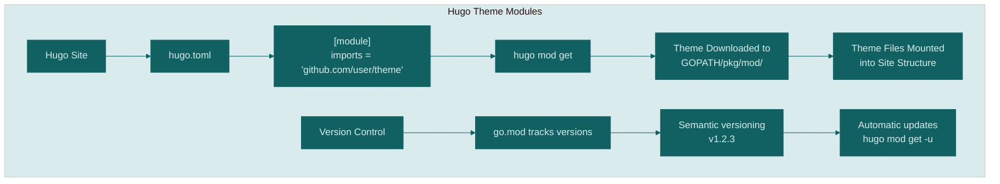
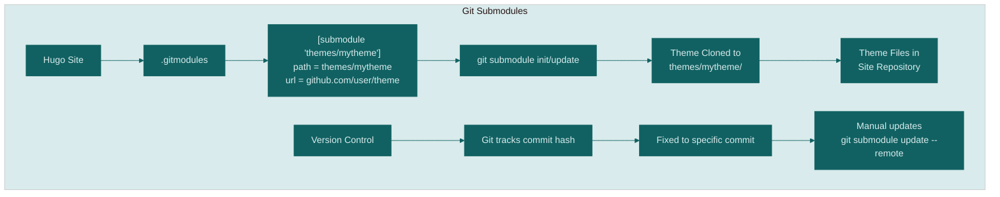

---
editor_options:
  markdown:
    wrap: sentence
title: "Hugo modules vs. Git submodules: manage your website more easily"
format: hugo-md
author: Dr. Mowinckel
date: '2025-09-01'
categories: []
tags:
  - git
  - hugo
  - submodules
  - web development
  - R
slug: submodules
image: featured.webp
image_alt: >-
  Two folders are labeled "Hugo Modules" and "Git Submodules," surrounded by
  floating islands with code snippets, gears, and file icons, all connected by
  glowing lines.
summary: >
  Explore the dynamics of Hugo modules and Git submodules in managing site
  dependencies efficiently. I go through their features, advantages, and practical 
  applications in web development, centering on my experience with Hugo and Git.
seo: >
  Learn how Hugo modules and Git submodules enhance design and site
  management, offering streamlined solutions for web development.
---


This week, a chat appeared in the rOpenSci Slack, where a solution using git submodules was discussed.
Even though my experience with git submodules isn't extensive, I've successfully integrated them in various projects.
Most notably, in transitioning the R-Ladies guide theme from Hugo modules to Git submodules, I could appreciate the powerful advantages these modular systems offer.
Inspired by my friend [Maëlle Salmon](https://masalmon.eu/), who suggested I delve into this topic, I decided to explore how (sub)modules can improve our software development practices and collaboration.
Maëlle also graciously reviewed this post and provided invaluable feedback, you would have been reading a very different post without her insights!

## What are Modules?

In software development, modules refer to discrete units of functionality that serve a specific purpose within a system.
They encapsulate code, facilitating independent development, testing, and deployment.
Modules reduce code complexity by promoting organized, reusable structures.
For instance, R packages and Python libraries act as modules, allowing consistent reuse across projects.

-   **Ease of Collaboration**: Developers can work on separate modules simultaneously, enhancing productivity and collaboration in team settings.  
-   **Simplified Testing**: Modules can be tested independently, facilitating unit testing and improving the reliability of the codebase.  
-   **Improved Organization**: Code modularity leads to a clean, organized codebase where different parts of the application are logically grouped and easy to locate.

| Programming Language | Modularity Mechanism       |
|----------------------|----------------------------|
| Python               | Modules and Packages       |
| R                    | Packages                   |
| Java                 | Classes and Packages       |
| JavaScript           | ES6 Modules, CommonJS, AMD |
| C/C++                | Header Files and Libraries |
| Ruby                 | Modules                    |
| C#                   | Namespaces and Assemblies  |
| Go                   | Packages                   |
| PHP                  | Namespaces                 |
| Rust                 | Crates and Modules         |

By implementing modularity, developers create complex, adaptable software systems efficiently, simplifying development and maintenance.
My first experience with modularity (other than R packages), was when I started using Hugo for my personal website and blog.
I was setting up my site with blogdown, which is an R package that integrates Hugo with R Markdown, and a recommendation there was to set up the site theme with a Hugo module.

## What are Hugo Modules?

[Hugo modules](https://gohugo.io/hugo-modules/) are an advanced feature in Hugo, designed to streamline the management of dependencies, themes, and assets ( even content!) by allowing them to be defined and imported directly in your Hugo project.
They are a specialized implementation of Go modules, which is particularly powerful for encouraging reuse and efficient code use.

1.  **Dependency Management**: Hugo modules simplify the process of managing dependencies like themes and components, automatically handling updates and version control.
2.  **Flexible Configuration**: Modules can be customized in `config.toml` or `config.yaml`, allowing seamless integration of multiple modules with varying settings.
3.  **Lazy Loading**: Only necessary parts of modules are fetched, optimizing build times and resource usage.
4.  **Version Specification**: Modules can specify precise versions, ensuring stability and minimizing issues related to updates.

Imagine a scenario where you have a website build with Hugo, and you have staff that are responsible for different parts of the site.
Let's say you have a front-end team that focuses on the design and layout of the site,  a back-end team that handles the Hugo configuration and build process, and a content team that creates and manages the blog posts and pages.
With Hugo modules, each team can work on their respective modules independently.
While the front-end and back-end team would need to coordinate on the overall site structure and design, they can work on their modules without interfering with each other's work.
At the same time, the content team can focus on creating and managing the content without worrying about the technical details of the site.
A well-managed team and project can benefit greatly from this modular approach, as it allows for parallel development and reduces the risk of conflicts and errors.

For most Hugo users, the primary use case for Hugo modules is to manage the site theme.
As a novice, I didn't fully understand the benefits of Hugo modules until I had to update my site theme for the first time.
Since I was using a Hugo module for the theme, I could simply run a command to update the theme to the latest version, without needing to manually download and replace files.
Since I had a theme that was actively maintained, this made it very easy to keep my site up to date with the latest features and fixes.

## File system structure with Hugo Modules

When using Hugo modules, the theme files are not directly present in your site's repository.
When using Hugo modules, the theme files are downloaded to a central location in your `GOPATH`, and then mounted into your site structure during the build process.
This means that the theme files are not directly part of your site's repository, which can make it easier to manage updates and keep your site lightweight.
The paths to the modules are tracked in the `go.mod` and `go.sum` files, which are automatically generated and updated by Hugo when you add or update modules.

Here is an example of what the file tree might look like when using Hugo modules for the theme:

```bash
    my-hugo-site/
    ├── hugo.toml
    ├── go.mod  # <<-- tracks module versions >>
    ├── go.sum  # <<-- tracks module versions >>
    ├── content/
    │   └── posts/
    ├── layouts/
    │   └── _default/
    └── static/
        └── images/
```

As you can see, the theme files are not present in the site directory structure.
This can make it easier to manage updates and keep your site lightweight, but can also cause confusion if you're not familiar with how Hugo modules work.
I know this confused me when I first started using Hugo modules.

**Think of Hugo Theme Modules like installing apps on your phone:**

1.  **Hugo Site** - This is your website project, like your phone
2.  **hugo.toml** - This is your settings file where you tell Hugo what you want
3.  **\[module\] imports** - You write down which theme you want (like saying "I want Instagram app")
4.  **hugo mod get** - This is like tapping "Install" - Hugo goes and fetches the theme for you
5.  **Theme Downloaded to GOPATH** - The theme gets stored in a central location on your computer (like how apps go to your phone's app library)
6.  **Theme Files Mounted** - Hugo makes the theme's files available to your website (like how the app appears on your home screen ready to use)



**The version control part works like app updates:**
- **go.mod tracks versions** - Hugo keeps track of which version of the theme you're using (like "Instagram v2.1.3")
- **Semantic versioning** - Themes use numbered versions that make sense (2.1.3 means major.minor.patch updates)
- **Automatic updates** - You can easily update to newer versions when they're available (like updating your apps)

The key advantage is that Hugo handles all the downloading, version tracking, and file management for you automatically - you just say what theme you want and Hugo takes care of the rest!

### Implementing Hugo Modules in Your Project

Incorporating Hugo modules into your workflow can significantly enhance your site's modularity and maintainability. Here's how to get started:

#### Setting Up Hugo Modules

1.  **Enable Modules in Your Project**: Start by setting up Hugo modules in your `config.toml` (or `config.yaml`). Here's an example of adding a theme module:

``` toml
[module]
  [[module.imports]]
    path = "github.com/gohugoio/my-hugo-theme"
```

1.  **Initializing Your Project with Modules**: If your Hugo project is not yet using modules, initialize with:

``` bash
hugo mod init <module-name>
```

1.  **Adding Modules**: You can add content, components, or themes as modules using paths to their respective repositories, similar to the example above.

### Managing Hugo Modules

Usually you would update your modules when you update your Hugo version, since newer versions of Hugo might require newer versions of the modules.
That's my experience both with my own website, and also with both the R-Ladies guide and the R-Ladies website.

1.  **Update Modules**: Update your modules to fetch the latest changes using:

``` bash
hugo mod get -u
```

1.  **Ensuring Versions**: Pin specific versions or commits to avoid unexpected changes impacting your project stability by specifying version numbers or commit hashes in your configuration file.

2.  **Nested Modules**: Hugo allows nested module imports, enabling hierarchical organization of dependencies for complex sites.

While Hugo modules are a powerful feature that enhances the modularity and maintainability of Hugo sites,
I never really got the hang of them, and I found them a bit cumbersome to work with.
I didn't really understand how they work and so I never really used them to their full potential.

When I started working on making my own custom theme, I had no idea how to set it up with Hugo modules.
But I did know how to use git submodules, and so I decided to use them instead.

## Why Use Git Submodules?

[Git submodules](https://git-scm.com/book/en/v2/Git-Tools-Submodules) are a Git feature that allows you to include and manage external repositories within a parent repository.
Git will actually complain if you try to add a repository inside another repository without using submodules, so this is a common use case.

In my post on [customizing your GitHub profile](./blog/2024/github-profile/), I mentioned that I use git submodules to get information about my latest blog posts.
There, I have my website repo as a submodule in my profile repository.
This allows me to keep the profile repository lightweight while still displaying the latest posts from my blog.
It does also post a small issue, because the submodule is not automatically updated when I push new posts to my blog.
This means that I need to remember to update the submodule in my profile repository whenever I push new posts.

### Using Git Submodules with Hugo

When working with Hugo incorporating themes or modular components efficiently is crucial.
In the case with the R-Ladies guide theme, transitioning from Hugo modules to Git submodules offered several advantages:

1.  **Version Control**: With git's robust version control capabilities, changes to the Hugo theme can be tracked seamlessly, enabling easy rollback and updates.  
2.  **Modular Setup**: Submodules keep your site's code clean by isolating theme code into its repository, making it easier to manage dependencies.  
3.  **Remove extra software installation**: Since Hugo modules require Go to be installed, switching to git submodules simplifies the setup process, as it only requires Git.

When using git submodules, the theme files are cloned directly into your site's repository, which means that they are part of your site's version control.
If you don't actually make sure to clone with the `--recursive` flag, you will likely see something like this:

```bash
    my-hugo-site/
    ├── hugo.toml
    ├── .gitmodules # <<-- tracks submodule location >>
    ├── .git/
    ├── content/
    │   └── posts/
    ├── layouts/
    │   └── _default/
    ├── static/
    │   └── images/
    └── themes/ # <<-- themes directory >>
        └── mytheme @ 7g8h9i0j # <<-- commit hash >>
```

The theme files are not actually present in the site directory structure, but are referenced by a commit hash.
But you won't be able to build your site until you run `git submodule init` and `git submodule update`, which will clone the theme files into the `themes/mytheme/` directory.
The files actually need to be present in the directory structure for Hugo to be able to use them.

```bash
    my-hugo-site/
    ├── hugo.toml
    ├── .gitmodules
    ├── .git/
    ├── content/
    │   └── posts/
    ├── layouts/
    │   └── _default/
    ├── static/
    │   └── images/
    └── themes/
        └── mytheme/ # <<-- theme files are now present >>
            ├── .git/
            ├── layouts/
            │   ├── _default/
            │   └── partials/
            ├── static/
            │   ├── css/
            │   └── js/
            ├── assets/
            └── theme.toml
```


Think of Git Submodules like manually downloading and organizing files:

1.  **Hugo Site** - This is your website project, like your main folder
2.  **.gitmodules** - This is a text file where you manually write down the theme's location (like writing down a friend's address)
3.  **\[submodule 'themes/mytheme'\]** - You specify exactly where the theme should go in your project and where to find it online
4.  **git submodule init/update** - You have to run these commands to actually go get the theme (like driving to your friend's house to pick something up)
5.  **Theme Cloned to themes/mytheme/** - The theme gets copied directly into a folder inside your website project
6.  **Theme Files in Site Repository** - The theme becomes part of your project's files (like copying your friend's files into your own folder)

The version control part is more rigid:  
- **Git tracks commit hash** - Instead of nice version numbers, Git remembers a specific snapshot using a long code (like "abc123def456")
- **Fixed to specific commit** - You're locked to exactly one version of the theme at a time
- **Manual updates** - When you want a newer version, you have to manually run commands to update it (like having to drive back to your friend's house every time they change something)

The key difference is that with Git submodules, you have to do a lot more manual work as a maintainer - you manage the downloading, specify exact locations, and handle updates yourself.
It's more hands-on but gives you complete control over exactly which version you're using.



### Getting Started with Git Submodules

Here's a basic guide on implementing git submodules in your project:

1.  **Adding a Submodule**: To add a new submodule, navigate to your project's root directory in the terminal and use:

``` bash
git submodule add <repository-url> <path>
```

This command links the external repository to a specific directory within your project.

1.  **Cloning a Repository with Submodules**: If you are cloning a repository that already uses submodules, use:

``` bash
git clone --recursive <repository-url>
```

Alternatively, if you've cloned without this flag, initialize the submodules with:

``` bash
git submodule init
git submodule update
```

1.  **Updating Submodules**: To pull in the latest changes from a submodule's remote repository, run:

``` bash
git submodule update --remote <submodule-path>
```

 **Committing Submodule Changes**: When you make changes within a submodule, you'll need to go into the submodule directory to stage and commit changes.
 After committing, navigate back to your main project, stage the submodule update, and commit it again.

Git submodules are a powerful tool for managing dependencies and shared components, and using them with Hugo can streamline your workflow, making theme management more efficient and collaborative.

## Comparing Hugo Modules and Git Submodules

While both Hugo modules and Git submodules aim to manage dependencies and shared components, they serve different purposes:

| Feature | Git Submodules | Hugo Modules |
|---------|----------------|--------------|
| **Dependency Management** | Manual submodule initialization and updates | Automatic handling of dependencies, themes, and components with version control |
| **Configuration** | Limited integration, requires `.gitmodules` file | Flexible customization via `config.toml`/`config.yaml` with multi-module support |
| **Resource Loading** | Full repository clone required | Lazy loading - only necessary parts fetched |
| **Version Control** | Manual commit hash tracking and updates | Precise version specification for stability |
| **Build Performance** | Full clone impacts build times | Optimized build times through selective loading |
| **Update Management** | Manual `git submodule update` commands | Automated update handling |
| **Ease of Use** | Requires Git knowledge and commands | Simplified with Hugo commands |
| **Software Requirements** | Only Git needed | Requires Go installation |

We implemented git submodules in the R-Ladies guide to simplify the setup process and avoid additional software dependencies, making it easier for contributors to get started without needing to install Go.
The probability of contributors having Go installed in this community is quite low, while most will have Git installed.
So while there is more work for us maintaining it, it makes it easier for new contributors to get started.
It also teaches contributors about git submodules, which is a useful skill to have, while learning about Hugo modules is less useful, since they are specific to Hugo.

But if Hugo modules are simpler to use, why did they confuse me?
When I started with Hugo, I was a complete novice, and I didn't really understand how Hugo modules worked.
I found the documentation a bit overwhelming, and I didn't really understand the benefits of using modules.
Also, I couldn't **see** the theme files in my project, which made it hard to understand how Hugo worked in general.
It required me to learn about Go modules, which was far from straightforward for a novice.

What is your experience with Hugo modules and git submodules?
Have you used them in your projects?
Feel free to share your thoughts and experiences in the comments below!
