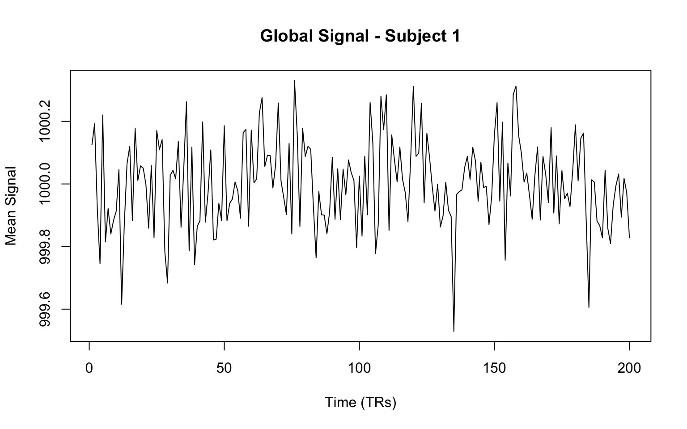

In my [first apply post](lets-get-applying), I briefly showed `apply()` converting columns to character, but I glossed over what makes `apply()` special.
It's actually quite different from `sapply()` and `mapply()` - it's designed specifically for matrices and arrays, and the `MARGIN` parameter is where the magic happens.

Understanding `apply()` properly will save you from writing many unnecessary loops when working with matrix-like data.

## The MARGIN parameter explained

The `MARGIN` parameter tells `apply()` which dimension to "collapse" by applying your function.
It's easier to understand with examples than explanations.

Let's start with a simple matrix:

``` r
# Create a 4x3 matrix
test_matrix <- matrix(1:12, nrow = 4, ncol = 3)
test_matrix
```

         [,1] [,2] [,3]
    [1,]    1    5    9
    [2,]    2    6   10
    [3,]    3    7   11
    [4,]    4    8   12

Now let's apply `sum()` across different margins:

``` r
# MARGIN = 1: apply across rows (each row becomes one value)
apply(test_matrix, MARGIN = 1, FUN = sum)
```

    [1] 15 18 21 24

``` r
# MARGIN = 2: apply across columns (each column becomes one value)
apply(test_matrix, MARGIN = 2, FUN = sum)
```

    [1] 10 26 42

Think of it this way:
- `MARGIN = 1`: "For each row, apply the function" → 4 rows become 4 values
- `MARGIN = 2`: "For each column, apply the function" → 3 columns become 3 values

## Real-world example: Student grades

Let's work with something more realistic - a gradebook matrix:

``` r
# Rows = students, Columns = assignments
grades <- matrix(
  c(
    85,
    92,
    78,
    88, # Student 1
    90,
    85,
    95,
    87, # Student 2
    78,
    83,
    80,
    85, # Student 3
    95,
    88,
    92,
    90, # Student 4
    82,
    79,
    84,
    81 # Student 5
  ),
  nrow = 5,
  byrow = TRUE
)

colnames(grades) <- c("Quiz1", "Quiz2", "Midterm", "Final")
rownames(grades) <- paste("Student", 1:5)
grades
```

              Quiz1 Quiz2 Midterm Final
    Student 1    85    92      78    88
    Student 2    90    85      95    87
    Student 3    78    83      80    85
    Student 4    95    88      92    90
    Student 5    82    79      84    81

Now we can easily compute student averages and assignment averages:

``` r
# Student averages (across columns for each row)
student_averages <- apply(grades, MARGIN = 1, FUN = mean)
student_averages
```

    Student 1 Student 2 Student 3 Student 4 Student 5 
        85.75     89.25     81.50     91.25     81.50 

``` r
# Assignment averages (across rows for each column)
assignment_averages <- apply(grades, MARGIN = 2, FUN = mean)
assignment_averages
```

      Quiz1   Quiz2 Midterm   Final 
       86.0    85.4    85.8    86.2 

This is so much cleaner than writing loops!

## Beyond mean: useful functions for apply

Let's explore some other useful functions:

``` r
# Standard deviation for each student
apply(grades, 1, sd)
```

    Student 1 Student 2 Student 3 Student 4 Student 5 
     5.909033  4.349329  3.109126  2.986079  2.081666 

``` r
# Range (min to max) for each assignment
apply(grades, 2, range)
```

         Quiz1 Quiz2 Midterm Final
    [1,]    78    79      78    81
    [2,]    95    92      95    90

``` r
# Which assignment was hardest for each student? (lowest score)
apply(grades, 1, which.min)
```

    Student 1 Student 2 Student 3 Student 4 Student 5 
            3         2         1         2         2 

``` r
# Get the assignment names instead
colnames(grades)[apply(grades, 1, which.min)]
```

    [1] "Midterm" "Quiz2"   "Quiz1"   "Quiz2"   "Quiz2"  

## Custom functions with apply

You can pass your own functions too. Let's say we want to calculate letter grades:

``` r
get_letter_grade <- function(scores) {
  avg <- mean(scores)
  if (avg >= 90) {
    return("A")
  }
  if (avg >= 80) {
    return("B")
  }
  if (avg >= 70) {
    return("C")
  }
  if (avg >= 60) {
    return("D")
  }
  return("F")
}

# Letter grade for each student
apply(grades, 1, get_letter_grade)
```

    Student 1 Student 2 Student 3 Student 4 Student 5 
          "B"       "B"       "B"       "A"       "B" 

Or something more complex - let's find the improvement trend:

``` r
calculate_trend <- function(scores) {
  # Simple linear trend (positive = improving, negative = declining)
  x <- seq_along(scores)
  trend <- cor(x, scores)
  return(trend)
}

# Trend for each student (are they improving over time?)
apply(grades, 1, calculate_trend)
```

      Student 1   Student 2   Student 3   Student 4   Student 5 
    -0.10923907  0.02968261  0.74740932 -0.47557147  0.12403473 

    ## Student 1 Student 2 Student 3 Student 4 Student 5 
    ##     0.500    -0.327     0.775    -0.500    -0.327

Student 3 shows the strongest improvement trend!

## Working with 3D arrays

`apply()` really shines with higher-dimensional data. Let's say we have test scores for multiple classes over multiple time points:

``` r
# 3D array: 5 students × 4 assignments × 3 classes
set.seed(42)
scores_3d <- array(
  round(rnorm(60, mean = 85, sd = 10)),
  dim = c(5, 4, 3),
  dimnames = list(
    Student = paste("S", 1:5, sep = ""),
    Assignment = c("Quiz1", "Quiz2", "Midterm", "Final"),
    Class = c("Math", "Science", "English")
  )
)

scores_3d
```

    , , Class = Math

           Assignment
    Student Quiz1 Quiz2 Midterm Final
         S1    99    84      98    91
         S2    79   100     108    82
         S3    89    84      71    58
         S4    91   105      82    61
         S5    89    84      84    98

    , , Class = Science

           Assignment
    Student Quiz1 Quiz2 Midterm Final
         S1    82    81      90    68
         S2    67    82      92    77
         S3    83    67      95    76
         S4    97    90      79    61
         S5   104    79      90    85

    , , Class = English

           Assignment
    Student Quiz1 Quiz2 Midterm Final
         S1    87    89      88    88
         S2    81    77      77    92
         S3    93    99     101    86
         S4    78    81      91    55
         S5    71    92      86    88

``` r
# Look at Math class
scores_3d[,, "Math"]
```

           Assignment
    Student Quiz1 Quiz2 Midterm Final
         S1    99    84      98    91
         S2    79   100     108    82
         S3    89    84      71    58
         S4    91   105      82    61
         S5    89    84      84    98

Now we can apply functions across different combinations:

``` r
# Student averages across all assignments and classes (collapse dimensions 2 and 3)
apply(scores_3d, MARGIN = 1, FUN = mean)
```

          S1       S2       S3       S4       S5 
    87.08333 84.50000 83.50000 80.91667 87.50000 

``` r
# Assignment averages across all students and classes (collapse dimensions 1 and 3)
apply(scores_3d, MARGIN = 2, FUN = mean)
```

       Quiz1    Quiz2  Midterm    Final 
    86.00000 86.26667 88.80000 77.73333 

``` r
# Class averages across all students and assignments (collapse dimensions 1 and 2)
apply(scores_3d, MARGIN = 3, FUN = mean)
```

       Math Science English 
      86.85   82.25   85.00 

You can also specify multiple margins:

``` r
# Average for each student in each class (collapse assignment dimension only)
apply(scores_3d, MARGIN = c(1, 3), FUN = mean)
```

           Class
    Student  Math Science English
         S1 93.00   80.25   88.00
         S2 92.25   79.50   81.75
         S3 75.50   80.25   94.75
         S4 84.75   81.75   76.25
         S5 88.75   89.50   84.25

## Pattern recognition

Use `apply()` when you have:

-   Matrix or array data (not data.frame)  
-   Need to collapse one or more dimensions  
-   Want to apply the same function across rows, columns, or other dimensions  
-   Working with multidimensional data (like neuroimaging, time series, etc.)

The syntax is always: `apply(X, MARGIN, FUN, ...)` where:
- `X` is your matrix/array
- `MARGIN` specifies which dimension(s) to preserve  
- `FUN` is your function
- `...` are additional arguments passed to `FUN`

## Tidyverse comparison

For completeness, dplyr handles the data.frame case elegantly:

``` r
library(dplyr)

# Convert our grades to a data.frame and add row means
grades_df <- as.data.frame(grades)
grades_df$student_avg <- rowMeans(grades)

# Or using dplyr
grades_df |> 
  rowwise() |> 
  mutate(student_avg = mean(c_across(Quiz1:Final)))
```

But for true matrices and arrays, especially multidimensional ones, `apply()` is often the most natural choice.

## Real neuroimaging example: fMRI data

This is where `apply()` really proves its worth. fMRI data is typically 4D (x, y, z, time) for each subject, and if you have multiple subjects, you're dealing with 5D arrays.

Let's simulate some fMRI-like data:

``` r
# Simulate fMRI data: 64x64x30 voxels, 200 timepoints, 10 subjects
# In reality, you'd load this with oro.nifti: readNIfTI("subject_001.nii")
set.seed(123)

# x, y, z, time, subjects
fmri_dims <- c(64, 64, 30, 200, 10)
fmri_data <- array(
  rnorm(prod(fmri_dims), mean = 1000, sd = 50),
  dim = fmri_dims,
  dimnames = list(
    x = NULL,
    y = NULL,
    z = NULL,
    time = paste0("t", 1:200),
    subject = paste0("sub", sprintf("%02d", 1:10))
  )
)

dim(fmri_data)
```

    [1]  64  64  30 200  10

Now we can use `apply()` for various neuroimaging analyses:

``` r
# 1. Calculate mean activation across time for each voxel, each subject
# Keep x, y, z, subject dimensions; collapse time (dimension 4)
mean_activation <- apply(
  fmri_data,
  MARGIN = c(1, 2, 3, 5),
  FUN = mean
)
dim(mean_activation) # Should be 64x64x30x10
```

    [1] 64 64 30 10

``` r
# 2. Calculate temporal standard deviation for each voxel (variability measure)
# Keep x, y, z, subject; collapse time
temporal_sd <- apply(fmri_data, MARGIN = c(1, 2, 3, 5), FUN = sd)

# 3. Group-level average: mean across all subjects for each voxel and timepoint
# Keep x, y, z, time; collapse subjects (dimension 5)
group_average <- apply(
  fmri_data,
  MARGIN = c(1, 2, 3, 4),
  FUN = mean
)
dim(group_average) # Should be 64x64x30x200
```

    [1]  64  64  30 200

``` r
# 4. Subject-level summary: mean signal across all voxels over time
# Keep time and subject; collapse spatial dimensions (1, 2, 3)
subject_timeseries <- apply(
  fmri_data,
  MARGIN = c(4, 5),
  FUN = mean
)
dim(subject_timeseries) # Should be 200x10
```

    [1] 200  10

``` r
plot(
  subject_timeseries[, 1],
  type = "l",
  main = "Global Signal - Subject 1",
  xlab = "Time (TRs)",
  ylab = "Mean Signal"
)
```



For more complex analyses, you might want custom functions:

``` r
# Calculate percent signal change relative to baseline (first 20 timepoints)
percent_change <- function(timeseries) {
  baseline <- mean(timeseries[1:20])
  ((timeseries - baseline) / baseline) * 100
}

# Apply percent change to each voxel timeseries
psc_data <- apply(
  fmri_data,
  MARGIN = c(1, 2, 3, 5),
  FUN = percent_change
)
dim(psc_data) # Should be 200x64x64x30x10 (time moved to first dimension)
```

    [1] 200  64  64  30  10

This is why `apply()` is so powerful for neuroimaging - you can easily specify which dimensions to preserve and which to collapse, making complex analyses much more readable than nested loops.

In practice, with `oro.nifti`, it might look like:

``` r
# Pseudocode for real analysis
# library(oro.nifti)
# 
# # Load data
# nii <- readNIfTI("functional_data.nii")  # 4D: x,y,z,time
# 
# # Calculate temporal mean for each voxel
# mean_img <- apply(nii, MARGIN = c(1,2,3), FUN = mean)
# 
# # Save result
# writeNIfTI(mean_img, "mean_activation")
```

Of course, real neuroimaging analyses can get much more complex, but `apply()` remains a core tool for manipulating these high-dimensional arrays.
They can give some quick summaries or transformations without diving into more specialized neuroimaging packages.

## Wrapping up

`apply()` is your go-to function for matrix and array operations, and it becomes absolutely essential when working with high-dimensional data like neuroimaging.
The key insight is understanding what `MARGIN` means - which dimensions you want to preserve vs. collapse.

Once you get comfortable with `apply()`, you'll find yourself reaching for it constantly when working with structured numeric data.
It's particularly powerful in scientific computing, image processing, and any domain where you work with multidimensional arrays.

The neuroimaging example shows why this matters: with 5-dimensional data, writing nested loops would be a nightmare, but `apply()` lets you specify exactly what you want with a single, readable function call.
