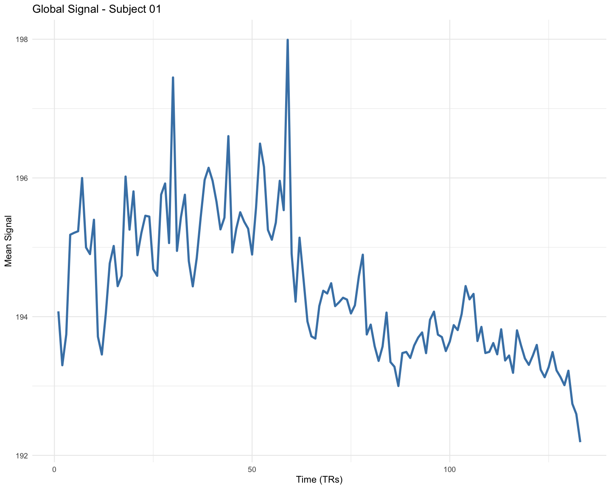
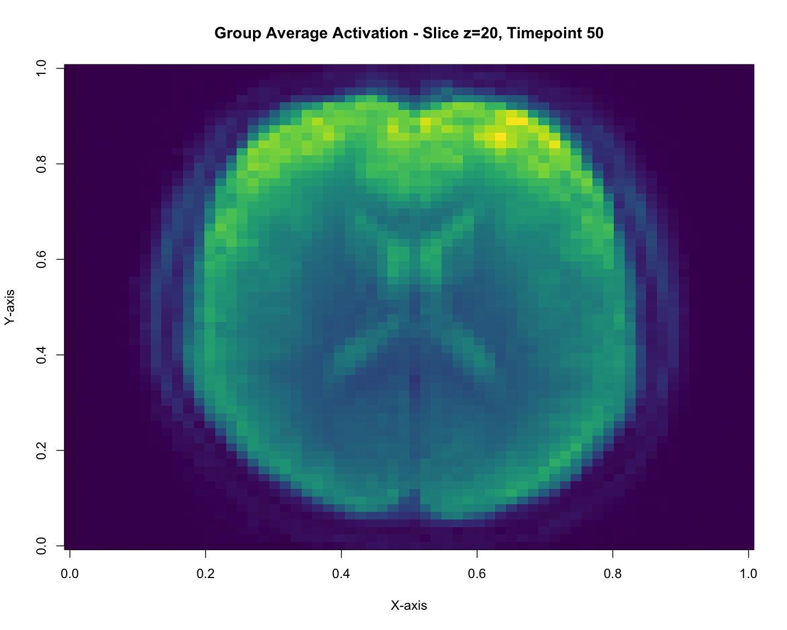
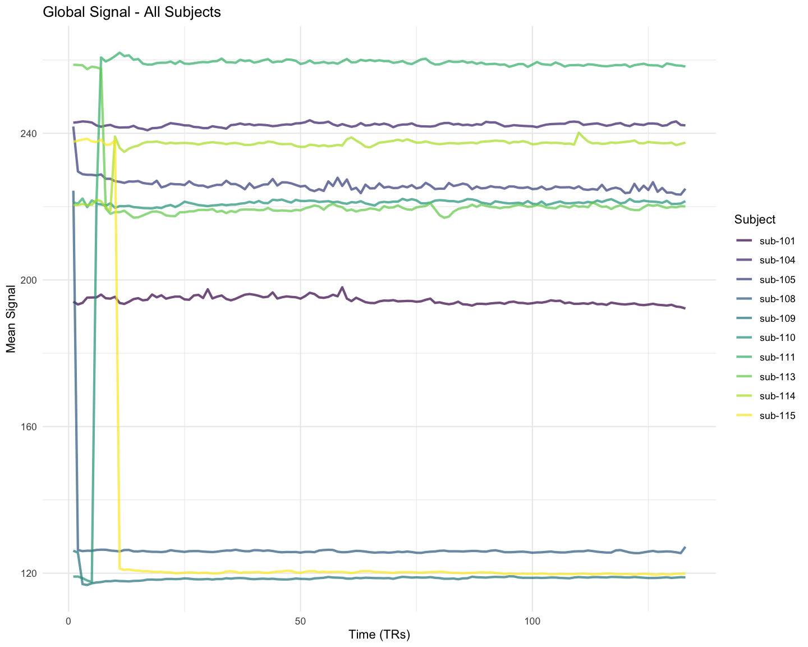

In my [first apply post](lets-get-applying), I briefly showed `apply()` converting columns to character, but I glossed over what makes `apply()` special.
Here's the thing: `apply()` is actually quite different from `sapply()` and `mapply()`.
While those work on lists and vectors, `apply()` is designed specifically for matrices and arrays.

## Pattern recognition

Use `apply()` when you have:

-   Matrix or array data (not data.frame - use dplyr for those)  
-   Need to collapse one or more dimensions by applying a function
-   Want to apply the same operation across rows, columns, or higher dimensions  
-   Working with multidimensional scientific data (neuroimaging, climate models, genomics, etc.)

The syntax is always: `apply(X, MARGIN, FUN, ...)`

Where:
- `X` is your matrix or array
- `MARGIN` specifies which dimension(s) to preserve (1 = rows, 2 = columns, 3+ = higher dimensions)
- `FUN` is the function to apply
- `...` are additional arguments passed to FUN

Think of `MARGIN` as telling R "keep these dimensions, collapse everything else."
That's where the magic happens.

I'm going to be honest - when I first encountered `apply()`, the `MARGIN` parameter confused the heck out of me.
"Why do I need to specify margins? What does that even mean?"
But once it clicked, I realized how powerful this function is for working with structured data.
Understanding `apply()` properly will save you from writing many unnecessary loops when working with matrix-like data.

## The MARGIN parameter explained

The `MARGIN` parameter tells `apply()` which dimension to "collapse" by applying your function.
I know that sounds abstract, so let me show you what I mean.
It's much easier to understand with examples than with explanations.

Let's start with a simple matrix - just numbers arranged in rows and columns:

``` r
# Create a 4x3 matrix (4 rows, 3 columns)
test_matrix <- matrix(1:12, nrow = 4, ncol = 3)
test_matrix
```

         [,1] [,2] [,3]
    [1,]    1    5    9
    [2,]    2    6   10
    [3,]    3    7   11
    [4,]    4    8   12

We've got a matrix with 4 rows and 3 columns.
Each row could represent a different observation, and each column could be a different variable.
Now, let's see what happens when we apply `sum()` across different margins:

``` r
# MARGIN = 1: apply across rows (each row becomes one value)
apply(test_matrix, MARGIN = 1, FUN = sum)
```

    [1] 15 18 21 24

Notice what happened? We got 4 values - one for each row.
`MARGIN = 1` means "for each row, apply the function and give me one result."
So R took each row, summed up all the values in that row, and gave us back a vector of 4 sums.

Now let's try the other direction:

``` r
# MARGIN = 2: apply across columns (each column becomes one value)
apply(test_matrix, MARGIN = 2, FUN = sum)
```

    [1] 10 26 42

This time we got 3 values - one for each column!
`MARGIN = 2` means "for each column, apply the function and give me one result."

Here's how I think about it:
- `MARGIN = 1`: "Process each row" → Number of rows determines output length
- `MARGIN = 2`: "Process each column" → Number of columns determines output length

The margin you specify is the dimension that gets *preserved* in your output.
Everything else gets collapsed by your function.

## Real-world example: Student grades

Okay, let's move beyond toy examples.
Imagine
Each row is a student, each column is an assignment.
This is actually a really common data structure in many fields - observations in rows, variables in columns.

``` r
# Rows = students, Columns = assignments
# styler: off
grades <- matrix(
  c(
    85, 92, 78, 88,  # Student 1
    90, 85, 95, 87,  # Student 2
    78, 83, 80, 85,  # Student 3
    95, 88, 92, 90,  # Student 4
    82, 79, 84, 81   # Student 5
  ),
  nrow = 5,
  byrow = TRUE
)

colnames(grades) <- c("Quiz1", "Quiz2", "Midterm", "Final")
rownames(grades) <- paste("Student", 1:5)
grades
```

              Quiz1 Quiz2 Midterm Final
    Student 1    85    92      78    88
    Student 2    90    85      95    87
    Student 3    78    83      80    85
    Student 4    95    88      92    90
    Student 5    82    79      84    81

Now we can easily answer questions like "What's each student's average?" and "Which assignment was hardest?"

To get each student's average, we want to work across columns for each row (sum up all their assignments and divide by the number of assignments):

``` r
# Student averages (across columns for each row)
student_averages <- apply(grades, MARGIN = 1, FUN = mean)
student_averages
```

    Student 1 Student 2 Student 3 Student 4 Student 5 
        85.75     89.25     81.50     91.25     81.50 

See how clean that is?
No loops, no indexing nightmares.
Just "hey R, for each student (row), calculate the mean."

What about assignment difficulty? We can look at the average score for each assignment by working down the columns:

``` r
# Assignment averages (across rows for each column)
assignment_averages <- apply(grades, MARGIN = 2, FUN = mean)
assignment_averages
```

      Quiz1   Quiz2 Midterm   Final 
       86.0    85.4    85.8    86.2 

Looks like Quiz 2 was the toughest (or maybe everyone was hungover that week?).
The midterm was actually easier than the quizzes on average.

This is so much cleaner than writing loops!
Compare this to what you'd have to do with a for loop - you'd need to initialize empty vectors, loop through indices, store results... it's just messy.

## Beyond mean: useful functions for apply

The function you pass to `apply()` can be anything that makes sense for your data.
Let's explore some other common operations you might want to do with gradebook data.

Want to know how consistent each student's performance is? Standard deviation tells you that:

``` r
# Standard deviation for each student (higher = more variable)
apply(grades, 1, sd)
```

    Student 1 Student 2 Student 3 Student 4 Student 5 
     5.909033  4.349329  3.109126  2.986079  2.081666 

Student 1 has the highest variability - maybe they're really good at some things and struggle with others?
Student 4 is super consistent.

What about the range of scores for each assignment?

``` r
# Range (min to max) for each assignment
apply(grades, 2, range)
```

         Quiz1 Quiz2 Midterm Final
    [1,]    78    79      78    81
    [2,]    95    92      95    90

This gives us a matrix where the first row is minimums and second row is maximums for each assignment.
Here's a fun one - which assignment was each student's worst?

``` r
apply(grades, 1, which.min)
```

    Student 1 Student 2 Student 3 Student 4 Student 5 
            3         2         1         2         2 

These are column indices.
We can make this more readable by looking up the actual assignment names:

``` r
# Get the assignment names instead of indices
colnames(grades)[apply(grades, 1, which.min)]
```

    [1] "Midterm" "Quiz2"   "Quiz1"   "Quiz2"   "Quiz2"  

Now that's informative!
Three students struggled most with Quiz2.

## Custom functions with apply

You're not limited to built-in functions.
You can pass your own functions too, which is where things get really powerful.

Let's say we want to calculate letter grades based on each student's average.
We need a function that takes a vector of scores, calculates the mean, and returns a letter:

``` r
get_letter_grade <- function(scores) {
  avg <- mean(scores)
  if (avg >= 90) {
    return("A")
  }
  if (avg >= 80) {
    return("B")
  }
  if (avg >= 70) {
    return("C")
  }
  if (avg >= 60) {
    return("D")
  }
  return("F")
}

# Letter grade for each student
apply(grades, 1, get_letter_grade)
```

    Student 1 Student 2 Student 3 Student 4 Student 5 
          "B"       "B"       "B"       "A"       "B" 

One A and 4 B's, impressive!

Here's something more interesting - let's figure out if students are improving over time.
We can calculate a simple correlation between time (assignment order) and scores:

``` r
calculate_trend <- function(scores) {
  # Simple linear trend (positive = improving, negative = declining)
  x <- seq_along(scores)
  trend <- cor(x, scores)
  return(trend)
}

# Trend for each student (are they improving over time?)
trends <- apply(grades, 1, calculate_trend)
trends
```

      Student 1   Student 2   Student 3   Student 4   Student 5 
    -0.10923907  0.02968261  0.74740932 -0.47557147  0.12403473 

Student 3 has the strongest positive trend (0.7474093) - they started rough but ended strong! Good for them.
Student 4 has a negative trend (-0.4755715) - started great but faded.
Maybe they need some extra help?

The cool thing about custom functions is you can make them as complex as you need.
Statistical tests, transformations, summarizations - whatever makes sense for your analysis.

## Working with 3D arrays

Now we're getting into territory where `apply()` really starts to shine.
Let's say instead of one class, you're teaching multiple sections.
Or maybe you're running a longitudinal study with multiple measurement occasions.
Suddenly you need a third dimension.

Let me simulate something realistic: test scores for 5 students across 4 assignments in 3 different classes:

``` r
# 3D array: 5 students × 4 assignments × 3 classes
set.seed(42)
scores_3d <- array(
  round(rnorm(60, mean = 85, sd = 10)),
  dim = c(5, 4, 3),
  dimnames = list(
    Student = paste("S", 1:5, sep = ""),
    Assignment = c("Quiz1", "Quiz2", "Midterm", "Final"),
    Class = c("Math", "Science", "English")
  )
)

# Look at the whole structure
scores_3d
```

    , , Class = Math

           Assignment
    Student Quiz1 Quiz2 Midterm Final
         S1    99    84      98    91
         S2    79   100     108    82
         S3    89    84      71    58
         S4    91   105      82    61
         S5    89    84      84    98

    , , Class = Science

           Assignment
    Student Quiz1 Quiz2 Midterm Final
         S1    82    81      90    68
         S2    67    82      92    77
         S3    83    67      95    76
         S4    97    90      79    61
         S5   104    79      90    85

    , , Class = English

           Assignment
    Student Quiz1 Quiz2 Midterm Final
         S1    87    89      88    88
         S2    81    77      77    92
         S3    93    99     101    86
         S4    78    81      91    55
         S5    71    92      86    88

This is now a 3-dimensional array.
Think of it like a cube of numbers.
We can slice it to look at just one class:

``` r
# Just the Math class
scores_3d[,, "Math"]
```

           Assignment
    Student Quiz1 Quiz2 Midterm Final
         S1    99    84      98    91
         S2    79   100     108    82
         S3    89    84      71    58
         S4    91   105      82    61
         S5    89    84      84    98

Now, with `apply()`, we can answer all sorts of questions by specifying which dimensions to collapse.

Want each student's overall average across all assignments and all classes?
We keep dimension 1 (students) and collapse dimensions 2 (assignments) and 3 (classes):

``` r
# Student averages across all assignments and classes
# Keep dimension 1, collapse dimensions 2 and 3
apply(scores_3d, MARGIN = 1, FUN = mean)
```

          S1       S2       S3       S4       S5 
    87.08333 84.50000 83.50000 80.91667 87.50000 

What if we want to know which assignments are hardest on average, regardless of student or class?
Keep dimension 2 (assignments), collapse dimensions 1 (students) and 3 (classes):

``` r
# Assignment difficulty across all students and classes
# Keep dimension 2, collapse dimensions 1 and 3
apply(scores_3d, MARGIN = 2, FUN = mean)
```

       Quiz1    Quiz2  Midterm    Final 
    86.00000 86.26667 88.80000 77.73333 

Or we could see which class has the highest average:

``` r
# Class averages across all students and assignments
# Keep dimension 3, collapse dimensions 1 and 2
apply(scores_3d, MARGIN = 3, FUN = mean)
```

       Math Science English 
      86.85   82.25   85.00 

Here's where it gets really cool - you can specify *multiple* margins to keep.
Say we want each student's average in each class (but collapsed across assignments):

``` r
# Average for each student in each class
# Keep dimensions 1 and 3, collapse dimension 2 (assignments)
apply(scores_3d, MARGIN = c(1, 3), FUN = mean)
```

           Class
    Student  Math Science English
         S1 93.00   80.25   88.00
         S2 92.25   79.50   81.75
         S3 75.50   80.25   94.75
         S4 84.75   81.75   76.25
         S5 88.75   89.50   84.25

Now we get a matrix: rows are students, columns are classes, values are averages.
This is super useful for generating summary tables.

The key insight is that `MARGIN` tells you what dimensions you want to *preserve* in your output.
Everything else gets fed to your function.

## Real neuroimaging example: fMRI data

Alright, this is where I get excited.
This is where `apply()` goes from "handy" to "absolutely essential."

Neuroimaging data is inherently multidimensional.
Most of us are aware that digital images are made of lots and lots of pixels, small squares that each have a single colour.
Together, all these pixels form the complete image.

When we record brain activity using MRI (Magnetic Resonance Imaging), it's similar.
We take a bunch of "slices" through the brain, each slice being a 2D image.
Stacked together, these slices form a 3D volume of the brain.
We call these voxels (3D pixels), and each voxel has a single intensity value representing tissue properties.


MRI data usually contains values for three spatial dimensions: X (left-right), Y (anterior-posterior), and Z (inferior-superior).
So a standard MRI scan is 3D: width, height, depth, a larger cube made of tiny cubes (voxels).

By combining these cubes in different ways, we get to see different sections of the brain.
You will often see neuroscientists talk about "slices" of the brain - these are just 2D cross-sections through the 3D volume.
A slice is like taking one layer out of a cake to see what's inside.
So you can see a single "slice" of the brain, and there will typically be a notice on that image indicating which slice number it is (e.g., slice X=20 or Y=37).


Less often we actually look at the entire 3d rendered brain, as we cannot look "inside" the brain that way.
But in essence we have a cube of voxels representing the brain volume.


An fMRI scan is 4D: three spatial dimensions (x, y, z) plus time (each volume was acquired at a different timepoint usually around 2.5 - seconds apart).
When we combine these 3D volumes over time, we get a time series of brain activity.
An array of cubes changing over time, cubes on a line.


If you have multiple subjects, you have multiple lines of cubes, a **plane** of cubes.
I am not 100% certain that this is how multideminsional data really are stored in practice, but it helps my brain work with it this way.


So we have a cube of voxels changing over time, for multiple subjects.
Each voxel is represented as a cell in our multidimensional array.
Analyzing this data without `apply()` would be a nightmare of nested loops and index juggling.

In real life, we would do lots of stuff to normalize and smooth the data to reduce the immense noise inherent in this data.
MRI analyses are complex and nuanced, but let me show you how `apply()` works with this kind of structure using actual data from a BIDS (Brain Imaging Data Standard) dataset I grabbed from [OpenNeuro](https://openneuro.org/datasets/ds005038/versions/1.0.3).

The data were obtained by Mueckstein (2024), and are openly available for anyone to use (with credit, of course).
This dataset comes from a dual-task training study where participants performed tasks requiring either compatible (visual+manual, auditory+vocal) or incompatible (visual+vocal, auditory+manual) modality pairings.
It has pre and post training sessions, though we'll only work with the pre-session data here.
For our purposes, we're using the anatomical scans and a simple auditory task to demonstrate how `apply()` works with real neuroimaging data.
I've reduced the data to just 10 subjects to keep things manageable.

## Single subject

Let's start simple with loading in a single subject, and have a look at the MRI data.

``` r
library(oro.nifti)

# Path to our BIDS dataset
bids_dir <- here::here("content/blog/2025/11-01_apply/data")
```

Let's load one subject's functional run:

``` r
# Load a functional run for subject 01
func_file <- file.path(
  bids_dir,
  "sub-101/ses-pre/func",
  "sub-101_ses-pre_task-DT_run-01_bold.nii.gz"
)

fmri_data <- readNIfTI(func_file, reorient = FALSE)
dim(fmri_data)
```

    [1]  64  64  37 133

This is a 4D array: 64 voxels in x, 64 in y, 37 in z, and 133 timepoints.
That's 64x64x37x133 = 298 individual numbers.
You definitely don't want to write nested loops for this!

One common analysis is calculating the mean activation for each voxel across time.
Of course, real fMRI analysis is more complex than this, but this can illustrate how `apply()` works with 4D data.
This tells you the average signal intensity at each location in the brain:

``` r
# Calculate mean activation across time for each voxel
# Keep x, y, z dimensions; collapse time (dimension 4)
mean_activation <- apply(
  fmri_data,
  MARGIN = c(1, 2, 3),
  FUN = mean
)
dim(mean_activation)
```

    [1] 64 64 37

``` r
# Visualize a slice of the mean activation
image(
  mean_activation[,,20], # Slice at z=20
  col = viridis::viridis(256),
  main = "Mean Activation - Subject 01 (Slice z=20)",
  xlab = "X-axis",
  ylab = "Y-axis"
)
```


We went from 4D to 3D - we collapsed the time dimension and kept the spatial dimensions.
Each voxel now has one number: its average signal across the whole scan.

Similarly, we might want to know how variable the signal is at each location.
High variability might indicate functional activity (or noise, depending on what you're looking for):

``` r
# Calculate temporal standard deviation for each voxel
temporal_sd <- apply(
  fmri_data,
  MARGIN = c(1, 2, 3),
  FUN = sd
)

# Coefficient of variation (CV) - normalized measure of variability
cv <- temporal_sd / mean_activation
```

``` r
# Visualize a slice of the CV
image(
  cv[,,20], # Slice at z=20
  col = viridis::viridis(256),
  main = "Coefficient of Variation - Subject 01 (Slice z=20)",
  xlab = "X-axis",
  ylab = "Y-axis"
)
```


The coefficient of variation is useful because it accounts for the baseline signal intensity.
A voxel with high signal and high variability has a different meaning than a voxel with low signal and high variability.

Sometimes you want to summarize across space instead of time.
The "global signal" is the average intensity across all voxels at each timepoint:

``` r
# Subject-level summary: mean signal across all voxels over time
# Keep time dimension; collapse spatial dimensions (1, 2, 3)
global_signal <- apply(
  fmri_data,
  MARGIN = 4,
  FUN = mean
)
```

``` r
# Plot the global signal
library(ggplot2)

data.frame(
  time = 1:length(global_signal),
  signal = global_signal
) |>
  ggplot(aes(x = time, y = signal)) +
  geom_line(color = "steelblue", linewidth = 1.2) +
  labs(
    title = "Global Signal - Subject 01",
    x = "Time (TRs)",
    y = "Mean Signal"
  ) +
  theme_minimal() 
```



This gives you a sense of overall signal drift and scanner stability.
You can see some slow drift over time, which is pretty typical in fMRI.

## Multiple subjects

Now let's scale up to multiple subjects.
This is where neuroimaging analysis gets computationally intensive, but `apply()` keeps it manageable:

``` r
fmri_files <- list.files(
  bids_dir,
  "ses-pre_task-DT_run-01_bold.nii.gz",
  recursive = TRUE,
  full.names = TRUE
)

# Extract subject IDs from filenames
subjects <- gsub(
  ".*sub-(\\d+)_ses-.*",
  "\\1",
  basename(fmri_files)
)
subjects
```

     [1] "101" "104" "105" "108" "109" "110" "111" "113" "114" "115"

``` r
# Read in imaging files
fmri_list <- lapply(
  fmri_files,
  readNIfTI,
  reorient = FALSE
)


# Combine into 5D array: x, y, z, time, subjects
fmri_array <- array(
  unlist(fmri_list),
  dim = c(dim(fmri_list[[1]]), length(fmri_list))
)

# Add dimension names
dimnames(fmri_array) <- list(
  X = NULL,
  Y = NULL,
  Z = NULL,
  time = paste0("TR", seq_len(dim(fmri_array)[4])),
  Subject = paste0("sub-", subjects)
)

dim(fmri_array)
```

    [1]  64  64  37 133  10

We now have a 5-dimensional array.
Three spatial dimensions, one temporal dimension, and one subject dimension.
That's over 201 million numbers to work with!

``` r
# tissue intensities at voxel (40,40,20) for subject 101, across all timepoints
fmri_array[40,40,20, , "sub-101"]
```

      TR1   TR2   TR3   TR4   TR5   TR6   TR7   TR8   TR9  TR10  TR11  TR12  TR13 
      760   755   743   768   755   763   770   756   760   767   766   769   767 
     TR14  TR15  TR16  TR17  TR18  TR19  TR20  TR21  TR22  TR23  TR24  TR25  TR26 
      780   777   769   780   790   770   780   764   785   765   757   779   771 
     TR27  TR28  TR29  TR30  TR31  TR32  TR33  TR34  TR35  TR36  TR37  TR38  TR39 
      776   769   773   765   767   787   759   783   787   771   772   761   781 
     TR40  TR41  TR42  TR43  TR44  TR45  TR46  TR47  TR48  TR49  TR50  TR51  TR52 
      772   752   779   767   768   781   764   768   765   775   777   764   766 
     TR53  TR54  TR55  TR56  TR57  TR58  TR59  TR60  TR61  TR62  TR63  TR64  TR65 
      785   782   793   790   779   789   773   759   777   754   769   761   776 
     TR66  TR67  TR68  TR69  TR70  TR71  TR72  TR73  TR74  TR75  TR76  TR77  TR78 
      755   763   769   769   748   762   773   763   781   767   758   768   779 
     TR79  TR80  TR81  TR82  TR83  TR84  TR85  TR86  TR87  TR88  TR89  TR90  TR91 
      780   770   759   776   763   760   748   762   758   757   773   743   769 
     TR92  TR93  TR94  TR95  TR96  TR97  TR98  TR99 TR100 TR101 TR102 TR103 TR104 
      769   753   761   761   786   756   787   748   762   774   746   761   755 
    TR105 TR106 TR107 TR108 TR109 TR110 TR111 TR112 TR113 TR114 TR115 TR116 TR117 
      771   770   763   784   770   771   741   757   777   750   755   762   765 
    TR118 TR119 TR120 TR121 TR122 TR123 TR124 TR125 TR126 TR127 TR128 TR129 TR130 
      762   781   764   770   785   760   772   770   746   760   766   760   752 
    TR131 TR132 TR133 
      753   754   762 

``` r
# tissue intensities at voxel (40,40,20) for all subjects, at timepoint 50
fmri_array[40,40,20, "TR50", ]
```

    sub-101 sub-104 sub-105 sub-108 sub-109 sub-110 sub-111 sub-113 sub-114 sub-115 
        777     531     625     197     187     613     575     647     546     181 

For group-level analysis, you might want the average across all subjects:

``` r
# Group-level average: mean across all subjects
# Keep x, y, z, time; collapse subjects (dimension 5)
group_average <- apply(
  fmri_array,
  MARGIN = c(1, 2, 3, 4),
  FUN = mean
)
dim(group_average)
```

    [1]  64  64  37 133

``` r
# visualize a slice of the group average
image(
  group_average[,,20, 50], # Slice at z=20, timepoint
  col = viridis::viridis(256),
  main = "Group Average Activation - Slice z=20, Timepoint 50",
  xlab = "X-axis",
  ylab = "Y-axis"
)
```



This gives you a 4D array representing the average response across all participants.
This is your group template - what the "average brain" is doing during this task.

We can also extract summary timeseries for all subjects:

``` r
# Extract global signal timeseries for each subject
# Keep time and subjects; collapse spatial dimensions
subject_timeseries <- apply(
  fmri_array,
  MARGIN = c(5, 4),
  FUN = mean
)
dim(subject_timeseries)
```

    [1]  10 133

This gives us a 10×133 matrix: 133 timepoints by 10 subjects.
Now we can visualize all subjects together:

``` r
# Plot all subjects' global signals

# Convert to long format for ggplot
subject_timeseries_df <- as.data.frame(subject_timeseries) |>
  tibble::rownames_to_column("subject") |>
  tidyr::pivot_longer(
    cols = -subject,
    names_to = "time",
    values_to = "signal"
  ) |>
  dplyr::mutate(time = as.numeric(gsub("V", "", time)))

ggplot(subject_timeseries_df, aes(x = time, y = signal, color = subject)) +
  geom_line(linewidth = 1, alpha = 0.7) +
  labs(
    title = "Global Signal - All Subjects",
    x = "Time (TRs)",
    y = "Mean Signal",
    color = "Subject"
  ) +
  theme_minimal()
```



There are some individual differences in signal patterns here.
In particular, you can see there are some spikes and dips in certain subjects in the very beginning.
It's always good to visually inspect your data like this before diving into more complex analyses.

The beautiful thing about `apply()` is that it scales.
Whether you're working with a single subject or a hundred, whether you have 10 timepoints or 1000, the syntax stays the same.
You just specify which dimensions matter for your analysis, and R handles the rest.

## Wrapping up

If you work with matrices or arrays - whether that's gradebooks, experimental data, images, or brain scans - `apply()` will become one of your most-used functions.
The key is understanding the `MARGIN` parameter: it tells R which dimensions to preserve while your function collapses the rest.

Once you get comfortable with `apply()`, you'll find yourself reaching for it constantly.
No more nested loops to calculate row means!
No more confusing index arithmetic!
Just a clear statement of what you want: "for each \[row/column/slice/timepoint\], calculate \[thing\]."

This is the power of R's array-oriented thinking.
Embrace it, and your code will be cleaner, faster, and easier to understand.

Mueckstein, Kai AND Heinzel, Marie AND Görgen. 2024. "\"Modality-Based Multitasking and Practice - fMRI\"." OpenNeuro. <https://doi.org/doi:10.18112/openneuro.ds005038.v1.0.3>.
