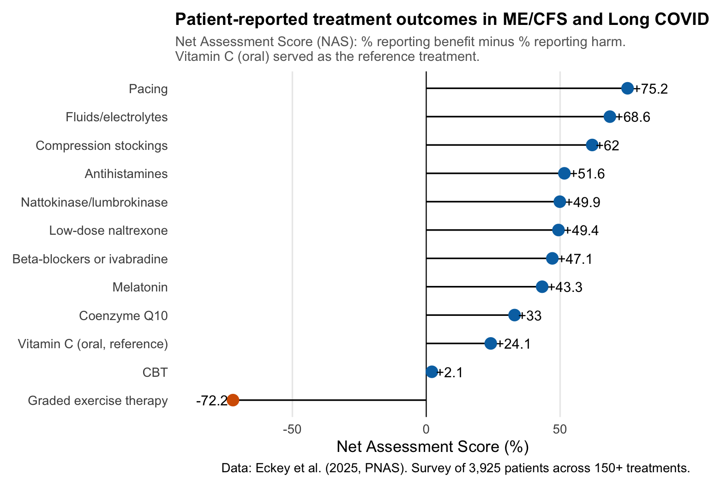
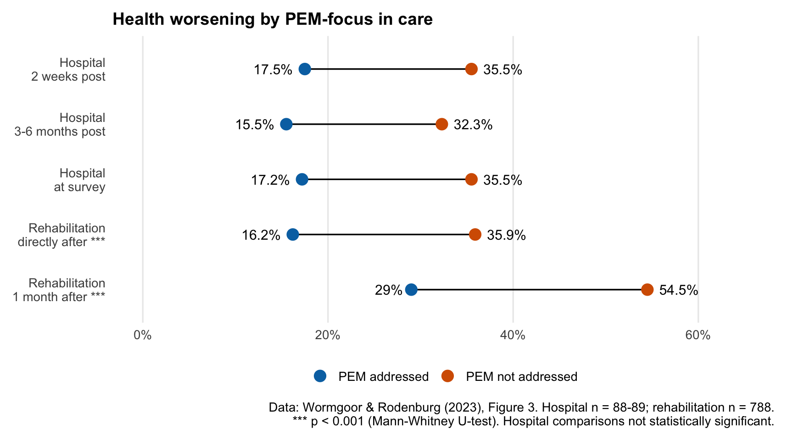
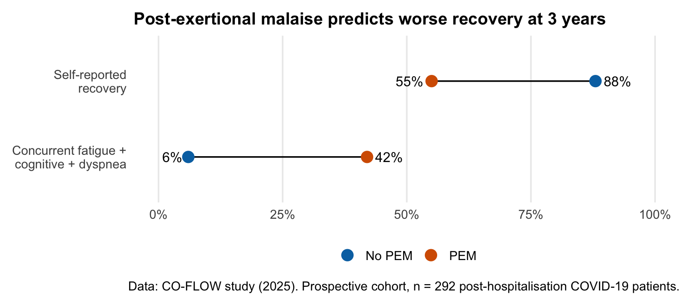

In February 2026, the Norwegian Directorate of Health (Helsedirektoratet) published draft national guidelines for fatigue and ME/CFS.
The consultation period is open until **May 4th, 2026**, and anyone can respond.

I've written a detailed consultation response, and I want to share both the response itself and the reasoning behind it.
Because these guidelines, if implemented as drafted, risk real harm to patients.

I'll be honest with you: this is personal.
I've been on sick leave since January 2024 with post-COVID condition.
I've [written about that year](../../../../blog/2025/the-difficult-year) and [tracked my symptoms with data](../../../../blog/2025/visible) on this blog before.
My wife lives with ME/CFS.
I know this illness from both sides, as patient and as caretaker, and what I see in these guidelines worries me deeply.

## What the guidelines recommend

The draft guideline covers assessment, treatment, and follow-up for patients with "utmattelse" (fatigue), prolonged fatigue, and ME/CFS.
It uses the [Canada Consensus Criteria](https://doi.org/10.1300/J092v11n01_02) for diagnosis, which is good.

But then it does something that undermines the whole thing: it explicitly states that the treatment recommendations do not distinguish between patients with prolonged fatigue and patients with ME/CFS.

> **The guideline's own words**
>
> > *"Retningslinjen skiller i utgangspunktet ikke mellom anbefalinger for pasienter med langvarig utmattelse og pasienter med ME/CFS"*
> >
> > (The guideline does not initially distinguish between recommendations for patients with prolonged fatigue and patients with ME/CFS)
>
> This is like writing a guideline that doesn't distinguish between a headache and a brain tumour because both involve head pain.

That's the core problem.

ME/CFS is classified as a neurological disease ([ICD-10 G93.3](https://icd.who.int/browse10/2019/en#/G93.3), [ICD-11 8E49](https://icd.who.int/browse/2024-01/mms/en#569175314)).
Its defining feature is post-exertional malaise (PEM), a measurable, physiological worsening after exertion that can last days or weeks.
Prolonged fatigue is a non-specific symptom with many different causes.
These are not the same thing, and they don't respond to the same treatments.

Under an umbrella term of "activity regulation," the guideline presents graded activity as more effective than pacing.
If you're not familiar with the distinction: graded activity means progressively increasing your activity levels over time.
Pacing means staying within your energy limits and stabilising before doing more.

For patients with PEM, graded activity is effectively graded exercise therapy (GET) under a different name.
And GET is precisely what [NICE 2021](https://www.nice.org.uk/guidance/ng206), the most rigorous evidence review of ME/CFS treatments ever conducted, recommended **against**.

## Why this matters

The evidence here is not ambiguous.

[Patient surveys](https://doi.org/10.1177/1359105317726152) consistently show that 50-74% of ME/CFS patients report worsening from GET.
A [recent survey of nearly 4,000 patients](https://doi.org/10.1073/pnas.2426874122) across 150+ treatments found that GET received the lowest patient-reported outcome score of all treatments studied, while pacing received the highest.

``` r
eckey <- tibble::tribble(
  ~treatment                    , ~nas  ,
  "Pacing"                      ,  75.2 ,
  "Fluids/electrolytes"         ,  68.6 ,
  "Compression stockings"       ,  62.0 ,
  "Antihistamines"              ,  51.6 ,
  "Nattokinase/lumbrokinase"    ,  49.9 ,
  "Low-dose naltrexone"         ,  49.4 ,
  "Beta-blockers or ivabradine" ,  47.1 ,
  "Melatonin"                   ,  43.3 ,
  "Coenzyme Q10"                ,  33.0 ,
  "Vitamin C (oral, reference)" ,  24.1 ,
  "CBT"                         ,   2.1 ,
  "Graded exercise therapy"     , -72.2
) |>
  mutate(
    treatment = fct_rev(fct_inorder(treatment)),
    direction = if_else(nas >= 0, "benefit", "harm")
  )

ggplot(eckey, aes(x = nas, y = treatment)) +
  geom_vline(xintercept = 0, linewidth = 0.4) +
  geom_linerange(
    aes(xmin = 0, xmax = nas),
    linewidth = 0.6,
    colour = "black"
  ) +
  geom_point(
    aes(colour = direction),
    size = 4,
    show.legend = FALSE
  ) +
  geom_text(
    aes(
      label = ifelse(nas >= 0, paste0("+", nas), nas),
      hjust = ifelse(nas >= 0, -0.15, 1.15)
    ),
    size = 4,
    show.legend = FALSE
  ) +
  scale_x_continuous(limits = c(-85, 90)) +
  scale_colour_manual(
    values = c("benefit" = "#0072B2", "harm" = "#D55E00"),
    guide = "none"
  ) +
  labs(
    title = "Patient-reported treatment outcomes in ME/CFS and Long COVID",
    subtitle = "Net Assessment Score (NAS): % reporting benefit minus % reporting harm.\nVitamin C (oral) served as the reference treatment.",
    caption = "Data: Eckey et al. (2025, PNAS). Survey of 3,925 patients across 150+ treatments.",
    x = "Net Assessment Score (%)",
    y = NULL
  ) +
  theme_horingssvar
```



[Norwegian survey data](https://doi.org/10.1177/13591053231169191) tells the same story.
Among 660 Norwegian fatigue patients, only 20% of those meeting the strict Canada Criteria reported improvement from rehabilitation programmes, compared to 40% of patients meeting the broader Fukuda criteria.
The stricter your ME/CFS definition, meaning the more certain you are that patients actually have PEM, the less effective these programmes are.

[When PEM is not addressed](https://doi.org/10.3389/fneur.2023.1247698) in rehabilitation, over half of patients report their health worsening.
When PEM **is** addressed, that number drops significantly.

``` r
wormgoor <- tibble::tribble(
  ~timepoint                           , ~group              , ~pct , ~sig  ,
  "Hospital\n2 weeks post"             , "PEM not addressed" , 35.5 , FALSE ,
  "Hospital\n2 weeks post"             , "PEM addressed"     , 17.5 , FALSE ,
  "Hospital\n3-6 months post"          , "PEM not addressed" , 32.3 , FALSE ,
  "Hospital\n3-6 months post"          , "PEM addressed"     , 15.5 , FALSE ,
  "Hospital\nat survey"                , "PEM not addressed" , 35.5 , FALSE ,
  "Hospital\nat survey"                , "PEM addressed"     , 17.2 , FALSE ,
  "Rehabilitation\ndirectly after ***" , "PEM not addressed" , 35.9 , TRUE  ,
  "Rehabilitation\ndirectly after ***" , "PEM addressed"     , 16.2 , TRUE  ,
  "Rehabilitation\n1 month after ***"  , "PEM not addressed" , 54.5 , TRUE  ,
  "Rehabilitation\n1 month after ***"  , "PEM addressed"     , 29.0 , TRUE
) |>
  mutate(
    timepoint = factor(
      timepoint,
      levels = c(
        "Rehabilitation\n1 month after ***",
        "Rehabilitation\ndirectly after ***",
        "Hospital\nat survey",
        "Hospital\n3-6 months post",
        "Hospital\n2 weeks post"
      )
    ),
    group = factor(group, levels = c("PEM addressed", "PEM not addressed"))
  )

wormgoor_segments <- wormgoor |>
  summarise(xmin = min(pct), xmax = max(pct), .by = timepoint)

wormgoor <- wormgoor |>
  mutate(is_min = pct == min(pct), .by = timepoint)

ggplot(wormgoor, aes(y = timepoint)) +
  geom_linerange(
    data = wormgoor_segments,
    aes(xmin = xmin, xmax = xmax),
    linewidth = 0.6,
    colour = "black"
  ) +
  geom_point(aes(x = pct, colour = group), size = 4) +
  geom_text(
    aes(
      x = pct,
      label = paste0(pct, "%"),
      hjust = ifelse(is_min, 1.3, -0.3)
    ),
    size = 4,
    show.legend = FALSE
  ) +
  scale_x_continuous(
    limits = c(0, 65),
    labels = \(x) paste0(x, "%")
  ) +
  scale_colour_manual(
    values = c(
      "PEM addressed" = "#0072B2",
      "PEM not addressed" = "#D55E00"
    ),
    name = NULL
  ) +
  guides(colour = guide_legend(override.aes = list(size = 4))) +
  labs(
    title = "Health worsening by PEM-focus in care",
    caption = "Data: Wormgoor & Rodenburg (2023), Figure 3. Hospital n = 88-89; rehabilitation n = 788.\n*** p < 0.001 (Mann-Whitney U-test). Hospital comparisons not statistically significant.",
    x = NULL,
    y = NULL
  ) +
  theme_horingssvar
```



And it's not just about how patients feel.
Post-COVID patients with PEM report [only 55% recovery at three years](https://doi.org/10.1016/j.lanepe.2025.101290), compared to 88% without PEM.
PEM fundamentally changes the trajectory of illness.

``` r
coflow <- tibble::tribble(
  ~measure                                    , ~group   , ~value ,
  "Self-reported\nrecovery"                   , "PEM"    ,     55 ,
  "Self-reported\nrecovery"                   , "No PEM" ,     88 ,
  "Concurrent fatigue +\ncognitive + dyspnea" , "PEM"    ,     42 ,
  "Concurrent fatigue +\ncognitive + dyspnea" , "No PEM" ,      6
) |>
  mutate(
    measure = fct_rev(fct_inorder(measure)),
    group = factor(group, levels = c("No PEM", "PEM"))
  )

coflow_segments <- coflow |>
  summarise(xmin = min(value), xmax = max(value), .by = measure)

coflow <- coflow |>
  mutate(is_min = value == min(value), .by = measure)

ggplot(coflow, aes(y = measure)) +
  geom_linerange(
    data = coflow_segments,
    aes(xmin = xmin, xmax = xmax),
    linewidth = 0.6,
    colour = "black"
  ) +
  geom_point(aes(x = value, colour = group), size = 4) +
  geom_text(
    aes(
      x = value,
      label = paste0(value, "%"),
      hjust = ifelse(is_min, 1.3, -0.3)
    ),
    size = 4,
    show.legend = FALSE
  ) +
  scale_x_continuous(
    limits = c(0, 100),
    labels = \(x) paste0(x, "%")
  ) +
  scale_colour_manual(
    values = c("No PEM" = "#0072B2", "PEM" = "#D55E00"),
    name = NULL
  ) +
  guides(colour = guide_legend(override.aes = list(size = 4))) +
  labs(
    title = "Post-exertional malaise predicts worse recovery at 3 years",
    caption = "Data: CO-FLOW study (2025). Prospective cohort, n = 292 post-hospitalisation COVID-19 patients.",
    x = NULL,
    y = NULL
  ) +
  theme_horingssvar
```



## What's missing from the guidelines

The draft guideline contains **no references to biomedical ME/CFS research**.
None.
No immunology, no metabolomics, no exercise physiology, no muscle biopsy studies.
The evidence base is drawn exclusively from the cognitive-behavioural research tradition.

> **Zero biomedical references**
>
> A national guideline for a neurological disease cites no immunology, no metabolomics, no exercise physiology, and no muscle biopsy studies. The entire evidence base comes from the cognitive-behavioural research tradition. Norwegian-produced research on ME/CFS, from the Fluge/Mella group at Haukeland, is also absent.

This is a striking omission when you consider what's been published:

-   [Muscle biopsies](https://doi.org/10.1038/s41467-023-44432-3) showing exercise triggers worsening of mitochondrial dysfunction and immune cell infiltration, with a [review of skeletal muscle adaptations](https://doi.org/10.1016/j.tem.2024.11.008) in PEM
-   [Two-day exercise tests](https://doi.org/10.3389/fneur.2025.1534352) demonstrating objective, measurable drops in work capacity on day two
-   [PET imaging](https://doi.org/10.2967/jnumed.113.131045) showing neuroinflammation
-   The NIH's [deep phenotyping study](https://doi.org/10.1038/s41467-024-45107-3) identifying brain, immune, and metabolic abnormalities
-   Norwegian researchers at Haukeland publishing on [endothelial dysfunction in ME/CFS](https://doi.org/10.1371/journal.pone.0280942)

The [American Heart Association](https://doi.org/10.1161/CIR.0000000000001348) acknowledged in 2025 that conventional exercise prescription may not apply to patients with PEM.
[Evidence-based stratification of exercise by PEM status](https://doi.org/10.1186/s40798-024-00695-8) already exists.
Yet the Norwegian guideline moves in the opposite direction.

> **"Focus less on PEM"**
>
> The guideline states: *"Erfaringer viser at kognitive teknikker kan være en hjelp i å fokusere mindre på PEM og andre symptomer"* (Experiences show that cognitive techniques can help focus less on PEM and other symptoms).
>
> PEM is an objective physiological response documented through muscle biopsies and exercise testing. Telling patients to "focus less" on PEM is like telling a diabetic to pay less attention to their blood glucose. The measurement reflects a real physiological state, and ignoring it makes the underlying process worse.

> **"Belief in recovery" as medical advice**
>
> The guideline includes an unreferenced claim that patients who recovered describe believing in recovery as "absolutely essential." This is included in the professional rationale for the activity recommendation. It implicitly places blame on patients who remain ill and is incompatible with biomedical understanding of the disease.

The guidelines also contain no discussion of harm from any recommended intervention.
And they use "bør" (should), a strong normative recommendation, for interventions where their own GRADE assessments show LOW to VERY LOW confidence in the evidence.
That's not how GRADE methodology works.

> **Strong recommendations on weak evidence**
>
> The guideline's own GRADE assessments show LOW to VERY LOW confidence in the evidence for CBT and graded activity. Yet it uses "bør" (should), a strong normative recommendation where benefits should clearly outweigh harms. GRADE methodology says low-confidence evidence should produce conditional recommendations ("kan"/may), not strong ones. And there is no discussion of harms at all.

## How did it end up like this?

You may ask, given what I have layed out, how the guidelines focus so mouch of the psychological approach compared to biomedical research.
This is a valid question, and has an unfortunate and frustrating answer.
The so-called "biopsychosocial" approach to ME/CFS and post-covid has real traction in Norway, stemming from a group of very vocal researchers.
The narrative of this approach also is very appealing to many, as most folks don't understand the complexity of the illness or what and how PEM work, so the idea that people can get our of illness by positive thinking is an appealing one.
It is also easier for most folks to understand that narrative, rather than the very complex biomedical evidence.
The clinicians and scientists perpetuating this narrative do no participate or engage in scientific discourse on the biomedical aspects of the illess, and thus end up in a positive self-enforcing echo-chamber.
This is how no biomedical research has been mentioned in the guidelines, they do not acknowledge it.

Claiming that they want the guidelines to be evidence-based, while ignoring high amounts of evidence to the contrary of their beliefs is contrary.

As a scientist, I find it abbhorrent.
We all have out pet hypotheses.
But we also need to let them go when the evidence keeps piling on against them.
That is part of being a scientist.

## My experience

I don't want to make this just about data, because the data represents real people.

In January 2024, I became bedbound with fatigue, brain fog, and pain.
A shower would send my heart rate to 140 bpm and take three days to recover from.
From February to June, there was minimal improvement.

The turning point came when my wife found [research on intensive pacing](https://doi.org/10.2196/65044) with 30-second breaks.
Not graded activity, but the opposite: doing less to get better.
After eight weeks at Godthaab Rehabilitation Centre with structured pacing as the core principle, I progressed from fewer than 1,000 daily steps to about 2,000.

But every single time I exceed my capacity, a trip to the post office, a vet visit, things most people wouldn't think twice about, it cost me weeks of hard-won progress.
This is not deconditioning.
It is not a lack of belief in recovery.
It is a physiological response I can measure in my heart rate data.
I've [explored this data in depth](../../../../blog/2025/visible-pca) using PCA and clustering analysis of my symptom tracking, and the patterns are clear.

The guidelines recommend the opposite of what helped me.

## The consultation response

I've written a detailed, referenced consultation response covering all of this.
You can download the [full consultation response (PDF)](horingssvar-utmattelse-retningslinje.pdf)

The response covers:

1.  **The scope conflation problem**: why ME/CFS and general fatigue need separate treatment recommendations
2.  **The missing biomedical evidence**: what the published research actually shows about the biology of ME/CFS
3.  **PEM as a physiological response**: why telling patients to "focus less" on PEM is like telling a diabetic to ignore their blood glucose
4.  **Graded activity vs. pacing**: what the evidence actually says, including Norwegian data
5.  **Evidence quality**: why low-confidence evidence shouldn't produce strong recommendations
6.  **What the guidelines should include**: stratified exercise recommendations based on PEM status, harm reporting, and alignment with NICE 2021

## How to respond

The consultation period is open until **May 4th, 2026**.
Anyone can submit a response, you don't need to be a healthcare professional or a Norwegian citizen.
If you are affected by ME/CFS or long COVID, your voice matters in this process.

You can find the draft guidelines and submission form on [Helsedirektoratet's website](https://www.helsedirektoratet.no/horinger).

If you want to use my response as a starting point or reference, please do.
The more people who respond with evidence-based concerns, the harder it becomes to ignore the science.
