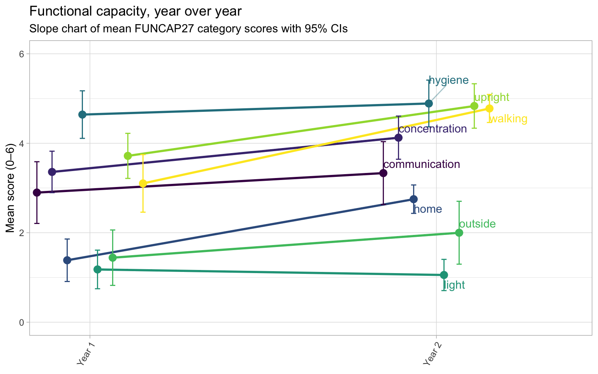
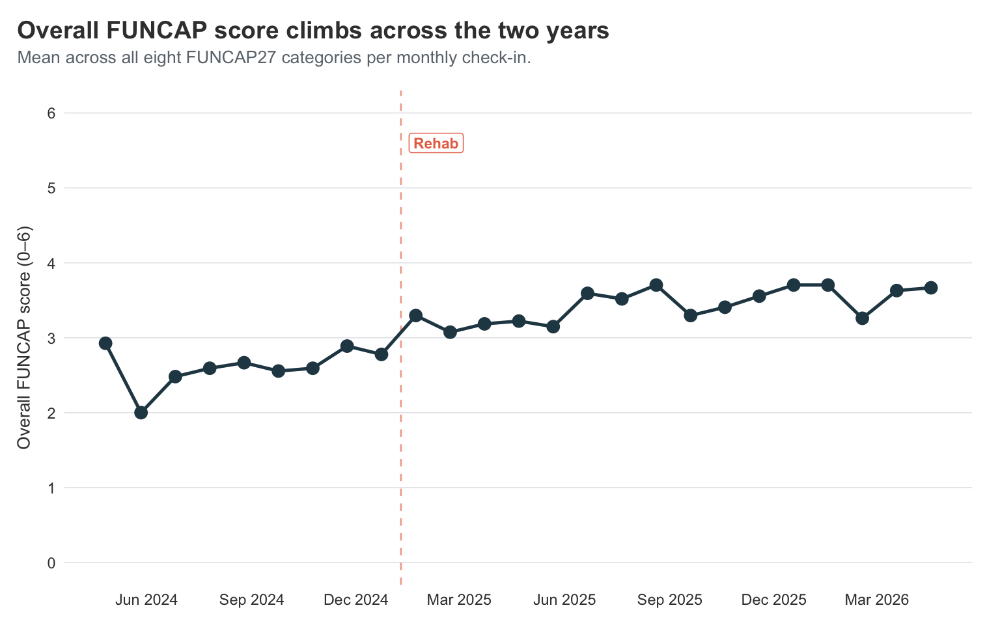
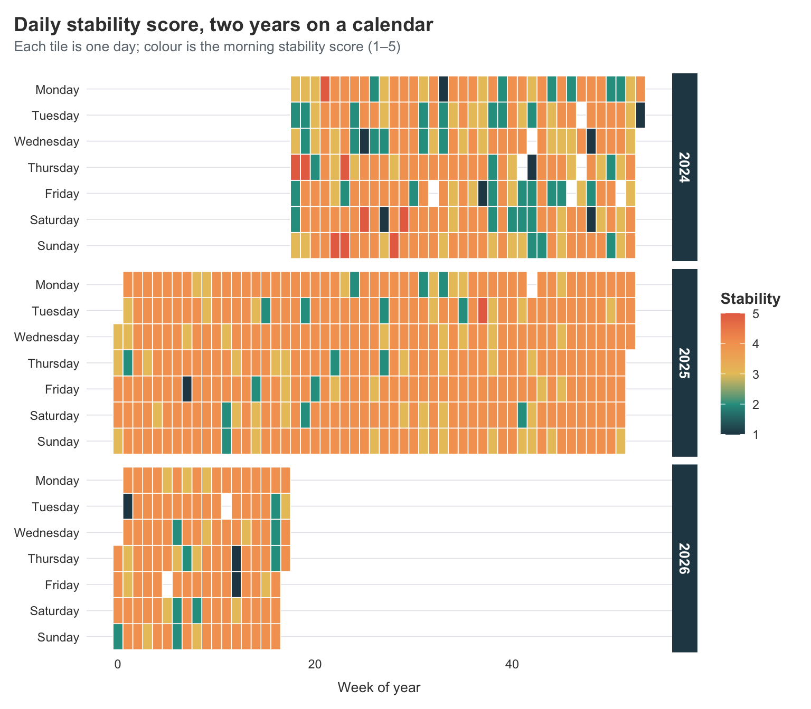
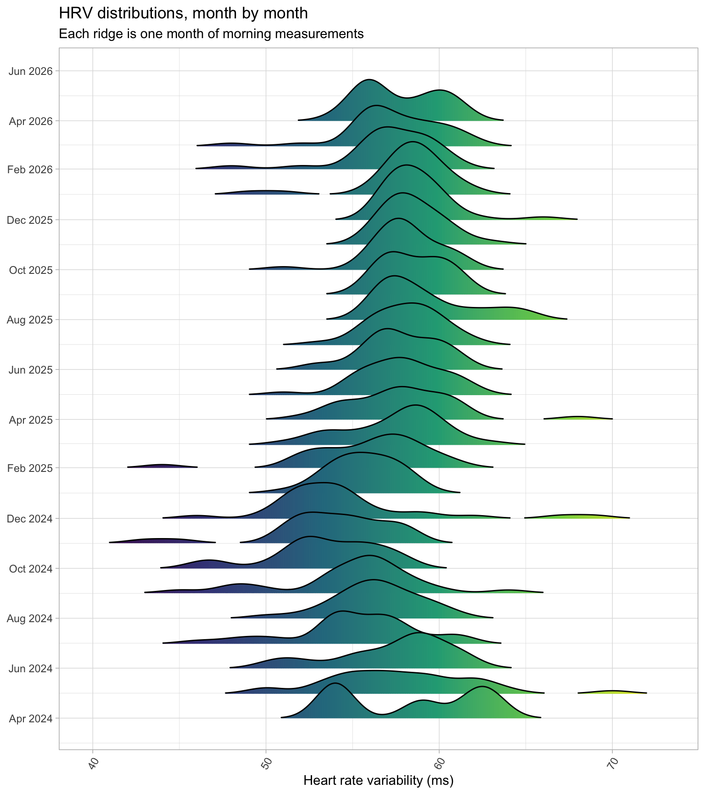
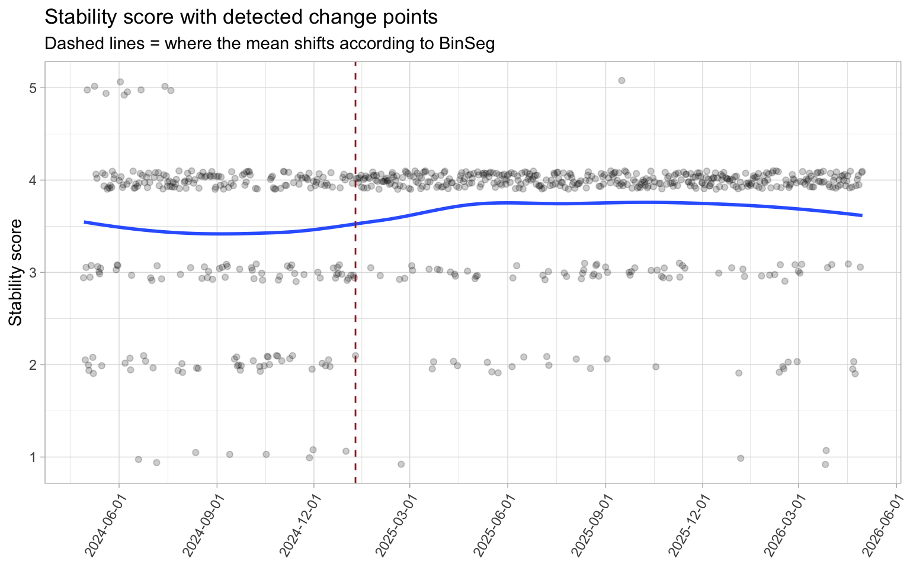
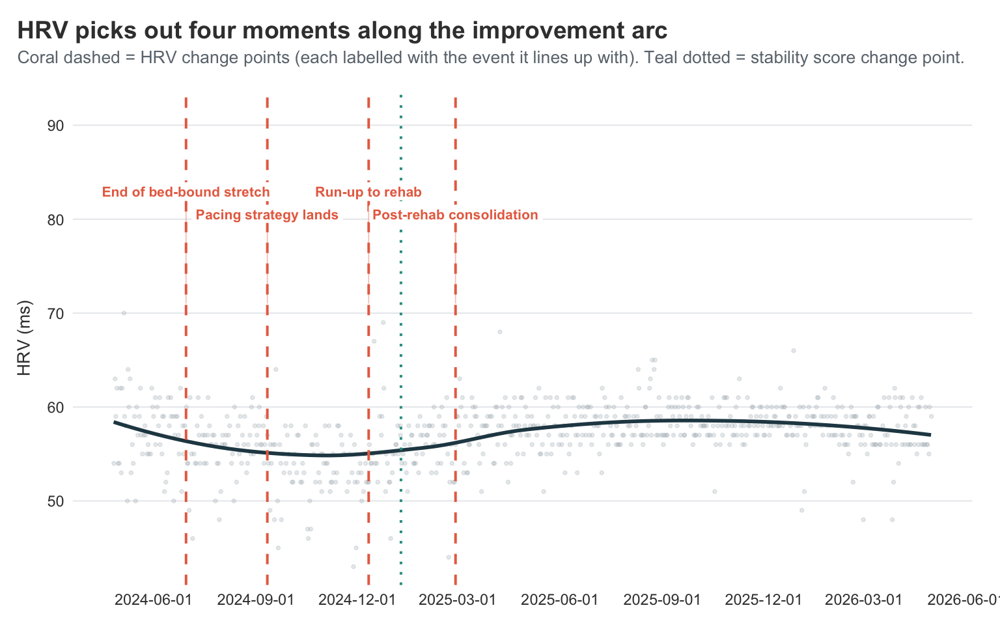
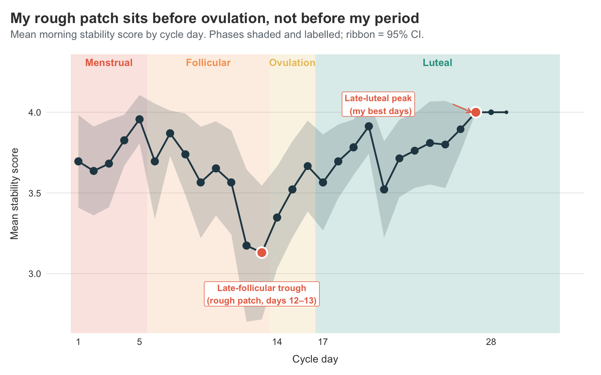
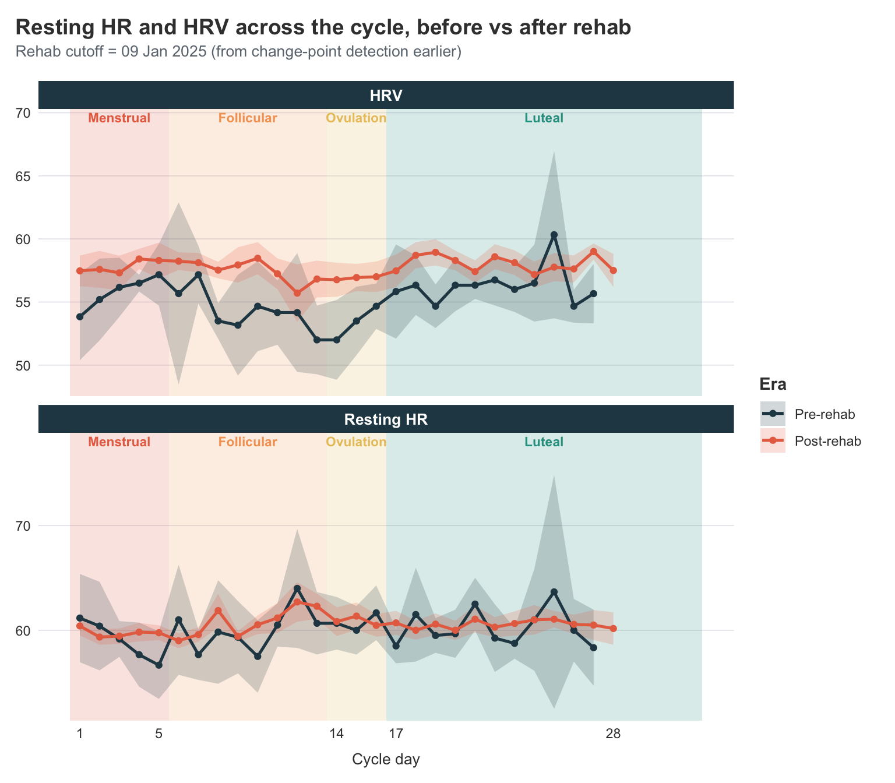
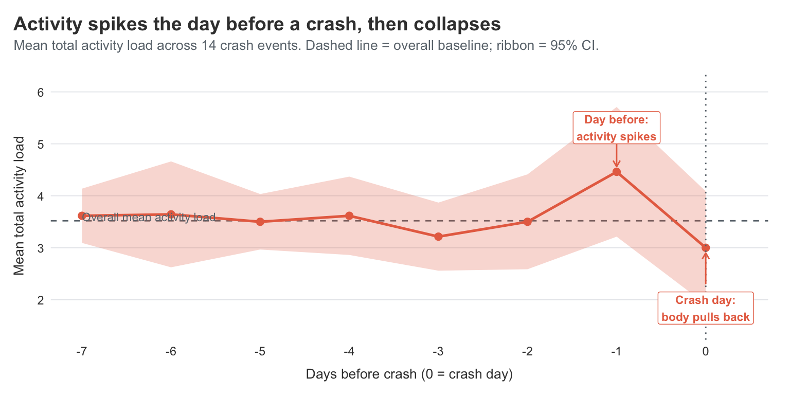

---
editor_options:
  markdown:
    wrap: sentence
title: 'Two Years of Visible: New Angles on the Long Covid Data'
format: hugo-md
code-fold: true
code-summary: Show code
execute:
  warning: false
  message: false
author: Dr. Mowinckel
date: '2026-05-04'
categories: []
tags:
  - R
  - health-data
  - longcovid
slug: visible-year-two
image: index.markdown_strict_files/figure-markdown_strict/stability-calendar-1.png
image_alt: >-
  A calendar heatmap of daily stability scores across two years, with each cell
  coloured by the day's score. The first year is darker and patchier; the second
  year is noticeably lighter and more even, especially through the spring of
  2026.
summary: >
  It's been two years since I started tracking my Long Covid with the Visible
  app, and a year since I last sat down with the data here on the blog. This
  post is a follow-up — same data, but now with twice as much of it, a clearer
  improvement arc, and some new plots and analyses I hadn't tried before.
  Calendar heatmaps, ridgeline plots, change-point detection, and a
  phase-by-phase look at how my morning stability score moves across the
  menstrual cycle all make an appearance, alongside a quick check on whether
  last year's symptom clusters still hold up.
seo: >-
  Two years of Long Covid data with the Visible app — calendar heatmaps,
  ridgeline plots, change-point detection, and stability score across menstrual
  cycle phases.
---


It's been a full year since I [last dove into my Visible data here](../../../../blog/2025/visible-pca), and almost two since I [first wrote about it](../../../../blog/2025/visible).
A lot has happened in that time --- most importantly, I'm doing *better*.
Not all the way better, but better.
Better enough that I sometimes forget for a few hours that I'm sick, which I genuinely could not have said this time last year.

This time, I thought I'd sit down with the same export again --- now with twice as much data --- and try out some new plots and analyses I haven't shown here before.
I'm not going to re-do everything from before, so go check out [those](../../../../blog/2025/visible) [two](../../../../blog/2025/visible-pca) posts if you want the full backstory and the original analyses.
What I *do* want to do is look at things year-over-year, see whether my slow improvement actually shows up clearly in the numbers, and try a few techniques I've been itching to play with.

## Loading two years of data

Getting the data out is exactly as easy as last year --- Visible's "Export Health Data" button still gives a tidy CSV, and the structure hasn't changed.
So I'll just plug the new export straight into the same cleaning pipeline I built last year.
If the cleaning steps look unfamiliar, the [first post](../../../../blog/2025/visible) walks through them in detail.

Then I'll add a simple `year` indicator that splits the data roughly in half.
**Year 1** is the period covered by last year's posts (April 2024 -- April 2025), and **Year 2** is everything since (May 2025 -- April 2026).
This is the split I'll lean on for most of what follows.

<details class="code-fold">
<summary>Show code</summary>

``` r
visible <- visible |>
  mutate(
    year = if_else(odate < as.Date("2025-05-01"), "Year 1", "Year 2")
  )

count(visible, year)
```

</details>

    # A tibble: 2 × 2
      year       n
      <chr>  <int>
    1 Year 1 11836
    2 Year 2 11490

## How did the FUNCAP27 actually move?

The FUNCAP27 is the most rigorous measure in this dataset, since it was actually built and validated for ME/CFS.
Higher score = more functional capacity, i.e. more daily life I can do without paying for it later.
Last year I plotted FUNCAP over time as a smooth, and could squint and see *some* improvement.
With another year in the bag, I want something more direct: did each FUNCAP category actually move between the two years, and if so, by how much?

A **slope chart** is perfect for this.
One line per category, drawn from its Year-1 mean to its Year-2 mean.
Going up means improving, flat means stuck, and going down means... well, hopefully not.

<details class="code-fold">
<summary>Show code</summary>

``` r
library(ggrepel)

funcap_yearly <- visible |>
  filter(category == "FunCap27") |>
  group_by(year, type) |>
  summarise(
    score = mean(value, na.rm = TRUE),
    se = sd(value, na.rm = TRUE) / sqrt(sum(!is.na(value))),
    ci_lower = score - 1.96 * se,
    ci_upper = score + 1.96 * se,
    .groups = "drop"
  ) |>
  group_by(type) |>
  mutate(
    y1_upper = ci_upper[year == "Year 1"],
    y1_lower = ci_lower[year == "Year 1"],
    y2_upper = ci_upper[year == "Year 2"],
    y2_lower = ci_lower[year == "Year 2"],
    meaningful = y2_lower > y1_upper | y2_upper < y1_lower
  ) |>
  ungroup() |>
  mutate(highlight = if_else(meaningful, "Meaningful change", "Within noise"))

dodge <- position_dodge(width = 0.35)

ggplot(
  funcap_yearly,
  aes(x = year, y = score, group = type, colour = highlight)
) +
  geom_line(
    linewidth = 1,
    position = dodge,
    show.legend = FALSE
  ) +
  geom_errorbar(
    aes(ymin = ci_lower, ymax = ci_upper),
    width = 0.12,
    position = dodge,
    show.legend = FALSE
  ) +
  geom_point(
    size = 3,
    position = dodge,
    show.legend = FALSE
  ) +
  geom_text_repel(
    data = filter(funcap_yearly, year == "Year 2"),
    aes(label = type),
    position = dodge,
    direction = "y",
    hjust = 0,
    segment.alpha = 0.4,
    box.padding = 0.3,
    show.legend = FALSE
  ) +
  scale_x_discrete(expand = expansion(mult = c(0.15, 0.45))) +
  scale_y_continuous(limits = c(0, 6)) +
  scale_colour_manual(
    values = c(
      "Meaningful change" = visible_colours$accent,
      "Within noise" = visible_colours$grey
    )
  ) +
  labs(
    title = "Four FUNCAP categories moved meaningfully — four didn't",
    subtitle = "Year 1 → Year 2 mean scores with 95% CIs. Coloured = CIs don't overlap; grey = within noise.",
    x = NULL,
    y = "Mean score (0–6)"
  )
```

</details>



This is the visual confirmation of what I've been feeling --- but the CIs do the work of telling me which of these movements are real.

The lines whose Year 1 and Year 2 error bars **don't overlap** are the ones I should actually believe in.
**Walking**, **upright**, and **home** all move a long way and the CI bars sit comfortably apart.
Those are the genuine, can't-be-explained-by-noise improvements.
A year ago I was timing every walk in minutes; this year I'm walking enough that I've stopped counting.
**Concentration** also has clearly separated CIs --- I feel that one daily, since I can read a news article now without losing the thread halfway through.

The lines where the CIs **do** overlap are the ones I shouldn't read too much into.
**Communication**, **hygiene**, and **outside** all move a little, but the error bars cross --- those changes are within noise.
**Light** drifts down, but again the CIs overlap, so calling it "worse" would be over-claiming.
What I can honestly say is that none of those four got dramatically better *or* worse --- they're holding pattern.

### Zooming out: overall FUNCAP across time

The slope chart compresses two years into two points per category, which makes movement legible but hides the path.
A simple line chart of the **overall FUNCAP score** --- the mean across all eight categories on each monthly check-in --- shows what the journey actually looked like.

<details class="code-fold">
<summary>Show code</summary>

``` r
rehab_date <- as.Date("2025-01-09")

funcap_overall <- visible |>
  filter(category == "FunCap27") |>
  group_by(odate) |>
  summarise(score = mean(value, na.rm = TRUE), .groups = "drop") |>
  arrange(odate)

ggplot(funcap_overall, aes(x = odate, y = score)) +
  geom_vline(
    xintercept = rehab_date,
    linetype = "dashed",
    colour = visible_colours$accent,
    alpha = 0.6
  ) +
  annotate(
    "label",
    x = rehab_date,
    y = 5.6,
    label = "Rehab",
    colour = visible_colours$accent,
    fill = "white",
    label.size = 0,
    fontface = "bold",
    size = 3,
    hjust = -0.15
  ) +
  geom_line(
    colour = visible_colours$primary,
    linewidth = 0.9
  ) +
  geom_point(
    colour = visible_colours$primary,
    size = 3
  ) +
  scale_y_continuous(limits = c(0, 6), breaks = 0:6) +
  scale_x_date(date_breaks = "3 months", date_labels = "%b %Y") +
  labs(
    title = "Overall FUNCAP score climbs across the two years",
    subtitle = "Mean across all eight FUNCAP27 categories per monthly check-in.",
    x = NULL,
    y = "Overall FUNCAP score (0–6)"
  )
```

</details>



This is the trajectory view I find easiest to describe out loud.
The line starts at about 2.9, then drops sharply to 2.0 in May 2024 --- the worst month of my bed-bound stretch --- before slowly climbing back up through the second half of 2024 and into the high-2s.
Around the rehab cutoff at the start of 2025 it crosses into the 3s, and from there it keeps grinding upward through 2025 and into 2026, settling in the 3.5--3.7 range.

The shape is the same one I felt living it: a dramatic plunge into the worst of it, a slow climb out, a structural lift around rehab, and a steady drift toward better that hasn't fully stopped.
A FUNCAP score of 6 is "fully functional" and 0 is "completely incapacitated"; I'm not at 6, and I might never be, but the journey from a 2.0 floor to a 3.7 ceiling over two years is real and visible in the same chart that fits on a phone screen.

## The improvement arc as a calendar heatmap

The slope chart is great for "did things change", but it tells you nothing about *when*.
For that I want something I haven't used on this blog before --- a **calendar heatmap**.
One tile per day, coloured by stability score.
You essentially get a year laid out like an actual calendar, with the colour telling you how I was doing.

<details class="code-fold">
<summary>Show code</summary>

``` r
stability <- visible |>
  filter(tracker == "Stability Score") |>
  transmute(
    odate,
    score = value,
    year_label = format(odate, "%Y"),
    week = as.numeric(format(odate, "%W")),
    weekday = factor(
      format(odate, "%A"),
      levels = c(
        "Monday",
        "Tuesday",
        "Wednesday",
        "Thursday",
        "Friday",
        "Saturday",
        "Sunday"
      )
    ),
    month = format(odate, "%b")
  )

ggplot(stability, aes(x = week, y = fct_rev(weekday), fill = score)) +
  geom_tile(colour = "white", linewidth = 0.3) +
  facet_grid(
    year_label ~ .,
    scales = "free_x",
    space = "free_x"
  ) +
  scale_fill_gradientn(
    colours = c(
      visible_colours$primary,
      visible_colours$secondary,
      visible_colours$quat,
      visible_colours$tertiary,
      visible_colours$accent
    ),
    limits = c(1, 5),
    name = "Stability"
  ) +
  labs(
    title = "Daily stability score, two years on a calendar",
    subtitle = "Each tile is one day; colour is the morning stability score (1–5)",
    x = "Week of year",
    y = NULL,
    fill = "Stability"
  ) +
  theme(
    panel.grid = element_blank(),
    axis.text.x = element_text(angle = 0, hjust = 0.5)
  )
```

</details>



You can *see* the improvement in this plot in a way the smoothed line graphs from last year never quite captured.
The early months of 2024 are dark and patchy --- lots of low scores scattered next to higher ones, which is the chaos I described in the original post.
By late 2024 the colour is more even, mostly mid-range.
And then the second half of 2025 onwards is noticeably brighter and more consistent.

You can also see I had a bit of a destabilising period this year. It was around the end of February, and I had just got my Claude Max subscription.
I got into a whole frenzy of feeling I could do *all the things* I wanted to but had not been cognitively able to now that I had Claude's help.
But, yeah, I had a pretty big crash from that, and it took me almost 5 weeks to get back to feeling the same as before that crash.

I keep returning to this plot.
It's the most honest visual summary of "how the last two years have been" that I've made.

## Distribution shifts in HRV

Heart rate variability is the metric I trust the most from the morning measurements, because it's measured rather than self-reported.
But HRV is noisy on any given day --- what I really care about is whether the *distribution* has shifted.

A **ridgeline plot** is the right tool here.
One density curve per month, stacked vertically, so you can see how the shape of the distribution moves over time.

<details class="code-fold">
<summary>Show code</summary>

``` r
library(ggridges)

visible |>
  filter(tracker == "HRV") |>
  mutate(month = floor_date(odate, "month")) |>
  ggplot(aes(x = value, y = month, group = month, fill = stat(x))) +
  geom_density_ridges_gradient(
    scale = 2.2,
    rel_min_height = 0.01,
    show.legend = FALSE
  ) +
  scale_y_date(date_breaks = "2 months", date_labels = "%b %Y") +
  scale_fill_gradientn(
    colours = c(
      visible_colours$primary,
      visible_colours$secondary,
      visible_colours$quat,
      visible_colours$accent
    )
  ) +
  labs(
    title = "HRV distributions, month by month",
    subtitle = "Each ridge is one month of morning measurements",
    x = "Heart rate variability (ms)",
    y = NULL
  )
```

</details>



What I'm looking for here isn't really the means moving --- they're broadly stable.
What I'm looking for is the *shape* getting tighter.
The early months of 2024 have wide, lumpy distributions, with long tails out to the right where the occasional spike sits.
Most of the more recent months are narrower and more symmetric, with the long tails appearing less often.

That tightening is the bit I find most reassuring.
As I mentioned [last year](../../../../blog/2025/visible), big HRV spikes for me are usually a warning sign that a crash is coming.
So a tighter distribution doesn't just mean "more average days" --- it means fewer of the warning-sign spikes that used to arrive in clusters.
Fewer spikes and fewer dips is the win here, not just "higher numbers on average".

That being said, the last couple months look a little worse again, which is likely because I have been increasing activity quite a lot.
I might need to remember to give myself a little more rest once in a while.

## When did things actually turn?

I've been telling myself a story about Dr. Simon's pacing strategy and the rehab stay being the turning points.
But that's me retrofitting a story onto a feeling.
Can the data actually tell us *when* things shifted?

The technique I want is **change-point detection** --- finding the points in a time series where the underlying mean (or variance) shifts.
The `changepoint` package gives you a clean way to do this with `cpt.mean()`.

<details class="code-fold">
<summary>Show code</summary>

``` r
library(changepoint)

stability_ts <- visible |>
  filter(tracker == "Stability Score") |>
  arrange(odate) |>
  pull(value)

cp <- cpt.mean(
  stability_ts,
  method = "BinSeg",
  Q = 4,
  penalty = "BIC"
)

cp
```

</details>

    Class 'cpt' : Changepoint Object
           ~~   : S4 class containing 14 slots with names
                  cpts.full pen.value.full data.set cpttype method test.stat pen.type pen.value minseglen cpts ncpts.max param.est date version 

    Created on  : Sat May  2 12:49:35 2026 

    summary(.)  :
    ----------
    Created Using changepoint version 2.3 
    Changepoint type      : Change in mean 
    Method of analysis    : BinSeg 
    Test Statistic  : Normal 
    Type of penalty       : BIC with value, 13.16405 
    Minimum Segment Length : 1 
    Maximum no. of cpts   : 4 
    Changepoint Locations : 249 
    Range of segmentations:
         [,1] [,2] [,3] [,4]
    [1,]  249   NA   NA   NA
    [2,]  249  132   NA   NA
    [3,]  249  132   10   NA
    [4,]  249  132   10  172

     For penalty values: 20.71083 8.262984 7.87305 3.443767 

`BinSeg` is binary segmentation --- it splits the series, then splits each segment again, up to `Q` change points.
I've capped it at 4 because more than that and we're just overfitting to the noise.
The `penalty = "BIC"` is a fairly standard way of saying "don't add change points unless they really earn their keep".

To see where they actually fell on the calendar, I'll pull the change-point indices and convert them back to dates.

<details class="code-fold">
<summary>Show code</summary>

``` r
cp_dates <- visible |>
  filter(tracker == "Stability Score") |>
  arrange(odate) |>
  slice(cpts(cp)) |>
  pull(odate)

cp_dates
```

</details>

    [1] "2025-01-09"

<details class="code-fold">
<summary>Show code</summary>

``` r
visible |>
  filter(tracker == "Stability Score") |>
  ggplot(aes(x = odate, y = value)) +
  geom_jitter(
    alpha = 0.25,
    height = 0.1,
    colour = visible_colours$grey,
    size = 0.7
  ) +
  geom_smooth(
    se = FALSE,
    colour = visible_colours$primary,
    linewidth = 1
  ) +
  geom_vline(
    xintercept = cp_dates,
    linetype = "dashed",
    colour = visible_colours$accent,
    linewidth = 0.7
  ) +
  scale_x_date(date_breaks = "3 months") +
  labs(
    title = "Stability score with detected change points",
    subtitle = "Dashed line = where the mean shifts according to BinSeg",
    x = NULL,
    y = "Stability score"
  )
```

</details>



Despite asking for up to four change points, the algorithm only commits to **one** --- and it lands right around the end of 2024 / start of 2025.
That's almost exactly when I went into rehab, and the period right after when my stability score quietly settled into a higher, less chaotic regime.

Honestly, I find this surprising.
I have a very clear timeline in my head and journal, corroborated by my wife, that my improvement started earlier.
The slope kind of looks like that too, but it seems the stability data does not have enough variation in it to show this.
This makes sense, its just a 5-point scale.
We likely need data with more variability in the measurement to get a clearer answer.

### Does HRV agree?

Stability score is a derived metric --- Visible computes it from heart rate, HRV, and the previous evening's symptom scores using their own algorithms.
So when the change-point algorithm tells me "stability shifted around rehab", I have to wonder how much of that is the underlying physiology and how much is just my own self-rated symptom scores feeding into the composite.
The cleanest way to check is to run the same analysis on a single *measured* signal --- HRV --- and see whether it picks the same date.

<details class="code-fold">
<summary>Show code</summary>

``` r
hrv_ts <- visible |>
  filter(tracker == "HRV") |>
  arrange(odate) |>
  pull(value)

cp_hrv <- cpt.mean(
  hrv_ts,
  method = "BinSeg",
  Q = 4,
  penalty = "BIC"
)

cp_hrv_dates <- visible |>
  filter(tracker == "HRV") |>
  arrange(odate) |>
  slice(cpts(cp_hrv)) |>
  pull(odate)

cp_hrv_dates
```

</details>

    [1] "2024-06-30" "2024-09-11" "2024-12-11" "2025-02-27"

<details class="code-fold">
<summary>Show code</summary>

``` r
cp_hrv_labels <- tibble(
  date = cp_hrv_dates,
  label = c(
    "End of bed-bound stretch",
    "Pacing strategy lands",
    "Run-up to rehab",
    "Post-rehab consolidation"
  ),
  y_pos = c(1, 0.8, 1, 0.8)
)

hrv_y_max <- max(visible$value[visible$tracker == "HRV"], na.rm = TRUE)

visible |>
  filter(tracker == "HRV") |>
  ggplot(aes(x = odate, y = value)) +
  geom_jitter(
    alpha = 0.25,
    height = 0,
    colour = visible_colours$grey,
    size = 0.7
  ) +
  geom_smooth(
    se = FALSE,
    colour = visible_colours$primary,
    linewidth = 1
  ) +
  geom_vline(
    xintercept = cp_hrv_dates,
    linetype = "dashed",
    colour = visible_colours$accent,
    linewidth = 0.7
  ) +
  geom_vline(
    xintercept = cp_dates,
    linetype = "dotted",
    colour = visible_colours$secondary,
    linewidth = 0.7
  ) +
  geom_label(
    data = cp_hrv_labels,
    aes(
      x = date,
      y = hrv_y_max + 12 * y_pos,
      label = label
    ),
    size = 2.8,
    colour = visible_colours$accent,
    fill = "white",
    label.size = 0,
    fontface = "bold",
    hjust = 0.5,
    vjust = 0
  ) +
  geom_segment(
    data = cp_hrv_labels,
    aes(
      x = date,
      xend = date,
      y = hrv_y_max + 12 * y_pos,
      yend = hrv_y_max + 1
    ),
    colour = visible_colours$accent,
    alpha = 0.4,
    linewidth = 0.3
  ) +
  scale_x_date(date_breaks = "3 months") +
  scale_y_continuous(expand = expansion(mult = c(0.05, 0.3))) +
  coord_cartesian(clip = "off") +
  labs(
    title = "HRV picks out four moments along the improvement arc",
    subtitle = "Coral dashed = HRV change points (each labelled with the event it lines up with). Teal dotted = stability score change point.",
    x = NULL,
    y = "HRV (ms)"
  )
```

</details>



The HRV series is noisier than stability score, and the algorithm reflects that --- instead of committing to a single decisive shift, it picks up **four** change points spread across the journey:

-   **2024-06-30** --- late spring / early summer 2024
-   **2024-09-11** --- September 2024
-   **2024-12-11** --- December 2024
-   **2025-02-27** --- late February 2025

These fit quite nicely into the narrative I have seen myself:

-   June 2024 sits roughly where the worst-of-the-worst bed-bound stretch tapered off and I started inching back toward function.
-   September 2024 is right after I really committed to Dr. Simon's pacing strategy in August and started taking the 30-second-break thing seriously.
-   December 2024 is the run-up to rehab, when I was finally letting myself stop pushing.
-   February 2025 is post-rehab, when the new, calmer rhythm had bedded in.

So HRV doesn't disagree with stability score --- it just sees the journey at higher resolution.
The single stability-score change point in January 2025 is sitting in the gap between the December and February HRV change points, where it makes sense for a smoothed composite to land.
A reasonable reading: the rehab transition wasn't a single jump but a gradual handover that started before rehab and finished a couple of months after, and HRV is sensitive enough to pick up the start and end of that handover where stability score papers over them.

That's actually the cross-validation I was hoping for, with a bonus.
I'm not reading my own narrative back into the data through self-rated symptoms, because the same general pattern of structural change shows up in a purely measured signal --- and one that picks out multiple individually meaningful moments along the way, not just the headline shift.

I'll keep using the stability-score change point as the cutoff for the rest of the analyses below, since it's the cleaner single date --- but the HRV result is the receipt that says it isn't a self-rating artefact, and the bonus that the path of improvement had distinct chapters rather than one big inflection.

## Stability score across the menstrual cycle

So far everything I've shown ignores one of the most reliable rhythms in my data: the menstrual cycle.
Last year's clustering grouped "period" together with stomach pain, muscle aches, light sensitivity, and constipation, and I left it there as the **Menstruation cluster** without going any further.
But a cycle is far more than just the days you bleed.
The four-ish weeks between periods come with a whole symphony of hormonal changes, and the question I really want to ask is: does my **morning stability score** --- the headline metric Visible gives me each day --- actually move with my cycle?

Stability score is the right thing to look at here because it's the closest thing in this dataset to a single number summarising "how is my body coping today".
I know what I've observed on my own, and it's not the [expected pattern](https://www.medrxiv.org/content/10.1101/2025.01.24.25321092v2) of being worse during menstruation, which also was the reason it tok me so long to notice the correlation.

The first step is to figure out when each cycle starts.
Visible's `Period` tracker is logged on each day I'm bleeding, so a new cycle begins on the first day of a run of period entries that follows a non-period day.
That's a one-liner with `lag()`.

<details class="code-fold">
<summary>Show code</summary>

``` r
period_data <- visible |>
  filter(tracker == "Period") |>
  arrange(odate) |>
  mutate(
    on_period = !is.na(value) & value > 0,
    new_cycle = on_period & !lag(on_period, default = FALSE)
  )

cycle_starts <- period_data |>
  filter(new_cycle) |>
  pull(odate)

length(cycle_starts)
```

</details>

    [1] 27

Then for every day in the dataset I want two things: which cycle day I'm on, and which **phase** of the cycle that falls into.
The four classic phases for a roughly 28-day cycle are:

-   **Menstrual**: days 1--5 (the period itself)
-   **Follicular**: days 6--13 (post-period, rising estrogen)
-   **Ovulation**: days 14--16 (a small window around expected ovulation)
-   **Luteal**: days 17 onward (post-ovulation, rising then dropping progesterone)

I'll also compute cycle length so I can filter out anything biologically implausible --- the few very long outliers are almost always because I forgot to log my period for a day or two, not because something dramatic happened.

<details class="code-fold">
<summary>Show code</summary>

``` r
cycle_lookup <- tibble(
  cycle_id = seq_along(cycle_starts),
  cycle_start = cycle_starts,
  cycle_end = c(cycle_starts[-1] - 1, max(visible$odate))
) |>
  mutate(cycle_length = as.integer(cycle_end - cycle_start) + 1L)

visible_cycle <- visible |>
  filter(odate >= min(cycle_starts)) |>
  left_join(
    cycle_lookup,
    join_by(closest(odate >= cycle_start))
  ) |>
  mutate(
    cycle_day = as.integer(odate - cycle_start) + 1L,
    phase = case_when(
      cycle_day <= 5 ~ "Menstrual",
      cycle_day <= 13 ~ "Follicular",
      cycle_day <= 16 ~ "Ovulation",
      TRUE ~ "Luteal"
    ),
    phase = factor(
      phase,
      levels = c("Menstrual", "Follicular", "Ovulation", "Luteal")
    )
  ) |>
  filter(cycle_length >= 21, cycle_length <= 40, cycle_day <= 35)
```

</details>

Now the actual question: does stability score move with the cycle?

I'll plot the mean stability score for each cycle day, with each of the four phases shaded behind the line as a coloured band.
That way I can see the day-to-day pattern *and* have the phase context right there in the plot --- no separate violins or summary tables needed.

<details class="code-fold">
<summary>Show code</summary>

``` r
stability_by_day <- visible_cycle |>
  filter(tracker == "Stability Score") |>
  group_by(cycle_day, phase) |>
  summarise(
    mean_score = mean(value, na.rm = TRUE),
    se = sd(value, na.rm = TRUE) / sqrt(sum(!is.na(value))),
    ci_lower = mean_score - 1.96 * se,
    ci_upper = mean_score + 1.96 * se,
    n = n(),
    .groups = "drop"
  ) |>
  filter(cycle_day <= 32)

phase_bands <- tibble(
  phase = factor(
    c("Menstrual", "Follicular", "Ovulation", "Luteal"),
    levels = c("Menstrual", "Follicular", "Ovulation", "Luteal")
  ),
  xmin = c(0.5, 5.5, 13.5, 16.5),
  xmax = c(5.5, 13.5, 16.5, 32.5)
) |>
  mutate(
    x_mid = (xmin + xmax) / 2,
    colour = phase_colours[as.character(phase)]
  )

trough <- stability_by_day |>
  filter(cycle_day %in% 11:14) |>
  slice_min(mean_score, n = 1, with_ties = FALSE)

peak <- stability_by_day |>
  filter(cycle_day >= 25) |>
  slice_max(mean_score, n = 1, with_ties = FALSE)

ggplot() +
  geom_rect(
    data = phase_bands,
    aes(xmin = xmin, xmax = xmax, ymin = -Inf, ymax = Inf, fill = phase),
    alpha = 0.18,
    show.legend = FALSE
  ) +
  scale_fill_manual(values = phase_colours) +
  geom_text(
    data = phase_bands,
    aes(x = x_mid, y = Inf, label = phase, colour = colour),
    vjust = 1.6,
    fontface = "bold",
    size = 3.4
  ) +
  scale_colour_identity() +
  geom_ribbon(
    data = stability_by_day,
    aes(x = cycle_day, ymin = ci_lower, ymax = ci_upper),
    fill = visible_colours$primary,
    alpha = 0.18
  ) +
  geom_line(
    data = stability_by_day,
    aes(x = cycle_day, y = mean_score),
    linewidth = 0.8,
    colour = visible_colours$primary
  ) +
  geom_point(
    data = stability_by_day,
    aes(x = cycle_day, y = mean_score, size = n),
    show.legend = FALSE,
    colour = visible_colours$primary
  ) +
  geom_point(
    data = bind_rows(trough, peak),
    aes(x = cycle_day, y = mean_score),
    size = 4,
    shape = 21,
    fill = visible_colours$accent,
    colour = "white",
    stroke = 1.2
  ) +
  annotate(
    "label",
    x = trough$cycle_day,
    y = trough$mean_score - 0.18,
    label = "Late-follicular trough\n(rough patch, days 12–13)",
    size = 3,
    colour = visible_colours$accent,
    fill = "white",
    label.size = 0,
    fontface = "bold",
    hjust = 0.5,
    vjust = 1
  ) +
  annotate(
    "label",
    x = peak$cycle_day - 4,
    y = peak$mean_score + 0.05,
    label = "Late-luteal peak\n(my best days)",
    size = 3,
    colour = visible_colours$accent,
    fill = "white",
    label.size = 0,
    fontface = "bold",
    hjust = 1,
    vjust = 0.5
  ) +
  geom_curve(
    aes(
      x = peak$cycle_day - 1.5,
      y = peak$mean_score + 0.05,
      xend = peak$cycle_day - 0.3,
      yend = peak$mean_score
    ),
    arrow = arrow(length = unit(0.18, "cm")),
    curvature = 0,
    colour = visible_colours$accent
  ) +
  scale_x_continuous(breaks = c(1, 5, 14, 17, 28)) +
  scale_y_continuous(expand = expansion(mult = c(0.05, 0.18))) +
  scale_size_continuous(range = c(1, 3)) +
  coord_cartesian(clip = "off") +
  labs(
    title = "My rough patch sits before ovulation, not before my period",
    subtitle = "Mean morning stability score by cycle day. Phases shaded and labelled; ribbon = 95% CI.",
    x = "Cycle day",
    y = "Mean stability score"
  )
```

</details>



The research suggests that the worst stability would land somewhere in the menstrual phase or in the late luteal phase --- both of which fit the standard "period-week is bad" / "PMS week is bad" narrative.
The data and my own experience flatly disagrees.

My **lowest** mean stability scores aren't during the period at all.
They're in the **late follicular phase**, around days 12 and 13 --- the run-up to ovulation.
The line dips to about 3.1 there.
Day 1 of the period is decent, the score actually *rises* through the bleeding days to a small peak around day 5, then steadily slides down through the follicular phase to that day 12--13 trough.
After ovulation, things turn around.
The luteal phase is, on average, my **best** time of the cycle, climbing steadily from around 3.55 to 4.0 by the late luteal days.

In other words: I shouldn't be making claims about specific days, but I *can* say that my late-follicular days really do tend to be worse than my late-luteal days.
If I had to write a one-line takeaway, it would be: **for me, the rough patch is the days before ovulation, not the days before my period**.
That's actionable in a way the polar symptom plots weren't --- it tells me roughly when in the month to plan for low-stability days, and when I can afford to be a bit more ambitious.

### What about HR and HRV across the cycle?

Stability score is a composite --- Visible computes it from heart rate, HRV, and the previous evening's symptom scores.
That's nice for "how am I doing today", but it makes it hard to know whether the cycle pattern I just described is being driven by the underlying physiology (HR, HRV) or by my own self-rated symptoms feeding into the score.

So let me strip the question down to the two purely *measured* signals --- **HRV** and **resting HR** --- and ask the same cyclical question.
And while I'm at it, I want to bring back the change-point cutoff from earlier and split each metric into **pre-** and **post-rehab** halves.
That gives me a 2×2 lens: cycle phase *and* rehab era.

<details class="code-fold">
<summary>Show code</summary>

``` r
library(ggnewscale)

cutoff <- cp_dates[1]

hr_cycle <- visible_cycle |>
  filter(tracker %in% c("HRV", "Resting HR")) |>
  mutate(
    era = if_else(odate < cutoff, "Pre-rehab", "Post-rehab"),
    era = factor(era, levels = c("Pre-rehab", "Post-rehab"))
  ) |>
  group_by(tracker, era, cycle_day) |>
  summarise(
    mean_value = mean(value, na.rm = TRUE),
    se = sd(value, na.rm = TRUE) / sqrt(sum(!is.na(value))),
    ci_lower = mean_value - 1.96 * se,
    ci_upper = mean_value + 1.96 * se,
    n = n(),
    .groups = "drop"
  ) |>
  filter(cycle_day <= 32, n >= 3)

ggplot() +
  geom_rect(
    data = phase_bands,
    aes(xmin = xmin, xmax = xmax, ymin = -Inf, ymax = Inf, fill = phase),
    alpha = 0.18,
    inherit.aes = FALSE,
    show.legend = FALSE
  ) +
  scale_fill_manual(values = phase_colours) +
  geom_text(
    data = phase_bands,
    aes(x = x_mid, y = Inf, label = phase, colour = colour),
    vjust = 1.4,
    fontface = "bold",
    size = 3
  ) +
  scale_colour_identity() +
  new_scale_fill() +
  new_scale_colour() +
  geom_ribbon(
    data = hr_cycle,
    aes(
      x = cycle_day,
      ymin = ci_lower,
      ymax = ci_upper,
      group = era,
      fill = era
    ),
    alpha = 0.2
  ) +
  geom_line(
    data = hr_cycle,
    aes(x = cycle_day, y = mean_value, colour = era),
    linewidth = 0.9
  ) +
  geom_point(
    data = hr_cycle,
    aes(x = cycle_day, y = mean_value, colour = era),
    size = 1.5
  ) +
  facet_wrap(~tracker, ncol = 1, scales = "free_y") +
  scale_x_continuous(breaks = c(1, 5, 14, 17, 28)) +
  scale_y_continuous(expand = expansion(mult = c(0.05, 0.18))) +
  scale_colour_manual(values = era_colours, name = "Era") +
  scale_fill_manual(values = era_colours, name = "Era") +
  coord_cartesian(clip = "off") +
  labs(
    title = "Resting HR and HRV across the cycle, before vs after rehab",
    subtitle = paste0(
      "Rehab cutoff = ",
      format(cutoff, "%d %b %Y"),
      " (from change-point detection earlier)"
    ),
    x = "Cycle day",
    y = NULL
  )
```

</details>



Reading the panels:

**HRV**.
The post-rehab line sits visibly higher than the pre-rehab line across pretty much every cycle day.
That alone is the improvement story I've been telling all post, told with a different signal.
What's *new* here is the **shape**: pre-rehab (purple), my HRV swung quite a bit across the cycle --- a clear trough around days 12--14 and a wide-CI bump in the late luteal phase.
Post-rehab (green), the line is much flatter and the CI ribbon much narrower.
So things getting better hasn't just lifted my HRV, it has **stabilised** it across the cycle.

**Resting HR**.
The post-rehab line sits lower than the pre-rehab line --- which is the right direction; lower resting HR means less autonomic strain on the same body doing the same things.
The cyclical pattern is much weaker here than for HRV; both lines are reasonably flat across the cycle.
Pre-rehab has more day-to-day jitter, especially toward the late luteal end where the CI fans out, but I don't see a clean phase-driven shape in either era.

Two things are worth saying carefully.

First, the CI ribbons for individual cycle days often overlap between eras, so I should be cautious about pointing at any one day and saying "this is a real difference."
What's *not* overlapping is the **overall level** of the lines.
Post-rehab HRV is higher, and post-rehab resting HR is lower, across most of the cycle, with separated CIs at most points.

Second, this is a much cleaner restatement of the change-point result from earlier in the post.
Same cutoff date, two different physiological signals, both pointing in the same direction --- that's the kind of internal consistency that makes me trust the cutoff is real, rather than an artefact of one specific metric or one specific algorithm.

## Does pushing today predict the days after?

The headline story of Long Covid (and ME/CFS) is **post-exertional malaise** --- PEM, for short.
The shape of it is simple to state and brutal to live with: do too much today, pay for it later.
"Later" is doing a lot of work in that sentence, though.
PEM can hit 24 to 72 hours after the activity, and once it lands it can stick around for days.
A "did pushing today cost me *tomorrow*?" analysis is too narrow to catch it; I need to look across a window of lags.

Visible has four "Activity" trackers --- every evening I rate how demanding the day was on four axes (mental, emotional, physical, social).
The way I actually pace, though, isn't axis-by-axis.
I aim to keep the *total* daily load below a ceiling, because I've learned the hard way that an "easy" day on three axes can still leave me crashed if I went too hard on the fourth.
So the right unit for asking the PEM question, for me, is the **total daily activity score** --- the sum across all four axes.

What I want is a **lag spectrum**: compute the correlation between today's total load and stability / HRV at lag 0, 1, 2, ... up to a week.
If PEM is real for me, I'd expect to see negative correlations --- pushing today should predict feeling worse later --- peaking somewhere in the 1--3 day window, where the literature says the cost usually lands.

<details class="code-fold">
<summary>Show code</summary>

``` r
activity_total <- visible |>
  filter(type == "Activity") |>
  pivot_wider(
    id_cols = odate,
    names_from = tracker,
    values_from = value
  ) |>
  mutate(
    total_load = `Mentally demanding` +
      `Emotionally stressful` +
      `Physically active` +
      `Socially demanding`
  ) |>
  select(odate, total_load)

metrics_wide <- visible |>
  filter(tracker %in% c("Stability Score", "HRV")) |>
  pivot_wider(
    id_cols = odate,
    names_from = tracker,
    values_from = value
  ) |>
  rename(stability = `Stability Score`, hrv = HRV) |>
  arrange(odate)

max_lag <- 7

metrics_lagged <- metrics_wide |>
  mutate(
    across(
      c(stability, hrv),
      .fns = setNames(
        lapply(0:max_lag, \(k) \(x) lead(x, n = k)),
        as.character(0:max_lag)
      ),
      .names = "{.col}__{.fn}"
    )
  )

combined <- activity_total |>
  inner_join(metrics_lagged, by = "odate")

lag_corrs <- combined |>
  pivot_longer(
    cols = matches("__\\d"),
    names_to = c("metric", "lag"),
    names_pattern = "(\\w+)__(\\d+)",
    values_to = "metric_value"
  ) |>
  mutate(lag = as.integer(lag)) |>
  drop_na(total_load, metric_value) |>
  group_by(metric, lag) |>
  summarise(
    test = list(cor.test(total_load, metric_value)),
    n = n(),
    .groups = "drop"
  ) |>
  mutate(
    cor = map_dbl(test, \(x) unname(x$estimate)),
    ci_lower = map_dbl(test, \(x) x$conf.int[1]),
    ci_upper = map_dbl(test, \(x) x$conf.int[2]),
    metric = factor(
      case_match(metric, "stability" ~ "Stability", "hrv" ~ "HRV"),
      levels = c("Stability", "HRV")
    )
  )

ggplot(lag_corrs, aes(x = lag, y = cor, colour = metric, fill = metric)) +
  geom_hline(
    yintercept = 0,
    linetype = "dashed",
    colour = visible_colours$baseline
  ) +
  geom_ribbon(
    aes(ymin = ci_lower, ymax = ci_upper),
    alpha = 0.2,
    colour = NA
  ) +
  geom_line(linewidth = 0.9) +
  geom_point(size = 2) +
  scale_x_continuous(breaks = 0:max_lag) +
  scale_colour_manual(
    values = c(
      "Stability" = visible_colours$primary,
      "HRV" = visible_colours$accent
    )
  ) +
  scale_fill_manual(
    values = c(
      "Stability" = visible_colours$primary,
      "HRV" = visible_colours$accent
    )
  ) +
  labs(
    title = "Lag spectrum: today's total activity load vs state on later days",
    subtitle = "Total load = sum across mental, emotional, physical and social. Negative = pushing today predicts feeling worse later. Ribbons = 95% CI.",
    x = "Days after activity",
    y = "Correlation",
    colour = "Outcome",
    fill = "Outcome"
  )
```

</details>


A few honest caveats before reading this.
The activity scores top out at 5 per axis, so total load can in principle range from 4 to 20, but most of my days sit in the lower half --- high total-load days are rare and individual points carry weight.
The lag analysis also assumes activity on different days is independent, which it isn't; high-load days cluster together, and that auto-correlation can muddy the picture.
And correlations are linear summaries of what may well be a non-linear relationship, so a flat line doesn't fully rule out a "threshold" PEM where only the very worst days hurt.

What's there to read?

At **lag 0**, both lines are strongly positive (stability ~0.20, HRV ~0.14).
That's not surprising: on days I'm feeling capable, I do more, and the morning measurements that day reflect that.
"Active when capable" is the same-day pattern, not a causal claim about activity making me better.

From **lag 1 onwards**, the correlations drop sharply and then hover near zero for the rest of the week.
Stability dips to roughly 0.01 at lag 1 and bounces around in the 0.0--0.08 range out to lag 7, with CIs wide enough that none of those points are distinguishable from zero.
HRV does something similar but a bit higher, settling in the 0.07--0.15 range.
What's *not* there is a clear dip into negative territory in the 1--3 day window, which is what a PEM signature would look like.

I take this as a quietly encouraging finding rather than a null one.
The PEM signal is genuinely hard to find in this dataset because **pacing is working**.
I keep my total daily load below the ceiling that would otherwise trigger a payback, so the correlation between load and "feeling worse a few days later" is essentially absent.
On the rare days I do push past the ceiling I pay for it (and I *know* I pay for it --- see: every crash mentioned in the previous posts), but those days are rare enough that they don't move a two-year correlation much.

If anything, this is the strongest argument I have for why the work I've done on pacing matters.
The data isn't telling me PEM is fictional; it's telling me PEM is well-managed.
That's a different and better thing.

### What about the days before an actual crash?

The lag-spectrum approach treats every day equally --- and that's both its strength and its weakness, since most days are uneventful and the signal we care about lives in the rare bad ones.
Visible has a binary **Crash** tracker that lets me ask the question more directly.
On the days I've decided to mark "crash", what was my activity load doing in the run-up?

<details class="code-fold">
<summary>Show code</summary>

``` r
crash_starts <- visible |>
  filter(tracker == "Crash") |>
  arrange(odate) |>
  mutate(
    on_crash = !is.na(value) & value > 0,
    new_crash = on_crash & !lag(on_crash, default = FALSE)
  ) |>
  filter(new_crash) |>
  pull(odate)

window <- 7

crash_windows <- map_dfr(
  crash_starts,
  \(d) {
    tibble(
      crash_id = as.character(d),
      crash_date = d,
      days_before = -window:0,
      odate = d + days_before
    )
  }
)

crash_trajectory <- crash_windows |>
  left_join(activity_total, by = "odate") |>
  drop_na(total_load) |>
  group_by(days_before) |>
  summarise(
    mean_load = mean(total_load),
    se = sd(total_load) / sqrt(n()),
    ci_lower = mean_load - 1.96 * se,
    ci_upper = mean_load + 1.96 * se,
    n = n(),
    .groups = "drop"
  )

baseline_mean <- mean(activity_total$total_load, na.rm = TRUE)

spike <- crash_trajectory |> filter(days_before == -1)
crash_day <- crash_trajectory |> filter(days_before == 0)

ggplot(crash_trajectory, aes(x = days_before, y = mean_load)) +
  geom_hline(
    yintercept = baseline_mean,
    linetype = "dashed",
    colour = visible_colours$baseline
  ) +
  geom_ribbon(
    aes(ymin = ci_lower, ymax = ci_upper),
    alpha = 0.25,
    fill = visible_colours$accent
  ) +
  geom_line(linewidth = 0.9, colour = visible_colours$accent) +
  geom_point(size = 2.2, colour = visible_colours$accent) +
  geom_vline(
    xintercept = 0,
    linetype = "dotted",
    colour = visible_colours$baseline
  ) +
  geom_curve(
    data = spike,
    aes(x = -1, y = mean_load + 0.7, xend = -1, yend = mean_load + 0.1),
    arrow = arrow(length = unit(0.18, "cm")),
    curvature = 0,
    colour = visible_colours$accent
  ) +
  annotate(
    "label",
    x = -1,
    y = spike$mean_load + 0.85,
    label = "Day before:\nactivity spikes",
    size = 3,
    colour = visible_colours$accent,
    fill = "white",
    label.size = 0,
    fontface = "bold",
    hjust = 0.5
  ) +
  geom_curve(
    data = crash_day,
    aes(x = 0, y = mean_load - 0.7, xend = 0, yend = mean_load - 0.1),
    arrow = arrow(length = unit(0.18, "cm")),
    curvature = 0,
    colour = visible_colours$accent
  ) +
  annotate(
    "label",
    x = 0,
    y = crash_day$mean_load - 0.85,
    label = "Crash day:\nbody pulls back",
    size = 3,
    colour = visible_colours$accent,
    fill = "white",
    label.size = 0,
    fontface = "bold",
    hjust = 0.5,
    vjust = 1
  ) +
  annotate(
    "text",
    x = -7,
    y = baseline_mean + 0.08,
    label = "Overall mean activity load",
    hjust = 0,
    size = 3,
    colour = visible_colours$baseline
  ) +
  scale_x_continuous(
    breaks = -window:0,
    expand = expansion(mult = c(0.05, 0.1))
  ) +
  scale_y_continuous(expand = expansion(mult = c(0.18, 0.18))) +
  coord_cartesian(clip = "off") +
  labs(
    title = "Activity spikes the day before a crash, then collapses",
    subtitle = paste0(
      "Mean total activity load across ",
      length(crash_starts),
      " crash events. Dashed line = overall baseline; ribbon = 95% CI."
    ),
    x = "Days before crash (0 = crash day)",
    y = "Mean total activity load"
  )
```

</details>



This is the cleaner version of the PEM question.
Instead of asking "does activity correlate with feeling worse later", I'm asking "what does the run-up to an actual crash look like?"

And the answer is satisfyingly visible in the data.

For most of the week before a crash, my activity sits right around my overall baseline.
Then **on the day before the crash, activity spikes sharply** --- the mean total load jumps to roughly 4.5, well above the baseline of about 3.5.
**On the crash day itself, activity drops to about 3.0**, below baseline, which is the body putting the brakes on after the fact.

That's the PEM shape, drawn cleanly in 14 crash events.
The wide CI ribbons on the day -1 spike and the day 0 drop reflect that the absolute number of crash events is small, but the shape is consistent enough that the day-before spike is meaningfully above the baseline mean.

What this is telling me, gently, is that my felt experience is roughly right --- but the lag is shorter than I thought.
I'd been narrating crashes as "punishment for what I did 1--3 days ago", but in this view, the strongest signal is **the day immediately before**.
The spike at day -1 is doing most of the work; days -3 and -2 are largely indistinguishable from baseline.
That's actually a more useful answer for pacing: if I notice an unusually busy day, the at-risk day is *tomorrow*, not "some time in the next three days".

The other thing this analysis underlines is why the lag-spectrum correlation looked so flat earlier.
A handful of overdoing-it days getting punished a day later doesn't move a two-year correlation by much.
The crash trajectory, by zooming in on the rare days where it actually mattered, picks the signal back up.
The two analyses aren't in conflict --- one is averaged across all days (where pacing dominates), the other is conditioned on the days I lost the pacing battle.

## Wrapping up

Two years in, the headline is the same as the one I'd give a friend over coffee: I'm slowly getting better, and the data agrees.
What's nice is that the data agrees in a few different ways --- the FUNCAP slopes, the calendar heatmap, the HRV distributions, and the change-point algorithm all tell a compatible story, even though they're looking at completely different aspects of the dataset.

The new plots earned their place too.
The calendar heatmap in particular is one I'll keep coming back to.
It's the rare visualisation where someone who's never seen this data before can look at it and understand the improvement in about three seconds, without me having to explain what HRV is or what a stability score is.
That's worth a lot, especially with a hidden illness, where most of the time I'm explaining what's going on rather than showing it.

If you've got long-running personal health data sitting around in any form --- a sleep tracker, a step counter, a daily mood journal --- I really do recommend pulling it apart yourself once a year.
Not for any clinical reason, just because it's surprisingly grounding to see your story laid out in numbers.
And if you happen to be a quantitative scientist, well, you might as well make some pretty plots out of it.

I had a plan on stopping the measurements now.
I want to rely on my own personal experience and how my body feels, now that I have reached a stage where that feels right.
Like I learned from my smart watch, I have learned lessons from the Visible app.
Now, its time to rely on my self.

However, seeing the possible downward trends in my HRV (increased spread in measurements and lowering of my mean level), I will continue taking measurements untill I am certain that is not what is happening.

After all, what is the point of these analyses if not to help me make decisions to improve my recovery?
