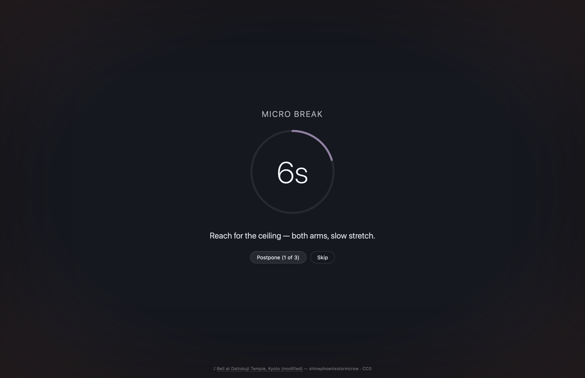
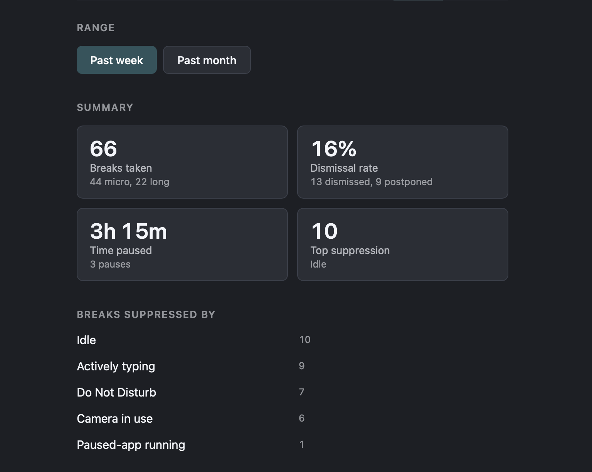
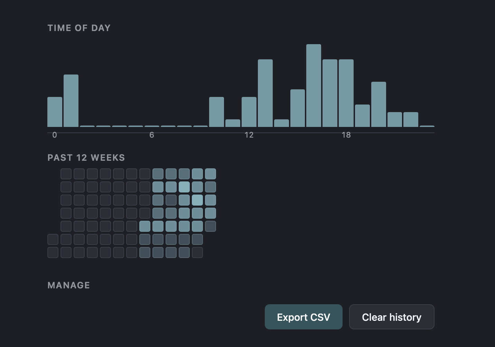
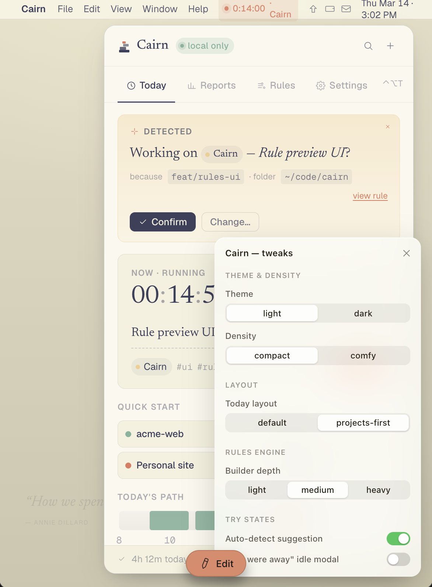
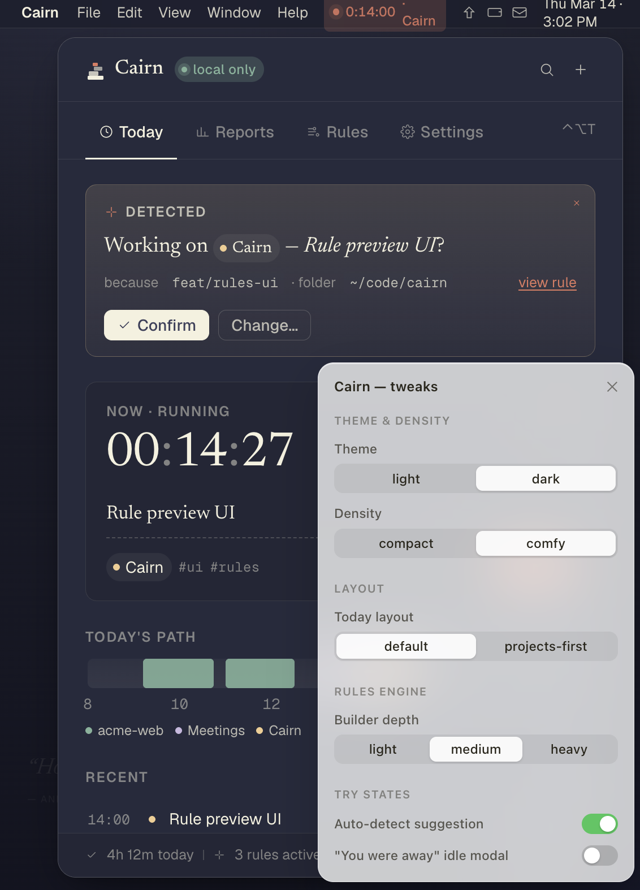
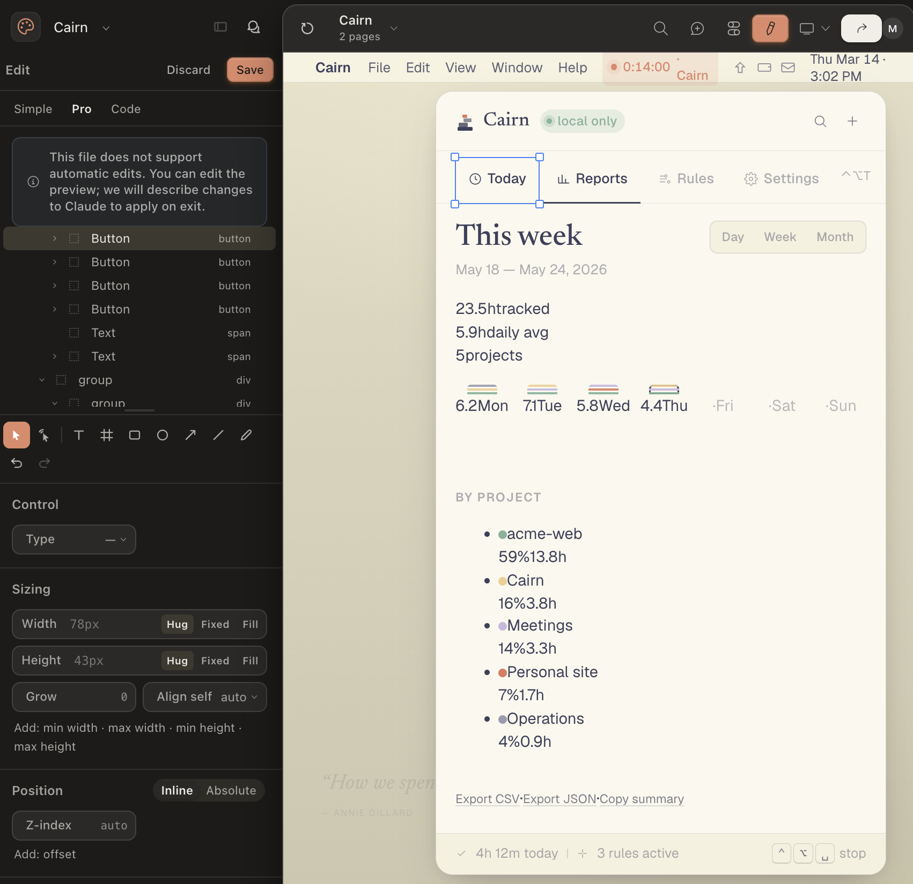

If you've read my blog before, you know I'm an R person.
I write R packages, I teach R, I think in tidy data and ggplot layers.
So when I started getting itchy about building a desktop break-reminder app, my first reaction was "great idea, wrong person."

I didn't even know what stack would make sense for this kind of app, I just knew it wasn't going to be R.

But I'd been wanting to test something.
With Claude as a coding partner, how far can I get on a project where I don't really speak the language?
Where I can read code well enough to know if it's bad, but not well enough to know if it's _right_?
That's the question I've been chewing on for a while.

After a while, I decided to start exploring.
I had a start by having a chat with Claude about what I wanted, and what type of tools would be appropriate to use.
After some pointed questions from Claude about more details, and what pros and cons for various approaches would be, we landed on a stack.
The stack I needed was Tauri 2, Rust, React, TypeScript — basically the entire universe of things I have only ever read about.
I knew what Typescript was, I do do some javascript work after all (TypeScript is a superset of javascript), and I had some idea about Rust being powerful and fast.
But that was about it.

I decided to jump into it anyway, and ended up starting to develop two things:

- [Entracte](https://entracte.drmowinckels.io/) a break reminder app.
- [Cairn](https://github.com/drmowinckels/cairn) a project tracking app.

This post is about what that process actually looked like — both the part where Claude and I just wrote code together, and the part where we started somewhere completely different.

## Why Entracte

I've been recovering from Long Covid for a while now (see [the visible posts](/tags/longcovid/) for the full picture).
One of the things that changed during recovery is that I can no longer push through a workday (and my workday is only 10% of full-time!).
If I sit too long, work too hard, or skip too many breaks, I pay for it that evening — and sometimes for days.

[Stretchly](https://hovancik.net/stretchly/) is a lovely app, and I used it for years, but I wanted things it didn't have.
Awareness of whether my camera was on — because nothing is more rude than a break overlay during a meeting.
Multi-monitor handling that didn't fling fullscreen windows across Spaces.
A daily screen-time budget that quietly nudged me toward wind-down.
And a Sleep prompt at the end of the day, because evening "just one more thing" is how I wreck tomorrow, or at worst the entire week.

So I had a feature list.
I had no idea how to build any of it.

## The Entracte experiment

We started straight in Claude code.
Claude scaffolded the Tauri project — Rust backend, React frontend, the basic IPC (inter-process communication) bridge between them — and from there we built features one at a time.

- Tick loop.
- Break overlay.
- Tray icon.
- CLI tool.
- Stats.
- Camera detection.
- Idle detection.

Each one took me from "I don't know what that even means" to "okay, I can review this PR" — further than I expected to get.

A few things made it work.

I treated each feature like a small specification — what does it do, when does it fire, what should it _not_ do.
That gave Claude something concrete to work against, and gave me something I could actually test against.

Very early on, almost right off the bat, I made sure we had CI workflows that ran cross-platform checks.
Thankfully, Rust is _opinionated_ so setting up good testing and linting CIs was really easy, and I made sure we had equivalents for the rest of the stack too, as much as possible.
Having this in place, made it easier to find issues early on, and make sure things were adhereing to best-practices.

I made a habit of saying "show me the test for that" any time something felt brittle.
Tests and docs ship _with_ the code, in the same PR.
No deferred test debt, no "we'll cover it next sprint."
I wrote that rule down because I kept needing the reminder, and now Claude reads it at the start of every session.

I cared more about the architecture diagrams than the line-by-line code.
If I could understand the data flow, I trusted the implementation.
The scheduler in Entracte is a Tokio tick loop that consults native OS hooks, applies pause and suppression rules, and decides when to surface a break.
I cannot write a Tokio tick loop from scratch.
I _can_ tell you what mine does.

Lastly, I had three LMM skills I used for _every_ PR with a feature we made:

- [Critical code reviewer](https://github.com/posit-dev/skills/blob/main/posit-dev/critical-code-reviewer/SKILL.md)
- [Security review](https://support.claude.com/en/articles/11932705-automated-security-reviews-in-claude-code) - catch vulnerabilities in code that could be exploited.
- Simplify - Internal Claude Code skill to help make functions less complex and detect duplications etc.

These three helped me find code duplications, security flaws, and general poor or flawed logic in the code.
They also helped me navigate the stack better and actually learn a little about code smells in a stack I knew almost nothing about.

Entracte runs well on my Mac now, ships on Windows and Linux too (with a few platform-specific gaps), and is [open source under Apache 2.0](https://github.com/drmowinckels/entracte).
I also have colleagues using it on Linux, and they seem quite happy with it.
I'd be very happy if more people use it, I think we all could do with break reminders as we sit glued to our computers doing work.

It has lots and lots of customisations, maybe too many (is there such a thing)?

There's a short _Micro_ break for eyes and posture, a longer _Long_ break, and a _Sleep_ prompt near bedtime that gets its own separate treatment.
It knows to shut up during Do Not Disturb, while my camera's on, while I'm idle, or outside my work hours — the whole point was never getting ambushed by a break overlay mid-meeting again.
And because I'm going to see this screen fifty times a day whether I like it or not, there are five overlay themes to choose from — dark, midnight, forest, sunset, rose.

{fig-alt="Entracte's micro-break overlay: a dark full-screen dim with a countdown ring at six seconds, the prompt “Reach for the ceiling — both arms, slow stretch,” and Postpone and Skip buttons"}

There's a tray countdown if I want to watch the next break coming, pause presets from fifteen minutes to indefinitely, and a small CLI for wiring into hotkeys — `entracte pause 30m`, `entracte trigger long`.

And there's stats.
A local history of breaks taken, dismissed, and suppressed, with a time-of-day breakdown and a 12-week heatmap.
None of it leaves my machine.
It's there so I can actually see whether I'm taking the breaks I built this whole app for, or just clicking Skip on autopilot.

{fig-alt="Entracte's stats summary for the past week: 66 breaks taken, a 16% dismissal rate, 3 hours 15 minutes paused, and a breakdown of why breaks were suppressed — idle time, active typing, Do Not Disturb, camera in use, and a paused app"}

{fig-alt="A time-of-day histogram of when breaks happen, plus a 12-week heatmap showing break activity building up over time"}

There's also a Supporter pack, a one-off purchase that unlocks a few personalisation extras — custom overlay colour, theme rotation, custom CSS, custom sounds.
Every scheduling, suppression, profile, stats, and CLI feature is free, for everyone.
The unlock check for the paid extras sits right there in the source, readable by anyone who cares to look — it's a thank-you, not a lock.

## Cairn started somewhere else

Once Entracte was in the air, I started thinking about a sibling app — a time tracker.
Something like Toggl, except local-first.

- No accounts.
- No cloud.
- No telemetry.

Pair it with passive work signals (the folder open in your IDE, your git branch, your calendar, your browser domain) and let _user-defined rules_ assign time to projects automatically.
If a rule isn't sure, ask a quiet "Working on X?" instead of guessing.

I called it Cairn — the stacked stones you leave on a path to mark where you've been.

This time, though, something was different.
Time trackers are emotional objects.
Most of them are noisy.
Judgemental.
Full of metrics that make you feel like a worse worker than you actually are.
The whole point of Cairn is to feel _quiet_, and be respectful.

You can't engineer that in at the end.
You have to see it first.

So we didn't start in Tauri.
We started in a Claude Design.

## Designing the whole thing inside Claude Design

There's a name for what we were doing, even if I didn't think of it that way at the time: UX-driven development.
Instead of starting from the data model and bolting a UI onto it later, you start from how the thing should _feel_ to use, and work backward to whatever needs to exist underneath to support that.
It's the opposite of how I work in R, where I reach for the data structure first and the presentation is an afterthought.
For Cairn, the UI came first, on purpose, because the feeling was the whole point.

Claude Design is built for exactly this kind of thing — documents, prototypes, whole websites.
It's iterative: it asks you a lot of questions, you answer, it builds, you react, and somewhere in that back-and-forth an artifact comes out the other end.
If you haven't used artifacts in Claude before, they're interactive HTML/React canvases you build with Claude directly inside the chat — real components, real CSS, actually clickable.
You can flip it dark or light, swap out a whole layout, prototype the entire UI, and never once open a build tool.

That's where Cairn lived for a very good while.

We built the popover shell — header, nav, body, footer.
Then the Today view, with its running-timer chip and day-timeline strip.
Then the Reports view with its weekly stacked-bar chart, by-project breakdown, and the "honesty meter" (a tiny bar that flags when too many entries were guessed by rules instead of confirmed by you).
Then the Rules view, with three depth modes — light, medium, heavy — so we could test how much complexity to expose by default.

{fig-alt="Cairn's Today view in light mode, showing a detected work-session banner asking “Working on Cairn — Rule preview UI?” with Confirm and Change buttons, a running timer, and an open tweaks panel exposing theme, density, layout, and rules-engine controls"}

{fig-alt="The same Cairn Today view in dark mode, with the tweaks panel switched to dark theme and comfy density, and the day's timeline and recent entries visible underneath"}

The whole time, the question wasn't "does this work."
It was "does this _feel_ right" — whether the running-timer chip reads as calm or anxious, whether the auto-detect banner comes across as reassuring or presumptuous, whether the rule builder feels like a tool you reach for or a chore you dread.

Claude Design also has this editing tool where you can adjust things in the design your self.
I didn't do this much, but I can see it being very nice when you have a clear idea of what needs fixing.

{fig-alt="Claude Design's Pro edit panel open alongside the Cairn Reports view, showing the layer tree of buttons and groups on the left and the weekly tracked-time summary with a by-project breakdown on the right"}

Those are visual decisions, but they're also _ethical_ decisions about how a piece of software relates to the person using it.
And they're enormously easier to make when you can actually _see_ them in front of you.

By the time we were done, the artifact had:

- A real palette — eggshell, burnt peach, twilight indigo, muted teal, apricot cream.
- Two density modes — compact and comfy — and a working theme switch.
- A floating "Tweaks" panel pinned to the bottom-right, so I could flip every variant without touching code.
- A complete fixture data set, so views looked alive instead of empty.
- An atomic component vocabulary — `ProjectChip`, `Tag`, `LocalBadge`, `Kbd`, `Icon` — that carried straight into the production app.

When I finally went to build the actual Tauri app, the `design/` folder came along _as the spec_.
The README in there literally says: "These are not production code.
They are a spec for what to build."
The HTML is the visual source of truth.
The prose spec sits alongside it.

That was the bet, and it paid off.
The Tauri+React build of Cairn is, mostly, a careful port of the artifact.
The design decisions were already made — pinned in code, sitting right in front of me — so the production work was just engineering, instead of engineering and aesthetic gambling rolled into one.

I do have to note though, a really weird and funny thing with the first iteration claude code made, it had the app _inside_ another window, just like it looked in claude design.
Difference it, claude design runs in the browser (or where I used it at least), and so the app inside a windows (with another background colour etc) made sense there.
I mean, it couldn't create a standalone app.

But it looked absolutely ridiculous as a standalone app.
I'm a little sad I didn't screenshot it for posterity to show it.
It was quite funny.

Under that funny bug, the actual architecture is pretty boring, in a good way.
The rules engine — the thing deciding whether an entry is "acme-web" or "Cairn" or "Meetings" — is pure Rust with no I/O.
That's on purpose: I can throw everything at it in tests without ever mocking a filesystem or a git repo.
Reading your actual work signals lives somewhere else entirely — a window watcher, a git-branch watcher, an idle watcher, each its own small module, all feeding into that same engine.
Everything lands in a local SQLite database.
No accounts, no cloud, no telemetry — that's not a tagline, it's just what the storage layer does.
And the popover itself sits off the tray, with a global shortcut to summon it, so checking in on my day doesn't mean alt-tabbing into a whole separate app.

## Two apps, deliberately drawn apart

There's one more thing that came out of all this.

Once both apps existed, they started drifting toward each other.
Entracte's wishlist had calendar integration, and Cairn already needed to read your calendar for its work signals.
Entracte tracked screen time; Cairn was already tracking work time, which is more or less the same number wearing a different hat.
And Cairn's rules kept nudging toward something Pomodoro-shaped — which Entracte, of course, already was.

So we drew a line, and wrote it down:

- Entracte owns _breaks_ — scheduling, Pomodoro, overlay, suppression, break stats.
- Cairn owns _work_ — time entries, projects, rules, work-time analytics, calendar awareness.

If a Cairn user wants Pomodoro, they install Entracte.
If an Entracte user wants project-level analytics, they install Cairn.
Neither app grows into the other.
When they need to cooperate, they cooperate through a shared local event bus — not by absorbing each other's domains.

That line only exists because we caught the duplication early.
It would have been _so_ easy to keep slipping features across the boundary and end up with two apps that did 80% of the same thing slightly differently.

## What I learned about working outside my stack

A few things have stuck with me.

The collaboration only works if I'm a real participant.
Claude can write Rust I cannot write.
But Claude cannot decide what kind of thing this is going to be.
That decision — what does it _do_, who does it _serve_, what should it _feel like_ — is still my job.
Doesn't matter how good the model gets.

It many times made choices on settings etc that made little sense, or where very haphazardly placed together with weird ways to specify settings.
It needed a human to make better design decisions.

Designing visually before designing in code is a superpower for emotional software.
Time trackers, break reminders, anything you live with — these need to be _seen_ before they're built.
The Claude Design approach for Cairn worked because it let me sketch the relationship between the user and the tool, without paying the cost of actually building it first.

Reading code well is a skill in its own right, and one I'd undersold.
I've spent most of my career _writing_ code, but for these projects I needed to be a critical reader instead.
PR review turned out to be its own discipline, separate from writing the code.
So did knowing when to ask "where's the test for this branch?" instead of just approving.
So did saying "this looks brittle, walk me through it" instead of nodding along because I didn't want to seem lost.
I got noticeably better at all three, mostly by being forced to.

Rules you write down survive sessions.
"Tests and docs ship with the code."
"Codecov gate stays at 100% on patches, can only be overruled by human decision."
"Entracte owns breaks, Cairn owns work, never the twain shall meet."
These are project-level memory entries Claude reads at the start of every session.
They keep us honest in a way that an in-session reminder never could.

And finally — I built two cross-platform desktop apps in a stack I do not write natively.
That feels like a thing worth telling other R people about.
If you've been sitting on an idea because you don't have the "right" background, I think the answer is closer than you think.
You don't need to learn Rust.
You need to learn how to _direct_ a project in a language you're still learning to read — and to be honest with yourself about which decisions are still yours to make.

## If you want to try the artifact-first approach

[Entracte](https://entracte.drmowinckels.io/) is free, open source, Apache 2.0, and works on macOS, Windows, and Linux.
There's a Supporter pack for personalisation extras if you want to back development.

[Cairn](https://cairn.drmowinckels.io/) is in its first public beta — I've been using it privately for a while, and while there are still some things I want to figure out, I'd also like to know how its working for others at this point.

If you want to try the "design in an artifact first" approach for your own thing, the recipe is roughly this:

- Start a Claude Design (or similar tool) conversation and ask for an HTML/React artifact of the main view.
- Iterate visually until it looks like the thing you actually want.
- Add a tweaks panel — every variant on a switch — so you can _see_ states without rebuilding.
- Build a fixture data file, so the views look alive.
- Only then move into production code, treating the artifact as the spec.

You won't have a working app at the end of this.
What you'll have is something I needed more: a clear, visible answer to "what am I trying to build," sitting right in front of me, before I'd written a line of production code.

That was worth more to me than a head start on the Rust.
