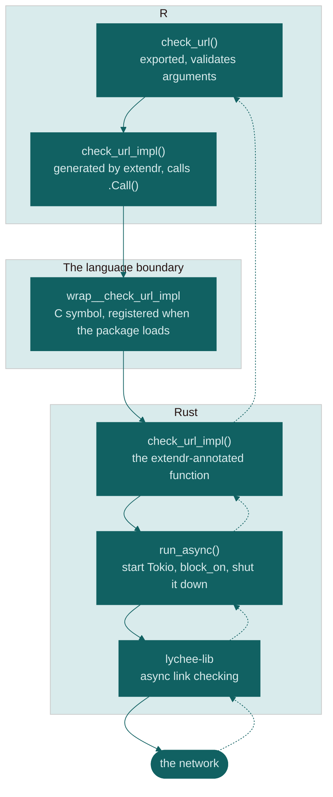

I already use [lychee](https://github.com/lycheeverse/lychee) to check links several website repos I maintain.
It is a link checker written in Rust, it is good, fast, and customizable, and I wanted that same control from inside R.

There is already an excellent R package for checking url status --- [urlchecker](https://github.com/r-lib/urlchecker).
It does the CRAN-style URL scan well, and indeed, it's intended scope is to do just that.
But I kept wanting to configure things it doesn't expose, and lychee exposes them.

The other reason is simpler: I had never ported a Rust crate to R, and I wanted to know how that works.
That is a perfectly good reason to build something.

I did this with Claude as a pairing partner, which mostly meant I had someone to argue with about tradeoffs.

## What the research turned up

The mature path for Rust in R is [extendr](https://extendr.github.io/) and its R-side companion `rextendr`.
It has had support from the R Consortium, whose [2025 project listing](https://r-consortium.org/all-projects/2025-group-2.html) puts it at "28 CRAN packages and nearly 600,000 downloads."
There is a newer, more explicit alternative called [savvy](https://github.com/yutannihilation/savvy), which [compares itself to extendr directly](https://yutannihilation.github.io/savvy/guide/) if you want to weigh them up.

CRAN has an official policy document, [Using Rust in CRAN packages](https://cran.r-project.org/web/packages/using_rust.html), and it is worth reading in full before you commit to anything.
Here is what it actually says, so you can check me.

On downloading dependencies at build time:

> Downloading should be avoided if at all possible.
> The package would become uninstallable if the Internet resources are temporarily or permanently unavailable, and CRAN packages are kept available for many years.

The recommended alternative is that "in most cases all the Rust software can be bundled into the package via `cargo vendor`.

On the toolchain:

> test before submission with at least a two-year-old version of cargo, and preferably one four or more years old.

That is not a hypothetical --- it is because Linux distributions update these tools slowly.

On declaring the dependency: `SystemRequirements: Cargo (Rust's package manager), rustc`, verbatim.

The R-package size limit is not in that document, but is a limit I know well from the ggsegverse development.
It is in the general [CRAN Repository Policy](https://cran.r-project.org/web/packages/policies.html): *"Source package tarballs should if possible not exceed 10MB."*
The policy does allow a higher limit on request where third-party source has to be bundled, which is exactly the situation a Rust package is in --- so treat 10MB as a strong default rather than a hard wall.

Then I went and measured what lychee actually costs.

All the numbers below come from `lychee-lib` 0.24.2 as of writing.
How many crates does it drag in?

``` sh
cargo tree -p lychee-lib --prefix none | sed 's/ (\*)//' | awk '{print $1" "$2}' | sort -u | wc -l
#> 330
```

330 transitive dependencies.
Now vendor them and see what a CRAN submission would have to carry:

``` sh
cargo vendor vendor/
du -sh vendor/                  
#> 463M

tar -cJf vendor.tar.xz vendor/  
# xz, as CRAN's policy recommends

du -h vendor.tar.xz             
#> 34.5M
```

**463MB raw, 34.5MB compressed.**
Against a 10MB guideline, before I have written a single line of my own code.

The three biggest offenders are worth naming, because they say something about where the weight actually is:

``` sh
du -sh vendor/* | sort -rh | head -3
#>  68M  vendor/aws-lc-sys
#>  54M  vendor/winapi-x86_64-pc-windows-gnu
#>  51M  vendor/winapi-i686-pc-windows-gnu
```

`aws-lc-sys` is the TLS crypto backend, and it arrives through `reqwest`'s default TLS feature --- remember this one, it comes back later and ruins my week.
The other two are Windows import libraries.
Roughly a third of what I would be shipping to CRAN is platform support I am not even the consumer of.

And then the toolchain problem: lychee-lib's `rust-version` is **1.88**, released in 2025.
CRAN asks me to test against a cargo that is two to four years old.
Those two requirements do not fit in the same room.

There is also a cautionary tale sitting right there, and it is worth getting the details right because it is usually told wrong.

R `polars`, the Rust-backed DataFrame library, *did* make it onto CRAN.
Version 0.7.0 was published on 2023-07-17 --- and [archived on 2023-07-18 "for policy violations"](https://cran.r-project.org/web/packages/polars/index.html).
One day.
The maintainers went back and forth about a return for a while, and then closed the CRAN release issue with ["Update in 2024: I don't think we will make a CRAN release, please install from R-multiverse"](https://github.com/pola-rs/r-polars/issues/80).

So it isn't a story about a package that couldn't get in.
It's a story about one that got in, fell out, and decided the fight wasn't worth having again.
[Its README now points at R-multiverse](https://github.com/pola-rs/r-polars) as the recommended channel, with r-universe for development builds.

## Starting outside CRAN, on purpose

This is the part I want to be precise about, because "not on CRAN" gets read as a verdict and it wasn't one.

I decided to stay off CRAN *first*.
Mybe not forever --- but at least at first.

Every one of those constraints above is a constraint on architecture.
Vendoring shapes your dependency budget.
An old-toolchain assumption shapes your MSRV, which shapes which version of lychee-lib you can even call.
If I had started by designing around all of that, I would have been designing around CRAN's requirements before I knew whether the thing worked at all.

So the plan was: build it properly, get the architecture right, find out what this package actually wants to be --- and then deal with CRAN adaptations later, with a working package in hand and real information about what they'd cost.

The immediate payoff of targeting r-universe instead is that its build servers have network access.
No vendoring, no 34MB tarball, no trimming lychee's features to fit a budget, no fighting the MSRV.
I could depend on current `lychee-lib` and get on with it.

Here's the number that made me glad about the sequencing: a clean build takes about **13 minutes**, compiling that whole dependency tree from scratch.
Fine locally, fine on r-universe which caches between builds.
It would have been a serious problem inside CRAN's check-time budget, and I would have been fighting it from day one instead of finding out about it at leisure.

The cost is real, though it lands more softly than I expected: no `install.packages("rambutan")` straight from CRAN, and anyone building from source needs a Rust toolchain.
I'll come back to that at the end, because working out who actually pays it took me a while.

Oh, and the name.
The obvious choice was `lychee`, but [an R package called lychee already exists](https://github.com/sumtxt/lychee) --- it does optimal one-to-one record linkage between data frames, nothing to do with checking links.
It isn't on CRAN, but "not on CRAN" is not the same as "available", and quietly claiming a name someone else is already using in the same language is just not great.

So I went looking for something adjacent.
A rambutan (*Nephelium lappaceum*) and a lychee (*Litchi chinensis*) are both in the [soapberry family, Sapindaceae](https://en.wikipedia.org/wiki/Rambutan) --- same family, spikier packaging.
That was that.


## Running async Rust from inside R

Rust has async/await in the language, but it ships no engine to run it.
An async fn doesn't do anything when you call it --- it hands you back a future, which is a description of work rather than work in progress.
Something has to take that description and drive it to completion, and Rust deliberately leaves that to a library.

Tokio is the library almost everyone picks.
It's the scheduler, the I/O event loop, and the timers --- the part that actually turns "here is a plan to fetch 200 URLs" into 200 URLs being fetched.
`block_on()` is the door between the two worlds: give it a future, it runs the whole thing and hands you a plain value back.

The closest R analogy I have is curl::multi_run() --- you queue up a pile of requests, then one loop drives them all concurrently and you get results at the end.
Tokio is that loop, generalised to everything.

Every public function in `lychee-lib` is an `async fn`.
There is no synchronous wrapper.
R, meanwhile, has no idea what a future is and would like you to just return a value.

So the binding has to stand up a Tokio runtime, hand it the future, and block until it comes back.

extendr documents this pattern, and it's the part I was most nervous about, because embedding someone else's async runtime inside R's process is exactly the sort of thing that works on your laptop and then doesn't.

It worked on the first try.

``` r
library(rambutan)

check_url("https://www.r-project.org")
#> $url
#> [1] "https://www.r-project.org"
#>
#> $is_success
#> [1] TRUE
#>
#> $code
#> [1] 200
#>
#> $details
#> [1] "200 OK"
```

### What actually happens when you call that

That one line goes through four layers before it touches the network, and I found the shape of it genuinely clarifying once I could see it.



Layer one is the function you call, and it is ordinary R.
It validates, collects configuration, and hands off --- nothing exotic:

``` r
check_url <- function(url, options = lychee_options()) {
  stopifnot(
    is.character(url),
    length(url) == 1L,
    inherits(options, "lychee_options")
  )

  args <- lychee_options_impl_args(options)
  do.call(check_url_impl, c(list(url = url), args))
}
```

Layer two is `check_url_impl()`, and I did not write it.
`rextendr::document()` generates it into `R/extendr-wrappers.R` every time the Rust signature changes, which is why the file says what it says:

``` r
# Generated by extendr: Do not edit by hand

#' @useDynLib rambutan, .registration = TRUE
NULL

check_url_impl <- function(url, exclude, include, timeout, ...) {
  .Call(wrap__check_url_impl, url, exclude, include, timeout, ...)
}
```

I have trimmed the arguments there --- the real one takes eighteen, all spelled out, because extendr does not do `...` across the boundary.
Every argument has to be named on both sides, and that is the honest cost of the whole arrangement: the R signature and the Rust signature are one thing pretending to be two, and they drift the moment you stop regenerating.

Layer three is the Rust function, which looks almost like normal Rust apart from the attribute:

``` rust
#[extendr]
fn check_url_impl(
    url: &str,
    exclude: Vec<String>,
    timeout: Nullable<f64>,
    // ...fifteen more
) -> std::result::Result<List, String> {
    let config = config_from_args(exclude, timeout, /* ... */)?;
    let client = build_client(config)?;
    // ...
}

extendr_module! {
    mod rambutan;
    fn check_url_impl;
    fn check_urls_impl;
    fn check_paths_impl;
}
```

The types are the interesting part.
`Vec<String>` is an R character vector.
`Nullable<f64>` is a numeric that might be `NULL`, which is how R spells "unset" and Rust does not.
Returning `Result<List, String>` means an `Err` becomes an R error, so a failure in Rust surfaces as `stop()` rather than a crash.
That mapping is most of what extendr is for.

And layer four is where the async problem gets solved:

``` rust
fn run_async<F: std::future::Future>(future: F) -> F::Output {
    let rt = tokio::runtime::Builder::new_current_thread()
        .enable_all()
        .build()
        .expect("failed to start tokio runtime");
    let result = rt.block_on(future);
    rt.shutdown_timeout(Duration::from_millis(100));
    result
}
```

Build a runtime, block on the future, shut the runtime down, return a plain value.
R never learns that any of this was asynchronous.

Hold onto that function, by the way.
It does not look like this by accident, and the reason is the rest of this post.

There's a small delight in there too --- lychee automatically excludes `.invalid` domains, because [RFC 6761](https://www.rfc-editor.org/rfc/rfc6761) reserves that TLD for exactly this kind of "definitely not real" use.
I got that behaviour for free by wrapping someone else's careful work, which is the whole point of wrapping someone else's careful work.

From there the API filled out: `check_urls()` for concurrent checks that preserve input order, `check_paths()` for scanning files, directories and globs using lychee's own Markdown and HTML extractors, and `check_package()`, which scans an R package's `DESCRIPTION`, Rd files, `NEWS`, `CITATION` and vignettes --- the same set CRAN's own URL check looks at.

``` r
check_urls(c("https://www.r-project.org", "https://cran.r-project.org"))
#>                          url is_success code details
#> 1  https://www.r-project.org       TRUE  200  200 OK
#> 2 https://cran.r-project.org       TRUE  200  200 OK

check_project(".")
```

The configuration I wanted in the first place lives in `lychee_options()`, and it reads a `lychee.toml` if you have one --- so the settings I already use on my websites carry straight over.

Then I turned on CI, and Windows started screaming.

## The crash that happened after everything passed

Here is the shape of the bug, because the shape is the interesting part.

On `windows-latest`, `R CMD check` reported an ERROR from the test step.
But when I pulled the actual test output from the CI artifact, it read:

    [ FAIL 0 | WARN 0 | SKIP 0 | PASS 101 ]

Every test passed.
Then the R process exited with `-1073740791`, which is `0xC0000409`, which is `STATUS_STACK_BUFFER_OVERRUN` --- Windows' stack-cookie check firing.
Not a generic failure. A specific, native, "something corrupted memory during teardown" failure.

The function worked.
The result was correct.
The process just refused to die politely.

In practice this only bites non-interactive use where someone checks the exit code --- `Rscript` in a CI step, basically.
Interactively it was invisible.

### Three fixes that didn't work

My first assumption was that this was my fault, and specifically that it was the Tokio runtime.
I think it was a reasonable assumption, but it was also wrong three times in a row.

**Attempt one: switch the runtime from multi-threaded to current-thread.**
The multi-threaded scheduler spawns persistent background OS threads, and persistent background OS threads are a classic way to make process teardown unhappy.
Result: identical crash.

**Attempt two: leak the runtime with `Box::leak` so its `Drop` never runs.**
This is a well-established fix for this exact class of bug in other embedded-Rust contexts --- if teardown is what crashes, don't tear down.
Result: instead of failing at 10 to 13 minutes, the job ran for 19 and a half minutes on the same step with no resolution.
I traded a crash for a hang, and cancelled it rather than let it sit there for the six-hour default timeout.

That's a genuinely informative failure, though.
A hang means something was waiting for the runtime's shutdown signal that never came.
So the state does need to be torn down --- it just crashes when teardown happens during process exit.

**Attempt three: build a fresh runtime per call and shut it down explicitly before returning to R.**
This is the `run_async()` I showed you earlier.
It is shaped that way --- build, block, shut down, all inside one call --- because of this attempt, and it stayed that way afterwards even though it did not fix anything.
No static, no global, nothing surviving past the `.Call()` boundary.
Teardown now happens at a deterministic, safe point in the middle of a call rather than during DLL unload.
Result: identical crash.

And that is the one that mattered, because it ruled out my own code entirely.
There was no Tokio state left to blame.
Whatever was crashing was in something else entirely.

So I documented it as a known issue in `?rambutan` and put `continue-on-error` on the Windows matrix job.

I want to be straight about that decision, because "known issue, workaround applied" can read as giving up and it wasn't.
The problem with a permanently red Windows job is not that it looks bad --- it's that it drowns out signal.
I needed CI that errored on errors I could actually do something about, so that the next real Windows bug would be visible instead of buried under this one.
Marking it non-blocking bought that.

It still felt bad. I always intended to come back.

### The part that actually changed the game

The single most useful thing I did in this whole investigation was not a fix.
It was building a faster loop.

A full `R CMD check` on Windows costs 20 to 40 minutes.
At that price, every hypothesis is an expensive guess, and after two or three of them you start reaching for whatever is cheap to try rather than whatever is likely to be true.

So I wrote a throwaway Windows-only workflow that did exactly one thing: load the package, call `check_url()` once, print the result, exit.
Minutes instead of tens of minutes.
That's what turned guessing back into debugging, and it's what let me confirm the eventual fix three times over instead of once.

## What it actually was

I came back to it after a break, wanting to give it another stab.
No new insight, no upstream bug report --- just a fresh look and the question: what variable has nobody tested yet?

The answer was the TLS crypto backend.

`reqwest`'s default TLS feature pulls in `aws-lc-rs` as its crypto provider.
I confirmed that rather than assuming it, and you can too:

``` sh
cargo tree -e features -i aws-lc-rs
```

which walks the chain back as `reqwest` "default" → "default-tls" → "rustls" → "\_\_rustls-aws-lc-rs" → `hyper-rustls` → `rustls` → `aws-lc-rs`.

And rambutan builds for `x86_64-pc-windows-gnu` --- the MinGW/Rtools target, which is what R uses on Windows, and the less-travelled of the two Windows targets.

Now, [aws-lc-rs's own platform support table](https://aws.github.io/aws-lc-rs/platform_support.html) gives `x86_64-pc-windows-gnu` ticks for both Build and Tests.
That is true, and it is also not the situation we're in.
They test it as a standalone binary.
An R package is a DLL, dynamically loaded into a long-lived host process, and potentially unloaded mid-session while that host keeps running.

That distinction is worth sitting with if you're wrapping any Rust crate for R.
Crates test themselves as programs.
Your package is a guest inside somebody else's program.
Those are different lifecycles, and teardown is exactly where the difference shows up.

The fix was small.
`reqwest` only falls back to `aws-lc-rs` if no process-wide `CryptoProvider` has already been installed --- I (or Claude in this case, because I was WAY out of my comfort-zone here) read reqwest's source to confirm that rather than trusting the docs.
So install rustls' `ring` provider first, before the first client is ever built:

``` rust
static INSTALL_CRYPTO_PROVIDER: std::sync::Once = std::sync::Once::new();

fn ensure_crypto_provider() {
    INSTALL_CRYPTO_PROVIDER.call_once(|| {
        let result = rustls::crypto::ring::default_provider().install_default();
        debug_assert!(
            result.is_ok(),
            "a rustls CryptoProvider was already installed before rambutan could install ring; \
             the aws-lc-rs Windows exit crash this guards against may resurface"
        );
    });
}
```

`ring` has years of solid Windows-GNU track record.
`aws-lc-rs` is comparatively new there.

Note what this does and does not do.
`aws-lc-rs` is still compiled into the binary --- Cargo's feature unification means another dependency drags it in and I can't remove it.
It just never runs.
That's a workaround, not a cure, and the `debug_assert!` is there to shout if some future dependency installs a provider before I get there.

Three clean runs on the fast debug workflow, against a crash that had been 100% reproducible.
Then the real thing: the full `R-CMD-check.yaml`, all five matrix targets, 120 tests, vignettes and all.

`windows-latest` passed. 24 minutes and 47 seconds, genuinely green for the first time in the package's history.
Then I removed the `continue-on-error`, pushed again, and watched it pass as a real blocking check.

## What I'd tell you before you start

**Decide your distribution channel deliberately, and early.**
Not necessarily CRAN --- but decide, because it determines your MSRV, whether you vendor, and how big a dependency tree you can afford.
Choosing to defer CRAN is a real strategy.
Drifting into it by accident is not.

**"It works but the process dies" is a real category of bug.**
When your tests pass and the exit code is still wrong, stop looking at your logic.
The bug is in teardown, and teardown is mostly other people's code.

**Your package is a guest in someone else's process.**
A crate that is well-tested as a binary has not been tested as a DLL loaded into R and unloaded mid-session.
That gap is where the ugly platform-specific bugs live.

**Build the fast loop before the third guess, not after.**
If a hypothesis costs 30 minutes to test, you will start optimising for cheap hypotheses instead of good ones.

**Ruling things out is progress.**
Those three failed Tokio fixes weren't wasted work.
They're the reason the fourth attempt was an informed experiment rather than a fourth guess.

## So was it worth it?

Here's where I have to be honest with you, because the obvious ending to a post like this is "and now link checking is fast," and I'm not sure that's true.

urlchecker is already fast.
It is pure R, it installs instantly, it has no system dependencies at all, and for the CRAN-style check it does the job.
rambutan installs as a binary now, so that gap is smaller than it was when I started writing this --- but it is still a package with a Rust toolchain somewhere in its history, against one that is just R.
And I have not benchmarked the actual checking. I have a fast async link checker underneath and a strong hunch, which is not the same as a number.
If you handed me a stopwatch and asked me to justify the trade on speed alone, I could not, because I have not done the measurement.

What I did get is the thing I actually went looking for.
I have the configurability I wanted, wired to the same `lychee.toml` I already use elsewhere.
And I now know a little more about porting a Rust crate to R --- the extendr scaffolding, the async-runtime embedding, the CRAN constraints in concrete numbers rather than vague dread, and a debugging story about DLL teardown I will not soon forget.

That was the point.
Not every package has to win a benchmark to have been worth building.

rambutan lives at [github.com/drmowinckels/rambutan](https://github.com/drmowinckels/rambutan), with a [pkgdown site](http://drmowinckels.io/rambutan/), and can be installed through R-universe.

``` r
install.packages(
  'rambutan', 
  repos = c(
    'https://drmowinckels.r-universe.dev', 
    'https://cloud.r-project.org')
  )
```

That line does not need Rust on your machine, and working out why took me longer than it should have --- because I had two separate problems glued together in my head.

The first is vendoring, and it is the CRAN-shaped one.
extendr's scaffold already wires `src/Makevars.in` up to build offline from either a `vendor/` directory or a `vendor.tar.xz`, and `tools/config.R` only passes `--offline` to cargo when one of them is present.
So the machinery is there; what I haven't done is generate and ship the tarball, which means today's builds still fetch from the network.
That is the thing standing between rambutan and a CRAN submission.

The second is the Rust toolchain, and it is the user-shaped one --- and here is the bit I had wrong.
Vendoring would not have helped with it at all.
Vendoring solves *offline* builds: it bundles the crate sources so the build doesn't need the network.
It does nothing about needing `cargo` and `rustc` to compile those sources.
`SystemRequirements` stays exactly as it is either way.

What spares users a Rust toolchain is precompiled binaries --- and that is what r-universe quietly does for you.
It has built rambutan for Windows, macOS and Linux, on x86_64 and arm64, across R 4.5 through 4.7.
If you are on any of those, `install.packages()` hands you a binary and Rust never enters the conversation.
You only need `cargo` and `rustc` ([rustup.rs](https://rustup.rs/)) if you are building from source --- installing from GitHub, or running a platform nobody has built for.

Two problems, then, not one, and only one of them is still open.
I find that quietly satisfying, mostly because for a while I thought the annoying one was the hard one, and it turned out to be a checkbox.
